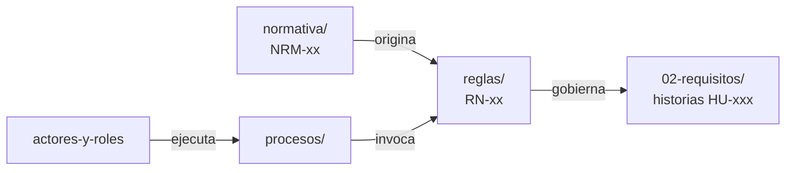

# 01 — Negocio

Cómo funciona hoy la operación de transporte de una institución pública hondureña, y qué reglas la gobiernan.

## Estructura

| Ruta | Estado | Contenido |
|---|---|---|
| `actores-y-roles.md` | Bloque 1 | Actores `ACT-xx`, responsabilidades y matriz de permisos con segregación de funciones |
| `mapa-de-procesos.md` | Bloque 1 | Vista de conjunto: qué procesos existen y cómo se encadenan |
| `procesos/` | Bloque 1 | Un archivo por proceso, con diagrama Mermaid y narrativa paso a paso |
| `reglas/` | Bloque 1 | Reglas de negocio `RN-xx`, una por archivo |
| `normativa/` | **Bloque 0 — listo** | Fichas `NRM-xx` del marco legal hondureño, riesgos y documentos por obtener |

## Cómo se relacionan

Una regla de negocio puede nacer de una norma (`NRM-xx`), de una decisión de producto, o de la práctica de la institución. **Siempre debe decir de cuál**, y con qué nivel de verificación.

## Advertencia

La normativa hondureña de este dominio cambia con frecuencia y parte de ella no es públicamente extraíble. Antes de tomar cualquier ficha como definitiva, revisa su nivel de verificación y el registro en [normativa/riesgos-normativos.md](normativa/riesgos-normativos.md).
