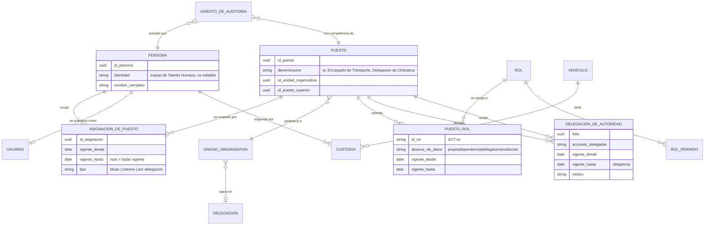
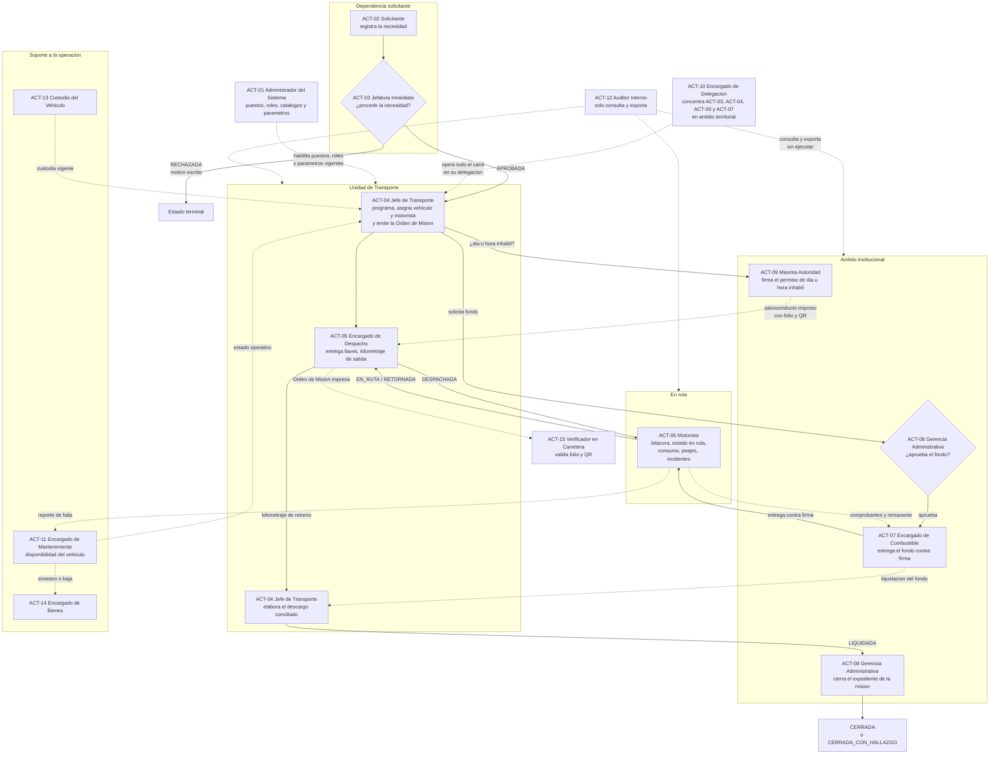

# Actores y roles

| Campo | Valor |
|---|---|
| **Ámbito** | Quién interviene en la operación de transporte institucional, qué puede hacer cada quien y qué no puede acumular |
| **Módulos afectados** | M-01 principalmente; condiciona a todos los demás |
| **Normativa de origen** | [NRM-01](normativa/NRM-01-control-interno-tsc.md) segregación de funciones, [NRM-02](normativa/NRM-02-bienes-del-estado.md) custodia y permisos, [NRM-09](normativa/NRM-09-realidad-operativa.md) rotación y conectividad |
| **Decisiones de producto** | [DP-001](../07-gestion/decisiones-de-producto/DP-001-fronteras-con-sistemas-existentes.md) D-04, D-05, D-07 |
| **Última actualización** | 2026-08-06 |

Este documento define **roles funcionales genéricos**, no el organigrama de ninguna institución. Cada institución mapea sus puestos reales contra estos roles al momento de la implantación. El organigrama concreto y los niveles de autorización **vienen de ARGOS por API** — ver DP-001 D-05 — y **aún no se conocen**: todo lo que dependa de ellos está marcado `[C]`.

---

## 1. Fichas de actor

Los IDs `ACT-xx` son estables y no se reciclan. Del `ACT-01` al `ACT-13` corresponden al catálogo base; del `ACT-14` en adelante son incorporaciones justificadas de este documento.

### ACT-01 — Administrador del Sistema

| Campo | Contenido |
|---|---|
| **Cargo típico** | Técnico o analista de la unidad de informática de la institución. En delegaciones no existe: se atiende de forma remota desde la sede `[I]` |
| **Responsabilidad en el proceso** | **Ninguna sobre la operación.** Administra la estructura organizativa, los usuarios, los puestos, los roles, el alcance de datos, los catálogos y la carga de parámetros normativos con vigencia. Ejecuta respaldos y restauraciones |
| **Qué produce** | Altas y bajas de usuario, asignaciones puesto↔rol, versiones vigentes de catálogos y parámetros, bitácora técnica de operación |
| **Dispositivo** | Computadora de escritorio en red institucional. Sin necesidad de operación desconectada |
| **Frecuencia** | Diaria en implantación; semanal o por evento en régimen estable `[I]` |
| **Límite duro** | **No puede ejecutar ni autorizar ninguna transacción de negocio**: no crea solicitudes, no autoriza, no despacha, no entrega fondos, no liquida. **No puede borrar, editar ni purgar la pista de auditoría.** Su acceso al contenido de negocio es de solo lectura, limitado a diagnóstico, y **cada lectura queda registrada** |

> El administrador con permisos de negocio es el punto único de falla del control interno: puede otorgarse a sí mismo cualquier facultad. Por eso su rol se define por exclusión y su actividad la revisa `ACT-12`. Ver NRM-01, implicación sobre segregación de funciones. `[P]`

### ACT-02 — Solicitante

| Campo | Contenido |
|---|---|
| **Cargo típico** | Cualquier servidor de cualquier dependencia que necesita movilizar personal, personas externas o carga. Con frecuencia es la asistente o la secretaria de la unidad quien captura por encargo de su jefatura `[I]` |
| **Responsabilidad** | Describir la necesidad de movilización: objeto del traslado, qué o a quién se moviliza, origen y destinos, ventana de tiempo, cantidad y peso o volumen de la carga, justificación institucional |
| **Qué produce** | Solicitud de transporte en estado `BORRADOR` → `SOLICITADA` |
| **Dispositivo** | Computadora de oficina. Ocasionalmente teléfono, con conectividad |
| **Frecuencia** | Esporádica: varias veces al mes, concentrada en fin de mes y en períodos operativos pico `[I]` |
| **Nota de modelado** | `ACT-02` es un **rol acumulable** con casi cualquier puesto. Prácticamente todo usuario lo ostenta. Es por eso que la incompatibilidad "solicita ≠ autoriza" se evalúa **por misión concreta**, no por perfil |

### ACT-03 — Jefatura Inmediata

| Campo | Contenido |
|---|---|
| **Cargo típico** | Jefe de departamento, coordinador de unidad, subdirector de área. Es el superior jerárquico del solicitante según la estructura de ARGOS |
| **Responsabilidad** | Pronunciarse sobre la **procedencia de la necesidad**: si el traslado corresponde a la función institucional, si la fecha es razonable, si el gasto se justifica. No decide sobre vehículo ni motorista — eso es de Transporte |
| **Qué produce** | Autorización o rechazo motivado. El rechazo motivado es un acto con consecuencia: `RECHAZADA` es estado terminal y queda en el expediente |
| **Dispositivo** | Computadora de oficina; teléfono para autorizar fuera de sede |
| **Frecuencia** | Diaria o cada dos días, en lotes. Es el cuello de botella típico del proceso `[I]` |
| **Pendiente** | `[C]` Qué umbral, monto, destino o duración obliga a escalar la autorización por encima de la jefatura inmediata. **Los niveles de autorización son propiedad de ARGOS y se consumen por API** — DP-001 D-05 |

### ACT-04 — Jefe de Transporte

| Campo | Contenido |
|---|---|
| **Cargo típico** | Jefe, encargado o coordinador de la Unidad de Transporte, dependiente de la Gerencia Administrativa |
| **Responsabilidad** | Convertir necesidades autorizadas en misiones ejecutables: viabilidad, programación, asignación vehículo↔motorista, emisión de la Orden de Misión, solicitud del fondo de combustible, elaboración del descargo conciliado de cada misión, gestión del expediente del vehículo y del padrón de motoristas |
| **Qué produce** | Programación del período, Orden de Misión, solicitud de fondo de combustible, liquidación conciliada, propuestas de catálogo operativo, reportes de flota |
| **Dispositivo** | Computadora de escritorio con doble pantalla — trabaja sobre un tablero de misiones. Teléfono para seguimiento en ruta |
| **Frecuencia** | **Permanente.** Es el usuario más intensivo del sistema; el sistema es su herramienta de trabajo, no un trámite |
| **Límite** | No autoriza la necesidad (`ACT-03`), no despacha físicamente (`ACT-05`), no entrega el fondo (`ACT-07`), no cierra el expediente (`ACT-08`) |

### ACT-05 — Encargado de Despacho

| Campo | Contenido |
|---|---|
| **Cargo típico** | Despachador, encargado de portón, o el propio guardia de acceso al predio vehicular en instituciones pequeñas `[I]` |
| **Responsabilidad** | El acto físico de salida y retorno: entrega de llaves y documentos al motorista contra la Orden de Misión impresa, verificación de kilometraje de salida, inspección visual, apertura de la bitácora; y a la vuelta, recepción del vehículo, kilometraje de retorno y cierre de bitácora |
| **Qué produce** | Registro de despacho, kilometraje de salida y de retorno, novedades de recepción del vehículo, manifiesto entregado al motorista cuando hay personas externas (M-17) |
| **Dispositivo** | Tableta o computadora en caseta o predio. **Debe funcionar sin conectividad** — el predio suele estar fuera del edificio principal `[I]` |
| **Frecuencia** | **Continua durante el horario hábil**, en ráfagas a primera hora de la mañana y a última de la tarde |
| **Límite** | No programa la misión, no la autoriza y no la liquida. Es el punto de control físico, no el de decisión |

### ACT-06 — Motorista

| Campo | Contenido |
|---|---|
| **Cargo típico** | Motorista, conductor o piloto institucional. Servidor de planilla con licencia de la categoría habilitante vigente |
| **Responsabilidad** | Ejecutar la misión: conducir, registrar la bitácora en cada hito, actualizar su propio estado en ruta (se movió, llegó, quedó en espera — DP-001 D-06), registrar consumo de combustible y peajes con fotografía del comprobante, reportar fallas, averías, incidentes y novedades del vehículo desde el campo (DP-001 D-08), y devolver el vehículo, el remanente del fondo y los comprobantes |
| **Qué produce** | Bitácora, lecturas de odómetro, registros de consumo y de peaje con fotografía, reportes de falla e incidente, evidencia de entrega de carga o de arribo de las personas trasladadas, actualizaciones de estado en ruta |
| **Dispositivo** | **Teléfono celular personal o institucional, frecuentemente sin señal, con batería limitada y a plena luz del sol.** Éste es el escenario de diseño, no un caso borde: más de 2 millones de personas del área rural no tienen acceso a internet — NRM-09 `[V]` |
| **Frecuencia** | **Varias veces al día**, en sesiones cortas, mientras conduce o en las paradas. Todo lo que le exija más de un minuto o más de tres toques por registro se llenará en papel y se digitará después, mal |
| **Límite duro** | No puede editar una bitácora cerrada ni modificar autorizaciones — NRM-01 `[P]`. No puede autorizar, despachar, aprobar ni liquidar **su propia misión**. Ve únicamente sus propias misiones |

### ACT-07 — Encargado de Combustible

| Campo | Contenido |
|---|---|
| **Cargo típico** | Auxiliar administrativo, encargado de caja chica, o tesorero de la unidad ejecutora. **Es quien tiene bajo custodia física el efectivo, las órdenes de pago o los vales** — DP-001 D-03 |
| **Responsabilidad** | Custodiar el fondo aprobado, entregarlo al motorista contra firma de recepción y misión vinculada, registrar el canje, controlar el ciclo de vida del vale — emitido → entregado → canjeado → conciliado, o anulado o extraviado con acta — y devolver el saldo no utilizado |
| **Qué produce** | Constancia de entrega firmada, folios de vale con su estado, registro de canje con comprobante, acta de anulación o extravío, arqueo del fondo |
| **Dispositivo** | Computadora de oficina. En delegación, tableta con operación desconectada |
| **Frecuencia** | Diaria, alineada con el despacho de la mañana `[I]` |
| **Límite duro** | **No liquida las misiones cuyo fondo entregó** y no despacha. Es el par de incompatibilidad más sensible: quien entrega el dinero no puede ser quien declara en qué se gastó |

### ACT-08 — Gerencia Administrativa

| Campo | Contenido |
|---|---|
| **Cargo típico** | Gerente o Director Administrativo, o Subgerente de Servicios Generales. Puesto institucional, no de dependencia |
| **Responsabilidad** | Aprobar el fondo de combustible que solicita Transporte y contra qué partida se afecta, resolver autorizaciones escaladas `[C]`, dar por conforme la liquidación y **cerrar el expediente de la misión**, aprobar cambios a catálogos y a parámetros normativos, y declarar y supervisar los regímenes de excepción de las delegaciones — sección 5 |
| **Qué produce** | Aprobación de fondo, cierre de misión o cierre con hallazgo, aprobación de parámetros con vigencia, reportes de control interno, paquetes de evidencia |
| **Dispositivo** | Computadora de oficina; teléfono para aprobaciones fuera de sede |
| **Frecuencia** | Diaria para aprobaciones; semanal o mensual para cierres y conciliación `[I]` |
| **Alcance** | **Institución completa** |

### ACT-09 — Máxima Autoridad

| Campo | Contenido |
|---|---|
| **Cargo típico** | Secretario de Estado del ramo, o Presidente, Director o Gerente General en institución descentralizada — NRM-02 `[V]` |
| **Responsabilidad** | **Firmar el permiso de circulación en día u hora inhábil**, que es facultad expresamente suya por norma `[V]`. Resolver lo escalado por conflicto de segregación de funciones o por umbral. Anular en cualquier estado por causa grave. Declarar excepciones institucionales |
| **Qué produce** | Permiso de circulación que se materializa en **salvoconducto impreso con folio y QR** que el motorista porta — el control en carretera es físico. Resoluciones de excepción. Actos de delegación de autoridad |
| **Dispositivo** | Teléfono o tableta. **Su interacción debe caber en una pantalla y resolverse en dos toques** — de lo contrario delega informalmente su clave, que es exactamente el riesgo que se quiere evitar `[I]` |
| **Frecuencia** | Baja pero crítica: concentrada antes de fines de semana, feriados y Semana Santa — NRM-02, NRM-09 `[V]` |
| **Alcance** | **Institución completa** |
| **Pendiente** | `[C]` ¿Es delegable la firma del permiso de circulación en día u hora inhábil? La norma dice "firmado por la máxima autoridad" `[V]`; no consta si admite delegación formal. **Mientras no se confirme, el sistema lo trata como indelegable.** |

### ACT-10 — Encargado de Delegación

| Campo | Contenido |
|---|---|
| **Cargo típico** | Jefe de delegación regional, departamental o fronteriza. **En la práctica hace de todo**: autoriza, programa, despacha, entrega el fondo y liquida — es el actor donde la segregación de funciones se rompe. Ver sección 5.4 |
| **Responsabilidad** | Toda la operación de transporte dentro de su ámbito territorial, incluida la **digitación diferida** de los formatos que se llenaron en papel por falta de señal, con constancia de quién digitó, cuándo y adjunto del original — NRM-09 |
| **Qué produce** | Todo lo que en sede producen `ACT-03`, `ACT-04`, `ACT-05` y `ACT-07`, más las digitaciones diferidas y las declaraciones de operación en régimen de excepción |
| **Dispositivo** | **Computadora o tableta con conectividad intermitente o nula.** Imprime con antelación las Órdenes de Misión y los salvoconductos con folio pre-asignado del rango de su delegación — NRM-09 |
| **Frecuencia** | Diaria, con sincronizaciones agrupadas cuando hay red `[I]` |
| **Alcance** | **Su delegación**, atravesando las dependencias que operen en ella |

### ACT-11 — Encargado de Mantenimiento

| Campo | Contenido |
|---|---|
| **Cargo típico** | Jefe de taller, mecánico institucional, o el enlace administrativo con el taller externo contratado `[I]` |
| **Responsabilidad** | Preventivo y correctivo, órdenes de trabajo, llantas y repuestos, y sobre todo **declarar la indisponibilidad del vehículo y su reingreso al servicio** — que es lo que condiciona toda la programación |
| **Qué produce** | Orden de trabajo, diagnóstico de la falla reportada por el motorista, cambio de estado operativo del vehículo, historial de mantenimiento, kilometraje de próximo servicio |
| **Dispositivo** | Computadora o tableta en el taller. Captura de fotografías del daño |
| **Frecuencia** | Diaria |
| **Alcance** | **Todos los vehículos que ingresan al taller**, sean de la dependencia que sean. Es un alcance por objeto, no territorial — ver sección 3.3 |

### ACT-12 — Auditor Interno

| Campo | Contenido |
|---|---|
| **Cargo típico** | Auditor de la Unidad de Auditoría Interna. Funcionalmente **independiente de la línea administrativa** |
| **Responsabilidad** | Verificar. Nada más y nada menos. Revisar la cadena `solicitud → autorización → orden de misión → bitácora → vale → comprobante → liquidación`, la conciliación galonaje↔kilometraje, los intentos bloqueados por segregación de funciones, los actos ejecutados en régimen de excepción y los cambios a parámetros normativos |
| **Qué produce** | **No produce ningún acto de negocio.** Produce consultas y paquetes de evidencia exportados: PDF con índice y sello de tiempo, anexos y hoja de cálculo — NRM-01 |
| **Dispositivo** | Computadora de oficina |
| **Frecuencia** | Por campaña de auditoría, con picos altos y períodos sin uso `[I]` |
| **Límite absoluto** | **Solo lectura y exportación. Sin excepciones y sin régimen de excepción que lo levante.** Un auditor con capacidad de ejecutar deja de ser auditor |
| **Contrapartida** | **Sus propias consultas quedan registradas**, incluidas las que tocan datos de personas externas (M-17) — el registro de consultas lo exige el MARCI, NRM-07 |

### ACT-13 — Custodio del Vehículo

| Campo | Contenido |
|---|---|
| **Cargo típico** | El servidor a cuyo nombre está firmada la **tarjeta de responsabilidad** del vehículo — NRM-02 `[P]`. Puede ser el Jefe de Transporte, un jefe de dependencia a la que el vehículo está asignado, o el propio motorista cuando el vehículo es de asignación permanente |
| **Responsabilidad** | Responder patrimonialmente por el bien. Verificar su estado y su identificación institucional — franjas azul–blanco–azul, leyenda, siglas y correlativo, NRM-02 `[V]`. Participar en la constatación física. Firmar el acta de entrega-recepción al recibir y al entregar la custodia |
| **Qué produce** | Acta de entrega-recepción firmada, constataciones físicas con fotografía y odómetro, reportes de novedad del bien |
| **Dispositivo** | Computadora u teléfono, según el puesto que ocupe |
| **Frecuencia** | Baja: por evento de custodia y en las constataciones periódicas `[I]` |
| **Nota de modelado** | `ACT-13` es un **rol adherido a un vehículo concreto**, no a la estructura organizativa. Una misma persona puede ser custodia de tres vehículos y de ninguna otra cosa. **La custodia bloquea el cierre de una asignación de puesto** — sección 2.4 |

### ACT-14 — Encargado de Bienes Institucionales

> **Justificación de la incorporación.** NRM-02 exige alta y baja del bien, número de inventario nacional, tarjeta de responsabilidad, descargo, constatación física y conciliación contra el registro de bienes; la Circular CGR-010-2026 de la Contaduría General exige conciliación de bienes del ejercicio (NRM-01, `[V]`). Ninguno de esos actos es competencia del Jefe de Transporte: los ejecuta la unidad de Bienes o Patrimonio, que es un actor distinto con alcance institucional sobre el inventario. Sin este actor, el descargo de un vehículo siniestrado no tiene dueño en el modelo.

| Campo | Contenido |
|---|---|
| **Cargo típico** | Encargado de Bienes Nacionales, de Patrimonio o de Inventarios, dependiente de la Gerencia Administrativa |
| **Responsabilidad** | Alta del vehículo en el inventario, número de bien, valor y fuente de financiamiento, tarjeta de responsabilidad, traslados entre unidades, y el proceso de **descargo o baja** con acta y resolución. Conduce la constatación física periódica |
| **Qué produce** | Registro del bien, acta de entrega-recepción, acta de constatación, expediente de descargo, conciliación con el registro de bienes |
| **Dispositivo** | Computadora de oficina; captura móvil con fotografía durante la constatación física |
| **Frecuencia** | Mensual, con pico en los cortes de conciliación de bienes `[I]` |
| **Alcance** | **Institución completa**, restringido al objeto "vehículo como bien" — no ve misiones ni combustible |
| **Pendiente** | `[C]` Si la institución tiene unidad de Bienes separada o la función la absorbe la Gerencia Administrativa. Si la absorbe, `ACT-14` se mapea al mismo puesto que `ACT-08` y **se activa el control compensatorio** de la sección 5 |

### ACT-15 — Verificador en Carretera

> **Justificación.** Todo documento oficial de SIGTI se imprime con folio y **QR de verificación** (M-15, premisa rectora 4). El QR no existe para el usuario interno: existe para quien detiene el vehículo en la carretera. Ese es un actor real del sistema y **no está autenticado**, lo que obliga a diseñar una superficie pública mínima. Si no se le nombra, alguien terminará exponiendo el expediente completo detrás de un código QR.

| Campo | Contenido |
|---|---|
| **Quién es** | Agente de tránsito, comisión de fiscalización del TSC en operativo — señaladamente en Semana Santa, NRM-02 `[V]` —, autoridad en puesto de control, o personal de una institución receptora que verifica una entrega |
| **Responsabilidad** | Comprobar que el documento en papel que tiene en la mano corresponde a un registro auténtico y vigente del sistema |
| **Qué produce** | Nada. Consume una verificación |
| **Dispositivo** | Su propio teléfono, con conectividad de datos móviles incierta |
| **Frecuencia** | Rara, impredecible, y siempre en el peor momento |
| **Qué se le muestra** | **Mínimo verificable, nunca el expediente**: folio, tipo de documento, institución, si está vigente o anulado, vehículo, ventana temporal autorizada, y hash del documento electrónico. **Nunca** nombres de personas trasladadas, ni montos, ni datos del motorista más allá de lo que ya aparece impreso en el documento que sostiene |
| **Pendiente** | `[C]` Si la institución acepta exponer un punto de verificación público en internet, siendo el despliegue on-premise. Alternativa sin exposición externa: verificación por el hash impreso y contraste visual, más un canal de consulta telefónica a la institución `[I]` |

### ACT-16 — Sistema ARGOS *(actor sistema)*

| Campo | Contenido |
|---|---|
| **Qué es** | Sistema hermano de la institución. Fuente de verdad de **viáticos, estructura presupuestaria, niveles de autorización y componente de mapas** — DP-001 |
| **Cómo interviene** | Carga inicial por API y **webhooks** que propagan cambios. SIGTI opera contra su espejo local, no editable desde SIGTI — DP-001 D-05, ADR-001 |
| **Qué aporta a este documento** | **La estructura organizativa y los niveles de autorización con que se resuelve quién es la jefatura inmediata de cada solicitante.** Sin ARGOS, `ACT-03` no se puede resolver automáticamente |
| **Pendiente** | `[C]` Contrato de API, eventos emitidos y esquema de la estructura de autorizaciones — insumo #16 |

### ACT-17 — Sistema de Talento Humano *(actor sistema)*

| Campo | Contenido |
|---|---|
| **Qué es** | Fuente de verdad del **expediente del empleado, permisos, vacaciones, incapacidades y calendario de feriados** — DP-001 D-07 |
| **Cómo interviene** | Provee el padrón del que se derivan las personas, sus puestos y la disponibilidad del motorista. Un motorista de vacaciones o incapacitado **no puede ser asignado** |
| **Qué aporta a este documento** | La entidad `PERSONA` y la ocupación de puestos. SIGTI **no crea personas**; las espeja |
| **Pendiente** | `[C]` Contrato de API — insumo #17. `[C]` Si Talento Humano administra también la licencia de conducir del servidor o si el padrón de licencias lo mantiene Transporte |

---

## 2. Rol ≠ persona ≠ puesto

### 2.1 El problema real

La rotación en el sector público hondureño es alta, especialmente tras cambios de administración — NRM-09 `[I]`. Si los permisos se asignan a personas, cada rotación obliga a reconstruirlos a mano, y lo que se reconstruye a mano se reconstruye mal: se copian los permisos del que se fue "para que no se trabe el trabajo", y en seis meses nadie sabe por qué el auxiliar de bodega puede aprobar fondos.

**Los permisos se asignan al puesto. Siempre.**

### 2.2 El modelo

Las tres entidades y por qué son distintas:

| Concepto | Qué es | Ejemplo | Quién lo cambia |
|---|---|---|---|
| **Persona** | Un ser humano con su identidad. Espejo de Talento Humano, no editable desde SIGTI | María López, identidad 0801-… | `ACT-17` por webhook |
| **Puesto** | Una plaza de la estructura organizativa, con su unidad y su superior jerárquico. **Existe aunque esté vacante** | "Encargado de Transporte de la Delegación de Choluteca" | `ACT-01`, contra la estructura de `ACT-16` |
| **Rol** | Un conjunto de facultades funcionales, `ACT-xx`. **Se otorga al puesto** | `ACT-04` + `ACT-02` | `ACT-01`, con aprobación de `ACT-08` para roles con facultad de autorizar o de aprobar fondos `[I]` |
| **Usuario** | La credencial con que una persona se autentica | `mlopez` | `ACT-01` |

**Los permisos efectivos de un usuario, en una fecha dada, son la unión de los roles de todos los puestos que esa persona ocupa vigentes a esa fecha.** No hay permisos otorgados directamente a una persona. Sin excepción — es lo que hace que la rotación sea un cambio de una fila y no un proyecto.

### 2.3 Las cardinalidades y sus consecuencias

- **Una persona puede ocupar varios puestos.** Es común: el Jefe de Transporte que además es custodio de dos vehículos, o el Encargado de Delegación que además es Solicitante de su propia unidad. Sus permisos se acumulan; **sus incompatibilidades también, y se evalúan sobre la persona, nunca sobre el puesto** — sección 5.2.
- **Un puesto puede ser ocupado por varias personas a la vez.** Ocurre en el traspaso: el titular saliente y el entrante coocupan durante la entrega. `[C]` El solape máximo permitido en días. Ambos ven lo mismo; los actos de cada uno quedan a su propio nombre.
- **Un rol lo ostentan muchos puestos.** `ACT-02` Solicitante lo tiene casi todo puesto de la institución.
- **Una persona sin puesto vigente es un usuario sin permisos.** No se borra: sus actos históricos lo referencian y el plazo de retención documental es un parámetro, no un capricho — NRM-01 `[C]`.

### 2.4 Cuando alguien se va con expedientes abiertos

Éste es el escenario que la rotación produce todos los meses y el que más daño hace si el sistema no lo previó.

**Principio: el expediente no es de la persona, es del puesto y de su unidad. La autoría histórica sí es de la persona y no se reasigna jamás.**

Al cerrar la asignación de un puesto, el sistema produce un **acta de cierre de asignación** que enumera y clasifica lo abierto:

| Tipo de pendiente | Ejemplos | Tratamiento |
|---|---|---|
| **Custodia física** | Vehículos bajo tarjeta de responsabilidad, vales emitidos sin canjear, efectivo u órdenes de pago del fondo, llaves | **Bloqueo duro.** La asignación no se cierra sin acta de entrega-recepción firmada, con la persona entrante o con la jefatura inmediata como depositario transitorio — NRM-02 `[P]` |
| **Actos pendientes de decisión** | Solicitudes sin autorizar, fondos sin aprobar, liquidaciones sin cerrar | Quedan atribuidos **al puesto**. Quien lo ocupe los ve al entrar. Si el puesto queda vacante más allá de un plazo parametrizable, **escalan al puesto superior** |
| **Misiones en ejecución** | Misiones `DESPACHADA` o `EN_RUTA` programadas por el saliente | No se interrumpen. Continúan bajo el puesto. Si el saliente era el **motorista**, es sustitución de motorista en ruta, que es un caso especial propio y no un asunto de este documento |
| **Autoría histórica** | Todo lo firmado, autorizado, despachado o liquidado | **No se toca.** Queda a nombre de la persona **y del puesto que ocupaba en ese momento**, ambos congelados en el asiento |

Por qué se guardan los dos: cuando el auditor pregunta *"¿quién autorizó esto y con qué competencia?"*, el nombre solo no responde. La competencia estaba en el puesto, y el puesto pudo haber cambiado de titular tres veces desde entonces.

**El caso feo: se fue y no entregó.** Ocurre. El sistema debe permitir cerrar la asignación mediante **entrega unilateral**: acta levantada por la jefatura inmediata con comisión de al menos dos servidores, inventario de lo no entregado, **hallazgo abierto** notificado a `ACT-14` y a `ACT-12`, y los bienes no entregados marcados como *pendientes de deducción de responsabilidad*. Lo que no se puede es dejar la asignación abierta indefinidamente, porque entonces el saliente conserva permisos.

> `RN-xx propuesta:` *No se cierra una asignación de puesto con custodias físicas activas sin acta de entrega-recepción o acta de entrega unilateral con hallazgo abierto.*
>
> `RN-xx propuesta:` *Los permisos efectivos se calculan por puesto vigente a la fecha del hecho; la autoría de un asiento registra persona y puesto, y ninguno de los dos se modifica posteriormente.*

---

## 3. Alcance de datos

### 3.1 Los cuatro niveles

| Nivel | Qué ve | Regla de resolución |
|---|---|---|
| **PROPIO** | Solo los registros en que la persona es autor, solicitante, motorista asignado o custodio | El más restrictivo. Es el que hace que un motorista no vea las misiones de sus compañeros |
| **DEPENDENCIA** | Todos los registros originados por la unidad organizativa del puesto **y sus unidades descendientes** en la estructura | Se resuelve por descendencia jerárquica de la estructura espejada de `ACT-16` |
| **DELEGACIÓN** | Todos los registros de la delegación territorial, **atravesando dependencias** | Una delegación agrupa unidades de varias dependencias. Es un corte territorial, no jerárquico. Los dos ejes coexisten |
| **INSTITUCIÓN** | Todo | Reservado a `ACT-08`, `ACT-09` y `ACT-12`. `ACT-14` lo tiene **restringido al objeto vehículo como bien** |

El alcance **se otorga en la relación puesto↔rol**, no en el rol. El mismo `ACT-04` Jefe de Transporte tiene alcance INSTITUCIÓN si el puesto es de la sede, y alcance DELEGACIÓN si el puesto es regional.

### 3.2 Asignación por defecto

| Actor | Alcance por defecto | Observación |
|---|---|---|
| `ACT-01` | Institución, **solo metadatos y configuración** | Sin acceso al contenido de negocio salvo diagnóstico registrado |
| `ACT-02` | Propio | Ve sus solicitudes y el estado de las misiones que originó |
| `ACT-03` | Dependencia | Su unidad y las descendientes |
| `ACT-04` | Institución o delegación, según el puesto | Sobre misiones, flota y motoristas |
| `ACT-05` | Dependencia o delegación, **acotado a despachos del predio que atiende** | |
| `ACT-06` | Propio | Solo sus misiones y solo el vehículo que conduce |
| `ACT-07` | Dependencia o delegación, acotado al fondo que custodia | |
| `ACT-08` | Institución | |
| `ACT-09` | Institución | |
| `ACT-10` | Delegación | |
| `ACT-11` | Institución, **acotado al objeto vehículo y mantenimiento** | No ve solicitudes, ni fondos, ni liquidaciones |
| `ACT-12` | Institución, **solo lectura**, con registro de cada consulta | |
| `ACT-13` | Propio, **acotado a los vehículos bajo su custodia** | |
| `ACT-14` | Institución, acotado al objeto vehículo como bien | |

### 3.3 El alcance no es solo territorial

Dos ajustes que la práctica impone y que un modelo puramente jerárquico no resuelve:

1. **Alcance por objeto.** `ACT-11` debe ver cualquier vehículo que entre al taller aunque pertenezca a otra dependencia. `ACT-14` debe ver todo el inventario. El alcance se resuelve **por tipo de objeto**, no globalmente: un puesto puede tener alcance DEPENDENCIA sobre misiones e INSTITUCIÓN sobre vehículos.
2. **Alcance sobre datos de personas externas (M-17).** Se rige por **necesidad de conocer**, no por jerarquía: el motorista ve el manifiesto de su misión y de ninguna otra; el despachador lo ve el día del despacho. Toda consulta a estos datos **se registra** — el registro de consultas lo exige el MARCI, NRM-07 `[V]`.

**Los registros anteriores a la asignación de un puesto son consultables dentro del alcance, pero nunca editables si el expediente está cerrado.** La continuidad operativa lo exige; la inmutabilidad lo limita.

---

## 4. Matriz de permisos

**Leyenda:** `E` ejecuta el acto · `A` autoriza o aprueba · `P` propone o prepara, sin consumar el acto · `C` consulta · `–` sin acceso · `*` condicionado, ver nota al pie.

| # | Acción | 01 | 02 | 03 | 04 | 05 | 06 | 07 | 08 | 09 | 10 | 11 | 12 | 13 | 14 |
|---|---|---|---|---|---|---|---|---|---|---|---|---|---|---|---|
| 1 | Crear solicitud de transporte | – | E | E | E | – | – | – | E | –¹ | E | E | – | E | E |
| 2 | Autorizar solicitud *(procedencia de la necesidad)* | – | – | **A** | – | – | – | – | A² | A² | A | – | C | – | – |
| 3 | Validar viabilidad y programar | – | – | – | **E** | E | – | – | C | – | E | C | C | – | – |
| 4 | Asignar vehículo y motorista | – | – | – | **E** | E | – | – | C | – | E | C³ | C | – | – |
| 5 | Emitir Orden de Misión | – | – | – | **E** | P | – | – | C | – | E | – | C | – | – |
| 6 | Despachar *(salida física del vehículo)* | – | – | – | E⁴ | **E** | C | – | C | – | E | – | C | C | – |
| 7 | Registrar bitácora | – | – | – | C | E⁵ | **E** | – | C | – | E⁶ | – | C | – | – |
| 8 | Solicitar fondo de combustible | – | – | – | **E** | – | – | – | C | – | E | – | C | – | – |
| 9 | Aprobar fondo de combustible | – | – | – | – | – | – | – | **A** | A² | – | – | C | – | – |
| 10 | Entregar fondo o vale al motorista | – | – | – | – | – | C⁷ | **E** | C | – | E⁴ | – | C | – | – |
| 11 | Registrar consumo de combustible | – | – | – | C | – | **E** | E | C | – | E⁶ | – | C | – | – |
| 12 | Registrar peaje | – | – | – | C | – | **E** | – | C | – | E⁶ | – | C | – | – |
| 13 | Liquidar misión *(descargo conciliado)* | – | – | – | **E** | – | P⁷ | P⁸ | C | – | E⁴ | – | C | – | – |
| 14 | Cerrar misión | – | – | – | P | – | – | – | **E** | – | – | – | C | – | – |
| 15 | Anular *(ver sub-matriz 4.2)* | – | E⁹ | E⁹ | E⁹ | – | – | E⁹ | E⁹ | **E** | E⁹ | – | C | – | – |
| 16 | Administrar catálogos maestros | **E** | – | – | P | – | – | – | A | – | – | P | C | – | P |
| 17 | Administrar parámetros normativos con vigencia | E¹⁰ | – | – | P | – | – | – | **A** | A² | – | – | C | – | – |
| 18 | Consultar pista de auditoría | C¹¹ | – | – | – | – | – | – | C | C | – | – | **E** | – | – |
| 19 | Exportar paquete de evidencia | – | – | – | E | – | – | – | E | E | E | – | **E** | – | E |
| 20 | Autorizar circulación en día u hora inhábil | – | – | – | P | – | – | – | P | **A** | P | – | C | – | – |
| 21 | Registrar incidente, avería o siniestro | – | – | – | E | E | **E** | – | C | – | E | E | C | E | C |
| 22 | Declarar vehículo fuera de servicio o reingreso | – | – | – | A | – | P | – | C | – | P | **E** | C | P | C |
| 23 | Mantener expediente y vencimientos del vehículo | – | – | – | **E** | – | – | – | C | – | E | E³ | C | C | E |
| 24 | Habilitar o inhabilitar motorista en el padrón | – | – | – | **E** | – | – | – | C | – | P | – | C | – | – |
| 25 | Consultar datos de personas externas trasladadas | – | – | – | C¹² | C¹² | C¹² | – | C¹² | C¹² | C¹² | – | C¹² | – | – |
| 26 | Administrar usuarios, puestos y roles | **E** | – | – | – | – | – | – | A¹³ | – | – | – | C | – | – |
| 27 | Declarar régimen de excepción de delegación | – | – | – | – | – | – | – | P | **A** | P | – | C | – | – |
| 28 | Convalidar actos ejecutados en régimen de excepción | – | – | – | – | – | – | – | **E** | E | – | – | C | – | – |

**Notas:**

1. `[C]` **¿Quién solicita y quién autoriza la misión de la máxima autoridad?** Su despacho captura la solicitud, pero `ACT-09` no puede autorizarse a sí misma sin romper la segregación. Requiere definición institucional; hasta entonces, el sistema la trata como cualquier solicitud y **escala** — sección 5.3.
2. `[C]` Escalamiento por umbral de monto, destino, duración o tipo de carga. **Los niveles de autorización son propiedad de ARGOS** — DP-001 D-05. No se cablea ningún umbral.
3. Informa disponibilidad y estado técnico; no decide la asignación.
4. Solo bajo **régimen de excepción declarado** por insuficiencia de personal, con convalidación posterior — sección 5.4.
5. Apertura y cierre de bitácora en el punto de despacho: kilometraje de salida y de retorno.
6. **Digitación diferida** de formatos llenados en papel, con fecha del hecho distinta de la fecha de captura, quién digitó y adjunto del original — NRM-01 y NRM-09.
7. Firma la recepción del fondo y aporta los comprobantes; **no liquida su propia misión**.
8. Aporta la liquidación del fondo entregado; **no elabora el descargo de la misión**.
9. Anulación limitada por estado y por origen del acto — ver 4.2.
10. **Carga** el parámetro; no lo pone en vigencia. La vigencia requiere aprobación de `ACT-08` — doble control, ver 4.3.
11. Solo eventos técnicos de operación del sistema. **Nunca contenido de negocio y nunca capacidad de borrar o alterar la pista.**
12. Bajo **necesidad de conocer**, acotado al manifiesto de la misión pertinente, y **con registro de cada consulta** — M-17, NRM-07.
13. `[I]` Aprobación de segundo par para el alta de roles con facultad de autorizar, aprobar fondos o administrar parámetros. Confirmar `[C]` si la institución acepta este control.

### 4.2 Anular: quién puede, según el estado

Nada se borra. **Toda anulación es un asiento reverso con motivo y autor** — NRM-01 `[V]`.

| Objeto | Estado | Quién anula | Requisito |
|---|---|---|---|
| Solicitud | `BORRADOR`, `SOLICITADA` | `ACT-02` (la propia), `ACT-03` | Motivo escrito |
| Orden de Misión | `APROBADA`, `PROGRAMADA` | `ACT-04`, `ACT-10` | Motivo; libera vehículo y motorista |
| Orden de Misión | `DESPACHADA`, `EN_RUTA` | `ACT-08` | Motivo, y **reversión de los vales ya entregados** con acta de `ACT-07` |
| Orden de Misión | `RETORNADA`, `LIQUIDADA` | Nadie anula | Solo corrección por asiento reverso de `ACT-08` con constancia |
| Orden de Misión | `CERRADA` | Nadie | Reapertura excepcional por `ACT-09`, notificada a `ACT-12` `[C]` |
| Vale o asignación de fondo | No canjeado | `ACT-07` | Acta de anulación con folio |
| Vale o asignación de fondo | Canjeado | Nadie | Se corrige en la liquidación, no anulando |
| Cualquiera | Cualquier estado | `ACT-09` | Causa grave, motivo escrito, notificación automática a `ACT-12` |

> `RN-xx propuesta:` *La anulación posterior al despacho obliga a resolver los vales entregados antes de consumarse; la Orden de Misión no puede quedar anulada con fondo vivo.*

### 4.3 Doble control sobre parámetros normativos

Una tarifa de peaje, un umbral de desviación de rendimiento o un plazo de liquidación **son dinero**. Quien pueda cambiarlos solo puede alterar el resultado de toda conciliación pasada y futura.

- `ACT-01` **carga** el parámetro y su rango de vigencia, adjuntando el respaldo documental — comunicado, acuerdo, tabla oficial.
- `ACT-08` **aprueba** su puesta en vigencia. Sin la aprobación, el parámetro existe pero no se aplica.
- Todo cálculo usa la tabla vigente **a la fecha del hecho**, no a la fecha de captura — premisa rectora 6.
- La modificación de un parámetro **nunca recalcula hechos pasados**. Si hay que corregir, se corrige por asiento reverso, visible.
- `ACT-12` ve el histórico completo de cambios de parámetros como un objeto de auditoría de primera clase.

> `RN-xx propuesta:` *Ningún parámetro normativo entra en vigencia con la sola acción del administrador del sistema; requiere aprobación de un puesto con facultad administrativa y respaldo documental adjunto.*

---

## 5. Segregación de funciones

Es la sección que hace o deshace este sistema. El MARCI la exige y el TSC la verifica: **quien solicita ≠ quien autoriza ≠ quien despacha ≠ quien entrega combustible ≠ quien liquida** — NRM-01 `[P]`, implicación explícita de requerimiento.

**Es bloqueo duro. No es advertencia, no es aviso amarillo, no hay botón de "continuar de todos modos".**

### 5.1 La aritmética que nadie dice en voz alta

La norma enumera **cinco funciones que deben recaer en personas distintas**. Eso significa que los diez pares posibles entre ellas son incompatibles, y que **cumplir la segregación completa exige cinco personas distintas por misión**.

Una delegación con tres servidores **no puede cumplirla localmente. Por aritmética, no por falta de voluntad.** Cualquier diseño que finja lo contrario será desactivado por el usuario en la primera semana, y entonces no habrá ni control ni sistema. La sección 5.4 lo aborda de frente.

### 5.2 Tabla de incompatibilidades

Se evalúan **sobre la persona, no sobre el puesto** — una persona con tres puestos acumula las tres competencias y el sistema debe verla como una sola.

| # | Par incompatible | Alcance de la evaluación | Nivel | Fundamento |
|---|---|---|---|---|
| I-01 | Solicita × Autoriza | Misma misión | **Bloqueo duro** | NRM-01 `[P]` |
| I-02 | Solicita × Despacha | Misma misión | **Bloqueo duro** | NRM-01 `[P]` |
| I-03 | Solicita × Entrega fondo | Misma misión | **Bloqueo duro** | NRM-01 `[P]` |
| I-04 | Solicita × Liquida | Misma misión | **Bloqueo duro** | NRM-01 `[P]` |
| I-05 | Autoriza × Despacha | Misma misión | **Bloqueo duro** | NRM-01 `[P]` |
| I-06 | Autoriza × Entrega fondo | Misma misión | **Bloqueo duro** | NRM-01 `[P]` |
| I-07 | **Autoriza × Liquida** | Misma misión | **Bloqueo duro — núcleo irreductible** | Son los dos extremos de la cadena de control |
| I-08 | Despacha × Entrega fondo | Misma misión | **Bloqueo duro** | NRM-01 `[P]` |
| I-09 | Despacha × Liquida | Misma misión | **Bloqueo duro** | NRM-01 `[P]` |
| I-10 | **Entrega fondo × Liquida** | Misma misión | **Bloqueo duro — núcleo irreductible** | Quien entrega el dinero no puede declarar en qué se gastó |
| I-11 | **Motorista × Autoriza / Despacha / Entrega fondo / Liquida su propia misión** | Misma misión | **Bloqueo duro — núcleo irreductible** | Autoliquidación: el vector de fraude clásico en combustible |
| I-12 | **`ACT-12` Auditor Interno × cualquier rol ejecutor** | Absoluto, permanente | **Bloqueo duro — núcleo irreductible** | La independencia de la auditoría no admite excepción |
| I-13 | **`ACT-01` Administrador × cualquier rol con facultad de autorizar, aprobar fondo o liquidar** | Absoluto, permanente | **Bloqueo duro — núcleo irreductible** | Podría otorgarse a sí mismo la facultad y borrar el rastro |
| I-14 | `ACT-04` Emite Orden de Misión × Liquida la misma misión | Misma misión | **Configurable**, apagado por defecto | No está en la enumeración del MARCI. Se ofrece activable para instituciones con planilla suficiente `[I]` |
| I-15 | `ACT-13` Custodio × Autoriza la salida de su propio vehículo | Misma misión | **Advertencia con motivo escrito** | Práctica de control, sin norma expresa `[I]` |
| I-16 | Ordena el mantenimiento × Recibe conforme el trabajo | Misma orden de trabajo | **Advertencia con motivo escrito** | Práctica de control `[I]`. `[C]` si Auditoría Interna lo quiere como bloqueo |
| I-17 | `ACT-14` Encargado de Bienes × Aprueba el descargo del bien | Mismo expediente de descargo | **Bloqueo duro** | Quien propone la baja de un bien no la aprueba — NRM-02 `[P]` |

**El núcleo irreductible (I-07, I-10, I-11, I-12, I-13) no se levanta nunca**: ni por régimen de excepción, ni por delegación, ni por resolución de la máxima autoridad. Todo lo demás admite el tratamiento de la sección 5.4.

### 5.3 Qué hace el sistema al detectar el conflicto

El control opera en **dos momentos**, y los dos son necesarios:

**A. Preventivo — al asignar el rol al puesto.** Si la asignación produce en una persona una acumulación incompatible de carácter absoluto (I-12, I-13), **se rechaza la asignación**. Si produce una acumulación que solo es incompatible por misión (I-01 a I-11), **se permite la asignación pero se marca el puesto como "de acumulación vigilada"** y aparece en el tablero de `ACT-08` y `ACT-12`. No se puede prohibir de entrada que el Encargado de Delegación sea también Solicitante: sería inoperante.

**B. Bloqueante — al ejecutar el acto sobre una misión concreta.** Es aquí donde se decide de verdad:

1. **Se impide consumar el acto.** No se guarda nada. El mensaje **nombra el conflicto con precisión**: *"Usted registró la solicitud SOL-2026-00417 el 03/08/2026. No puede autorizarla. La autorización corresponde a [puesto superior]."* Un mensaje genérico produce una llamada a soporte; un mensaje preciso produce la acción correcta.
2. **Se registra el intento en la pista de auditoría**: persona, puesto, acción pretendida, misión, par de incompatibilidad detectado, marca de tiempo y origen. **El intento bloqueado es información de control, no ruido.** Un mismo usuario intentando quince veces autorizar sus propias solicitudes es exactamente lo que Auditoría Interna quiere ver.
3. **Se ofrece escalamiento en el acto, no un callejón sin salida.** El sistema encola la acción como *pendiente de resolución* y notifica al destinatario que corresponda:
   - primero, al **puesto superior** del que intentó actuar, dentro de la misma unidad;
   - si no existe o está vacante, al **puesto de sede central** designado como respaldo de esa delegación;
   - si tampoco, a `ACT-08`.
   La misión no queda trabada por un problema de organización: queda **visiblemente pendiente en la bandeja de alguien**.
4. **Nunca se ofrece "continuar de todos modos"** para un bloqueo duro. Para las advertencias (I-15, I-16) sí se permite continuar, **exigiendo motivo escrito** que se adjunta al expediente y se lista en el reporte de excepciones.

> `RN-xx propuesta:` *Todo intento de acto bloqueado por incompatibilidad de funciones se registra en la pista de auditoría con el par detectado, y genera automáticamente una tarea de resolución en el puesto competente.*

### 5.4 El caso difícil: la delegación de tres personas

**El problema, sin adornos.** Una delegación regional tiene un encargado, un auxiliar y un motorista. Llega la necesidad de trasladar equipo a un municipio a dos horas. El encargado autoriza, programa, despacha, entrega el dinero del combustible y liquida. Son cinco funciones incompatibles en una sola persona. Si el sistema lo bloquea, la delegación no puede mover un vehículo. En dos semanas la delegación vuelve al papel, la sede deja de tener visibilidad de lo que pasa ahí, y el sistema se abandona **precisamente en el lugar donde más falta hace el control**.

Bloquear sin alternativa no produce control: produce evasión.

**La resolución propuesta, en tres niveles.**

#### Nivel 1 — Sacar de la delegación lo que no requiere estar ahí *(preferente)*

Tres de las cinco funciones **no exigen presencia física**: autorizar la necesidad, aprobar el fondo y cerrar la misión. Se ejercen desde la sede central sin que nadie viaje.

- La **autorización** de las solicitudes de la delegación se otorga a un puesto de sede — la jefatura de la que depende territorialmente la delegación, según la estructura de ARGOS `[C]`.
- La **aprobación del fondo** es de `ACT-08` en todos los casos, sin excepción posible.
- El **cierre de la misión** es de `ACT-08`, sin excepción posible.

Con esto quedan localmente solo **despachar, conducir, entregar el fondo y liquidar**: cuatro funciones para tres personas. Sigue faltando una, pero el problema pasó de irresoluble a manejable.

**Choque con la realidad de campo:** este nivel exige que la delegación pueda comunicarse con la sede en el momento de necesitar la autorización. Con más de 2 millones de personas del área rural sin acceso a internet — NRM-09 `[V]` —, eso no siempre ocurre. Por eso existe el Nivel 2. Mitigaciones ya previstas: **emisión anticipada** de Órdenes de Misión y salvoconductos con folio pre-asignado del rango de la delegación, y autorización asíncrona mediante **código gestionado por el sistema** — DP-001 D-04 — que la sede puede comunicar por teléfono y que el encargado ingresa sin conectividad.

#### Nivel 2 — Régimen de excepción por insuficiencia de personal *(cuando el Nivel 1 no alcanza)*

Un régimen **declarado, acotado y compensado**. No es una casilla que el usuario marca: es un acto administrativo con expediente.

| Elemento | Contenido |
|---|---|
| **Quién lo declara** | `ACT-09` Máxima Autoridad, a propuesta de `ACT-08` |
| **Sobre qué** | Una delegación identificada, no la institución |
| **Qué levanta** | **Únicamente** los pares I-02, I-03, I-04, I-05, I-06, I-08, I-09, enumerados **uno por uno** en el acto. Lo que no se enumera, no se levanta |
| **Qué nunca levanta** | El núcleo irreductible: I-07 autoriza×liquida, I-10 entrega fondo×liquida, I-11 motorista sobre su propia misión, I-12 auditor, I-13 administrador |
| **Vigencia** | **Obligatoria, con fecha de fin.** Renovable con nueva resolución motivada. Sin régimen indefinido |
| **Causal** | Insuficiencia de personal documentada: número de servidores asignados a la delegación menor al mínimo requerido para la separación |

**Controles compensatorios — son la contrapartida, no un adorno:**

1. **Marca indeleble.** Todo acto ejecutado bajo el régimen se registra como *ejecutado en régimen de excepción*, citando el folio de la resolución. El documento impreso **lleva la leyenda visible**. El auditor no tiene que buscarlo: lo ve en el papel.
2. **Convalidación posterior obligatoria.** Un puesto de sede central designado convalida los actos acumulados dentro de un plazo parametrizable. **Mientras no se convalide, la misión no puede pasar a `CERRADA`.** El pendiente se acumula visiblemente y presiona a que se resuelva.
3. **Tablero de excepciones pendientes**, permanentemente visible para `ACT-08` y `ACT-12`.
4. **Revisión del 100 %** de las misiones ejecutadas bajo el régimen por Auditoría Interna, frente al muestreo habitual `[C]`.
5. **Reporte mensual** por delegación: cantidad de actos en régimen de excepción, tiempo promedio hasta convalidación, y convalidaciones vencidas.
6. **Firma en papel local.** El encargado de delegación firma físicamente el formato correspondiente, que se escanea o fotografía y se adjunta. La firma manuscrita ante testigos sigue siendo evidencia; la ausencia de firma electrónica certificada — DP-001 D-04 — no impide que el acto sea trazable.

`[I]` La sustitución de la segregación de funciones por **controles compensatorios documentados** cuando la separación es materialmente impracticable por tamaño de la entidad es práctica reconocida en los marcos de control interno sobre los que se construye el MARCI. **No se ha verificado que el MARCI la contemple de forma expresa** y el articulado exacto no se pudo extraer — NRM-01 `[C]`.

> `[C]` **Confirmar con Auditoría Interna y con la Gerencia Administrativa de la institución si aceptan el régimen de excepción con controles compensatorios, y bajo qué formalidad.** Esto no está decidido y **no debe presentarse a la institución como si lo estuviera.** Si la respuesta es que no, la única salida es el Nivel 1 reforzado con dotación de personal, y esa es una decisión institucional, no de diseño.

#### Nivel 3 — Convalidación de emergencia *(el caso que igual va a ocurrir)*

Emergencia real: un traslado de salud, un operativo, un vehículo averiado que hay que rescatar de noche. No hay régimen declarado y no hay señal.

- El encargado ejecuta y registra el acto como **de emergencia**, con motivo obligatorio y clasificación de la causal.
- El sistema **no lo bloquea**, pero lo marca, notifica a `ACT-08` y a `ACT-12` en la primera sincronización, y exige **convalidación en un plazo parametrizable** `[C]`.
- **Si no se convalida en plazo, la misión se cierra como `CERRADA_CON_HALLAZGO`** y entra en el reporte de auditoría. Nunca desaparece ni se cierra en silencio.
- La emergencia **tampoco levanta el núcleo irreductible.**

> `RN-xx propuesta:` *Los actos ejecutados en régimen de excepción o por emergencia impiden el cierre de la misión hasta ser convalidados por un puesto de sede central; vencido el plazo, la misión se cierra con hallazgo.*
>
> `RN-xx propuesta:` *El núcleo irreductible de incompatibilidades (I-07, I-10, I-11, I-12, I-13) no admite excepción, emergencia ni delegación.*

---

## 6. Los actores y el flujo principal

Cómo leerlo: **cada flecha continua es un cambio de estado de la Orden de Misión y un cambio de responsable**. Las flechas punteadas son insumos, evidencias o consultas que no mueven el estado. `ACT-10` aparece a un costado porque **no es un paso del flujo: es la persona que ocupa cuatro carriles a la vez** — y por eso es donde vive el problema de la sección 5.4.

---

## 7. Delegación de autorización

Alguien sale de comisión, se incapacita o toma vacaciones, y el proceso se traba. La respuesta informal es prestar la clave: es la peor de todas, porque destruye la trazabilidad de golpe y no deja rastro de que ocurrió. El sistema debe ofrecer una alternativa **mejor y más cómoda** que prestar la clave.

### 7.1 Reglas de la delegación

| Regla | Detalle |
|---|---|
| **Solo se delega lo que se tiene** | Un puesto no puede delegar una facultad que no ostenta a la fecha de la delegación |
| **Se delega en un puesto, no en una persona** | Coherente con la sección 2. Si el ocupante del puesto delegado cambia durante la vigencia, la delegación sigue con el puesto `[C]` — confirmar si la institución lo acepta o exige delegación nominativa |
| **Ámbito acotado y enumerado** | Se enumeran las acciones delegadas (autorizar solicitudes, aprobar fondo, cerrar misión) y sus límites: monto, tipo de misión, dependencia. **Nunca "todas mis facultades"** |
| **Vigencia obligatoria** | Fecha de inicio y **fecha de fin, ambas requeridas**. Sin delegaciones indefinidas. `[C]` Tope máximo de duración |
| **Sin subdelegación** | El delegado no puede volver a delegar `[C]` |
| **No levanta incompatibilidades** | Si el delegado ya solicitó la misión, no puede autorizarla por delegación. **El bloqueo duro de la sección 5 opera igual, y se verifica también en el acto de delegar**: no se puede delegar en un puesto que ya ostenta el rol incompatible |
| **Revocable en cualquier momento** | Efecto inmediato. **Los actos ya ejecutados bajo la delegación no se invalidan** — se ejecutaron con facultad vigente |
| **Dirección jerárquica** | Se delega hacia un puesto del mismo nivel o del inmediato inferior, dentro del mismo ámbito `[C]` — confirmar contra la política de la institución y la estructura de ARGOS |
| **Indelegable** | La firma del permiso de circulación en día u hora inhábil, mientras no se confirme lo contrario — `ACT-09`, NRM-02 `[V]` sobre la facultad, `[C]` sobre su delegabilidad |

### 7.2 Cómo queda constancia

Un acto ejecutado por delegación registra, además de lo que registra cualquier acto:

- **Puesto y persona del delegado** — quien firmó materialmente.
- **Puesto delegante** — de quién es la facultad.
- **Folio del acto de delegación** y su vigencia.
- **Motivo** de la delegación.

Y en el **documento impreso**, en el bloque de firma:

> *Por delegación de [denominación del puesto delegante], según acto de delegación folio [xxx] de fecha [dd/mm/aaaa], vigente del [dd/mm/aaaa] al [dd/mm/aaaa].*

Esto es exactamente lo que el auditor pide cuando encuentra una firma que no corresponde al titular. Sin esa leyenda, la Orden de Misión aparece autorizada por quien no tenía competencia, y es hallazgo.

### 7.3 Ausencia no planificada

Una incapacidad súbita no viene con delegación previa firmada.

- El sistema consume **permisos, vacaciones e incapacidades desde Talento Humano** — DP-001 D-07 — y, al detectar una ausencia registrada de un puesto con facultad de autorizar, **sugiere activar la delegación** ya configurada o solicitarla.
- Si no hay delegación y la ausencia no fue prevista, las solicitudes pendientes **escalan automáticamente al puesto superior** transcurrido un plazo parametrizable `[C]`. El escalamiento **se registra como tal**: no se disfraza de autorización ordinaria.
- Ninguna misión queda trabada por una ausencia. Ninguna autorización aparece firmada por quien no la firmó.

> `RN-xx propuesta:` *Toda delegación de autorización tiene vigencia con fecha de inicio y fin obligatorias, ámbito enumerado, y no levanta ninguna incompatibilidad de segregación de funciones.*
>
> `RN-xx propuesta:` *Las solicitudes pendientes de un puesto con ausencia registrada en Talento Humano escalan al puesto superior transcurrido el plazo parametrizado, registrando el escalamiento de forma diferenciada.*

---

## 8. Reglas de negocio candidatas derivadas de este documento

Se nombran como candidatas y **sin número definitivo**: la numeración `RN-xx` la fija quien escribe las reglas.

| # | Regla candidata | Origen | Sección |
|---|---|---|---|
| 1 | Los permisos efectivos se calculan por puesto vigente a la fecha del hecho; el asiento registra persona y puesto, y ninguno se modifica después | NRM-01, NRM-09 | 2.2, 2.4 |
| 2 | No se cierra una asignación de puesto con custodias físicas activas sin acta de entrega-recepción o acta de entrega unilateral con hallazgo abierto | NRM-02 | 2.4 |
| 3 | El alcance de datos se resuelve por tipo de objeto, no globalmente | Práctica `[I]` | 3.3 |
| 4 | Toda consulta a datos de personas externas se registra con el usuario, la misión y el momento | NRM-07 | 3.3, 4.1 nota 12 |
| 5 | La anulación posterior al despacho obliga a resolver los vales entregados antes de consumarse | NRM-01 | 4.2 |
| 6 | Ningún parámetro normativo entra en vigencia con la sola acción del administrador del sistema | NRM-01 | 4.3 |
| 7 | Todo intento bloqueado por incompatibilidad se registra con el par detectado y genera tarea de resolución en el puesto competente | NRM-01 | 5.3 |
| 8 | El núcleo irreductible de incompatibilidades no admite excepción, emergencia ni delegación | NRM-01 | 5.2, 5.4 |
| 9 | Los actos en régimen de excepción o por emergencia impiden el cierre hasta ser convalidados; vencido el plazo, la misión se cierra con hallazgo | NRM-01, NRM-09 | 5.4 |
| 10 | Toda delegación de autorización tiene vigencia acotada y ámbito enumerado, y no levanta incompatibilidades | Práctica `[I]`, NRM-01 | 7.1 |
| 11 | Las solicitudes pendientes de un puesto ausente escalan al puesto superior con registro diferenciado | DP-001 D-07 | 7.3 |
| 12 | El administrador del sistema no ejecuta transacciones de negocio ni puede alterar la pista de auditoría | NRM-01 | 1 ACT-01, 5.2 |

---

## 9. Insumos pendientes que genera este documento

**Ninguno de estos datos se ha inventado.** Deben trasladarse a [`docs/07-gestion/insumos-pendientes.md`](../07-gestion/insumos-pendientes.md).

| # | Pendiente | Bloquea |
|---|---|---|
| A | **Niveles y umbrales de autorización** — monto, destino, duración o tipo de carga que obligan a escalar por encima de la jefatura inmediata. **Propiedad de ARGOS**, se consumen por API | Acciones 2 y 9 de la matriz; todo M-06 y M-07 |
| B | **¿Quién autoriza la misión de la máxima autoridad?** | Nota 1 de la matriz |
| C | **¿Es delegable la firma del permiso de circulación en día u hora inhábil?** Mientras no se confirme, se trata como indelegable | `ACT-09`, sección 7.1 |
| D | **¿Acepta la institución el régimen de excepción con controles compensatorios para delegaciones sin personal suficiente?** ¿Bajo qué formalidad y con qué vigencia máxima? Requiere pronunciamiento de Auditoría Interna | Toda la operación de delegaciones pequeñas — sección 5.4 |
| E | **Mapa de delegaciones con su dotación real de personal** y qué puesto de sede central respalda a cada una | Nivel 1 de la sección 5.4 |
| F | **¿Existe unidad de Bienes separada** o la función la absorbe la Gerencia Administrativa? | `ACT-14`; si se absorbe, se activa control compensatorio |
| G | **¿Acepta la institución exponer un punto público de verificación de QR**, siendo el despliegue on-premise? | `ACT-15`, M-15 |
| H | **Plazos parametrizables**: convalidación de actos en régimen de excepción, escalamiento por ausencia, solape máximo en coocupación de puesto, vigencia máxima de una delegación | Secciones 2.3, 5.4, 7.3 |
| I | **¿Talento Humano administra la licencia de conducir** del servidor, o el padrón de licencias lo mantiene Transporte? | `ACT-17`, M-05 |
| J | **¿Exige Auditoría Interna revisión del 100 %** de las misiones ejecutadas en régimen de excepción? | Control compensatorio 4, sección 5.4 |
| K | **¿Se admite delegación en un puesto o debe ser nominativa** a una persona? ¿Se admite subdelegación? | Sección 7.1 |
