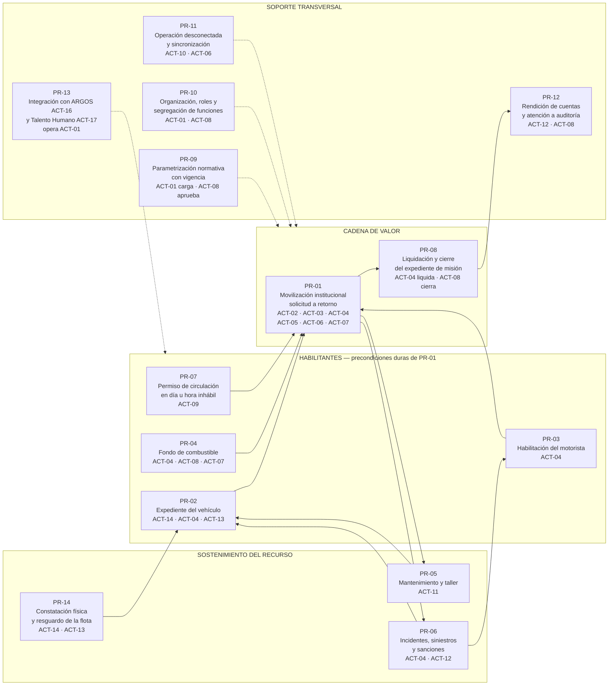

# Mapa de procesos de SIGTI

| Campo | Valor |
|---|---|
| **Ámbito** | Vista de conjunto de la operación de transporte de una institución pública hondureña |
| **Sprint / Bloque** | Sprint 0 / Bloque 1 |
| **Estado** | Borrador para revisión del PO |
| **Fecha** | 2026-08-06 |
| **Depende de** | [actores-y-roles.md](actores-y-roles.md), [DP-001](../07-gestion/decisiones-de-producto/DP-001-fronteras-con-sistemas-existentes.md), [ADR-001](../03-arquitectura/adr/ADR-001-integracion-argos-talento-humano.md), fichas [NRM-01](normativa/NRM-01-control-interno-tsc.md), [NRM-02](normativa/NRM-02-bienes-del-estado.md), [NRM-06](normativa/NRM-06-transito-y-licencias.md), [NRM-09](normativa/NRM-09-realidad-operativa.md), [NRM-10](normativa/NRM-10-peajes.md) |

---

## 1. Qué cuenta como proceso en este mapa

Un proceso `PR-xx` es una secuencia de trabajo que cumple **las cuatro condiciones**:

1. Tiene **disparador propio** — algo del mundo real lo inicia, no lo inicia otro proceso por conveniencia de documentación.
2. Tiene un **actor responsable** de que termine.
3. Produce una **salida verificable** — un documento, un estado, un expediente.
4. **El Tribunal Superior de Cuentas o Auditoría Interna pueden pedir su expediente.** `[V]` NRM-01

La cuarta condición es la que manda. Si una actividad no deja expediente reclamable, es un paso dentro de un proceso, no un proceso.

> **Proceso ≠ módulo.** Un proceso cruza varios módulos `M-xx`, y un módulo sirve a varios procesos. La tabla de módulos de `CLAUDE.md` organiza el software; este mapa organiza el trabajo de la institución.

---

## 2. Las tres capas

| Capa | Qué agrupa | Por qué se separa |
|---|---|---|
| **Habilitantes** | Lo que debe estar resuelto **antes** de que se pueda mover un vehículo | Cada uno es una precondición dura de `PR-01`. Si fallan, `PR-01` se bloquea — no se advierte, se bloquea |
| **Cadena de valor** | La movilización propiamente dicha y su cierre económico | Es el motivo por el que existe el sistema |
| **Sostenimiento y soporte** | Lo que mantiene el recurso vivo y el sistema confiable | Se alimentan de la ejecución y devuelven condiciones a los habilitantes |

---

## 3. Cadena de valor

Las flechas punteadas son **condicionamiento**, no secuencia: `PR-09` no se ejecuta antes de una misión, pero ninguna misión se calcula sin la tabla vigente que produce.

---

## 4. Catálogo de procesos

Los actores se identifican con los `ACT-xx` de [actores-y-roles.md](actores-y-roles.md), que es la fuente de verdad de responsabilidades, alcance de datos y matriz de permisos. `[C]` La denominación real de cada cargo varía por institución y se confirma al levantar el organigrama; los IDs no.

### 4.1 Procesos habilitantes

| ID | Proceso | Disparador | Actor principal | Otros actores | Salida | Módulos |
|---|---|---|---|---|---|---|
| **PR-02** | **Gestión del expediente del vehículo** — alta en inventario, ficha técnica, régimen de tenencia, tarjeta de responsabilidad, documentación y vencimientos, estado operativo, traslados, descargo y baja | Ingreso de un vehículo al patrimonio o al uso de la institución: compra, donación, comodato, alquiler, traslado interinstitucional | **Encargado de Bienes Institucionales (ACT-14)** para el bien: alta, número de inventario, tarjeta de responsabilidad, traslados y descargo | Jefe de Transporte (ACT-04) mantiene el expediente operativo y los vencimientos; Custodio del Vehículo (ACT-13) firma el acta; Encargado de Mantenimiento (ACT-11) declara el estado operativo; Gerencia Administrativa (ACT-08) o Máxima Autoridad (ACT-09) aprueban el descargo | Vehículo en estado `DISPONIBLE` con expediente completo, categoría de peaje resuelta y rotulación constatada | M-03, M-04, M-02, M-18 |
| **PR-03** | **Habilitación del motorista** — incorporación al padrón, licencia y categorías, restricciones médicas, capacitaciones, vehículos habilitados, disponibilidad | Un empleado con funciones de conducción se incorpora, o vence o cambia su licencia | **Jefe de Transporte (ACT-04)** — habilita e inhabilita en el padrón | Sistema de Talento Humano (ACT-17) provee identidad, puesto, permisos, vacaciones e incapacidades; Auditor Interno (ACT-12) consulta | Motorista (ACT-06) `HABILITADO` para un conjunto determinado de categorías de vehículo, con vigencia | M-05, M-02, M-20 |
| **PR-04** | **Gestión del fondo de combustible** — solicitud del fondo, aprobación de Administración, custodia, asignación a misiones o motoristas, reposición, corte del período | Agotamiento del fondo vigente, o inicio de un nuevo período de operación | **Jefe de Transporte (ACT-04)** solicita; **Gerencia Administrativa (ACT-08)** aprueba | Encargado de Combustible (ACT-07) custodia y entrega; Encargado de Delegación (ACT-10) en ámbito territorial | Fondo aprobado y disponible para asignar, con monto, partida, aprobante y fecha | M-09, M-13, M-20 |
| **PR-07** | **Permiso de circulación en día u hora inhábil** — solicitud justificada, resolución de la máxima autoridad, emisión del salvoconducto y verificación en carretera | Una misión aprobada cae, total o parcialmente, fuera del calendario y horario hábil vigentes | **Máxima Autoridad (ACT-09)** — facultad expresamente suya por norma `[V]` NRM-02 | Jefe de Transporte (ACT-04) o Encargado de Delegación (ACT-10) proponen; Encargado de Despacho (ACT-05) entrega el impreso; **Verificador en Carretera (ACT-15)** lo escanea en el puesto de control | **Salvoconducto impreso** con folio y QR verificable, con ventana temporal, vehículo, motorista y ruta | M-04, M-15, M-02 |

`PR-07` no es un trámite administrativo menor: sin él, circular en día u hora inhábil está prohibido y expone a multa y posible decomiso en operativo del TSC. `[V]` NRM-02 — rango de multa `[P]`, base legal exacta `[C]`.

**`PR-07` termina en la carretera, no en la oficina.** El destinatario final del salvoconducto es `ACT-15` Verificador en Carretera — agente de tránsito, comisión de fiscalización del TSC o autoridad de puesto de control. Es un actor **no autenticado**: la verificación por QR le muestra el mínimo verificable — folio, tipo de documento, institución, vigente o anulado, vehículo, ventana temporal y hash — y **nunca el expediente**. Sin `ACT-15` el documento impreso no tendría razón de existir. `[C]` Si la institución acepta exponer un punto público de verificación siendo el despliegue on-premise — pendiente G de actores-y-roles.

`[C]` La firma del permiso se trata como **indelegable** mientras no se confirme lo contrario — pendiente C de actores-y-roles.

### 4.2 Cadena de valor

| ID | Proceso | Disparador | Actor principal | Otros actores | Salida | Módulos |
|---|---|---|---|---|---|---|
| **PR-01** | **Movilización institucional** — de la necesidad de mover personas, carga o ambos hasta el retorno del vehículo y la devolución de la custodia | Una dependencia necesita movilizar un recurso institucional | **Solicitante (ACT-02)** inicia; **Jefe de Transporte (ACT-04)** ejecuta | Jefatura Inmediata (ACT-03) autoriza; Encargado de Despacho (ACT-05) despacha y recibe; Motorista (ACT-06) ejecuta; Encargado de Combustible (ACT-07) entrega el fondo; Máxima Autoridad (ACT-09) firma el salvoconducto; Encargado de Delegación (ACT-10) en territorio; Verificador en Carretera (ACT-15) en el puesto de control; ARGOS (ACT-16) y Talento Humano (ACT-17) como espejos | Misión ejecutada, bitácora cerrada, vehículo recibido y expediente listo para liquidar | M-06, M-07, M-08, M-09, M-15, M-16, M-17, M-18, M-19 |
| **PR-08** | **Liquidación y cierre del expediente de misión** — descargo conciliado del fondo entregado, conciliación de peajes, conciliación galonaje–kilometraje, tipificación de desviaciones y cierre | La misión llega a estado `RETORNADA` y su bitácora está cerrada | **Jefe de Transporte (ACT-04)** elabora el descargo conciliado; **Gerencia Administrativa (ACT-08)** cierra el expediente | Encargado de Combustible (ACT-07) aporta la liquidación del fondo que entregó, sin elaborar el descargo; Motorista (ACT-06) aporta comprobantes y remanente; Auditor Interno (ACT-12) consulta | Misión `CERRADA` o `CERRADA_CON_HALLAZGO`, con expediente inmutable y exportable a auditoría | M-13, M-09, M-18, M-14 |

`PR-08` es el último tramo de `PR-01` y se documenta aparte por dos razones: es donde se concentra el riesgo de hallazgo `[V]` NRM-01, y **quien liquida no es quien despachó ni quien entregó el fondo, y quien cierra no es quien liquida** — incompatibilidades I-09 y I-10 de actores-y-roles, bloqueo duro.

`ACT-04` puede liquidar la misión que él mismo programó: esa acumulación (I-14, *emite Orden de Misión × liquida*) **no está en la enumeración del MARCI** y queda como control **configurable, apagado por defecto**, para instituciones con planilla suficiente. `[I]`

### 4.3 Sostenimiento del recurso

| ID | Proceso | Disparador | Actor principal | Otros actores | Salida | Módulos |
|---|---|---|---|---|---|---|
| **PR-05** | **Mantenimiento y taller** — preventivo por kilometraje o calendario, correctivo, llantas, repuestos, órdenes de trabajo, indisponibilidad programada | Vencimiento del plan preventivo, falla reportada por el motorista desde el campo, o hallazgo en la verificación previa a la salida | **Encargado de Mantenimiento (ACT-11)** — es quien **declara la indisponibilidad del vehículo y su reingreso al servicio** | Motorista (ACT-06) reporta la falla desde el campo `[V]` DP-001 D-08; Jefe de Transporte (ACT-04) aprueba la salida de servicio; Custodio del Vehículo (ACT-13) propone | Vehículo devuelto a `DISPONIBLE`, o mantenido `EN_TALLER` con orden de trabajo abierta | M-11, M-03, M-08 |
| **PR-06** | **Incidentes, siniestros y sanciones** — avería en ruta, accidente, robo, multa de tránsito, uso indebido, investigación y deducción de responsabilidad | Evento reportado en bitácora, denuncia, notificación de multa, o hallazgo de auditoría | **Jefe de Transporte (ACT-04)** instruye el expediente | Motorista (ACT-06) y Encargado de Despacho (ACT-05) registran; Auditor Interno (ACT-12) verifica sin ejecutar; Encargado de Bienes (ACT-14) cuando deriva en descargo del bien; Máxima Autoridad (ACT-09) resuelve lo grave | Expediente de incidente con estado del proceso de deducción de responsabilidad | M-12, M-03, M-05, M-14 |
| **PR-14** | **Constatación física y resguardo de la flota** — verificación física contra el registro de bienes, acta de comisión verificadora, y resguardo previo a operativos de fiscalización | Calendario de inventario, corte de conciliación de bienes, o proximidad de Semana Santa | **Encargado de Bienes Institucionales (ACT-14)** — conduce la constatación física y la conciliación con el registro de bienes | Custodio del Vehículo (ACT-13) participa y firma; Jefe de Transporte (ACT-04) aporta el dato operativo; Auditor Interno (ACT-12) consulta y exporta; Gerencia Administrativa (ACT-08) recibe el reporte | Acta de constatación con fotografía, odómetro y ubicación; reporte de vehículos autorizados a circular y de vehículos resguardados | M-03, M-14, M-15 |

`PR-14` existe porque el TSC realiza **operativos de fiscalización vehicular en Semana Santa** `[V]` NRM-02. Es un evento recurrente y predecible: el sistema puede prepararse para él en lugar de sufrirlo.

**Corrección de titularidad.** El alta del bien, el número de inventario nacional, la tarjeta de responsabilidad, el descargo y la constatación física **no son competencia del Jefe de Transporte (`ACT-04`)**: los ejecuta la unidad de Bienes o Patrimonio, `ACT-14`, cuyo alcance es institucional pero **restringido al objeto vehículo como bien** — no ve misiones ni combustible. La Circular CGR-010-2026 de la Contaduría General exige conciliación de bienes del ejercicio `[V]` NRM-01. Además, **quien propone el descargo de un bien no lo aprueba** — incompatibilidad I-17, bloqueo duro. `[C]` Si la institución no tiene unidad de Bienes separada y la función la absorbe `ACT-08`, se activa el control compensatorio previsto en actores-y-roles.

### 4.4 Soporte transversal

| ID | Proceso | Disparador | Actor principal | Otros actores | Salida | Módulos |
|---|---|---|---|---|---|---|
| **PR-09** | **Parametrización normativa con vigencia** — tarifas de peaje, categorías vehiculares, matriz licencia↔vehículo, feriados, horario hábil, plazos, umbrales de desviación | Publicación o cambio de una norma, o alerta del sistema por parámetro sin revisar más de 12 meses | **Administrador del Sistema (ACT-01)** carga el parámetro y su respaldo documental; **Gerencia Administrativa (ACT-08)** aprueba su puesta en vigencia — doble control | Jefe de Transporte (ACT-04) y Encargado de Bienes (ACT-14) proponen catálogo operativo; Auditor Interno (ACT-12) ve el histórico completo de cambios | Nueva versión del parámetro con **rango de vigencia**, fuente y fecha de verificación registradas | M-02, M-18, M-05 |
| **PR-10** | **Organización, roles y segregación de funciones** — dependencias, delegaciones, usuarios, roles por puesto, alcance de datos, delegaciones de autorización | Cambio de estructura, rotación de personal, o traspaso de custodias | **Administrador del Sistema (ACT-01)** | Gerencia Administrativa (ACT-08) aprueba el alta de roles con facultad de autorizar, aprobar fondos o administrar parámetros `[I]`; Máxima Autoridad (ACT-09) declara regímenes de excepción; ARGOS (ACT-16) provee la estructura y los niveles de autorización | Matriz de roles vigente que hace cumplir la segregación como bloqueo duro | M-01, M-20 |
| **PR-11** | **Operación desconectada y sincronización** — captura en campo sin red, cola local, reconciliación al reconectar, resolución de conflictos, digitación diferida de formatos en papel | Recuperación de señal, o entrega de formatos en papel llenados en zona sin cobertura | **Encargado de Delegación (ACT-10)** para la digitación diferida | Motorista (ACT-06) y Encargado de Despacho (ACT-05) capturan en campo; Administrador del Sistema (ACT-01) atiende la cola de conflictos técnica | Registros del campo incorporados al expediente, con distinción entre **fecha del hecho** y fecha de captura | M-16, M-08, M-15 |
| **PR-12** | **Rendición de cuentas y atención a auditoría** — reportes operativos y de control interno, paquetes de evidencia, atención de requerimientos del TSC o de Auditoría Interna | Requerimiento de auditoría, corte periódico, o alerta automática de correlación anómala | **Auditor Interno (ACT-12)** — solo lectura y exportación, con registro de cada consulta | Gerencia Administrativa (ACT-08), Máxima Autoridad (ACT-09), Jefe de Transporte (ACT-04) y Encargado de Bienes (ACT-14) exportan dentro de su alcance | Paquete de evidencia por período, vehículo, motorista o dependencia, con índice y sello de tiempo | M-14, M-13, M-15 |
| **PR-13** | **Integración con sistemas hermanos** — carga inicial, webhooks, reconciliación periódica y cola de conflictos | Evento emitido por el sistema origen, o ventana de reconciliación programada | **Administrador del Sistema (ACT-01)** opera | **Sistema ARGOS (ACT-16)** y **Sistema de Talento Humano (ACT-17)** como actores sistema origen | Espejo local al día, con marca de última sincronización visible por entidad | M-20 |

`PR-13` opera bajo el patrón de [ADR-001](../03-arquitectura/adr/ADR-001-integracion-argos-talento-humano.md): **espejo local, nunca consulta en línea en la operación**.

`ACT-01` **no ejecuta ninguna transacción de negocio** y no puede alterar la pista de auditoría: su rol se define por exclusión y su actividad la revisa `ACT-12` — incompatibilidad I-13, núcleo irreductible.

---

## 5. Encadenamiento: qué necesita `PR-01` para poder ejecutarse

| Precondición | La produce | Si falta |
|---|---|---|
| Un vehículo `DISPONIBLE`, con documentación vigente, tipo y categoría de peaje resueltos | `PR-02` — `ACT-14` y `ACT-04`, estado operativo declarado por `ACT-11` | No hay asignación posible — bloqueo en programación |
| Un motorista `HABILITADO` con licencia vigente durante **todo** el rango de la misión | `PR-03` — `ACT-04`, sobre dato **propio de SIGTI** | Bloqueo duro `[V]` NRM-06, D-12 de DP-001 |
| Fondo de combustible aprobado con saldo suficiente | `PR-04` — `ACT-08` aprueba, `ACT-07` custodia | Se bloquea la entrega del fondo, no necesariamente la misión — ver `PR-01`, punto de control PC-08 |
| Salvoconducto vigente, cuando la salida cae fuera del calendario hábil | `PR-07` — `ACT-09` | Bloqueo del despacho `[V]` NRM-02 |
| Tablas vigentes de tarifas, feriados, horario y matriz de licencias **a la fecha del hecho** | `PR-09` — `ACT-01` carga, `ACT-08` aprueba | El cálculo de estimados y la determinación de día inhábil no son confiables |
| Roles asignados de forma que ningún actor concentre dos funciones incompatibles | `PR-10` — `ACT-01` | Bloqueo duro `[V]` NRM-01 |
| Disponibilidad del motorista: sin permiso, vacaciones ni incapacidad | `PR-13` sobre el espejo de Talento Humano `ACT-17` | Bloqueo en la asignación; se cubre con otro motorista sin perder trazabilidad de la asignación original |
| Nivel de autorización competente resuelto sobre la estructura de ARGOS | `PR-13` sobre el espejo de ARGOS `ACT-16` | Sin ARGOS, `ACT-03` no se resuelve automáticamente `[C]` |

### Qué devuelve `PR-01` al resto

| Salida | La consume |
|---|---|
| Kilometraje acumulado y falla reportada desde el campo por `ACT-06` | `PR-05` — `ACT-11` dispara el preventivo o el correctivo |
| Avería, accidente, multa o uso indebido detectado | `PR-06` — `ACT-04` instruye, `ACT-12` verifica |
| Consumo real del fondo y saldo devuelto | `PR-04` — `ACT-07` arquea, alimenta la reposición del período |
| Desviación de peaje, de galonaje o de ruta | `PR-08` (`ACT-04`, `ACT-08`) y `PR-12` (`ACT-12`) |
| Odómetro, ubicación y estado observado del vehículo | `PR-02` y `PR-14` — `ACT-14`, `ACT-13` |
| Documento impreso con folio y QR verificado en carretera | `PR-07` — cierra el ciclo con `ACT-15` |

---

## 6. Los procesos contra el ciclo de vida de la Orden de Misión

| Estado | Proceso que lo produce | Módulo dominante |
|---|---|---|
| `BORRADOR` → `SOLICITADA` | PR-01, etapa de solicitud | M-06 |
| `SOLICITADA` → `APROBADA` / `RECHAZADA` | PR-01, etapa de autorización | M-06 |
| `APROBADA` → `PROGRAMADA` | PR-01, etapa de programación y asignación | M-07 |
| `PROGRAMADA` → `DESPACHADA` | PR-01, etapa de despacho — requiere `PR-04` y, si aplica, `PR-07` | M-07, M-09 |
| `DESPACHADA` → `EN_RUTA` | PR-01, etapa de ejecución — opera sin red | M-08, M-16, M-19 |
| `EN_RUTA` → `RETORNADA` | PR-01, etapa de retorno y recepción | M-08 |
| `RETORNADA` → `LIQUIDADA` | PR-08 — descargo conciliado de `ACT-04` | M-13 |
| `LIQUIDADA` → `CERRADA` / `CERRADA_CON_HALLAZGO` | PR-08 — cierre de `ACT-08`; ante hallazgo entra `PR-06` y `ACT-12` | M-13, M-12, M-14 |
| `ANULADA` (desde cualquier estado previo a `EN_RUTA`) | PR-01, con asiento reverso de fondo y peajes ya emitidos. Anular después del despacho es facultad de `ACT-08` y exige reversión de los vales con acta de `ACT-07` | M-13, M-09 |

Toda transición registra actor, rol, marca de tiempo, origen y motivo. Nada se borra: la anulación es asiento reverso. `[V]` NRM-01

---

## 7. Segregación de funciones vista como cadena

El control interno del Estado exige que estas cinco funciones **no se acumulen en la misma persona**. `[V]` NRM-01 — códigos NOGECI exactos `[C]`.

El bloqueo lo implementa `PR-10` (`ACT-01`) y lo hace cumplir cada proceso en el momento del acto, no al final. **Es bloqueo duro, no advertencia.** La tabla completa de incompatibilidades I-01 a I-17 y su núcleo irreductible están en [actores-y-roles.md](actores-y-roles.md), sección 5.

Dos precisiones que corrigen la lectura ingenua de la cadena:

- **Quien liquida no es un actor aparte:** el descargo conciliado lo elabora `ACT-04`, que no autoriza (`ACT-03`), no despacha (`ACT-05`) y no entrega el fondo (`ACT-07`). El **cierre** sí cambia de manos: es de `ACT-08`.
- `ACT-06` Motorista **no puede autorizar, despachar, recibir el fondo como responsable ni liquidar su propia misión** — I-11, núcleo irreductible.

`[C]` En delegaciones con poco personal la cadena no se puede cumplir por aritmética: cinco funciones separadas exigen cinco personas. `ACT-10` Encargado de Delegación concentra `ACT-03`, `ACT-04`, `ACT-05` y `ACT-07`. La salida propuesta — subir a sede lo que no requiere presencia física, y un **régimen de excepción declarado, acotado y compensado** que nunca levanta el núcleo irreductible — está en actores-y-roles sección 5.4 y **no está aprobada por la institución**: es el pendiente D.

---

## 8. Qué **no** es proceso de SIGTI

| Actividad | Dueño | Referencia |
|---|---|---|
| Cálculo, anticipo y liquidación de **viáticos** | **ARGOS (ACT-16)** | DP-001, D-01 |
| Estructura presupuestaria y afectación | **ARGOS (ACT-16)** | DP-001, D-01 y D-09 |
| Definición de **niveles de autorización** y jerarquía | **ARGOS (ACT-16)** — sin él, `ACT-03` no se resuelve automáticamente | DP-001, D-05 |
| Componente de mapas | **ARGOS (ACT-16)** — se reutiliza, no se construye | DP-001, D-06 |
| Expediente del empleado, permisos, vacaciones, incapacidades, calendario de feriados | **Talento Humano (ACT-17)** | DP-001, D-07 |
| Compra de combustible, contratos y convenios marco de suministro | Otros sistemas de la institución | DP-001, D-03 |
| Inventario de insumos y materiales | Almacén — integración **diferida** | DP-001 |
| Firma electrónica certificada | **Descartada.** Autorización interna con registro completo | DP-001, D-04 |

SIGTI **sí** conserva el vínculo con los viáticos de ARGOS por clave compartida, y **sí** gestiona los gastos operativos que el motorista ejecuta con fondos de la institución: **combustible y peajes**. Eso es control de flota, no viático del servidor. `[V]` DP-001, D-01.

**La licencia de conducir sí es dato propio de SIGTI.** `ACT-17` provee identidad, puesto, alta y baja, permisos, vacaciones e incapacidades; **número de licencia, categorías, vigencia, restricciones médicas y escaneo son de SIGTI**, porque el bloqueo duro de la matriz licencia↔vehículo no puede depender del modelo de datos de un sistema ajeno que no tiene motivo para mantenerlo. Corrección incorporada a [ADR-001](../03-arquitectura/adr/ADR-001-integracion-argos-talento-humano.md). Consecuencia operativa que hay que decir de frente: **alguien de la institución tiene que capturar y mantener las licencias dentro de SIGTI**, y eso es trabajo adicional real. `[C]` Reconsiderable si el contrato de API de Talento Humano (insumo #17) demuestra que sí mantiene ese detalle.

---

## 9. Pendientes de la institución

| Pendiente | Afecta | Marca |
|---|---|---|
| Denominación real de los cargos y **qué puesto ocupa cada `ACT-xx`** de la cadena de segregación | Todos | `[C]` |
| Si la institución acepta el **régimen de excepción con controles compensatorios** para delegaciones sin personal suficiente, y bajo qué formalidad | PR-10, PR-01 — `ACT-10` | `[C]` — pendiente D de actores-y-roles |
| Si existe **unidad de Bienes separada** o `ACT-08` absorbe las funciones de `ACT-14` | PR-02, PR-14 | `[C]` — pendiente F |
| Si la institución acepta exponer un **punto público de verificación de QR** para `ACT-15`, siendo el despliegue on-premise | PR-07, PR-01 | `[C]` — pendiente G |
| Si es **delegable la firma** del permiso de circulación en día u hora inhábil | PR-07 — `ACT-09` | `[C]` — pendiente C. Hasta confirmarlo, indelegable |
| Niveles y umbrales de autorización, propiedad de `ACT-16` | PR-01 — `ACT-03` | `[C]` — pendiente A, insumo #16 |
| Horario hábil oficial y calendario de feriados aplicable | PR-07, PR-09 | `[C]` — NRM-09 |
| Reglamento interno de uso de vehículos | PR-02, PR-06 | `[C]` — insumo #1 |
| Formatos en papel vigentes de bitácora, requisición, salida y control de combustible | PR-01, PR-11 | `[C]` — insumo #2 |
| Informes de Auditoría Interna o del TSC sobre flota | PR-12 | `[C]` — insumo #19 |
| Si el peaje se financia con el viático o es gasto de misión separado | PR-08 | `[C]` — insumo #25 |

Los que traen número están en [insumos-pendientes.md](../07-gestion/insumos-pendientes.md); los identificados con letra los genera [actores-y-roles.md](actores-y-roles.md) y **aún deben trasladarse a ese registro**. **Ninguno se suple con inferencia.**

---

## 10. Trazabilidad

- **Procesos detallados**: [PR-01](procesos/PR-01-movilizacion-institucional.md). Los demás se escriben en el mismo bloque.
- **Normativa**: [NRM-01](normativa/NRM-01-control-interno-tsc.md), [NRM-02](normativa/NRM-02-bienes-del-estado.md), [NRM-06](normativa/NRM-06-transito-y-licencias.md), [NRM-09](normativa/NRM-09-realidad-operativa.md), [NRM-10](normativa/NRM-10-peajes.md)
- **Decisiones**: [DP-001](../07-gestion/decisiones-de-producto/DP-001-fronteras-con-sistemas-existentes.md), [ADR-001](../03-arquitectura/adr/ADR-001-integracion-argos-talento-humano.md)
- **Actores**: [actores-y-roles.md](actores-y-roles.md) — `ACT-01` a `ACT-17`, con matriz de permisos, alcance de datos y tabla de incompatibilidades I-01 a I-17. Es la fuente de verdad; este mapa solo referencia
- **Reglas de negocio**: las candidatas detectadas en cada proceso se consolidan en `docs/01-negocio/reglas/`
