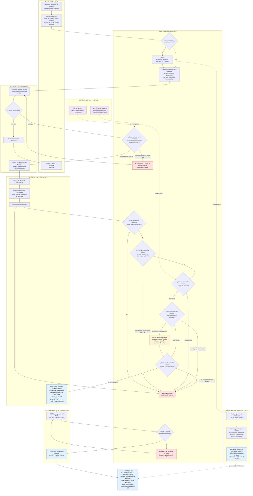
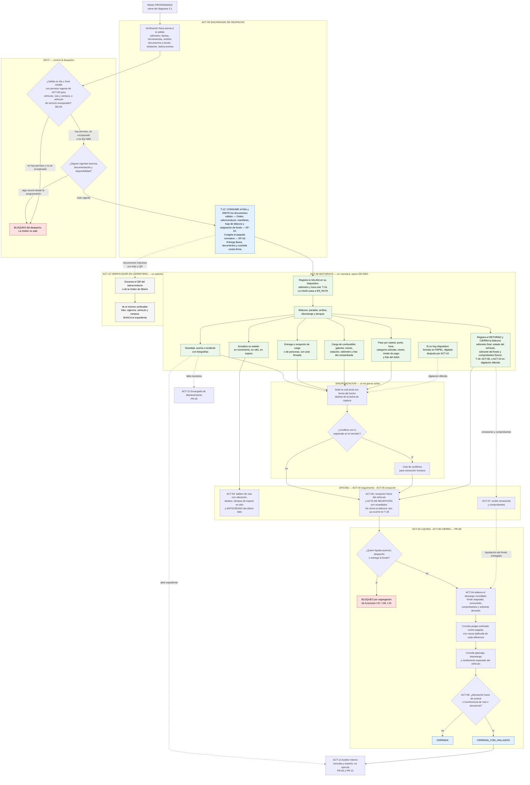
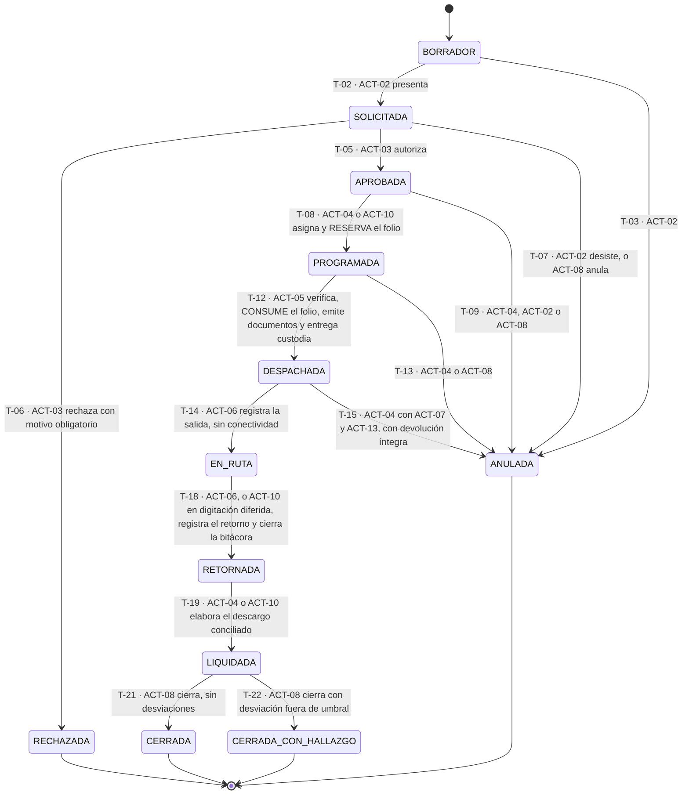

# PR-01 — Movilización institucional

| Campo | Valor |
|---|---|
| **Tipo** | Proceso misional. Es el macroproceso central de SIGTI |
| **Disparador** | Una dependencia necesita movilizar un recurso institucional: personal, personas externas, carga o una combinación |
| **Actor responsable** | **Jefe de Transporte (ACT-04)**. Lo inicia el Solicitante (ACT-02) y lo cierra Gerencia Administrativa (ACT-08) |
| **Actores intervinientes** | ACT-02, ACT-03, ACT-04, ACT-05, ACT-06, ACT-07, ACT-08, ACT-09, ACT-10, ACT-11, ACT-12, ACT-13, ACT-15, ACT-16, ACT-17 |
| **Salida** | Orden de Misión ejecutada, bitácora cerrada, vehículo recibido, fondo liquidado y expediente `CERRADA` o `CERRADA_CON_HALLAZGO` |
| **Módulos** | M-06, M-07, M-08, M-09, M-13, M-15, M-16, M-17, M-18, M-19, M-20 |
| **Sprint / Bloque** | Sprint 0 / Bloque 1 — borrador para revisión del PO |
| **Fecha** | 2026-08-06. **Corregido el 2026-08-13** con los hallazgos del Bloque 3 |

> **La unidad de control no es el viaje. Es la Orden de Misión.** Todo lo que se autoriza, se gasta, se recorre y se responde ante auditoría cuelga de ese folio.

> **Alineación con la autoridad.** En transiciones de estado, precondiciones, invariantes y bloqueos duros manda [orden-de-mision.md](../../03-arquitectura/estados/orden-de-mision.md); en actores e incompatibilidades manda [actores-y-roles.md](../actores-y-roles.md) — [precedencia entre artefactos, `CLAUDE.md`](../../../CLAUDE.md). Este proceso **narra** el flujo; **no redefine** ninguna de las dos cosas. Las correcciones de esta versión responden a los hallazgos `HB3-09`, `HB3-10` y `HB3-11`, e incorporan lo ya corregido en la autoridad por `HB3-01`, `HB3-02`, `HB3-04`, `HB3-07` y `HB3-08`, más las incompatibilidades `I-18` e `I-19`. Cada una lleva su nota visible en el punto donde aplica.

---

## 0. Alcance y no-alcance

**Está dentro:** la necesidad, la solicitud, la autorización, la programación, la asignación de vehículo y motorista, la Orden de Misión, la entrega del fondo de combustible, el despacho, la bitácora, el paso por peajes, el seguimiento en ruta, el retorno, la liquidación de los gastos operativos y el cierre del expediente.

**Está fuera:**

| Fuera del proceso | Quién lo hace | Referencia |
|---|---|---|
| Cálculo, anticipo y liquidación de **viáticos** | **ARGOS (ACT-16)**. SIGTI solo guarda la clave de vínculo y muestra el estado | DP-001, D-01 |
| Determinación del **nivel de autorización** competente | **ARGOS (ACT-16)**. SIGTI lo resuelve contra su espejo local | DP-001, D-05 |
| **Disponibilidad del empleado** — permiso, vacaciones, incapacidad, feriados | **Talento Humano (ACT-17)**. SIGTI lo resuelve contra su espejo local | DP-001, D-07 |
| Compra de combustible y contratos de suministro | Fuera del alcance del producto | DP-001, D-03 |
| Alta del bien, tarjeta de responsabilidad, descargo y constatación física del vehículo | **Encargado de Bienes Institucionales (ACT-14)**, en `PR-02` y `PR-14` | actores-y-roles, ACT-14 |

Lo que **sí** liquida SIGTI son los gastos operativos que el motorista ejecuta con fondos entregados por la institución: **combustible y peajes**. No es viático del servidor; es control de flota. `[V]` DP-001, D-01.

---

## 1. Quiénes intervienen

Los `ACT-xx` y su matriz de permisos son de [actores-y-roles.md](../actores-y-roles.md), que es la fuente de verdad. `[C]` La denominación de cada cargo varía por institución; los identificadores no.

| Actor | Qué hace en PR-01 | No puede hacer |
|---|---|---|
| **ACT-02 Solicitante** — servidor de una dependencia | Detecta la necesidad y registra la solicitud | Autorizar, despachar, recibir el fondo ni liquidar su propia misión — I-01 a I-04 |
| **ACT-03 Jefatura Inmediata** | Se pronuncia sobre la **procedencia de la necesidad**: autoriza o rechaza con motivo | Decidir vehículo ni motorista — eso es de `ACT-04`. Autorizar si es también el solicitante — I-01 |
| **ACT-04 Jefe de Transporte** | Programa, consolida, asigna vehículo y motorista, **reserva el folio** de la Orden de Misión (`T-08`, `EF-02`), solicita el fondo, y **elabora el descargo conciliado de la misión** | Autorizar la necesidad (`ACT-03`), despachar físicamente (`ACT-05`), entregar el fondo (`ACT-07`) ni cerrar el expediente (`ACT-08`). **Emitir el documento válido de la Orden**: eso ocurre al despachar, en `T-12`, y lo ejecuta `ACT-05`. **Aprobar el fondo que él mismo solicita** — I-19. **Dar por buena su propia licencia** cuando además conduce — I-18 |
| **ACT-05 Encargado de Despacho** | Verifica físicamente el vehículo, **emite los documentos oficiales consumiendo el folio** (`T-12`, `EF-02`), entrega llaves y documentos contra la Orden impresa, registra el odómetro de salida en el acta de entrega, y al retorno recibe el vehículo y levanta el acta de recepción | Programar, autorizar, entregar el fondo o liquidar. **Cerrar la bitácora**: el cierre ocurre en `T-18` y lo ejecuta `ACT-06`, o `ACT-10` en digitación diferida |
| **ACT-06 Motorista** | Conduce, **registra la salida** (`T-14`) y **el retorno con el cierre de la bitácora** (`T-18`) sin conectividad, paga peajes, carga combustible, actualiza su estado en ruta, reporta fallas e incidentes, retorna el vehículo con remanente y comprobantes | Editar una bitácora cerrada, modificar autorizaciones, o autorizar, despachar, recibir como responsable el fondo o liquidar **su propia misión** — I-11, núcleo irreductible |
| **ACT-07 Encargado de Combustible** | Custodia el fondo, lo asigna a la misión y lo entrega contra firma, controla el ciclo del vale y recibe el remanente | **Liquidar las misiones cuyo fondo entregó** — I-10, núcleo irreductible — ni despachar |
| **ACT-08 Gerencia Administrativa** | Aprueba el fondo del período (`PR-04`), resuelve autorizaciones escaladas `[C]`, y **cierra el expediente de la misión** | Liquidar lo que cierra, cuando además autorizó — I-07. **Solicitar el fondo que aprueba** — I-19 |
| **ACT-09 Máxima Autoridad** | Firma el permiso de circulación en día u hora inhábil, resuelve lo escalado por conflicto de segregación, anula por causa grave | Delegar la firma del permiso `[C]` — se trata como indelegable hasta confirmarlo |
| **ACT-10 Encargado de Delegación** | En ámbito territorial concentra `ACT-03`, `ACT-04`, `ACT-05` y `ACT-07`; **registra el retorno y cierra la bitácora en digitación diferida** (`T-18`) y hace la digitación diferida del papel | Levantar el núcleo irreductible I-07, I-10, I-11 ni siquiera bajo régimen de excepción |
| **ACT-11 Encargado de Mantenimiento** | Declara la indisponibilidad y el reingreso del vehículo — condiciona toda la programación | Autorizar, despachar o liquidar |
| **ACT-12 Auditor Interno** | Recibe los expedientes con hallazgo y exporta paquetes de evidencia | **Ejecutar cualquier acto de negocio** — I-12, núcleo irreductible |
| **ACT-13 Custodio del Vehículo** | Responde patrimonialmente por el bien; firma el acta de entrega-recepción de la custodia | Autorizar la salida de su propio vehículo sin motivo escrito — I-15, advertencia |
| **ACT-15 Verificador en Carretera** | **No autenticado.** Detiene el vehículo y escanea el QR de la Orden de Misión o del salvoconducto | Ver el expediente: solo el mínimo verificable |
| **ACT-16 Sistema ARGOS** | Provee niveles de autorización, estructura presupuestaria, clave de viáticos y componente de mapas | Ser consultado en línea durante la operación — se trabaja contra espejo |
| **ACT-17 Sistema de Talento Humano** | Provee identidad, puesto, permisos, vacaciones, incapacidades y calendario | Ser fuente de la **licencia de conducir**: eso es dato propio de SIGTI |

---

## 2. Narrativa paso a paso

Se narra como lo vive quien lo ejecuta. El encabezado de cada etapa indica **qué actor la ejecuta** y si funciona **sin red**.

### E1 — Aparece la necesidad · `ACT-02` · `SIN RED`

Una dependencia necesita mover algo. No siempre es gente: puede ser un lote de expedientes a la delegación regional, un generador eléctrico a un puesto fronterizo, una comisión de tres servidores a una supervisión, o una combinación. El Solicitante (`ACT-02`) entra al sistema y empieza el borrador — con frecuencia es la asistente de la unidad quien captura por encargo de su jefatura `[I]`.

**La captura por encargo se declara, no se infiere.** El borrador registra por separado **quién captura** y **a nombre de quién se solicita** — el solicitante de derecho. Sin ese dato el bloqueo de segregación de E3 queda ciego, porque formalmente el jefe que autoriza no creó ni envió nada `[V]` `BD-01`, [orden-de-mision.md](../../03-arquitectura/estados/orden-de-mision.md).

> **Corrección — hallazgo `HB3-01`.** `BD-01` fue corregida para comparar al autorizador contra **tres** identidades: quien creó la solicitud (`T-01`), quien la envió (`T-02`) y **el solicitante de derecho**. El escenario cotidiano —la asistente captura para su jefe y el jefe autoriza— no bloqueaba, y sin embargo violaba I-01. La consecuencia sobre este proceso es que el dato del solicitante de derecho es **obligatorio desde E1**, no un adorno de la narrativa.

Aquí el sistema ya hace su primera pregunta que en papel nadie hacía: **qué se traslada**. Personal de la institución, personas externas, carga, o mixto. De esa respuesta dependen el tipo de vehículo compatible, los documentos que habrá que emitir y las validaciones que se aplicarán.

*Regla candidata `RN-c:objeto-del-traslado-obligatorio` — ninguna solicitud avanza sin objeto del traslado declarado, y ese dato determina el tipo de vehículo compatible.*

### E2 — Se registra la solicitud de transporte · `ACT-02` · `SIN RED`

El Solicitante (`ACT-02`) llena: motivo institucional, objeto del traslado con su detalle (cantidad de pasajeros, o naturaleza, peso y volumen de la carga), origen, destino o destinos, paradas previstas, ventana de fechas y horas, tipo de vehículo requerido, si requiere viático en ARGOS, y si es una emergencia.

El sistema, sin que nadie se lo pida:

- resuelve si la ventana cae en **día u hora inhábil** contra el calendario vigente **a la fecha prevista de salida**, no a la de hoy;
- **estima el costo de peajes** de la ruta, desglosado por punto de peaje y con la categoría que corresponde al tipo de vehículo requerido, con la tarifa vigente a la fecha prevista `[V]` NRM-10;
- estima el **consumo de combustible** según el rendimiento histórico del tipo de vehículo;
- muestra si hay vehículos del tipo requerido con disponibilidad en esa ventana.

El estimado de peajes se presenta **desglosado, nunca como total opaco**: quien autoriza tiene que poder verificar el cálculo `[V]` NRM-10.

La solicitud pasa a `SOLICITADA`.

### E3 — La jefatura inmediata autoriza · `ACT-03` · `REQUIERE RED`

La Jefatura Inmediata (`ACT-03`) abre su bandeja y ve la solicitud con las validaciones ya evaluadas y las advertencias en la cara: día inhábil, estimados, disponibilidad, misiones anteriores del solicitante sin liquidar. Se pronuncia sobre **la procedencia de la necesidad**, no sobre el vehículo ni el motorista: eso es de `ACT-04`.

Al autorizar, el sistema verifica **antes de registrar nada**:

1. Que quien autoriza **no sea ninguna de las tres identidades** del lado solicitante, cuando sean distintas entre sí: quien **creó** la solicitud, quien la **envió**, y el **solicitante de derecho** declarado en E1. Si coincide con cualquiera de ellas, bloquea y escala al puesto superior, dejando el intento en la pista de auditoría con el par de incompatibilidad detectado — I-01. La comparación es por **identidad de persona**, no por cuenta de usuario: un mismo servidor con dos cuentas sigue siendo la misma persona. `[V]` NRM-01, `BD-01`.
2. Que tenga **nivel competente** sobre la dependencia y sobre el tipo de misión, resuelto contra el espejo local de **ARGOS (`ACT-16`)**. `[C]` Los umbrales de escalamiento por monto, destino, duración o tipo de carga son propiedad de `ACT-16` — pendiente A. **No se cablea ninguno.**

Se registra quién, con qué cargo y rol, cuándo, desde qué dispositivo y **sobre qué contenido** — con hash del contenido autorizado. No hay firma electrónica certificada: la autorización es interna, con registro completo. `[V]` DP-001, D-04.

La solicitud pasa a `APROBADA`, o a `RECHAZADA` con **motivo obligatorio**. `RECHAZADA` es estado terminal y queda en el expediente: no se reabre, se duplica como nueva.

Si la ventana cae en día u hora inhábil, la aprobación de `ACT-03` **es válida pero no habilita el despacho**. Queda con la marca `REQUIERE_PERMISO_MAXIMA_AUTORIDAD` y se dispara `PR-07` hacia `ACT-09`.

`[C]` **Caso sin resolver:** quién autoriza la misión de la propia Máxima Autoridad (`ACT-09`). Su despacho captura la solicitud, pero `ACT-09` no puede autorizarse a sí misma sin romper I-01. Hasta que la institución lo defina, el sistema la trata como cualquier solicitud y **escala** — pendiente B de actores-y-roles.

### E4 — Programación · `ACT-04` · `REQUIERE RED`

La solicitud aprobada cae en la cola de programación del Jefe de Transporte (`ACT-04`), que ve el calendario de la flota, los conflictos y las **oportunidades de consolidación**: dos solicitudes al mismo destino, en la misma ventana, con carga compatible, se atienden con un solo vehículo.

La consolidación no fusiona las solicitudes: **cada una conserva su expediente y su autorización**, y ambas quedan vinculadas a una misma Orden de Misión. Esto importa porque el costo se prorratea y porque cada dependencia responde por lo suyo.

*Regla candidata `RN-c:consolidacion-conserva-expedientes` — consolidar no elimina la trazabilidad individual de cada solicitud.*

### E5 — Asignación de vehículo y motorista · `ACT-04` · `REQUIERE RED`

Es el punto de mayor riesgo legal de todo el proceso. `ACT-04` decide; el sistema resuelve la compatibilidad y bloquea lo que no puede pasar:

| Verificación | Fuente del dato | Resultado si falla |
|---|---|---|
| Tipo de vehículo compatible con el objeto del traslado — pasajeros, peso, volumen, naturaleza de la carga | SIGTI, ficha técnica de `PR-02` | Bloqueo: no se puede asignar |
| Vehículo `DISPONIBLE`: no en taller, sin misión superpuesta, sin indisponibilidad programada | SIGTI — el estado lo declara `ACT-11` | Bloqueo |
| Documentación del vehículo vigente durante todo el rango de la misión | SIGTI, expediente mantenido por `ACT-04` y `ACT-14` | Matrícula: bloqueo. Seguro y revisión: **advertencia registrada**, bloqueo solo si la institución lo activó `[V]` NRM-06 |
| Rotulación e identificación del vehículo del Estado constatada | SIGTI — última constatación de `PR-14`, `ACT-14` y `ACT-13` | Advertencia con fecha de última constatación `[V]` NRM-02 |
| **Licencia del motorista habilitante para la categoría del vehículo y vigente en toda la ventana de la misión** | **SIGTI — dato propio**, mantenido en `PR-03` por `ACT-04` | **Bloqueo duro, sin excepción configurable** `[V]` NRM-06, DP-001 D-12 |
| Motorista disponible: sin permiso, vacaciones ni incapacidad | Espejo de **Talento Humano (`ACT-17`)** | Bloqueo; se cubre con otro motorista conservando la trazabilidad de la asignación original `[V]` DP-001, D-07 |
| **Categoría de peaje del vehículo resuelta y vigente** | SIGTI, derivada de la ficha técnica | **Bloqueo**: es precondición de `T-08`, no advertencia `[V]` NRM-10 |

> **Corrección — hallazgo `HB3-09`.** Esta fila decía *"Advertencia: sin ella el estimado de peajes no es confiable"*, y la severidad estaba repartida en tres momentos y dos gravedades distintas. **Manda la máquina de estados:** `BD-07` exige *"categoría de peaje resuelta y vigente"* entre las precondiciones de `T-08`, de modo que **sin ella no se programa**. El razonamiento de fondo es el mismo que sostiene el desglose de E2: quien autoriza tiene que poder **verificar el cálculo** del estimado, y un estimado calculado sobre una categoría no resuelta no es verificable — es un número inventado con apariencia de dato `[V]` NRM-10, `BD-07`, [orden-de-mision.md](../../03-arquitectura/estados/orden-de-mision.md).
>
> Consecuencia operativa que hay que decir de frente: **la categoría de peaje pasa a ser dato obligatorio de la ficha del vehículo antes de que ese vehículo pueda asignarse a misión alguna**. Se resuelve en `PR-02`, no en la cola de programación. Un vehículo recién ingresado a flota sin categoría resuelta queda inasignable hasta que alguien la capture. Ver también `PC-06b`.

Sobre la licencia: asignar un motorista sin licencia habilitante **traslada responsabilidad directa a quien autorizó**. Una excepción registrada en el sistema sería evidencia en contra ante un siniestro. Por eso no existe la opción de forzarlo.

**La licencia es dato propio de SIGTI, no espejo de `ACT-17`.** Categoría, vigencia y restricciones médicas son exactamente lo que `ACT-17` no tiene motivo para mantener, y un control de esta criticidad legal no puede depender del modelo de datos de un sistema ajeno — corrección incorporada a [ADR-001](../../03-arquitectura/adr/ADR-001-integracion-argos-talento-humano.md). El precio, dicho de frente: alguien de la institución tiene que capturarlas y mantenerlas dentro de SIGTI, con su alerta de vencimiento.

*Regla candidata `RN-c:licencia-habilitante-bloqueo-duro`.*
*Regla candidata `RN-c:vigencia-cubre-todo-el-rango` — no basta que la licencia o el documento estén vigentes hoy: deben estarlo el último día de la misión.*

### E6 — Se prepara la Orden de Misión y se **reserva** su folio · `ACT-04` · `REQUIERE RED`

> **Corrección — hallazgo `HB3-10`.** Esta etapa decía que el Jefe de Transporte (`ACT-04`) **emite** la Orden de Misión y que ahí se imprime, estando la misión en `PROGRAMADA`. **Es incorrecto**, y es la misma clase de error que ya se corrigió en `HB1-06` con el fondo entregado antes de tiempo. La máquina de estados separa dos momentos del folio: `EF-02` lo **reserva** dentro de `T-08` — `INV-15`: *"el folio está **reservado** del rango de la delegación, no consumido"* — y `EF-02` lo **consume y emite los documentos oficiales** dentro de `T-12` despachar, transición que ejecuta `ACT-05`. La sección 2 de [orden-de-mision.md](../../03-arquitectura/estados/orden-de-mision.md) lista expresamente entre lo que **no se puede** en `PROGRAMADA`: *"Imprimir la Orden de Misión como documento válido — se puede imprimir una vista previa marcada visiblemente como no válida para circulación"*.

El Jefe de Transporte (`ACT-04`) deja armado el contenido de la Orden de Misión y el sistema **reserva su folio** del rango de la delegación. La Orden es el documento que manda: folio, QR verificable, hash del documento electrónico, espacio de firma y sello. Contiene vehículo, motorista, solicitud o solicitudes vinculadas, objeto del traslado, ruta autorizada con sus destinos, puntos de peaje previstos, estimado de combustible y de peajes, ocupantes o descripción de la carga, y ventana temporal.

**Con la misión en `PROGRAMADA` lo único imprimible es una vista previa marcada como no válida para circulación.** El documento válido —folio consumido y hash registrado— se emite en E8, dentro del acto de despachar (`T-12`, `EF-02`), y quien lo emite es el Encargado de Despacho (`ACT-05`), o `ACT-10` en su ámbito territorial. Junto con la Orden se emiten en ese mismo acto el salvoconducto si aplica, el manifiesto de personas externas si aplica, la hoja de bitácora y la asignación del fondo de combustible.

Un **folio reservado que nunca se consume se anula**: no se recicla ni vuelve al rango. Es lo que ocurre si la programación se deshace y los recursos se liberan.

Se imprime al despachar. **El control en carretera es físico**: `ACT-06` sale con papel, y el destinatario del QR es `ACT-15` Verificador en Carretera. `[V]` NRM-09.

Para delegaciones sin cobertura, la **emisión anticipada** que exige NRM-09 se resuelve ejecutando `T-12` en el dispositivo **sin red, con el código gestionado por el sistema**, usando el folio ya reservado del rango local, de modo que el documento salga impreso y válido antes de partir. En delegación quien lo ejecuta es `ACT-10`, bajo el **modo delegación desconectada** `[C]` — su habilitación depende de la institución, insumo #11.

`[C]` **Divergencia anotada — hallazgo `HB3-14`.** Esa lectura es la única compatible con `INV-15`. Si la institución necesita **imprimir documento válido con la misión todavía en `PROGRAMADA`** —sin ejecutar `T-12`—, hace falta una **decisión de producto explícita**: hoy no está permitido. `[C]` También está sin gobernar cómo se distingue en el papel la vista previa del documento válido — hallazgo `HB3-18`, escalado al PO.

La misión permanece en `PROGRAMADA` hasta el despacho.

### E7 — Se **emite** la asignación del fondo de combustible · `ACT-07` · `REQUIERE RED`

> **Corrección — hallazgo `HB1-06`.** Esta etapa decía *"se asigna y entrega"*, y el diagrama 3.1 terminaba con *"fondo entregado"* estando la misión en `PROGRAMADA`. **Es incorrecto.** La máquina de estados separa dos momentos: la **emisión** ocurre en `PROGRAMADA` (`V-01`), y la **entrega contra firma** ocurre **dentro de `T-12` despachar** (`EF-04`, `V-02`). La sección 10.1 de [orden-de-mision.md](../../03-arquitectura/estados/orden-de-mision.md) lista expresamente "entregar fondo de combustible" entre lo que **no se puede** en `PROGRAMADA`. Alineado con [`RN-32`](../reglas/RN-32-entrega-de-combustible-contra-orden-de-mision.md) corregida.

Del fondo aprobado por Gerencia Administrativa (`ACT-08`) en `PR-04`, el Encargado de Combustible (`ACT-07`) **emite** la asignación de esta misión: efectivo, vale u orden de pago **con folio**, en estado `EMITIDA`.

**El instrumento no sale de la custodia de `ACT-07` todavía.** La entrega contra firma de recepción del Motorista (`ACT-06`) ocurre en E8, como parte del acto de despachar. Emitir antes permite imprimir con antelación para las delegaciones sin cobertura; entregar antes dejaría fondo público en manos de alguien cuya misión aún puede no despacharse.

El sistema verifica:

- que haya **saldo suficiente** en el fondo vigente;
- que `ACT-07` **no sea** quien despacha (`ACT-05`) ni quien va a liquidar (`ACT-04`) — I-08 e I-10, esta última del núcleo irreductible `[V]` NRM-01;
- que la asignación quede atada a un folio, un responsable, una misión y un odómetro.

El vale vive su propio ciclo bajo `ACT-07`: emitido → entregado con firma → canjeado con comprobante → conciliado; o anulado o extraviado **con acta**. `[V]` NRM-09.

`[C]` Sobre los peajes: no está confirmado si `ACT-06` recibe efectivo por adelantado junto con el de combustible, si paga de su bolsillo y liquida después, o si la institución usa TAG prepago. El sistema se diseña para **soportar los tres**, con el medio de pago como dato, porque de él depende qué evidencia existe. `[I]` NRM-10 — insumos #24 y #25.

### E8 — Despacho, emisión de documentos y salida · `ACT-05` despacha · `ACT-06` registra la salida · `SIN RED, con código`

**Aquí se emiten los documentos válidos.** El Encargado de Despacho (`ACT-05`) ejecuta `T-12` y con ello **se consume el folio** reservado en E6: se emiten e imprimen la Orden de Misión, el salvoconducto si aplica, el manifiesto si aplica, la hoja de bitácora y la asignación del fondo, cada uno con folio, QR de verificación, espacio de firma y sello, y hash del contenido electrónico `[V]` `EF-02`, [orden-de-mision.md](../../03-arquitectura/estados/orden-de-mision.md). En el mismo acto se **congela el paquete normativo** de la misión —tarifas de peaje, calendario hábil, matriz licencia↔vehículo, rendimiento esperado y umbrales vigentes—, de modo que todo cálculo posterior use ese paquete aunque las tablas cambien mientras el vehículo está en ruta `[V]` `EF-03`.

**La entrega del fondo ocurre aquí**, no en E7: `ACT-07` entrega el efectivo, el vale o la orden de pago **contra firma de recepción de `ACT-06`**, y la asignación pasa de `EMITIDA` a `ENTREGADA`. Es parte del acto de despachar (`T-12`, `EF-04`), no un paso previo.

El Encargado de Despacho (`ACT-05`) y el Motorista (`ACT-06`) hacen juntos la verificación física antes de salir: odómetro de salida, nivel de combustible, llantas, herramientas y llanta de repuesto, extintor, documentos a bordo, estado de la rotulación, daños preexistentes con fotografía.

`ACT-05` entrega llaves, documentos y la **custodia del vehículo** contra firma. A partir de aquí el vehículo responde a nombre de `ACT-06`, sin que `ACT-13` deje de ser el custodio patrimonial del bien.

El sistema no permite el despacho si:

- la salida cae en día u hora inhábil y **no hay permiso vigente** de `ACT-09` para ese **vehículo, esa ruta y esa ventana**, con su salvoconducto impreso `[V]` NRM-02, `BD-04`. **No aplica** al vehículo marcado como de **servicio exceptuado** — emergencia, seguridad, defensa, salud —, que es atributo del vehículo con vigencia, no del viaje, y cuyo uso queda registrado;
- `ACT-11` cambió el estado del vehículo a `EN_TALLER` después de la programación;
- la licencia del motorista venció entre la programación y la salida — puede pasar, y pasa.

> **Corrección — hallazgos `HB3-08` y `HB3-07`.** Esta etapa exigía salvoconducto sin excepción alguna, de modo que **una ambulancia con excepción vigente no podía despacharse un domingo**; y describía el permiso como nominativo por motorista. `BD-04` fue corregida en ambas cosas: **exceptúa al vehículo de servicio exceptuado**, y el permiso **ampara vehículo, ruta y ventana**. El motorista figura en el salvoconducto, pero **un relevo documentado no lo invalida** siempre que el entrante esté habilitado (`BD-02`, `PC-04`) y el relevo quede registrado. La razón es operativa: si el relevo invalidara el permiso, un motorista incapacitado un domingo en carretera dejaría un bien del Estado varado en la vía sin salida legal. `[C]` Pendiente de confirmación con Auditoría Interna — `NRM-02` no precisa el alcance del permiso.

La misión pasa a `DESPACHADA`. **La salida la registra el propio Motorista (`ACT-06`) desde el dispositivo, sin conectividad** (`T-14`): odómetro de salida y marca de tiempo real. Con ese registro la misión pasa a `EN_RUTA`.

**Aquí aparece `ACT-15`.** Todo lo que `ACT-06` lleva en la mano — Orden de Misión, salvoconducto, manifiesto — está impreso con folio y QR precisamente para que un agente de tránsito o una comisión de fiscalización del TSC pueda comprobar en la carretera que corresponde a un registro auténtico y vigente. `ACT-15` **no se autentica** y **no ve el expediente**: solo folio, tipo de documento, institución, vigente o anulado, vehículo, ventana temporal autorizada y hash. Nunca nombres de personas trasladadas, ni montos. `[C]` Si la institución acepta exponer ese punto de verificación público siendo el despliegue on-premise — pendiente G; alternativa sin exposición externa: contraste del hash impreso más consulta telefónica `[I]`.

*Regla candidata `RN-c:revalidacion-al-despacho` — las validaciones de habilitación se vuelven a correr en el momento del despacho, no se dan por buenas desde la programación.*

### E9 — Ejecución y bitácora · `ACT-06` · `SIN RED — este es el tramo offline por definición`

El Motorista (`ACT-06`) está en carretera, con su teléfono, frecuentemente sin señal, con batería limitada y a plena luz del sol. Puede estar días así. Todo lo que registre queda en el dispositivo y se sincroniza después, con **fecha del hecho distinta de la fecha de captura** `[V]` NRM-01, TSC-NOGECI V-10.

Registra:

- **Bitácora**: salida, paradas, arribos, kilometraje en cada punto, tiempos.
- **Paso por caseta de peaje**: punto, fecha y hora, categoría cobrada, monto, medio de pago y **foto del ticket**. Si le cobran en una categoría distinta a la asignada al vehículo, lo marca como discrepancia de clasificación y conserva el ticket — la SAPP ya tuvo que resolver reclasificaciones indebidas de vehículos livianos `[V]` NRM-10.
- **Carga de combustible**: galones, monto, estación, odómetro al momento de cargar y foto del comprobante.
- **Entregas y recepciones**: de carga o de personas, con acta y firma de quien recibe.
- **Novedades e incidentes**: avería, accidente, retén, retraso, cambio de ruta forzado, con fotografías. Cualquiera de estos abre expediente en `PR-06` con `ACT-04`, y una falla mecánica llega a `ACT-11` `[V]` DP-001 D-08.

Todo lo que le exija a `ACT-06` más de un minuto o más de tres toques por registro **se llenará en papel y se digitará después, mal**. Si el dispositivo falla o no lo hay, se llena el **formato en papel** y `ACT-10` lo digita después con constancia de quién digitó, cuándo, y el original escaneado adjunto. El papel no es un fracaso del sistema: es parte del diseño. `[V]` NRM-09.

### E10 — Seguimiento en ruta · `ACT-06` y `ACT-04` · `RED INTERMITENTE — degrada, no falla`

Cuando hay señal, `ACT-06` actualiza su propio estado: se movió, llegó, quedó en espera. `ACT-04` ve en el tablero dónde está cada vehículo, con quién anda, a qué destino va y cuándo se espera que termine. Los **tiempos de espera en sitio** se miden y se muestran: son costo operativo que hoy nadie registra.

Sin señal, los cambios de estado se encolan con la marca de tiempo del dispositivo y el tablero muestra la **última posición conocida con su antigüedad** — nunca una posición vieja presentada como actual.

El componente de mapas es el de **ARGOS (`ACT-16`)**, reutilizado, no uno nuevo. `[V]` DP-001, D-06. `[C]` Cuál es y cómo se reutiliza — insumo #18.

*Regla candidata `RN-c:antiguedad-visible-del-dato-de-ruta` — toda ubicación mostrada exhibe su antigüedad.*

### E11 — Retorno y devolución de la custodia · `ACT-06` registra y cierra · `ACT-05` recibe el vehículo · `SIN RED`

> **Corrección — hallazgo `HB3-11`.** Esta etapa atribuía el cierre de la bitácora al Encargado de Despacho (`ACT-05`). **Es incorrecto.** `T-18` registrar retorno lo ejecuta el **Motorista (`ACT-06`)** desde el dispositivo, sin conectividad, o el **Encargado de Delegación (`ACT-10`)** en digitación diferida. La razón importa más que la atribución: **una delegación sin despachador un sábado a las 21:00 tiene que poder registrar el retorno.** Si el cierre dependiera de `ACT-05`, la misión quedaría atrapada en `EN_RUTA` hasta el lunes, con el vehículo bloqueado, el motorista comprometido y el plazo de liquidación sin empezar a correr. El acta de recepción física del vehículo sí es de `ACT-05` cuando lo hay: son dos actos distintos y no hay que confundirlos.

`ACT-06` retorna y **registra el retorno en su dispositivo, con o sin señal**: odómetro final, estado del vehículo, novedades y combustible remanente. Con ese registro **se cierra la bitácora** y la misión pasa a `RETORNADA` (`T-18`). Si `ACT-06` no pudo hacerlo —incapacitado, sin dispositivo, o no volvió a la oficina—, el retorno se registra en digitación diferida por `ACT-10`, o como **retorno constatado en oficina** con acta y adjunto.

`ACT-05` recibe físicamente el vehículo y levanta el **acta de recepción** con novedades; la custodia se devuelve contra firma. El **sobrante del fondo** y los comprobantes físicos — tickets de peaje, facturas de combustible, actas de entrega — se entregan a `ACT-07`, que es de quien los recibió.

El sistema valida coherencia del odómetro: retroceso, salto imposible o consumo sin recorrido son alertas inmediatas `[V]` NRM-09. En el retorno **ordinario**, un odómetro final menor al de salida es bloqueo duro de captura; en el subtipo **retorno constatado**, no bloquea: se registra tal cual, se marca la inconsistencia y **el vehículo se libera igual** — bloquear ahí deja al predio sin unidad por un trámite `[V]` `BD-05`, `RN-79`.

Cerrada la bitácora, **`ACT-06` ya no puede editar nada**: toda corrección posterior es un asiento `[V]` NRM-01. El vehículo vuelve a `DISPONIBLE`, o pasa a `EN_TALLER` o `NO_DISPONIBLE` según las novedades declaradas, y empieza a correr el **plazo de liquidación** `[C]` — insumo #32.

### E12 — Liquidación: el descargo conciliado · `ACT-04`, o `ACT-10` en su ámbito · `REQUIERE RED` — detalle en `PR-08`

Lo elabora el **Jefe de Transporte (`ACT-04`)** —o el **Encargado de Delegación (`ACT-10`)** en ámbito territorial, según `T-19`—, que no autorizó la necesidad (fue `ACT-03`), no despachó físicamente (fue `ACT-05`) y no entregó el fondo (fue `ACT-07`) — I-07, I-09 e I-10 quedan satisfechas. `ACT-07` **aporta la liquidación del fondo que entregó pero no elabora el descargo**, y `ACT-06` aporta comprobantes y remanente sin liquidar su propia misión. `[V]` NRM-01.

`[I]` Que `ACT-04` liquide la misión que él mismo programó y cuya Orden emitió es la incompatibilidad **I-14**: no está en la enumeración del MARCI y queda como control **configurable, apagado por defecto**, activable por instituciones con planilla suficiente.

Se liquidan tres cosas:

1. **Fondo de combustible**: asignado vs. consumido vs. comprobantes presentados vs. sobrante devuelto.
2. **Peajes**: estimado vs. pagado, punto por punto, con causa tipificada de cada diferencia — cambio de tarifa entre aprobación y ejecución, ruta distinta a la autorizada, paso adicional no previsto, cobro en categoría equivocada, o peaje pagado sin paso registrado `[V]` NRM-10.
3. **Kilometraje**: recorrido según bitácora vs. ruta autorizada.

La falta de un ticket de peaje **advierte pero no bloquea** el cierre: `ACT-06` no siempre podrá conseguirlo, y bloquear por eso hace que el sistema se abandone `[V]` NRM-10.

La misión pasa a `LIQUIDADA`.

### E13 — Conciliación y cierre · `ACT-08` · `REQUIERE RED` — detalle en `PR-08`

La conciliación es lo que el auditor va a pedir. **No busca comprobantes archivados: busca correlación** entre consumo, kilometraje y misión autorizada `[V]` NRM-01.

El sistema cruza:

- galones consumidos × kilómetros recorridos × rendimiento esperado del vehículo, con desviación marcada **en ambas direcciones**;
- secuencia de casetas contra coherencia geográfica y temporal — un peaje de Yojoa en una misión autorizada a Choluteca es un hallazgo, y el sistema debe producirlo solo `[V]` NRM-10;
- ruta ejecutada contra ruta autorizada;
- ventana temporal ejecutada contra la autorizada y contra el calendario hábil.

**Quien cierra es `ACT-08` Gerencia Administrativa, no quien liquidó.** Sin desviaciones fuera de umbral, la misión pasa a `CERRADA`. Con ellas, a `CERRADA_CON_HALLAZGO`, y el expediente queda disponible para el Auditor Interno (`ACT-12`) y, si corresponde, abre `PR-06`. El umbral es **parámetro configurable con vigencia** cargado por `ACT-01` y aprobado por `ACT-08`, no un número en el código.

**El reclamo de peaje ante la SAPP no condiciona el cierre.** Una discrepancia de clasificación cobrada en caseta se liquida con el monto realmente pagado, se marca y **sobrevive al cierre en su propio expediente, con su monto**. Lo que sí condiciona el cierre es lo que puede **cambiar el resultado de esta misión**: un incidente en investigación cuyo desenlace altera la responsabilidad, o una orden de trabajo que revela que el kilometraje registrado era falso.

> **Corrección — hallazgo `HB3-02`.** `T-21` fue precisada porque el bloqueo anterior no tenía salida: un reclamo ante la SAPP **tarda meses**, y la discrepancia de clasificación no figura entre los criterios de hallazgo `H-01` a `H-08`, cuya lista está cerrada. Sin `T-21` ni `T-22` disponibles, **el expediente quedaba atrapado en `LIQUIDADA` indefinidamente** — exactamente lo que `RN-08` evitó al admitir `CERRADA_CON_HALLAZGO`: *un expediente que no puede cerrarse se abandona, y un expediente abandonado no produce el hallazgo que el auditor necesita ver.* Razón de fondo de la resolución: el reclamo es una gestión **contra un tercero** por un cobro indebido del concesionario, no un hallazgo sobre la conducta de la institución — es una **cuenta por cobrar**. `[C]` Decisión del PO pendiente: la alternativa descartada era abrir un `H-09`, que marcaría a la institución por un error ajeno.

El expediente queda inmutable y exportable como paquete de evidencia. Si existe viático asociado en **ARGOS (`ACT-16`)**, se muestra su estado por la clave de vínculo; SIGTI no lo calcula ni lo liquida.

`ACT-12` solo lee y exporta — nunca ejecuta, ni siquiera bajo régimen de excepción — y **sus propias consultas quedan registradas**, incluidas las que tocan datos de personas externas `[V]` NRM-07.

---

## 3. Diagramas

### 3.1 Solicitud, autorización y programación

### 3.2 Despacho, ejecución, retorno y cierre

Los nodos verdes del diagrama 3.2 son los que **deben funcionar sin ninguna conectividad**. El carril gris de `ACT-15` es el único actor **no autenticado** del proceso: consume una verificación y no produce nada.

### 3.3 Estados de la Orden de Misión

> **Vista reducida. La autoridad es [orden-de-mision.md](../../03-arquitectura/estados/orden-de-mision.md), sección 3.** Este diagrama muestra el camino principal del proceso; no reemplaza la tabla de transiciones ni sus precondiciones. Omite deliberadamente `T-04` devolver para corrección, `T-10` reasignar recurso, `T-11` liberar recursos, `T-16` misión no ejecutada con consumo, `T-17` prórroga o relevo en ruta y `T-20` devolver liquidación.
>
> **Corrección — hallazgos `HB3-10` y `HB3-11`, más divergencias detectadas al corregirlos.** Las etiquetas de este diagrama atribuían transiciones a actores que no las ejecutan. Se alinearon con la tabla de transiciones: `T-08` **reserva** el folio y no emite documento válido; `T-14` registrar salida es de `ACT-06`, no de `ACT-05`; `T-18` registrar retorno es de `ACT-06` o de `ACT-10`, no de `ACT-05`. **No estaban en la lista de hallazgos y no se resolvieron en silencio:** además se corrigieron los actores de las cuatro anulaciones — `T-07` es `ACT-02` o `ACT-08`, no `ACT-03`; `T-09` es `ACT-04`, `ACT-02` o `ACT-08`; `T-13` es `ACT-04` o `ACT-08`, no `ACT-10`; y `T-15` exige el concurso de `ACT-04`, `ACT-07` y `ACT-13`, no solo de `ACT-08`.

Anular después de emitir vales o de asignar fondo **no borra nada**: genera asiento reverso con motivo y autor, y los vales pasan a `ANULADO` con acta de `ACT-07`. En `DESPACHADA` la anulación exige **devolución íntegra** de lo entregado —vehículo, documentos y fondo— y concurren `ACT-04`, `ACT-07` y `ACT-13` (`T-15`). **Una misión que ya salió no se anula nunca**: desde `EN_RUTA` en adelante el camino es `T-18` registrar retorno, y lo que haya que corregir se corrige por asiento reverso. `[V]` NRM-01, [orden-de-mision.md](../../03-arquitectura/estados/orden-de-mision.md) §3.4.

> **Divergencia corregida, no listada en `H-B3-001`.** Este párrafo afirmaba que **`ACT-09` puede anular en cualquier estado por causa grave**. La máquina de estados no contempla esa transición: las anulaciones son `T-03`, `T-07`, `T-09`, `T-13` y `T-15`, ninguna atribuida a `ACT-09`, y §3.4 declara prohibido anular una misión que ya salió. Se sigue a la autoridad y se retira la afirmación. `[C]` Si la institución necesita esa facultad excepcional para la máxima autoridad, hay que abrirla en la máquina de estados como transición propia con sus precondiciones — no darla por supuesta en un proceso.

---

## 4. Puntos de control

Dónde el sistema bloquea, y por qué. **Bloqueo duro** significa que no hay manera de continuar: no existe la casilla de "autorizar de todos modos".

| ID | Momento | Actores | Qué verifica | Efecto | Fundamento |
|---|---|---|---|---|---|
| **PC-01** | Autorización (E3) | `ACT-03` vs. **las tres identidades** del lado solicitante | Quien autoriza no es quien **creó** la solicitud, ni quien la **envió**, ni el **solicitante de derecho** declarado en E1 — incompatibilidad I-01, `BD-01`. Comparación por identidad de persona, no por cuenta de usuario | **Bloqueo duro** + escalamiento al puesto superior + registro del intento con el par detectado | `[V]` NRM-01, segregación MARCI/TSC. Corrección `HB3-01` |
| **PC-02** | Autorización (E3) | `ACT-03`, dato de `ACT-16` | Nivel competente sobre la dependencia y el tipo de misión | **Bloqueo** | `[V]` NRM-01 TSC-NOGECI V-07. Umbrales `[C]`, propiedad de `ACT-16` — pendiente A |
| **PC-03** | Autorización (E3) y despacho (E8) | `ACT-09` emite · `ACT-05` verifica · `ACT-15` comprueba en carretera | Si la ventana cae en día u hora inhábil, debe existir **permiso vigente con su salvoconducto impreso** para ese **vehículo, esa ruta y esa ventana**. El motorista figura en el documento, pero **un relevo documentado no lo invalida** si el entrante está habilitado (`PC-04`) y el relevo queda registrado | Marca en E3; **bloqueo del despacho** en E8. **No aplica** al vehículo marcado como de **servicio exceptuado** — emergencia, seguridad, defensa, salud —, atributo del vehículo con vigencia, no del viaje | `[V]` NRM-02, `BD-04`. Correcciones `HB3-07` y `HB3-08`. `[C]` Alcance del permiso pendiente de Auditoría Interna |
| **PC-04** | Asignación (E5) y despacho (E8) | `ACT-04`; licencia es **dato propio de SIGTI**, no de `ACT-17` | Licencia habilitante para la categoría del vehículo **y vigente el último día de la misión** | **Bloqueo duro, sin excepción configurable** | `[V]` NRM-06, DP-001 D-12, ADR-001. Matriz definitiva pendiente del Art. 48 reformado `[C]` |
| **PC-05** | Asignación (E5) y despacho (E8) | `ACT-04`; estado operativo declarado por `ACT-11` | Matrícula vigente; vehículo no `EN_TALLER`; sin misión superpuesta | **Bloqueo** | `[V]` NRM-02, NRM-06 |
| **PC-06** | Asignación (E5) | `ACT-04` | Póliza de seguro y revisión mecánica vigentes | **Advertencia registrada**; bloqueo solo si la institución activó la regla — apagada por defecto | `[V]` NRM-06: no son obligatorios por ley vigente. DP-001 D-13 |
| **PC-06b** | Asignación (E5), dentro de `T-08` | `ACT-04`; el dato se captura en `PR-02` | **Categoría de peaje del vehículo resuelta y vigente** | **Bloqueo.** Sin ella no se programa: el estimado de peajes no sería verificable por quien autoriza | `[V]` NRM-10, `BD-07` y precondiciones de `T-08`. Corrección `HB3-09` |
| **PC-07** | Asignación (E5) | `ACT-04` | Compatibilidad tipo de vehículo ↔ objeto del traslado: pasajeros, peso, volumen, naturaleza de la carga | **Bloqueo** | Premisa rectora 2 de `CLAUDE.md` |
| **PC-08** | **Emisión** del fondo (E7) | `ACT-07`; la ampliación la aprueba `ACT-08` | Saldo suficiente en el fondo vigente; misión en `PROGRAMADA`, con vehículo y motorista ya asignados | **Bloqueo de la emisión.** No bloquea la misión: despachar sin fondo asignado es posible y queda como **decisión registrada con responsable** | `[I]` DP-001 D-03 y PROP-01. `[C]` Confirmar si la institución admite despachar sin fondo |
| **PC-08b** | **Entrega** del fondo (E8, dentro de `T-12`) | `ACT-07`, contra firma de `ACT-06` | La misión se está despachando. **No se entrega fondo a una misión no despachada** | **Bloqueo de la entrega** | `[V]` `EF-04` y §10.1 de [orden-de-mision.md](../../03-arquitectura/estados/orden-de-mision.md); [`RN-32`](../reglas/RN-32-entrega-de-combustible-contra-orden-de-mision.md) — corrección `HB1-06` |
| **PC-09** | Entrega del fondo (E7) | `ACT-07` vs. `ACT-05` y `ACT-04` | Quien entrega el fondo ≠ quien despacha ≠ quien liquida — I-08 e I-10 | **Bloqueo duro.** I-10 es núcleo irreductible: no lo levanta ni el régimen de excepción | `[V]` NRM-01 |
| **PC-10** | Asignación (E5) | `ACT-04`, dato de `ACT-17` | Motorista disponible: sin permiso, vacaciones ni incapacidad | **Bloqueo**; se cubre con otro motorista conservando la asignación original | `[V]` DP-001 D-07 |
| **PC-11** | Retorno (E11), dentro de `T-18` | `ACT-06`, o `ACT-10` en digitación diferida | Coherencia del odómetro: sin retroceso, sin salto imposible, sin consumo sin recorrido | En el **retorno ordinario**, odómetro final menor al de salida es **bloqueo duro de captura**, salvo acta previa de sustitución o reinicio de odómetro de `ACT-11`. En el subtipo **retorno constatado en oficina**, **no bloquea**: se registra tal cual, se marca la inconsistencia, el vehículo se libera y queda bloqueada la liquidación hasta resolverla | `[V]` NRM-09, `BD-05`, `RN-79`. Corrección `HB3-04` |
| **PC-12** | Despacho (E8) — traslado de personas externas | `ACT-05` emite el manifiesto; toda consulta al dato queda registrada | Manifiesto emitido y cadena de custodia registrada antes de la salida | **Bloqueo del despacho** | M-17, NRM-07. `[C]` Requisitos documentales concretos según el tipo de institución |
| **PC-13** | Liquidación (E12) y cierre (E13) | `ACT-04` liquida · `ACT-08` cierra | Quien liquida no autorizó (I-07), no despachó (I-09) y no entregó el fondo (I-10); y **quien cierra no es quien liquidó** | **Bloqueo duro** | `[V]` NRM-01 |
| **PC-14** | Liquidación (E12) | `ACT-04` | Falta el ticket de un paso por caseta registrado | **Advertencia. No bloquea el cierre** | `[V]` NRM-10: bloquear por esto hace que el sistema se abandone |
| **PC-15** | Autorización (E3) | `ACT-03` | El solicitante tiene misiones anteriores sin liquidar | **Configurable**: advertencia o bloqueo, según parámetro institucional | `[C]` Definir con la institución |
| **PC-16** | Cualquier acto de autorización | Todos | Registro de persona, **puesto**, rol, cuándo, desde dónde y hash del contenido. Si fue por delegación: folio del acto que la confiere y su vigencia | Obligatorio, no omisible | `[V]` NRM-01, DP-001 D-04 |
| **PC-17** | Permanente | `ACT-01` y `ACT-12` | `ACT-01` no ejecuta transacciones de negocio ni altera la pista de auditoría (I-13); `ACT-12` solo lee y exporta (I-12) | **Bloqueo duro permanente — núcleo irreductible** | `[V]` NRM-01 |
| **PC-18** | Operación de delegación | `ACT-10`; convalida un puesto de sede | Los actos ejecutados **por emergencia** impiden el cierre hasta ser convalidados; vencido el plazo, la misión cierra con hallazgo | **Bloqueo del cierre**, no del acto | `[I]` — ver la nota de abajo |
| **PC-19** | Emisión de documentos oficiales (E6 y E8) | `ACT-05` emite al despachar; `ACT-10` en su ámbito | Con la misión en `PROGRAMADA` el folio está **reservado**, no consumido: solo se imprime **vista previa marcada como no válida para circulación**. El documento válido se emite al consumir el folio dentro de `T-12` | **Bloqueo de la impresión de documento válido** antes del despacho | `[V]` `EF-02`, `INV-15` y §2 de [orden-de-mision.md](../../03-arquitectura/estados/orden-de-mision.md). Corrección `HB3-10`. `[C]` Distinción visual de la vista previa — `HB3-18`, sin regla que la gobierne |
| **PC-20** | Habilitación del motorista (`PR-03`) y fondo del período (`PR-04`) | `ACT-04` y `ACT-08` | Quien **habilita** una licencia no es el habilitado — I-18; quien **solicita** el fondo no es quien lo **aprueba** — I-19 | **Bloqueo duro** `[C]`. Mientras el insumo #26 siga abierto, la salida para la delegación sin personal es el **escalamiento a sede**, no la excepción local | `[C]` [actores-y-roles.md](../actores-y-roles.md) I-18 e I-19, incorporadas provisionalmente por los hallazgos `HB3-05` y `HB3-06`; pendiente el pronunciamiento de Auditoría Interna |

> **`PC-18` — alcance reducido por [DP-002](../../07-gestion/decisiones-de-producto/DP-002-segregacion-en-delegaciones-pequenas.md).** Este punto de control cubría también los actos ejecutados **en régimen de excepción**. Ese régimen quedó **suspendido y no se implementa**: la vía para una delegación sin personal suficiente es el **escalamiento a sede**, no levantar incompatibilidades. `PC-18` conserva únicamente la convalidación de los actos ejecutados **por emergencia**, que sí existe.
>
> Si Auditoría Interna avala el régimen de excepción (insumo #26), se revierte por `DP-003` y este punto de control recupera su alcance original — junto con las acciones 27 y 28 de la matriz de permisos, hoy suspendidas.

**Advertencia de diseño:** una advertencia que nadie ve no es un control. Toda advertencia de esta tabla queda **visible en el expediente** con el nombre de quien continuó a pesar de ella. Es lo que el auditor pregunta.

---

## 5. Qué funciona sin conectividad

Honduras tiene más de 2 millones de personas del área rural sin acceso a internet `[V]` NRM-09. El tramo de ejecución de este proceso ocurre exactamente ahí.

| Etapa | Actor | Modo | Detalle |
|---|---|---|---|
| E1 Necesidad | `ACT-02` | **Sin red** | Borrador local |
| E2 Solicitud | `ACT-02` | **Sin red, con reserva** | Se captura y encola. Los **estimados de peaje y combustible** se calculan con la tabla de parámetros sincronizada localmente; si está desactualizada más allá del umbral, el sistema lo advierte antes de mostrar el número |
| E3 Autorización | `ACT-03` | **Requiere red** | Es un acto con consecuencia legal y necesita el espejo de `ACT-16` al día. Alternativa prevista: **código gestionado por el sistema** que la sede comunica por teléfono y el encargado ingresa sin conectividad `[V]` DP-001 D-04. `[C]` Canal degradado por SMS — sin confirmar viabilidad, NRM-09 |
| E4 Programación | `ACT-04` | **Requiere red** | Se hace en oficina, contra el calendario completo de la flota |
| E5 Asignación | `ACT-04` | **Requiere red** | Depende del espejo de `ACT-17` y del estado real de la flota. Asignar contra datos viejos es asignar mal; si la sincronización lleva demasiado detenida, el sistema **advierte antes de permitir asignar** |
| E6 Reserva del folio de la Orden | `ACT-04` o `ACT-10` | **Requiere red** | Se **reserva** el folio del rango de la delegación y se arma el contenido. En `PROGRAMADA` solo hay vista previa no válida para circulación — `PC-19` |
| E7 Fondo de combustible | `ACT-07` | **Requiere red** | Movimiento de valores; se registra donde está el fondo. En delegación, `ACT-10` con tableta y operación desconectada |
| E8 Despacho, emisión e impresión | `ACT-05`, o `ACT-10` en delegación | **Sin red, con código** | **Aquí se consume el folio y se imprime el documento válido** — el predio suele estar fuera del edificio principal `[I]`. Verificación física y firma de custodia se capturan en el dispositivo. Para la delegación sin cobertura, es aquí donde se resuelve la **emisión anticipada** que exige NRM-09 `[V]`. `[C]` Modo delegación desconectada — insumo #11 |
| E8b Registro de la salida | `ACT-06` | **Sin red** | `T-14`: odómetro de salida y marca de tiempo real, capturados por el propio motorista en el dispositivo portador |
| E9 Bitácora, peajes, combustible, incidentes | `ACT-06` | **Sin red — obligatorio** | Es el núcleo offline. Identificadores generados en el cliente, marca de tiempo del dispositivo y del servidor, sin sobrescritura silenciosa `[V]` NRM-09, ADR-001 |
| E10 Seguimiento en ruta | `ACT-06` actualiza, `ACT-04` observa | **Red intermitente — degrada** | Sin señal, cola local; el tablero muestra la última posición conocida **con su antigüedad** |
| E11 Retorno y cierre de bitácora | `ACT-06`, o `ACT-10` en digitación diferida | **Sin red — obligatorio** | `T-18`: odómetro final y cierre de bitácora se capturan offline y se sincronizan al llegar. **No puede depender de que haya despachador**: una delegación sin `ACT-05` un sábado a las 21:00 tiene que poder registrar el retorno — `HB3-11`. La recepción física del vehículo y su acta son de `ACT-05` cuando lo hay |
| E12 Liquidación | `ACT-04` | **Requiere red** | Se hace en oficina sobre datos ya sincronizados |
| E13 Conciliación y cierre | `ACT-08` | **Requiere red** | Cruza contra el histórico completo del vehículo |
| Verificación en carretera | `ACT-15` | **Requiere red del lado del verificador** `[C]` | Su conectividad de datos móviles es incierta. Si no hay red, queda el contraste visual del hash impreso y la consulta telefónica a la institución `[I]` — pendiente G |

**Regla dura:** ningún dato capturado en campo se pierde ni se sobrescribe en silencio. Los conflictos van a **cola de resolución humana**. `[V]` NRM-09, ADR-001.

**Salida en papel:** cuando no hay dispositivo, se usa el formato preimpreso y `ACT-10` lo digita después, con quién digitó, cuándo, el original adjunto, y la **fecha del hecho distinta de la fecha de captura** `[V]` NRM-01 TSC-NOGECI V-10.

---

## 6. Fronteras con otros sistemas

Se trabaja siempre contra el **espejo local**, nunca con una llamada en línea dentro de la operación. `[V]` ADR-001.

| Etapa | Dato | Sistema dueño | Cómo se usa en SIGTI |
|---|---|---|---|
| E3 | Nivel de autorización competente y jerarquía | **ARGOS (`ACT-16`)** | Espejo local de solo lectura. Sin él, `ACT-03` no se resuelve automáticamente. Si la sincronización lleva más del umbral detenida, el sistema **advierte antes de permitir la autorización** |
| E2, E13 | Vínculo con viáticos de la misión | **ARGOS (`ACT-16`)** | Solo la **clave de vínculo** y el estado. SIGTI no calcula, no anticipa y no liquida viáticos |
| E2 | Estructura presupuestaria y objeto del gasto | **ARGOS (`ACT-16`)** | Espejo local. SIAFI está diferido, DP-001 D-09 |
| E10 | Componente de mapas | **ARGOS (`ACT-16`)** | Se reutiliza, no se construye uno nuevo. `[C]` Insumo #18: cuál es y cómo se reutiliza |
| E5 | Disponibilidad del motorista: permisos, vacaciones, incapacidades | **Talento Humano (`ACT-17`)** | Espejo local. Es precondición de la asignación |
| E2, E3, E8 | Calendario de feriados y horario hábil | **Talento Humano (`ACT-17`)** | Espejo local, parámetro con vigencia. **Nunca cableado** `[V]` NRM-09 |
| E5 | Identidad, puesto, dependencia, alta y baja del empleado | **Talento Humano (`ACT-17`)** | Espejo. SIGTI **no crea personas**; las espeja |
| E5 | **Licencia: número, categorías, vigencia, restricciones médicas, escaneo** | **SIGTI — dato propio** | No es espejo. Es el soporte de PC-04 |
| E5, E9 | Habilitación por tipo de vehículo, historial de conducción e incidentes al volante | **SIGTI — dato propio** | El empleado pertenece a `ACT-17`; **su rol como motorista dentro de la flota pertenece a SIGTI** `[V]` ADR-001 |

**Frontera resuelta — la licencia de conducir es dato propio de SIGTI.** ADR-001 la listaba como espejo de Talento Humano y fue corregido: categoría, vigencia y restricciones médicas son precisamente lo que `ACT-17` no tiene motivo para mantener, y **un control de esta criticidad legal no puede depender del modelo de datos de un sistema ajeno**. Consecuencia operativa que hay que decir de frente: alguien de la institución tiene que capturar y mantener las licencias dentro de SIGTI, con alerta de vencimiento. Es trabajo adicional real, y es el precio de que el bloqueo sea defendible ante un siniestro. `[C]` Reconsiderable solo si el contrato de API de `ACT-17` (insumo #17) demuestra que sí mantiene ese detalle.

`[C]` **Frontera sin resolver — peaje y viático.** Si el peaje se financia dentro del viático, es de `ACT-16` y M-18 se solapa. Insumo #25, NRM-10.

**Riesgo aceptado del patrón espejo:** la divergencia silenciosa. Un motorista dado de baja en `ACT-17` al que SIGTI siga asignando misiones no es un problema técnico, es un problema legal. Las mitigaciones obligatorias están en ADR-001.

---

## 7. Variantes del proceso

Todas parten del camino base descrito arriba; se documenta **solo la diferencia**.

### V-01 — Traslado de carga en lugar de personas

| Aspecto | Diferencia |
|---|---|
| Solicitud (E2) | `ACT-02` declara naturaleza, peso en kg, volumen, embalaje, remitente y consignatario, y si requiere condiciones especiales `[C]` |
| Asignación (E5) | `ACT-04` resuelve la compatibilidad contra **capacidad de carga**, no contra número de pasajeros |
| Documentos | Se emite **acta de entrega-recepción de la carga** con firma de quien recibe. `ACT-15` puede ser personal de la institución receptora que verifica la entrega |
| Ejecución (E9) | `ACT-06` registra entrega parcial, faltante y daño, con fotografía |
| Liquidación (E12) | `ACT-04` concilia carga despachada contra carga entregada |
| **No aplica** | Permiso especial del IHTT para carga: **no se requiere**, el PO lo confirmó `[V]` DP-001 D-14, NRM-06 |

*Regla candidata `RN-c:acta-de-entrega-obligatoria-en-carga`.*

### V-02 — Traslado mixto: personas y carga

| Aspecto | Diferencia |
|---|---|
| Asignación (E5) | `ACT-04` debe satisfacer la compatibilidad **en ambas dimensiones a la vez**: plazas y capacidad de carga. Es el caso donde la asignación falla más seguido |
| Seguridad | `[C]` ¿La institución permite transportar personas junto con determinados tipos de carga — combustible, materiales peligrosos, equipo pesado? Es regla de seguridad, y la institución debe declararla |
| Liquidación | Prorrateo del costo entre las dependencias solicitantes cuando la misión fue consolidada `[C]` criterio de prorrateo |

### V-03 — Traslado de personas externas (M-17)

| Aspecto | Diferencia |
|---|---|
| Solicitud (E2) | `ACT-02` identifica a las personas externas con **minimización de datos**: solo lo indispensable para la operación y la custodia |
| Antes del despacho | `ACT-05` emite el **manifiesto** con folio y registra la **cadena de custodia**: quién entrega, quién recibe, en qué punto y a qué hora — PC-12, bloqueo |
| Ejecución (E9) | `ACT-06` registra cada entrega o recepción de persona con acta y hora, aunque no haya red |
| Acceso al dato | **Necesidad de conocer, no jerarquía**: `ACT-06` ve el manifiesto de su misión y de ninguna otra; `ACT-05` lo ve el día del despacho. **Toda consulta se registra**, incluidas las de `ACT-12` `[V]` NRM-07 MARCI. No se diseña para anticipar la ley de datos personales pendiente `[V]` DP-001 D-14 |
| Verificación externa | `ACT-15` **nunca ve** nombres de las personas trasladadas: solo folio, vigencia, vehículo y ventana |
| Cierre | El expediente conserva el manifiesto como documento con folio y QR |

`[C]` Los requisitos documentales concretos dependen del tipo de institución y de la naturaleza del traslado. **No se inventan.**

### V-04 — Viaje multi-destino

| Aspecto | Diferencia |
|---|---|
| Solicitud (E2) | `ACT-02` declara la **secuencia** de destinos con la permanencia estimada en cada uno |
| Estimación | Los peajes se estiman **por tramo**, contando cada paso por caseta — un Tegucigalpa–San Pedro Sula ida y vuelta son 6 cruces por tres estaciones `[V]` NRM-10 |
| Ejecución (E9) | `ACT-06` registra arribo y salida **por destino**, no solo al inicio y al final |
| Seguimiento (E10) | `ACT-04` ve el destino actual, el siguiente y el **tiempo de espera en sitio** acumulado `[V]` DP-001 D-06 |
| Conciliación (E13) | `ACT-04` y `ACT-08` validan la secuencia real de casetas contra la **coherencia geográfica y temporal** de la ruta autorizada `[V]` NRM-10 |

### V-05 — Emergencia con convalidación posterior

| Aspecto | Diferencia |
|---|---|
| Orden de los pasos | **El vehículo sale primero.** La autorización llega después. Es la variante que más se usa y la que peor se documenta en papel. Típicamente la ejecuta `ACT-10` en delegación, sin señal |
| Registro | La solicitud se crea con marca `EMERGENCIA`, motivo obligatorio y causal clasificada, con fecha de salida en el pasado. El sistema **no la bloquea**, pero **no la presenta como autorización previa sino como convalidación** |
| Quién convalida | Un puesto de sede central designado; `ACT-08` y `ACT-12` reciben notificación en la primera sincronización. `[C]` Qué puesto exactamente y en qué plazo máximo. **Dato de la institución: no se inventa** — pendientes D y H |
| Efecto | **La misión no puede pasar a `CERRADA` hasta que se convalide** — PC-18. Vencido el plazo, cierra como `CERRADA_CON_HALLAZGO` y entra al reporte de auditoría. Nunca se cierra en silencio |
| Límite | La emergencia **no levanta el núcleo irreductible**: `ACT-06` sigue sin poder autorizar, despachar ni liquidar su propia misión (I-11), y I-07 e I-10 siguen en pie |
| Combustible | El fondo se entrega o se reembolsa después, contra comprobantes, con la misma exigencia de folio y firma de `ACT-07` |
| Riesgo | Si esta variante se vuelve la vía normal para saltarse a `ACT-03`, el control desaparece. **El sistema debe medir su frecuencia por dependencia y exponerla en el reporte de control interno de `ACT-08` y `ACT-12`** |

*Regla candidata `RN-c:convalidacion-con-plazo-maximo` — la convalidación fuera de plazo no se rechaza: se registra como hallazgo.*

### V-06 — Salida en día u hora inhábil

| Aspecto | Diferencia |
|---|---|
| Detección | Automática en E2 contra el calendario y el horario vigentes **a la fecha prevista de salida** |
| Trámite adicional | Se dispara `PR-07`: permiso **firmado por la Máxima Autoridad (`ACT-09`)** `[V]` NRM-02. `ACT-04` o `ACT-10` lo proponen; `[C]` se trata como **indelegable** hasta confirmarlo — pendiente C |
| Ergonomía del acto | La pantalla de `ACT-09` debe caber en un teléfono y resolverse en dos toques. Si no, delega informalmente su clave — que es exactamente el riesgo que se quiere evitar `[I]` |
| Documento | **Salvoconducto impreso** con folio, QR verificable, vehículo, motorista, ruta y **ventana temporal**, emitido y entregado por `ACT-05` al despachar (`T-12`). El control en carretera es físico y su destinatario es `ACT-15`. **Lo que ampara son vehículo, ruta y ventana**: el motorista figura, pero un **relevo documentado no invalida el permiso** — `BD-04`, hallazgo `HB3-07` |
| Bloqueo | Sin salvoconducto vigente **no hay despacho** — PC-03 |
| Excepción | Vehículos marcados como de **servicio exceptuado**: emergencia, seguridad, salud `[V]` NRM-02. Es atributo **del vehículo**, no del viaje. `[C]` ¿La institución tiene vehículos así? |
| Riesgo real | El TSC hace operativos de fiscalización vehicular **en Semana Santa** `[V]` NRM-02, NRM-09 — ahí `ACT-15` es una comisión de fiscalización del propio TSC. Multas reportadas de L 5,000 a L 50,000 más posible decomiso `[P]`, base legal exacta `[C]` |
| Preparación | `PR-14`, bajo `ACT-14`, produce el reporte previo: vehículos autorizados con su permiso, y vehículos que deben estar resguardados con confirmación de resguardo |
| Carga sobre `ACT-09` | Su intervención es **baja en frecuencia pero crítica**, y se concentra antes de fines de semana, feriados y Semana Santa `[V]` |

---

## 8. Tiempos y volumen `[C]`

**Nada de esta sección está confirmado.** Se deja el molde para llenarlo con la institución, porque cada dato de aquí se convierte en un parámetro, un umbral o un requisito de dimensionamiento — y un número inventado se vuelve código que nadie vuelve a cuestionar.

| Dato requerido | Para qué se necesita | Marca |
|---|---|---|
| Solicitudes de transporte por mes, por dependencia y por delegación | Dimensionamiento y diseño de la cola de programación | `[C]` |
| Tamaño y composición de la flota por tipo de vehículo | Compatibilidad y conflictos de asignación | `[C]` |
| Número de motoristas y de delegaciones | Alcance de datos y roles | `[C]` |
| **Antelación mínima** exigida entre solicitud y salida | Regla de negocio y advertencia de solicitud tardía | `[C]` |
| **Plazo máximo para liquidar** una misión después del retorno | Alerta, bloqueo de nuevas solicitudes del mismo solicitante y reporte de morosidad | `[C]` |
| **Plazo máximo para convalidar** una salida de emergencia | Variante V-05 | `[C]` |
| Duración media y máxima de una misión | Vigencia de licencias y documentos durante el rango, y diseño de la cola offline | `[C]` |
| Porcentaje de misiones **multi-destino** | Prioridad de M-19 | `[C]` |
| Porcentaje de misiones en **día u hora inhábil** | Carga de trabajo de `PR-07` sobre la máxima autoridad | `[C]` |
| Porcentaje de misiones que atraviesan **peaje** | Prioridad de M-18 | `[C]` |
| Picos estacionales de demanda | Dimensionamiento y planificación de flota | `[C]` |
| **Umbral aceptable de desviación** galonaje–kilometraje por tipo de vehículo | PC-11 y conciliación de E13 | `[C]` |
| Umbral aceptable de desviación de peaje estimado contra pagado | E12 | `[C]` |
| Días típicos sin conectividad por delegación | Tamaño de la cola local y frecuencia de reconciliación | `[C]` |
| **Dotación real de personal por delegación** y qué puesto de sede la respalda | Determina si `ACT-10` puede o no cumplir la segregación localmente — pendiente E | `[C]` |
| Cuántas salidas en día u hora inhábil concentra `ACT-09` por semana | Carga sobre la Máxima Autoridad, cuya intervención es baja pero crítica | `[C]` |
| Horario hábil oficial de la institución, con horarios especiales | Detección de hora inhábil | `[C]` NRM-09 |

Se levantan junto con los insumos #1 y #2 en la sesión con Gerencia Administrativa (`ACT-08`), el Jefe de Transporte (`ACT-04`), un motorista (`ACT-06`) con años en el puesto y Auditoría Interna (`ACT-12`).

---

## 9. Reglas de negocio candidatas

Nombradas como candidatas: la numeración `RN-xx` definitiva la asigna el especialista que escribe `docs/01-negocio/reglas/`.

| Candidata | Enunciado | Origen | Tipo |
|---|---|---|---|
| `RN-c:objeto-del-traslado-obligatorio` | Ninguna solicitud avanza sin objeto del traslado declarado; ese dato determina el tipo de vehículo compatible | Premisa rectora 1 y 2 | Bloqueo |
| `RN-c:segregacion-solicita-autoriza` | Quien autoriza no puede ser el creador, el remitente ni el **solicitante de derecho** de la misma misión; el intento se registra con el par I-01 y la solicitud se escala al puesto superior | `[V]` NRM-01, `BD-01` | Bloqueo duro |
| `RN-c:captura-por-encargo-se-declara` | Toda solicitud registra por separado quién la capturó y a nombre de quién se solicita. Sin ese dato el bloqueo anterior queda ciego | `[V]` NRM-01, `BD-01` | Estructural |
| `RN-c:segregacion-despacha-entrega-liquida` | Despachar (`ACT-05`), entregar el fondo (`ACT-07`) y liquidar (`ACT-04`) son funciones mutuamente excluyentes en una misma misión — I-08, I-09, I-10 | `[V]` NRM-01 | Bloqueo duro |
| `RN-c:cierra-quien-no-liquida` | El descargo conciliado lo elabora `ACT-04` y el cierre del expediente lo consuma `ACT-08`: no son el mismo acto ni el mismo actor | `[V]` NRM-01 | Bloqueo duro |
| `RN-c:verificacion-publica-minima` | La verificación por QR devuelve a `ACT-15` folio, tipo de documento, institución, vigencia, vehículo, ventana y hash; **nunca** el expediente, nombres de trasladados ni montos | `[I]` M-15, NRM-07 | Estructural |
| `RN-c:licencia-habilitante-bloqueo-duro` | No se asigna motorista a vehículo cuya categoría no cubra su licencia | `[V]` NRM-06, DP-001 D-12 | Bloqueo duro, sin excepción |
| `RN-c:vigencia-cubre-todo-el-rango` | Licencia, matrícula, póliza y permisos deben estar vigentes el **último día** de la misión, no solo el día de la asignación | `[V]` NRM-06 | Bloqueo |
| `RN-c:revalidacion-al-despacho` | Las validaciones de habilitación se vuelven a correr en el despacho | `[I]` | Bloqueo |
| `RN-c:dia-inhabil-requiere-salvoconducto` | Sin permiso vigente de la máxima autoridad para **vehículo, ruta y ventana** no hay despacho en día u hora inhábil, salvo vehículo de servicio exceptuado. **Un relevo de motorista documentado no invalida el permiso** | `[V]` NRM-02, `BD-04` | Bloqueo |
| `RN-c:categoria-de-peaje-resuelta-para-programar` | Un vehículo sin categoría de peaje resuelta y vigente **no se puede asignar a misión**: el estimado no sería verificable | `[V]` NRM-10, `BD-07` | Bloqueo |
| `RN-c:folio-se-reserva-al-programar-y-se-consume-al-despachar` | En `PROGRAMADA` el folio está reservado y solo hay vista previa no válida para circulación; el documento válido se emite al despachar. El folio reservado que no se consume se anula, nunca se recicla | `[V]` `EF-02`, `INV-15` | Estructural |
| `RN-c:el-retorno-lo-cierra-quien-conduce` | El retorno y el cierre de bitácora los registra el motorista, o el encargado de delegación en digitación diferida; **no dependen de que haya despachador disponible** | `[V]` `T-18` | Estructural |
| `RN-c:reclamo-de-peaje-no-condiciona-el-cierre` | La discrepancia de clasificación cobrada en caseta se liquida con el monto pagado y **sobrevive al cierre** como cuenta por cobrar en su propio expediente | `[V]` `T-21` `[C]` decisión del PO | Estructural |
| `RN-c:calculo-a-la-fecha-del-hecho` | Todo cálculo normativo usa la tabla vigente a la fecha del hecho, no a la de captura | Premisa rectora 6, `[V]` NRM-10 | Estructural |
| `RN-c:consolidacion-conserva-expedientes` | Consolidar solicitudes no elimina la trazabilidad individual de cada una | `[I]` NRM-01 | Estructural |
| `RN-c:fondo-atado-a-folio-y-odometro` | Ningún lempira del fondo se mueve sin folio, responsable, misión y odómetro | `[I]` DP-001 PROP-01 | Bloqueo |
| `RN-c:ticket-faltante-advierte-no-bloquea` | La falta del ticket de peaje advierte, no bloquea el cierre | `[V]` NRM-10 | Advertencia |
| `RN-c:odometro-coherente` | Retroceso, salto imposible o consumo sin recorrido impiden cerrar la bitácora hasta justificar | `[V]` NRM-09 | Bloqueo |
| `RN-c:bitacora-cerrada-es-inmutable` | `ACT-06` no edita bitácoras cerradas ni autorizaciones, y no ve misiones que no sean las suyas | `[V]` NRM-01 | Bloqueo |
| `RN-c:anulacion-es-asiento-reverso` | Nada se borra; toda anulación es asiento reverso con motivo y autor | `[V]` NRM-01 | Estructural |
| `RN-c:fecha-del-hecho-vs-captura` | Todo registro distingue el momento del hecho del momento de captura | `[V]` NRM-01 V-10, NRM-09 | Estructural |
| `RN-c:antiguedad-visible-del-dato-de-ruta` | Toda ubicación mostrada exhibe su antigüedad | `[I]` ADR-001 | Presentación |
| `RN-c:advertencia-visible-en-expediente` | Toda advertencia superada queda en el expediente con el nombre de quien continuó | `[I]` NRM-01 | Estructural |
| `RN-c:convalidacion-con-plazo-maximo` | La convalidación de emergencia fuera de plazo no se rechaza: se registra como hallazgo | `[C]` plazo | Hallazgo |
| `RN-c:acta-de-entrega-obligatoria-en-carga` | Todo traslado de carga cierra con acta de entrega-recepción firmada | `[I]` NRM-06 | Bloqueo |
| `RN-c:manifiesto-previo-en-personas-externas` | Sin manifiesto y cadena de custodia registrada no hay despacho de personas externas | `[C]` M-17 | Bloqueo |

---

## 10. Casos especiales detectados

Candidatos a `CE-xx`. **Ninguno se cierra sin regla de resolución**; los que no la tienen quedan escalados al PO marcados `[C]`. Se desarrollan en `docs/02-requisitos/casos-especiales/`.

| Situación | Regla de resolución propuesta |
|---|---|
| El vehículo se avería a mitad de ruta | `ACT-06` abre incidente desde el campo sin red; la misión queda `EN_RUTA` con estado `INTERRUMPIDA`; `ACT-04` decide reemplazo de vehículo o retorno; el fondo remanente y los peajes ya pagados se liquidan igual; el kilometraje se corta en el punto de la avería y `ACT-11` abre orden de trabajo en `PR-05` |
| La licencia del motorista venció ayer y la misión sale hoy | PC-04 bloquea en el despacho aunque la programación fuera válida. `ACT-04` sustituye motorista conservando la asignación original en el historial. **No hay forma de forzarlo** |
| La misión se canceló después de emitir los vales y entregar el fondo | Anulación por `ACT-08` con asiento reverso: vales a `ANULADO` con acta de `ACT-07`, devolución del fondo registrada con firma, misión a `ANULADA` con motivo. **La Orden de Misión no puede quedar anulada con fondo vivo.** Nada se borra |
| La bitácora se llenó en papel porque no había señal ni dispositivo | Digitación diferida por `ACT-10`, con original adjunto, quién digitó, cuándo, y fecha del hecho distinta de la de captura `[V]` NRM-09 |
| `ACT-15` detiene el vehículo y su teléfono no tiene datos para escanear el QR | El documento impreso lleva el hash visible y el folio; queda el contraste visual más la consulta telefónica a la institución `[I]`. `[C]` Pendiente G: si la institución acepta un punto de verificación público |
| En la caseta le cobraron una categoría superior a la que le corresponde al vehículo | Se registra el monto realmente pagado, se marca **discrepancia de clasificación**, se conserva el ticket y se habilita el reclamo ante la SAPP `[V]` NRM-10. **El reclamo no condiciona el cierre de la misión**: es una cuenta por cobrar contra un tercero y sobrevive al cierre en su propio expediente — `T-21`, hallazgo `HB3-02` |
| El vehículo retorna un sábado a las 21:00 y la delegación no tiene despachador | El retorno lo registra `ACT-06` en su dispositivo, sin red (`T-18`), o `ACT-10` en digitación diferida. La bitácora se cierra, el vehículo se libera y el plazo de liquidación empieza a correr. **El acta de recepción física la levanta `ACT-05` el día hábil siguiente**, sin retener la misión en `EN_RUTA` — hallazgo `HB3-11` |
| Un vehículo recién ingresado a flota no tiene resuelta su categoría de peaje | Queda **inasignable** hasta que se capture: es precondición de `T-08`, no advertencia. Se resuelve en `PR-02` sobre la ficha técnica, no en la cola de programación — `PC-06b`, hallazgo `HB3-09` |
| El motorista se incapacita en carretera un domingo y hay que relevarlo | El permiso de circulación ampara **vehículo, ruta y ventana**: el relevo documentado **no lo invalida**, siempre que el motorista entrante esté habilitado (`PC-04`) y el relevo quede registrado (`T-17`). Lo contrario dejaría un bien del Estado varado en la vía `[C]` pendiente de Auditoría Interna — hallazgos `HB3-07` y `HB3-08` |
| La tarifa de peaje cambió entre la aprobación y la ejecución, incluso con efecto retroactivo | El estimado conserva la tarifa vigente a la fecha de aprobación; la conciliación tipifica la diferencia como *cambio de tarifa*; una corrección retroactiva recalcula y deja **asiento de la diferencia**, sin sobrescribir el valor histórico `[V]` NRM-10 |
| El motorista asignado quedó incapacitado la mañana de la salida | La incapacidad llega por el espejo de `ACT-17`; `ACT-04` cubre con otro motorista revalidando PC-04 y PC-10, y la asignación original queda en el historial `[V]` DP-001 D-07 |
| El titular de un puesto se fue con misiones `EN_RUTA` y vales sin canjear | Las misiones no se interrumpen: continúan bajo el **puesto**, no bajo la persona. Vales y efectivo son custodia física, y **la asignación de puesto no se cierra sin acta de entrega-recepción** o acta de entrega unilateral con hallazgo abierto notificado a `ACT-14` y `ACT-12`. La autoría histórica no se reasigna jamás — actores-y-roles 2.4 |
| El vehículo no tiene placa metálica por el desabastecimiento nacional | Estado válido. Se registra el documento sustitutivo o constancia del IP como adjunto. Un campo `placa` obligatorio y único rompería el sistema `[V]` NRM-06 |
| Dos solicitudes aprobadas compiten por el único vehículo compatible | `[C]` Criterio de prelación: no se inventa. Escalado al PO — ¿jerarquía del solicitante, orden de llegada, criticidad declarada del motivo? |
| La delegación no tiene personal suficiente para segregar funciones | Tres niveles, en orden: **1)** subir a sede lo que no exige presencia física — autorización (`ACT-03`), aprobación del fondo y cierre (`ACT-08`); **2)** régimen de excepción declarado por `ACT-09`, acotado a pares enumerados, con vigencia y controles compensatorios; **3)** convalidación de emergencia. **Nunca se levanta el núcleo irreductible I-07, I-10, I-11.** `[C]` El régimen **no está aprobado por la institución** — pendiente D. Detalle en actores-y-roles 5.4 |
| El fondo del período se agotó y hay misiones aprobadas pendientes | `ACT-07` bloquea la entrega del fondo, no la misión; `ACT-04` dispara la solicitud de ampliación a `ACT-08` en `PR-04`; despachar sin fondo queda como decisión registrada con responsable `[C]` confirmar si la institución lo admite |
| El motorista pagó el peaje de su bolsillo porque no recibió efectivo | `[C]` ¿Existe reembolso, y contra qué documento? Insumos #24 y #25 |

---

## 11. Trazabilidad

- **Mapa de procesos**: [mapa-de-procesos.md](../mapa-de-procesos.md)
- **Actores**: [actores-y-roles.md](../actores-y-roles.md) — `ACT-02`, `ACT-03`, `ACT-04`, `ACT-05`, `ACT-06`, `ACT-07`, `ACT-08`, `ACT-09`, `ACT-10`, `ACT-11`, `ACT-12`, `ACT-13`, `ACT-15`, `ACT-16`, `ACT-17` intervienen en este proceso; `ACT-01` y `ACT-14` lo condicionan desde `PR-09`, `PR-10`, `PR-02` y `PR-14`. Incompatibilidades **I-01 a I-19** y núcleo irreductible en su sección 5. **`I-18`** habilita × es habilitado e **`I-19`** solicita fondo × aprueba fondo son posteriores a la redacción original de este proceso y se recogen en `PC-20` `[C]`
- **Máquina de estados** — **autoridad en transiciones, precondiciones e invariantes**: [orden-de-mision.md](../../03-arquitectura/estados/orden-de-mision.md). `T-08`, `T-12`, `T-14`, `T-18`, `T-21`; bloqueos duros `BD-01`, `BD-04`, `BD-05`, `BD-07`; efectos `EF-02`, `EF-03`, `EF-04`; invariante `INV-15`
- **Hallazgos que corrigieron este documento**: [H-B3-001](../../05-calidad/hallazgos/H-B3-001-hallazgos-de-casos-de-uso.md) — `HB3-01`, `HB3-02`, `HB3-04`, `HB3-05`, `HB3-06`, `HB3-07`, `HB3-08`, `HB3-09`, `HB3-10`, `HB3-11`, `HB3-14`, `HB3-18`; y `HB1-06` del Bloque 1
- **Procesos relacionados**: `PR-02`, `PR-03`, `PR-04`, `PR-07` como precondiciones; `PR-05`, `PR-06`, `PR-08`, `PR-11`, `PR-12` como continuaciones
- **Normativa**: [NRM-01](../normativa/NRM-01-control-interno-tsc.md), [NRM-02](../normativa/NRM-02-bienes-del-estado.md), [NRM-06](../normativa/NRM-06-transito-y-licencias.md), [NRM-09](../normativa/NRM-09-realidad-operativa.md), [NRM-10](../normativa/NRM-10-peajes.md)
- **Decisiones**: [DP-001](../../07-gestion/decisiones-de-producto/DP-001-fronteras-con-sistemas-existentes.md), [ADR-001](../../03-arquitectura/adr/ADR-001-integracion-argos-talento-humano.md), [ADR-000](../../03-arquitectura/adr/ADR-000-diferir-seleccion-de-stack.md)
- **Insumos pendientes**: #1, #2, #16, #17, #18, #19, #20, #24, #25 en [insumos-pendientes.md](../../07-gestion/insumos-pendientes.md), más los pendientes A, B, C, D, G y H que genera actores-y-roles y **aún no se han trasladado a ese registro**
- **Aguas abajo**: casos de uso `CU-xx` de autorización, asignación, despacho y liquidación; historias `HU-xxx` de M-06, M-07, M-08, M-09, M-13, M-18, M-19; casos especiales `CE-xx` de la sección 10
