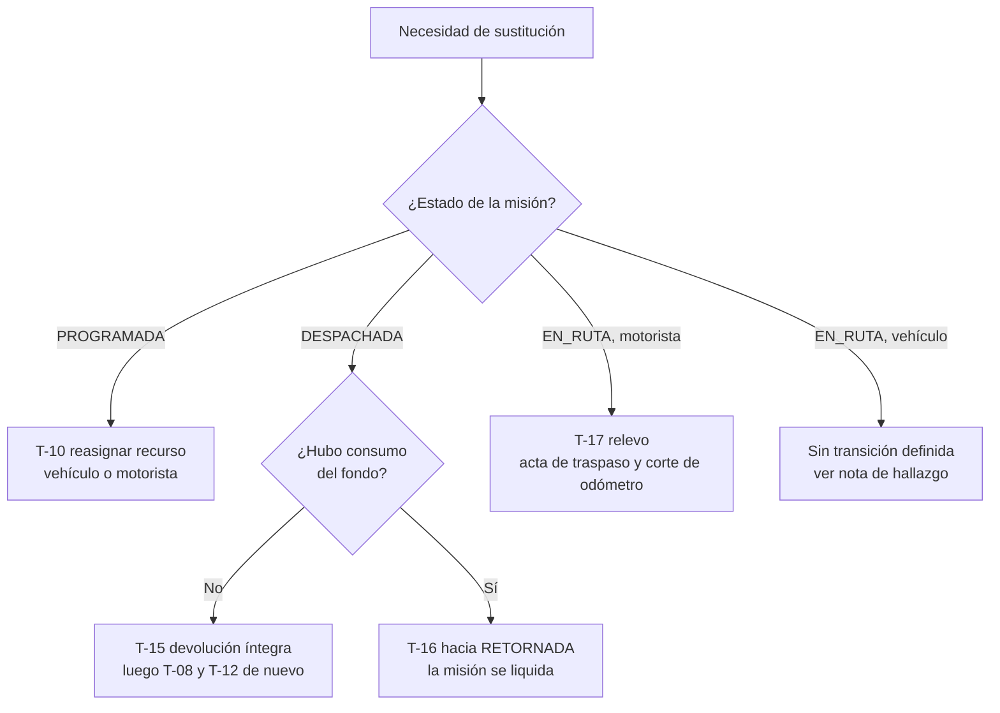

# CU-07 — Sustituir el vehículo o el motorista de una misión

| Campo | Valor |
|---|---|
| **Módulos** | M-07 Programación y Despacho · M-08 Ejecución y Bitácora |
| **Actor principal** | `ACT-04` Jefe de Transporte · `ACT-10` Encargado de Delegación en su ámbito |
| **Actores secundarios** | `ACT-06` Motorista saliente y entrante · `ACT-05` Encargado de Despacho · `ACT-07` Encargado de Combustible · `ACT-11` Encargado de Mantenimiento · `ACT-08` Gerencia Administrativa (solo para desplazar por prioridad) |
| **Precondiciones** | Existe una Orden de Misión con vehículo y motorista asignados, en `PROGRAMADA`, `DESPACHADA` o `EN_RUTA`. El actor tiene competencia sobre la misión según su alcance de datos. |
| **Postcondiciones** | El recurso entrante está verificado y reservado; el saliente, liberado. **La asignación original se conserva en el diario**, con motivo tipificado. El folio de la Orden no cambia si la misión sigue siendo la misma. Todo valor derivado del vehículo se recalculó y se volvió a congelar, con asiento de diferencia. |
| **Disparador** | El vehículo entra a taller, el motorista queda no disponible, la licencia vence dentro del rango, se pierde la habilitación, o el recurso se desplaza por prioridad superior. |

**El camino depende del estado, y no hay atajos entre ellos.** Sustituir en `PROGRAMADA` es una autotransición; sustituir en `DESPACHADA` exige revertir primero lo entregado; sustituir en `EN_RUTA` solo está resuelto para el motorista.

---

## Flujo principal — sustitución con la misión en `PROGRAMADA` (`T-10`)

1. `ACT-04` abre la Orden de Misión y elige sustituir vehículo, motorista titular, o ambos.
2. El sistema exige **motivo tipificado**: vehículo a taller, motorista no disponible, licencia que vence dentro del rango, cambio de requerimiento, consolidación, desplazamiento por prioridad superior. Un motivo de texto libre aquí no produce ningún indicador ([`RN-82`](../../01-negocio/reglas/RN-82-indicadores-de-calidad-de-la-programacion.md)).
3. El sistema propone los candidatos compatibles y libres en la ventana efectiva —ventana solicitada más holguras— y muestra, para cada uno, por qué es elegible.
4. `ACT-04` selecciona el recurso entrante.
5. El sistema **revalida sobre el recurso entrante todas las precondiciones de `T-08`**, sin dar por buena ninguna verificación previa:
   - `BD-02` licencia habilitante por categoría, vigente **durante todo el rango**, con restricciones médicas compatibles ([`RN-09`](../../01-negocio/reglas/RN-09-matriz-licencia-vehiculo.md), [`RN-10`](../../01-negocio/reglas/RN-10-licencia-vigente-en-todo-el-rango.md), [`RN-11`](../../01-negocio/reglas/RN-11-restricciones-medicas-del-motorista.md))
   - `BD-03` documentación del vehículo vigente en todo el rango ([`RN-15`](../../01-negocio/reglas/RN-15-identidad-del-vehiculo-y-placa.md), [`RN-16`](../../01-negocio/reglas/RN-16-seguro-y-revision-mecanica.md))
   - `BD-07` vehículo `DISPONIBLE`, compatible con el objeto del traslado, con capacidad suficiente y **categoría de peaje resuelta y vigente** ([`RN-20`](../../01-negocio/reglas/RN-20-compatibilidad-vehiculo-objeto-del-traslado.md), [`RN-21`](../../01-negocio/reglas/RN-21-capacidad-de-pasajeros-y-carga.md), [`RN-33`](../../01-negocio/reglas/RN-33-categoria-de-peaje-derivada-de-ficha-tecnica.md))
   - `BD-10` motorista disponible según el espejo de Talento Humano ([`RN-12`](../../01-negocio/reglas/RN-12-disponibilidad-del-motorista.md))
   - `BD-11` sin solapamiento de reserva, incluidas las holguras ([`RN-13`](../../01-negocio/reglas/RN-13-sin-doble-asignacion.md))
6. El sistema registra el resultado de cada verificación **con los datos concretos contra los que se evaluó**. Esto es la defensa de quien autorizó ante un siniestro; guardar "verificado: sí" no defiende a nadie (§9.2).
7. El sistema libera la reserva del recurso saliente y crea la del entrante (`EF-01`). El vehículo saliente vuelve a `DISPONIBLE`, o al estado que corresponda si la causa fue una falla (`W-04`, `W-07`, `W-09`).
8. Si cambió el vehículo, el sistema **recalcula y vuelve a congelar todo valor derivado de él** —categoría y estimado de peajes por punto, rendimiento esperado, estimado de combustible— con el paquete de tarifas vigente a la fecha programada, y deja **asiento de la diferencia** ([`RN-61`](../../01-negocio/reglas/RN-61-sustitucion-de-vehiculo-recalcula-valores-congelados.md), [`RN-42`](../../01-negocio/reglas/RN-42-correccion-retroactiva-con-asiento-de-diferencia.md)).
9. Si la diferencia de estimado supera el umbral configurable respecto a lo autorizado, el sistema **exige nueva autorización antes de despachar**.
10. **El folio reservado no cambia**: es el mismo expediente (`EF-02`).
11. El diario muestra a quién se había asignado, por qué se cambió y a quién se asignó ([`DP-001, D-07`](../../07-gestion/decisiones-de-producto/DP-001-fronteras-con-sistemas-existentes.md), [`RN-14`](../../01-negocio/reglas/RN-14-sustitucion-de-motorista.md)).
12. El sistema notifica al motorista saliente, al entrante y a la dependencia solicitante. La misión permanece en `PROGRAMADA`.

---

## Flujos alternos

**A1 — El motorista queda no disponible por Talento Humano** (desde el paso 2)
1. La incapacidad, el permiso o las vacaciones llegan por el espejo ([`CE-13`](../casos-especiales/CE-13-motorista-no-disponible-por-talento-humano.md), [`RN-12`](../../01-negocio/reglas/RN-12-disponibilidad-del-motorista.md)).
2. El sistema marca todas las misiones del motorista que se solapan con la ausencia y las lista para `ACT-04` con su ventana y su dependencia solicitante.
3. Se cubre con otro motorista **conservando la asignación original en el historial** (`PC-10`).
4. Si el espejo lleva más del umbral sin confirmarse, la verificación se marca como realizada sobre datos posiblemente desactualizados y **la marca se imprime en el documento** ([`RN-49`](../../01-negocio/reglas/RN-49-reconciliacion-periodica-del-espejo.md), [`RN-50`](../../01-negocio/reglas/RN-50-degradacion-por-sincronizacion-detenida.md)).

**A2 — El vehículo entra a taller con misiones ya programadas** (desde el paso 2)
1. La indisponibilidad sobrevenida exige **causa, ventana estimada de indisponibilidad y desenlace explícito de cada reserva afectada** ([`RN-60`](../../01-negocio/reglas/RN-60-indisponibilidad-sobrevenida-y-reservas.md), [`CE-16`](../casos-especiales/CE-16-vehiculo-a-taller-con-misiones-programadas.md)).
2. Ninguna reserva queda en silencio: por cada una, `ACT-04` decide sustituir (`T-10`), desprogramar (`T-11`) o anular (`T-13`).
3. Un vehículo que no vuelve del taller antes del inicio de una ventana no puede aparecer como asignable para esa ventana ([`RN-19`](../../01-negocio/reglas/RN-19-vehiculo-no-operativo-no-se-asigna.md), [`RN-17`](../../01-negocio/reglas/RN-17-alertas-de-vencimiento-documental.md) con umbrales también en kilómetros).

**A3 — La licencia del motorista vence dentro del rango de la misión** (desde el paso 2)
1. `BD-02` exige vigencia **durante todo el rango, incluida la holgura posterior**. Una licencia que vence el miércoles no habilita una misión que retorna el viernes ([`CE-11`](../casos-especiales/CE-11-licencia-vence-durante-la-mision.md)).
2. El sistema lo detecta al programar y lo vuelve a detectar al despachar; también lo alerta con antelación configurable ([`RN-17`](../../01-negocio/reglas/RN-17-alertas-de-vencimiento-documental.md)).
3. Si el vencimiento ocurre con la misión ya `EN_RUTA`, no se detiene la ejecución, pero el expediente **cierra con hallazgo** ([`RN-55`](../../01-negocio/reglas/RN-55-habilitacion-vencida-durante-la-mision.md), criterio `H-07`).

**A4 — Sustituir con la misión ya `DESPACHADA` y el vehículo sin salir** (desde el paso 1)
1. **No se puede cambiar de vehículo ni de motorista en `DESPACHADA`.** Hay folio consumido, documentos emitidos y fondo entregado.
2. Si la devolución de lo entregado es **íntegra**: `T-15` con acta de devolución del fondo firmada por `ACT-06` y `ACT-07`, devolución de la custodia con odómetro dentro de tolerancia, y devolución o constancia de destrucción de los impresos. Los folios pasan a `ANULADO` y **no se reciclan** (`EF-06`).
3. Se vuelve a programar por `T-08` con el recurso nuevo, y se toma **folio nuevo**: el anterior está anulado.
4. Si hubo **cualquier consumo**, `T-15` no está disponible: la misión va a `RETORNADA` por `T-16` y se liquida, aunque su kilometraje sea cero ([`CE-20`](../casos-especiales/CE-20-mision-cancelada-con-combustible-ya-entregado.md)). La necesidad de movilización se atiende con una **misión nueva**, vinculada a la anterior.

**A5 — Relevo de motorista con la misión `EN_RUTA`** (desde el paso 1)
1. Se ejecuta `T-17` relevo. El motorista entrante cumple `BD-02` **contra el paquete normativo congelado que lleva el dispositivo**, no contra la tabla actual del servidor.
2. Existe **acta de traspaso** con hora, lugar, odómetro, identidad de quien entrega y de quien recibe, y motivo tipificado. **El odómetro del acta es el corte de imputación** de kilometraje y consumo entre ambos tramos ([`RN-71`](../../01-negocio/reglas/RN-71-traspaso-en-ruta-con-acta-y-corte-de-odometro.md), [`RN-72`](../../01-negocio/reglas/RN-72-imputacion-por-tramo-de-vehiculo-y-motorista.md)).
3. El **fondo de combustible se traspasa solo por acta propia**, con conteo de folios uno por uno y saldo enumerado. Sin acta, el fondo permanece a nombre del receptor original y la liquidación se hace por asignación, no por persona presente. Un consumo imputado a un folio ya traspasado es **alerta automática**.
4. La responsabilidad del tramo anterior **no se transfiere**.
5. Sin conectividad, se ejecuta con el **código de autorización fuera de línea** (§6.6): un solo uso, atado a esa misión y esa transición, verificable en el dispositivo sin red. Ver [`CE-05`](../casos-especiales/CE-05-cambio-de-motorista-con-la-mision-en-curso.md).

**A6 — El motorista saliente no puede firmar el acta** (en A5, paso 2)
1. Ocurre de verdad: el custodio está inconsciente en una ambulancia ([`CE-10`](../casos-especiales/CE-10-motorista-incapacitado-en-ruta.md)).
2. **La custodia del vehículo se cierra igual**: consta el impedimento y firman **dos personas presentes** más el receptor tipificado ([`RN-71`](../../01-negocio/reglas/RN-71-traspaso-en-ruta-con-acta-y-corte-de-odometro.md)).
3. El registro de campo **no captura atribución de responsabilidad**: eso se determina en el expediente ([`RN-74`](../../01-negocio/reglas/RN-74-sin-atribucion-de-responsabilidad-en-campo.md)).

**A7 — Desplazamiento por prioridad superior** (desde el paso 2)
1. Solo `ACT-08` Gerencia Administrativa puede desplazar una programación existente.
2. Hacerlo **libera la primera misión a `APROBADA` mediante `T-11`**, con motivo obligatorio "desplazada por prioridad superior" y notificación a la dependencia afectada. Nunca se le quita el vehículo a una misión sin devolverla explícitamente a la cola: una misión que pierde su vehículo en silencio se descubre el día de la salida, en el predio (`EF-01`, camino 4).
3. La adjudicación aplica el criterio de prelación parametrizado y deja constancia de las desplazadas ([`RN-56`](../../01-negocio/reglas/RN-56-prelacion-entre-solicitudes-que-compiten.md), [`CE-12`](../casos-especiales/CE-12-dos-solicitudes-compiten-por-el-mismo-vehiculo.md)).
4. `[C]` El criterio de prelación no está definido — insumo #31. Sin criterio explícito, lo resuelve quien tenga más jerarquía, que es exactamente lo que el sistema debe evitar.

---

## Flujos de excepción

**E1 — El motorista entrante no tiene licencia habilitante o vigente en todo el rango** (en el paso 5)
1. `BD-02` bloquea. **Sin excepción configurable**, ni por urgencia ni por orden superior ([`DP-001, D-12`](../../07-gestion/decisiones-de-producto/DP-001-fronteras-con-sistemas-existentes.md)).
2. El sistema muestra el dato que falló —categoría, vencimiento, peso bruto del vehículo, fin de rango evaluado— y no ofrece "continuar de todos modos" ([`RNF-16`](../no-funcionales/RNF-16-idioma-accesibilidad-y-mensajes.md): ningún bloqueo deja al usuario sin saber qué hacer).
3. Se registra el intento con el resultado de la verificación.

**E2 — El vehículo entrante no tiene categoría de peaje resuelta** (en el paso 5)
1. `BD-07` bloquea: sin categoría, el estimado de peajes no es verificable y quien autoriza no puede comprobar el cálculo ([`RN-33`](../../01-negocio/reglas/RN-33-categoria-de-peaje-derivada-de-ficha-tecnica.md), [`NRM-10`](../../01-negocio/normativa/NRM-10-peajes.md)).
2. La categoría se deriva de la ficha técnica, **no del número de ejes por sí solo**. Resolverla es tarea del expediente del vehículo (M-03), no de este caso.

**E3 — Hay que cambiar el vehículo con la misión `EN_RUTA`** (en el paso 1)
1. **No existe transición que lo permita.** `T-17`, única autotransición de `EN_RUTA`, cubre prórroga, destino adicional y relevo de motorista — no cambio de vehículo.
2. El camino disponible hoy: registrar la **interrupción en ruta** con su desenlace, en [`CU-09`](CU-09-interrupcion-en-ruta-y-desenlace.md), que abre un tramo nuevo bajo la misma Orden con revalidación completa contra el paquete congelado, o aborta la misión con retorno anticipado.
3. Ver la **nota de hallazgo** al pie.

**E4 — No hay ningún recurso sustituto compatible** (en el paso 3)
1. El sistema no sobre-asigna, ni siquiera con advertencia: dos misiones con el mismo vehículo el mismo día es el error que termina con un servidor público esperando en la puerta.
2. Los caminos son: consolidar con otra misión de ruta compatible, reprogramar con acuerdo registrado de la dependencia afectada, desprogramar (`T-11`) o anular (`T-09`, `T-13`) con **motivo tipificado**.
3. Cada anulación tipificada por "sin flota disponible" o "sin motorista habilitado" es **la medición del déficit de flota**, y es uno de los pocos indicadores que la institución puede llevar a una gestión presupuestaria con evidencia.

**E5 — El recurso entrante ya está reservado en esa franja** (en el paso 5)
1. `BD-11` bloquea, incluidas las holguras previa y posterior.
2. El sistema **muestra el conflicto con su titular**: qué misión tiene tomado el recurso, de qué dependencia y en qué franja, y ofrece los cuatro caminos de `EF-01` en orden — consolidar, asignar otro recurso, reprogramar, escalar la prioridad.

**E6 — Quien sustituye no tiene competencia sobre la misión** (en el paso 1)
1. `ACT-10` solo actúa en el ámbito de su delegación; `ACT-04` en el suyo según el puesto ([`actores-y-roles.md §alcance de datos`](../../01-negocio/actores-y-roles.md)).
2. El intento se registra y se rechaza. La sustitución fuera de ámbito se pide a quien la tiene, o se escala a sede.

**E7 — Sustitución con espejo de Talento Humano desactualizado más allá del umbral** (en el paso 5)
1. El sistema **degrada explícitamente antes de operar**: advierte, registra la advertencia en el diario y la imprime en el documento ([`RN-50`](../../01-negocio/reglas/RN-50-degradacion-por-sincronizacion-detenida.md), [`RNF-07`](../no-funcionales/RNF-07-sincronizacion-del-espejo-local.md)).
2. Si al reconciliar el espejo alguno de los bloqueos duros falla, **no se revierte el hecho** —el vehículo ya salió—: se abre hallazgo automático `H-07` y se notifica a `ACT-04` y `ACT-12`.

---

## Reglas aplicables

| Regla | Qué gobierna en este caso |
|---|---|
| [`RN-14`](../../01-negocio/reglas/RN-14-sustitucion-de-motorista.md) | **Regla rectora del caso**: la sustitución revalida todas las habilitaciones y conserva la asignación original |
| [`RN-09`](../../01-negocio/reglas/RN-09-matriz-licencia-vehiculo.md) · [`RN-10`](../../01-negocio/reglas/RN-10-licencia-vigente-en-todo-el-rango.md) · [`RN-11`](../../01-negocio/reglas/RN-11-restricciones-medicas-del-motorista.md) | `BD-02` sobre el motorista entrante |
| [`RN-12`](../../01-negocio/reglas/RN-12-disponibilidad-del-motorista.md) · [`RN-13`](../../01-negocio/reglas/RN-13-sin-doble-asignacion.md) | `BD-10` y `BD-11` |
| [`RN-19`](../../01-negocio/reglas/RN-19-vehiculo-no-operativo-no-se-asigna.md) · [`RN-60`](../../01-negocio/reglas/RN-60-indisponibilidad-sobrevenida-y-reservas.md) | Estado operativo y desenlace de reservas afectadas |
| [`RN-20`](../../01-negocio/reglas/RN-20-compatibilidad-vehiculo-objeto-del-traslado.md) · [`RN-21`](../../01-negocio/reglas/RN-21-capacidad-de-pasajeros-y-carga.md) · [`RN-67`](../../01-negocio/reglas/RN-67-matriz-de-compatibilidad-objeto-objeto.md) · [`RN-68`](../../01-negocio/reglas/RN-68-compatibilidad-y-capacidad-por-tramo.md) | Compatibilidad del vehículo entrante, evaluada **por tramo** |
| [`RN-61`](../../01-negocio/reglas/RN-61-sustitucion-de-vehiculo-recalcula-valores-congelados.md) · [`RN-42`](../../01-negocio/reglas/RN-42-correccion-retroactiva-con-asiento-de-diferencia.md) | Recálculo y recongelamiento con asiento de diferencia |
| [`RN-71`](../../01-negocio/reglas/RN-71-traspaso-en-ruta-con-acta-y-corte-de-odometro.md) · [`RN-72`](../../01-negocio/reglas/RN-72-imputacion-por-tramo-de-vehiculo-y-motorista.md) | Relevo en ruta: acta, corte de odómetro, imputación por tramo |
| [`RN-55`](../../01-negocio/reglas/RN-55-habilitacion-vencida-durante-la-mision.md) · [`RN-57`](../../01-negocio/reglas/RN-57-habilitacion-de-quien-efectivamente-conduce.md) | Habilitación vencida en ruta y habilitación de quien conduce |
| [`RN-56`](../../01-negocio/reglas/RN-56-prelacion-entre-solicitudes-que-compiten.md) | Desplazamiento por prioridad con constancia |
| [`RN-04`](../../01-negocio/reglas/RN-04-anulacion-como-asiento-reverso.md) · [`RN-06`](../../01-negocio/reglas/RN-06-transiciones-de-estado-de-la-orden.md) | Reversión de lo entregado y registro de cada transición |
| [`RN-82`](../../01-negocio/reglas/RN-82-indicadores-de-calidad-de-la-programacion.md) | Los motivos tipificados alimentan el indicador, no un texto libre |

---

## Nota de hallazgo — no se resuelve aquí

**No existe transición para cambiar el vehículo con la misión `EN_RUTA`.** [`RN-14`](../../01-negocio/reglas/RN-14-sustitucion-de-motorista.md) dice que la sustitución **de motorista o de vehículo** revalida las habilitaciones y conserva la asignación original, y le atribuye los módulos M-07 **y M-08**. Pero `T-17` cubre solo prórroga, destino adicional y relevo de motorista.

El hallazgo ya está reportado desde [`CE-02`](../casos-especiales/CE-02-averia-mecanica-en-ruta.md) y [`RN-70`](../../01-negocio/reglas/RN-70-interrupcion-en-ruta-con-desenlace-obligatorio.md) hacia [`docs/03-arquitectura/estados/orden-de-mision.md`](../../03-arquitectura/estados/orden-de-mision.md), que **es la autoridad en transiciones**. Este caso de uso no lo resuelve: lo registra por tercera vez, desde el ángulo de la programación, y deja constancia de que el vacío se alcanza por dos caminos distintos —la avería y la simple decisión administrativa de cambiar de unidad a mitad de ruta—, no solo por incidente.

Tratamiento pedido, idéntico al del relevo: revalidación de bloqueos duros contra el paquete congelado, acta de traspaso de custodia con odómetro como corte de imputación, conservación de la asignación original y recálculo de valores derivados del vehículo.

---

## Trazabilidad

- **Transiciones:** `T-10` reasignar recurso · `T-11` liberar recursos · `T-08` reprogramar · `T-15` y `T-16` para revertir desde `DESPACHADA` · `T-17` relevo en ruta · `T-09` y `T-13` anular · `W-04`, `W-07`, `W-09` estado operativo del vehículo
- **Bloqueos duros:** `BD-02`, `BD-03`, `BD-07`, `BD-10`, `BD-11`
- **Efectos:** `EF-01` reserva y conflicto con su titular · `EF-02` el folio no cambia en `T-10`, se anula en `T-11` · `EF-06` devolución con asiento reverso
- **Puntos de control de `PR-01`:** `PC-04`, `PC-05`, `PC-06`, `PC-07`, `PC-10`
- **Proceso:** [`PR-01`](../../01-negocio/procesos/PR-01-movilizacion-institucional.md) etapa E5, con retorno desde E8
- **Casos especiales:** [`CE-05`](../casos-especiales/CE-05-cambio-de-motorista-con-la-mision-en-curso.md) · [`CE-10`](../casos-especiales/CE-10-motorista-incapacitado-en-ruta.md) · [`CE-11`](../casos-especiales/CE-11-licencia-vence-durante-la-mision.md) · [`CE-12`](../casos-especiales/CE-12-dos-solicitudes-compiten-por-el-mismo-vehiculo.md) · [`CE-13`](../casos-especiales/CE-13-motorista-no-disponible-por-talento-humano.md) · [`CE-16`](../casos-especiales/CE-16-vehiculo-a-taller-con-misiones-programadas.md) · [`CE-02`](../casos-especiales/CE-02-averia-mecanica-en-ruta.md) · [`CE-20`](../casos-especiales/CE-20-mision-cancelada-con-combustible-ya-entregado.md)
- **Casos de uso relacionados:** [`CU-06`](CU-06-despachar-y-registrar-salida.md) revalida al despachar lo que aquí se asignó · [`CU-09`](CU-09-interrupcion-en-ruta-y-desenlace.md) es el camino cuando la misión ya salió
- **Normativa:** [`NRM-06`](../../01-negocio/normativa/NRM-06-transito-y-licencias.md) licencias y documentación · [`NRM-02`](../../01-negocio/normativa/NRM-02-bienes-del-estado.md) custodia · [`NRM-10`](../../01-negocio/normativa/NRM-10-peajes.md) categoría y recálculo · [`NRM-01`](../../01-negocio/normativa/NRM-01-control-interno-tsc.md) trazabilidad de la asignación original
- **Requisitos no funcionales:** [`RNF-07`](../no-funcionales/RNF-07-sincronizacion-del-espejo-local.md) · [`RNF-05`](../no-funcionales/RNF-05-temporalidad-normativa.md) · [`RNF-16`](../no-funcionales/RNF-16-idioma-accesibilidad-y-mensajes.md)
- **Historias:** pendientes del Bloque 3
- **Insumos pendientes:** #31 (criterio de prelación) · #17 (umbral de antigüedad del espejo) · #23 (catálogo de restricciones médicas de la DNVT) · #1 (holguras y umbrales)
