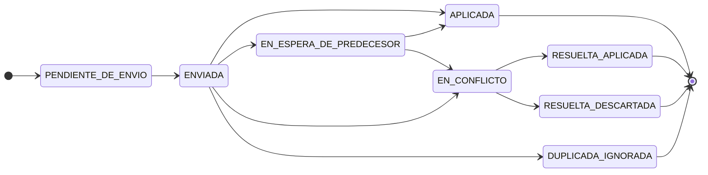

# CU-11 — Sincronizar el cliente de campo y resolver conflictos

| Campo | Valor |
|---|---|
| **Módulo** | M-16 Sincronización y Operación Desconectada |
| **Actor principal** | `ACT-04` Jefe de Transporte resuelve la cola de conflictos · `ACT-10` Encargado de Delegación en su ámbito |
| **Actores secundarios** | `ACT-06` Motorista (su dispositivo envía y recibe el resultado) · `ACT-12` Auditor Interno (lectura del diario y de las versiones descartadas) · `ACT-01` Administrador del Sistema (diagnóstico registrado, **sin poder alterar la bitácora**) |
| **Precondiciones** | El dispositivo tiene registros en estado `PENDIENTE_DE_ENVIO` y aparece conectividad, aunque sea intermitente. |
| **Postcondiciones** | Cada transición y cada evento quedó en uno de los estados de sincronización definidos: `APLICADA`, `EN_ESPERA_DE_PREDECESOR`, `EN_CONFLICTO`, `DUPLICADA_IGNORADA`, `RESUELTA_APLICADA` o `RESUELTA_DESCARTADA`. **Ningún registro se perdió y ninguno se sobrescribió.** Las divergencias sin resolver bloquean `T-19` por `BD-08`. |
| **Disparador** | Aparece señal, o el Encargado de Delegación llega a un punto con cobertura, o el dispositivo reintenta una sincronización cortada. |

---

## Las dos cosas que este caso no puede fallar

**Cero pérdida y cero sobrescritura silenciosa.** Ninguna regla de conflicto descarta datos: lo que no se aplica, se conserva y se muestra ([`RN-45`](../../01-negocio/reglas/RN-45-cero-sobrescritura-silenciosa.md), [`RNF-03`](../no-funcionales/RNF-03-operacion-sin-conectividad.md)). En este dominio los datos en conflicto son **odómetros, galones y montos**: una sobrescritura automática destruye el término de una conciliación de auditoría, y nadie se entera hasta que el TSC pregunta.

**El usuario que resuelve no entiende de sincronización, y no tiene por qué.** La pantalla de resolución muestra **ambas versiones lado a lado, campo por campo, en lenguaje del negocio** — "el motorista registró la salida el lunes a las 5:40, sin señal" y no "conflicto de versión en la entidad transición, secuencia 1, hash divergente". Es la pantalla más difícil del sistema y la que nadie diseña hasta que duele.

**El cliente no envía "la misión está en RETORNADA". Envía el diario**: la secuencia completa de transiciones y eventos que produjo. Dos dispositivos no negocian un estado; intercambian transiciones (principio `P-1`).

---

## Flujo principal

1. Aparece señal. **La sincronización arranca sola, en segundo plano, sin que el motorista tenga que hacer nada ni entender qué está pasando** ([`RNF-12`](../no-funcionales/RNF-12-uso-en-campo.md)). No interrumpe la captura en curso.
2. El cliente envía su diario **ordenado por número de secuencia del dispositivo**, con, para cada registro: identificador generado en el cliente, identificador de la misión, **estado origen esperado** contra el que evaluó las precondiciones, estado destino, secuencia monotónica, `ocurrido_en`, `capturado_en`, actor, rol ejercido, dispositivo, motivo cuando aplica, y **hash encadenado con el registro anterior del mismo dispositivo** (§6.2).
3. El servidor **descarta duplicados por identificador**: una transición ya aplicada se ignora y la recepción duplicada se registra. Los reenvíos son normales cuando la red se corta a mitad de una sincronización (Regla 1, idempotencia).
4. El servidor aplica los registros **en orden de secuencia del dispositivo, no en orden de llegada**, verificando en cada uno el estado origen esperado.
5. El servidor **mide y registra el desfase del reloj del dispositivo**, comparando el `capturado_en` de la última transición contra su propio `recibido_en`. El desfase queda en el expediente: permite auditar después si un dispositivo tenía el reloj corrido, y **corregir el análisis sin corregir el dato**.
6. El servidor devuelve al cliente el resultado **registro por registro**, no un "sincronizado: sí".
7. El cliente muestra ese resultado en lenguaje del negocio: *enviado y aceptado* · *esperando un registro anterior que no ha llegado* · *ya estaba registrado* · **necesita que alguien decida**. Nunca oculta un registro en conflicto hasta que alguien lo resuelva.
8. Al aplicarse `T-18`, se dispara `EF-05` conciliación completa y se notifica a `ACT-04` la misión retornada con sus desviaciones detectadas.
9. Los conflictos entran a la **cola de resolución humana**, con: registro afectado, ambas versiones, origen y fecha de cada una, quién las capturó, e **impacto declarado** — si afecta un odómetro, un monto o una autorización, se prioriza y se notifica al responsable.
10. La cola tiene **responsable por puesto, antigüedad visible y escalamiento por plazo configurable**. Una cola sin dueño se convierte en un basurero. `[C]` responsable y plazos — ver insumos al pie.
11. `ACT-04` abre un conflicto y ve las dos versiones **lado a lado, campo por campo**, con sus adjuntos y fotografías, y con la explicación de por qué difieren en términos de la operación.
12. `ACT-04` resuelve: elige una versión, con **motivo obligatorio**. La resolución es un acto identificado y registrado: qué versión se toma, cuál se descarta, por qué, y con qué autoridad.
13. **La versión descartada no se borra.** Queda como `RESUELTA_DESCARTADA`, con su contenido íntegro y consultable, vinculada como asiento a la decisión que la descartó ([`RN-04`](../../01-negocio/reglas/RN-04-anulacion-como-asiento-reverso.md)).
14. Resueltas todas las divergencias de la misión, `BD-08` deja de bloquear y la misión puede liquidarse.

---

## Flujos alternos

**A1 — Falta un registro intermedio de la secuencia** (desde el paso 4)
1. Llega la secuencia 41 y falta la 40. El servidor **no aplica ni rechaza**: retiene la 41 en `EN_ESPERA_DE_PREDECESOR`.
2. Si el hueco se cierra, aplica en orden. Si no se cierra en un plazo configurable, **escala a la cola de resolución humana** para `ACT-04`.
3. **Nunca aplica una transición saltando una faltante**: eso produciría una misión `RETORNADA` sin odómetro de salida (Regla 2).

**A2 — Sincronización parcial: llegó el consumo pero no su fotografía** (desde el paso 6)
1. **No es conflicto: es adjunto pendiente.** El sistema distingue *pendiente* de *ausente* ([`RN-08`](../../01-negocio/reglas/RN-08-cadena-de-trazabilidad-para-cierre.md)).
2. El evento se aplica; el adjunto sube después vinculado por el identificador del evento.
3. Un adjunto que nunca llega sí cuenta para el criterio de hallazgo `H-08` y para [`RN-85`](../../01-negocio/reglas/RN-85-ausencia-de-comprobante-causa-y-descargo-alternativo.md).

**A3 — Cientos de conflictos después de semanas sin sincronizar** (desde el paso 9)
1. Resolver de a uno miles de conflictos es inviable; hacerlo sin declarar el criterio es sobrescritura con más pasos.
2. Se permite **resolución por lotes con criterio explícito declarado por el operador** —"aceptar la versión de campo para todos los registros de esta misión"—, y **ese criterio queda registrado** con autor y alcance.
3. Los conflictos de alto impacto —odómetro, monto, autorización— **quedan fuera del lote** y se resuelven uno por uno.

**A4 — Dos dispositivos sobre la misma misión** (desde el paso 4)
1. Ocurre de verdad: el teléfono del motorista se dañó y el Encargado de Delegación registró el retorno desde el suyo.
2. Al despachar se designó **un dispositivo portador**: es el único cuya cadena se aplica automáticamente.
3. Una transición de otro dispositivo es **legítima pero no automática**: se registra y, si no entra en conflicto con la cadena del portador, se aplica **marcada como "de dispositivo no portador"**.
4. Si entra en conflicto —dos cadenas que ambas declaran `DESPACHADA → EN_RUTA` con datos distintos—, se aplica la **primera cadena recibida**, la segunda se conserva **íntegra** como cadena divergente, y se abre conflicto con ambas versiones lado a lado, campo por campo.
5. La misión queda marcada **"con divergencia pendiente"** y `BD-08` impide liquidarla.
6. `ACT-04` puede **reasignar el dispositivo portador**, con motivo, y el cambio queda en el diario (Regla 4).

**A5 — El registro viene de papel digitado días después** (desde el paso 2)
1. **No es conflicto de sincronización**: es modo de captura `digitación diferida de papel`, con quién digitó, cuándo, y adjunto del original fotografiado ([`RN-47`](../../01-negocio/reglas/RN-47-digitacion-diferida-desde-papel.md), [`CU-10`](CU-10-registrar-retorno-y-cerrar-bitacora.md) A3).
2. Solo entra a la cola si **contradice** algo ya registrado — típicamente lo constatado en el portón contra lo que dice el papel ([`CE-09`](../casos-especiales/CE-09-bitacora-en-papel-digitada-dias-despues.md) punto 5).

**A6 — Se inserta un registro con fecha del hecho anterior a otros ya aplicados** (desde el paso 4)
1. La misión del 10 al 12 se digitó antes que la del 3 al 7. La continuidad del odómetro se evalúa **sobre la serie ordenada por fecha del hecho**, nunca por orden de captura ([`RN-89`](../../01-negocio/reglas/RN-89-kilometraje-acumulado-invariante-del-expediente.md), [`RN-40`](../../01-negocio/reglas/RN-40-calculo-a-la-fecha-del-hecho.md)).
2. **Insertar un registro anterior reabre la validación de todos los posteriores**, y las incoherencias que aparezcan van a la cola: **no se corrigen solas**.
3. Sin esto, la validación se hace contra una serie incompleta y da un resultado falso — y peor, un resultado falso que después nadie vuelve a revisar.

**A7 — El espejo de ARGOS o de Talento Humano diverge** (fuera de la cola de `RN-45`)
1. **No aplica la cola de conflictos.** Los datos espejo son de solo lectura y su dueño es el sistema origen: ahí el origen prevalece y la divergencia se corrige por **reconciliación** ([`RN-48`](../../01-negocio/reglas/RN-48-datos-espejo-de-solo-lectura.md), [`RN-49`](../../01-negocio/reglas/RN-49-reconciliacion-periodica-del-espejo.md)).
2. Lo que sí es común a ambos mecanismos: **nunca diverger en silencio**. Cada entidad muestra su última sincronización y, superado el umbral, el sistema **degrada explícitamente antes de operar** ([`RN-50`](../../01-negocio/reglas/RN-50-degradacion-por-sincronizacion-detenida.md), [`RNF-07`](../no-funcionales/RNF-07-sincronizacion-del-espejo-local.md)).

---

## Flujos de excepción — la pantalla de resolución

**E1 — Estado origen inesperado: la oficina anuló, el motorista ya había salido** (en el paso 4)
1. Caso real: la oficina anuló la misión el lunes por la mañana; el motorista, sin señal, había salido el lunes al amanecer.
2. La transición **no se descarta ni sobrescribe**: se registra íntegra y se abre conflicto.
3. La pantalla lo dice así, en lenguaje del negocio:

   > **La oficina anuló esta misión el lunes 12 a las 08:15.**
   > Motivo registrado: "suspendida por la Gerencia". Anuló: María López, Jefa de Transporte.
   >
   > **El motorista registró la salida el lunes 12 a las 05:40, sin señal.**
   > Odómetro de salida: 92,480. Capturado en el dispositivo asignado a la misión.
   >
   > *El vehículo salió antes de que se registrara la anulación. ¿Qué versión describe lo que pasó?*

4. **El hecho ocurrió**: la anulación es la que está equivocada, y quien lo resuelve es una persona con las dos versiones a la vista (Regla 3). El camino correcto será `T-18` con subtipo retorno anticipado y liquidación, no revivir una anulación imposible: `EN_RUTA → ANULADA` no existe.
5. La resolución queda registrada con autor, motivo y autoridad; la versión descartada se conserva.

**E2 — Conflicto en campos distintos del mismo registro** (en el paso 11)
1. Uno cambió el odómetro y otro la hora de arribo. **Técnicamente combinables.**
2. **No se combinan automáticamente**: se presentan campo por campo y decide una persona. Una fusión automática puede producir un registro que nadie capturó — y ese registro acabaría en un reporte del TSC.

**E3 — Un bloqueo duro falla al revalidarse en el servidor** (en el paso 4)
1. Ocurre cuando se operó con espejo desactualizado o en modo delegación desconectada: la licencia estaba suspendida, el motorista estaba de vacaciones, la documentación había vencido.
2. **No se revierte el hecho** — el vehículo ya salió, la misión ya se ejecutó. Se **abre hallazgo automático `H-07`** y se notifica a `ACT-04` y `ACT-12` (§6.1).
3. El hallazgo **no imputa responsabilidad a nadie**: es marca de seguimiento con expediente propio.

**E4 — Un registro de campo llega después del cierre en oficina** (en el paso 4)
1. **Es el caso más frecuente y el que más tienta a implementar un descarte automático.**
2. No se descarta ni se aplica sobre lo cerrado: entra a la cola **con su fecha del hecho** ([`RN-05`](../../01-negocio/reglas/RN-05-registro-cerrado-no-se-edita.md)).
3. Si el registro afecta algo ya usado en una liquidación cerrada, se resuelve por **asiento de diferencia** ([`RN-42`](../../01-negocio/reglas/RN-42-correccion-retroactiva-con-asiento-de-diferencia.md)) o se cierra con hallazgo.
4. Si la misión está `CERRADA`, **no se reabre ni por auditoría**: se abre expediente de hallazgo posterior con su ciclo propio, y la misión cerrada muestra desde entonces que tiene hallazgos vinculados ([`RN-93`](../../01-negocio/reglas/RN-93-expediente-de-hallazgo-posterior.md), [`CE-28`](../casos-especiales/CE-28-hallazgo-posterior-sobre-mision-cerrada.md)). Todo reporte declara su **fecha de corte de conocimiento** y es reproducible a esa fecha ([`RN-94`](../../01-negocio/reglas/RN-94-fecha-de-corte-de-conocimiento-en-todo-reporte.md), [`RNF-06`](../no-funcionales/RNF-06-reproducibilidad-historica-de-reportes.md)).

**E5 — Dos motoristas registran el mismo paso por caseta** (en el paso 9)
1. Ocurre en misión con relevo. **Ambos registros son válidos y describen el mismo hecho.**
2. Se detecta como **posible duplicado por punto de peaje y ventana temporal**, no como duplicado exacto —los identificadores son distintos—, y lo resuelve una persona.
3. Se emparenta con [`RN-84`](../../01-negocio/reglas/RN-84-unicidad-del-comprobante-en-la-institucion.md): el mismo comprobante no puede sostener dos consumos en la institución, y eso se bloquea **al registrarlo**, no ocho meses después conciliando a mano.

**E6 — La marca de tiempo es incoherente** (en el paso 4)
1. `ocurrido_en > capturado_en` fuera de tolerancia: el dato es incoherente y va a la cola.
2. `ocurrido_en` fuera de la ventana de la misión más tolerancia: **no bloquea**, exige justificación y marca la misión.
3. El orden de los hechos lo define la **secuencia monotónica**, no el reloj ([`RN-46`](../../01-negocio/reglas/RN-46-fecha-del-hecho-y-fecha-de-captura.md)).

**E7 — La red se corta a mitad de la sincronización** (en el paso 2)
1. El cliente reintenta de forma segura: **reenviar el mismo registro no crea duplicados** ([`RN-44`](../../01-negocio/reglas/RN-44-identificadores-y-folios-en-el-cliente.md)).
2. Se verifica explícitamente en la batería de `RNF-03`: prueba de interrupción — cortar la red a mitad de una sincronización, reintentar, y comprobar que no se duplique ni se pierda nada.

**E8 — La cola se acumula y nadie la atiende** (en el paso 10)
1. **Es el efecto deseado**: la acumulación bloquea liquidaciones, que es donde el control importa.
2. Debe tener responsable por puesto, antigüedad visible y escalamiento por plazo.
3. Existe **reporte de conflictos por período, dispositivo y delegación**: un dispositivo que genera conflictos con frecuencia es un problema a corregir, no un hecho a tolerar.

**E9 — Alguien intenta "arreglar" el conflicto editando el dato** (en el paso 12)
1. No existe la acción. La bitácora es **append-only**: no se actualiza ni se borra ningún registro, **ni el Administrador del Sistema puede hacerlo**, y su ausencia de esa capacidad debe ser demostrable ([`RNF-04`](../no-funcionales/RNF-04-bitacora-append-only-con-hash-encadenado.md), par `I-13`).
2. La resolución es elegir entre versiones existentes, o registrar un asiento nuevo. Nunca reescribir una.

---

## Estados de sincronización que el cliente y el servidor deben poder mostrar

`RESUELTA_DESCARTADA` significa que la transición **no se aplicó al expediente**. No significa que se haya borrado: su contenido queda íntegro y consultable, con la decisión humana que la descartó.

---

## Reglas aplicables

| Regla | Qué gobierna en este caso |
|---|---|
| [`RN-45`](../../01-negocio/reglas/RN-45-cero-sobrescritura-silenciosa.md) | **Regla rectora**: ningún conflicto se resuelve por sobrescritura; todo va a cola de resolución humana |
| [`RN-43`](../../01-negocio/reglas/RN-43-captura-de-campo-sin-conectividad.md) · [`RN-44`](../../01-negocio/reglas/RN-44-identificadores-y-folios-en-el-cliente.md) | Nada se pierde; identificador de cliente como llave de idempotencia |
| [`RN-46`](../../01-negocio/reglas/RN-46-fecha-del-hecho-y-fecha-de-captura.md) · [`RN-40`](../../01-negocio/reglas/RN-40-calculo-a-la-fecha-del-hecho.md) | Tres marcas de tiempo; el cálculo usa la del hecho; el orden lo da la secuencia |
| [`RN-47`](../../01-negocio/reglas/RN-47-digitacion-diferida-desde-papel.md) | La digitación diferida no es conflicto, es modo de captura |
| [`RN-05`](../../01-negocio/reglas/RN-05-registro-cerrado-no-se-edita.md) · [`RN-04`](../../01-negocio/reglas/RN-04-anulacion-como-asiento-reverso.md) · [`RN-42`](../../01-negocio/reglas/RN-42-correccion-retroactiva-con-asiento-de-diferencia.md) | Registro que llega tarde sobre lo cerrado |
| [`RN-08`](../../01-negocio/reglas/RN-08-cadena-de-trazabilidad-para-cierre.md) | Cadena incompleta y distinción pendiente/ausente |
| [`RN-89`](../../01-negocio/reglas/RN-89-kilometraje-acumulado-invariante-del-expediente.md) | Serie de odómetro por fecha del hecho; inserción retroactiva reabre validaciones |
| [`RN-79`](../../01-negocio/reglas/RN-79-el-retorno-constatado-libera-al-vehiculo.md) | La liberación es local hasta sincronizar; conciliación de odómetros al digitar |
| [`RN-48`](../../01-negocio/reglas/RN-48-datos-espejo-de-solo-lectura.md) · [`RN-49`](../../01-negocio/reglas/RN-49-reconciliacion-periodica-del-espejo.md) · [`RN-50`](../../01-negocio/reglas/RN-50-degradacion-por-sincronizacion-detenida.md) | El espejo no entra a esta cola: se reconcilia y se degrada explícitamente |
| [`RN-84`](../../01-negocio/reglas/RN-84-unicidad-del-comprobante-en-la-institucion.md) | Duplicado de comprobante detectado al registrar |
| [`RN-93`](../../01-negocio/reglas/RN-93-expediente-de-hallazgo-posterior.md) · [`RN-94`](../../01-negocio/reglas/RN-94-fecha-de-corte-de-conocimiento-en-todo-reporte.md) | Registro tardío sobre misión cerrada |
| [`RN-06`](../../01-negocio/reglas/RN-06-transiciones-de-estado-de-la-orden.md) · [`RN-03`](../../01-negocio/reglas/RN-03-registro-inmutable-de-autorizacion.md) | Cada transición aplicada y cada resolución quedan registradas con actor, rol y momento |

**Requisitos no funcionales:** [`RNF-03`](../no-funcionales/RNF-03-operacion-sin-conectividad.md) 0 registros perdidos, 0 sobrescrituras, < 3 min para una misión con 20 fotos en 3G · [`RNF-07`](../no-funcionales/RNF-07-sincronizacion-del-espejo-local.md) el espejo nunca diverge en silencio · [`RNF-04`](../no-funcionales/RNF-04-bitacora-append-only-con-hash-encadenado.md) · [`RNF-16`](../no-funcionales/RNF-16-idioma-accesibilidad-y-mensajes.md) lenguaje del negocio en la pantalla de resolución · [`RNF-06`](../no-funcionales/RNF-06-reproducibilidad-historica-de-reportes.md) · [`RNF-20`](../no-funcionales/RNF-20-observabilidad-y-diagnostico.md) una sola pantalla dice qué está mal y qué hacer.

---

## Requisitos de la pantalla de resolución — verificables

Se listan porque son la diferencia entre una cola que se atiende y una que se abandona.

| # | Requisito | Cómo se comprueba |
|---|---|---|
| 1 | Muestra **ambas versiones completas**, campo por campo, con la diferencia resaltada | Un conflicto de odómetro muestra los dos valores, no solo el "nuevo" |
| 2 | Usa **vocabulario de la operación**, no de la sincronización | Ningún texto de la pantalla contiene "merge", "versión del registro", "timestamp" ni "conflicto de escritura" |
| 3 | Declara **quién capturó cada versión, cuándo ocurrió y cuándo se registró** | Los tres datos visibles sin abrir otra pantalla |
| 4 | Muestra los **adjuntos de ambas versiones** —fotografía del tablero, del comprobante— | Se puede decidir mirando la evidencia, no solo el número |
| 5 | Exige **motivo** para resolver y no ofrece resolución sin él | No hay botón que resuelva sin motivo |
| 6 | Declara el **impacto**: qué queda bloqueado mientras no se resuelva | "Esta misión no se puede liquidar hasta resolver esto" |
| 7 | Deja **rastro de la decisión y conserva lo descartado**, consultable desde el expediente | El auditor puede ver la versión que no se aplicó |
| 8 | Ordena la cola por **impacto y antigüedad**, no por fecha de llegada | Un conflicto de monto de tres días aparece antes que uno de texto de hoy |

---

## Trazabilidad

- **Autoridad:** [`orden-de-mision.md`](../../03-arquitectura/estados/orden-de-mision.md) §6.2 qué se sincroniza · §6.3 reglas 1 a 5 de aplicación en el servidor y estados de sincronización · §6.4 tres marcas de tiempo · §6.5 qué muestra el sistema mientras no sabe nada · §9 auditoría de transiciones · principio `P-1`
- **Bloqueos duros:** `BD-08` sin divergencias pendientes para liquidar
- **Criterios de hallazgo:** `H-07` bloqueo duro que falla al revalidar tras sincronizar · `H-08` divergencia resuelta descartando datos capturados en campo
- **Transiciones afectadas:** todas las capturadas sin red — `T-01`, `T-02`, `T-14`, `T-17`, `T-18` y los eventos de bitácora; `T-19` queda bloqueada mientras haya divergencias
- **Proceso:** [`PR-01`](../../01-negocio/procesos/PR-01-movilizacion-institucional.md) etapas E9, E10 y E11
- **Casos especiales:** [`CE-09`](../casos-especiales/CE-09-bitacora-en-papel-digitada-dias-despues.md) · [`CE-22`](../casos-especiales/CE-22-odometro-inconsistente.md) · [`CE-28`](../casos-especiales/CE-28-hallazgo-posterior-sobre-mision-cerrada.md) · [`CE-02`](../casos-especiales/CE-02-averia-mecanica-en-ruta.md) · [`CE-05`](../casos-especiales/CE-05-cambio-de-motorista-con-la-mision-en-curso.md) · [`CE-25`](../casos-especiales/CE-25-comprobante-perdido-o-estacion-sin-factura.md)
- **Casos de uso relacionados:** [`CU-08`](CU-08-ejecucion-en-ruta-sin-conectividad.md) produce lo que aquí se sincroniza · [`CU-09`](CU-09-interrupcion-en-ruta-y-desenlace.md) · [`CU-10`](CU-10-registrar-retorno-y-cerrar-bitacora.md) aporta el conflicto papel contra tablero
- **Normativa:** [`NRM-09`](../../01-negocio/normativa/NRM-09-realidad-operativa.md) `[V]` *"resolver conflictos de sincronización con reglas deterministas y sin pérdida de datos… cola de conflictos para resolución humana en lugar de sobrescritura silenciosa"* · [`NRM-01`](../../01-negocio/normativa/NRM-01-control-interno-tsc.md) registro oportuno y bitácora inalterable
- **Decisiones:** [`ADR-001`](../../03-arquitectura/adr/ADR-001-integracion-argos-talento-humano.md) — la divergencia silenciosa es *"la peor forma de fallar"* · [`ADR-000`](../../03-arquitectura/adr/ADR-000-diferir-seleccion-de-stack.md) — este caso describe comportamiento observable, no mecanismo de sincronización
- **Historias:** pendientes del Bloque 3
- **Insumos pendientes:** #76 (responsable por puesto de la cola de conflictos, plazo de retención de un hueco de secuencia y plazo de escalamiento) · #68 (enlace real de sede y delegaciones, para el umbral de tiempo de sincronización) · #11 y #41 (modo delegación desconectada y su tope de días) · #67 (volumen: cuántos conflictos por período se esperan)
