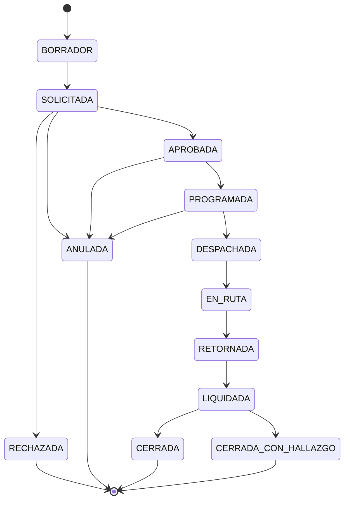

# 03 — Arquitectura

Cómo se estructura el sistema y por qué.

## Estructura

| Ruta | Estado | Contenido |
|---|---|---|
| `modelo-datos/` | Bloque 4 | Modelo conceptual, lógico y diccionario de datos |
| `estados/` | Bloque 1 | Máquinas de estado: Orden de Misión, vale de combustible, viático, vehículo |
| `adr/` | Sprint 2+ | Decisiones de arquitectura `ADR-xxx` |
| `c4/` | Sprint 2 | Contexto, contenedores y componentes |
| `seguridad/` | Sprint 2 | Autenticación, autorización, auditoría, cifrado, firma electrónica |

## El stack está diferido al Sprint 2 — deliberadamente

Hasta el Sprint 2 no se nombra ningún lenguaje, framework ni motor de base de datos. Si surge una pregunta de tecnología antes, se responde en términos de **capacidades requeridas**.

La razón: elegir stack antes de conocer el dominio produce arquitecturas que pelean con el problema. Las restricciones que realmente van a decidir el stack — offline-first en campo, auditoría append-only, impresión de formatos oficiales, despliegue on-premise sin equipo de TI dedicado en las delegaciones — todavía se están descubriendo.

## Capacidades ya identificadas como determinantes

Se registran aquí para que el `ADR-001` de selección de stack tenga contra qué evaluarse:

| Capacidad | Origen | Impacto |
|---|---|---|
| Almacenamiento local persistente en cliente de campo y sincronización diferida | `RNF` offline-first | Alto — descarta arquitecturas puramente server-rendered |
| Bitácora append-only inmutable con hash encadenado | Control interno TSC | Alto — condiciona el modelo de persistencia |
| Generación de documentos imprimibles con folio, QR y hash | Marco híbrido papel-digital | Medio |
| Parámetros con vigencia por rango de fechas (temporalidad bitemporal) | Tarifas de peaje y categorías por ejes, que se revisan periódicamente | Alto — condiciona el modelo de datos |
| Espejo local de datos externos con sincronización por eventos y reconciliación | Integración con ARGOS y Talento Humano — ver [ADR-001](adr/ADR-001-integracion-argos-talento-humano.md) | Alto |
| Seguimiento de ubicación y estado en tiempo real, con mapas | M-19; se reutiliza el componente de ARGOS | Medio |
| Instalación y respaldo operables por personal sin especialización | Despliegue on-premise en delegaciones | Alto — descarta stacks con operación compleja |
| Uso desde celular en campo, con cámara y sin conectividad | Realidad rural hondureña | Alto |
| Cifrado en reposo de datos personales | M-17 y hábeas data | Medio |

### Capacidades incorporadas al escribir los `RNF-xx`

Surgieron al fijar umbrales verificables. Ver [`docs/02-requisitos/no-funcionales/`](../02-requisitos/no-funcionales/README.md).

| Capacidad | Origen | Impacto |
|---|---|---|
| **Anclaje externo del sello de la cadena de auditoría** — el sello periódico sale a ≥ 2 destinos fuera del alcance de quien administra la base | [`RNF-04`](../02-requisitos/no-funcionales/RNF-04-bitacora-append-only-con-hash-encadenado.md) | Alto — sin él, la inmutabilidad es solo frente al usuario de la aplicación |
| **Segmento de datos personales separable de la cadena de auditoría** — la cadena encadena referencia y huella, no el contenido en claro | [`RNF-17`](../02-requisitos/no-funcionales/RNF-17-retencion-y-depuracion-diferenciada.md) | Alto — **no se puede agregar después** de tener años de cadena construida |
| **Generación distribuida de folios con rangos pre-asignados por delegación**, distinta de los identificadores internos generados en el cliente | [`RNF-21`](../02-requisitos/no-funcionales/RNF-21-integridad-de-folios-y-correlativos.md) | Alto — condiciona el modelo documental |
| **Reportes reproducibles con fecha de corte de conocimiento** — misma consulta, mismo corte, mismo resultado años después | [`RNF-06`](../02-requisitos/no-funcionales/RNF-06-reproducibilidad-historica-de-reportes.md) | Alto — condiciona toda consulta agregada |
| **Archivado en frío que conserva la consultabilidad**, con reducción de densidad de series y sin eliminación | [`RNF-02`](../02-requisitos/no-funcionales/RNF-02-volumen-y-crecimiento-del-acervo.md) | Alto |
| **Canal de posición en vivo con cola offline y degradación declarada** en el propio marcador del tablero | [`RNF-08`](../02-requisitos/no-funcionales/RNF-08-seguimiento-en-ruta.md) | Medio — el componente de mapas se reutiliza de ARGOS |
| **Almacén local del dispositivo cifrado, con expiración y borrado remoto** | [`RNF-13`](../02-requisitos/no-funcionales/RNF-13-cifrado-en-transito-y-en-reposo.md) | Medio |
| **Pantalla de estado legible por personal no técnico**, con acción sugerida por cada indicador anómalo | [`RNF-20`](../02-requisitos/no-funcionales/RNF-20-observabilidad-y-diagnostico.md) | Medio — no se obtiene añadiendo registros técnicos al final |
| **Autoría histórica inmutable frente a reorganizaciones**: persona, puesto y vigencia separados | [`RNF-15`](../02-requisitos/no-funcionales/RNF-15-continuidad-ante-rotacion-de-personal.md) | Alto — condiciona el modelo de datos |
| **Mismo artefacto de despliegue para toda institución**, con parámetros vacíos y bloqueantes cuando el dato real está `[C]` | [`RNF-19`](../02-requisitos/no-funcionales/RNF-19-configurabilidad-multi-institucion.md) | Alto |

**Los nueve `RNF` determinantes** contra los que debe evaluarse el `ADR` de stack del Sprint 2 están listados en el [índice de requisitos no funcionales](../02-requisitos/no-funcionales/README.md#los-nueve-que-van-a-decidir-el-stack).

## Máquina de estados principal

El detalle de quién puede ejecutar cada transición, qué precondiciones tiene y qué efectos colaterales dispara se documenta en `estados/orden-de-mision.md` (Bloque 1).
