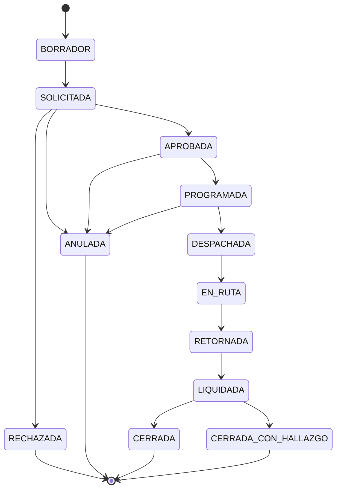

# 03 — Arquitectura

Cómo se estructura el sistema y por qué.

## Estructura

| Ruta | Estado | Contenido |
|---|---|---|
| `modelo-datos/` | Bloque 4 | Modelo conceptual, lógico y diccionario de datos |
| `estados/` | Bloque 1 | Máquinas de estado: Orden de Misión, vale de combustible, viático, vehículo |
| `adr/` | Sprint 2+ | Decisiones de arquitectura `ADR-xxx` |
| `c4/` | Sprint 2 | Contexto, contenedores y componentes |
| `seguridad/` | Sprint 2 | Autenticación, autorización, auditoría, cifrado, firma electrónica |

## El stack está diferido al Sprint 2 — deliberadamente

Hasta el Sprint 2 no se nombra ningún lenguaje, framework ni motor de base de datos. Si surge una pregunta de tecnología antes, se responde en términos de **capacidades requeridas**.

La razón: elegir stack antes de conocer el dominio produce arquitecturas que pelean con el problema. Las restricciones que realmente van a decidir el stack — offline-first en campo, auditoría append-only, impresión de formatos oficiales, despliegue on-premise sin equipo de TI dedicado en las delegaciones — todavía se están descubriendo.

## Capacidades ya identificadas como determinantes

Se registran aquí para que el `ADR-001` de selección de stack tenga contra qué evaluarse:

| Capacidad | Origen | Impacto |
|---|---|---|
| Almacenamiento local persistente en cliente de campo y sincronización diferida | `RNF` offline-first | Alto — descarta arquitecturas puramente server-rendered |
| Bitácora append-only inmutable con hash encadenado | Control interno TSC | Alto — condiciona el modelo de persistencia |
| Generación de documentos imprimibles con folio, QR y hash | Marco híbrido papel-digital | Medio |
| Parámetros con vigencia por rango de fechas (temporalidad bitemporal) | Reglamento de viáticos cambiante | Alto — condiciona el modelo de datos |
| Instalación y respaldo operables por personal sin especialización | Despliegue on-premise en delegaciones | Alto — descarta stacks con operación compleja |
| Uso desde celular en campo, con cámara y sin conectividad | Realidad rural hondureña | Alto |
| Cifrado en reposo de datos personales | M-17 y hábeas data | Medio |

## Máquina de estados principal

El detalle de quién puede ejecutar cada transición, qué precondiciones tiene y qué efectos colaterales dispara se documenta en `estados/orden-de-mision.md` (Bloque 1).
