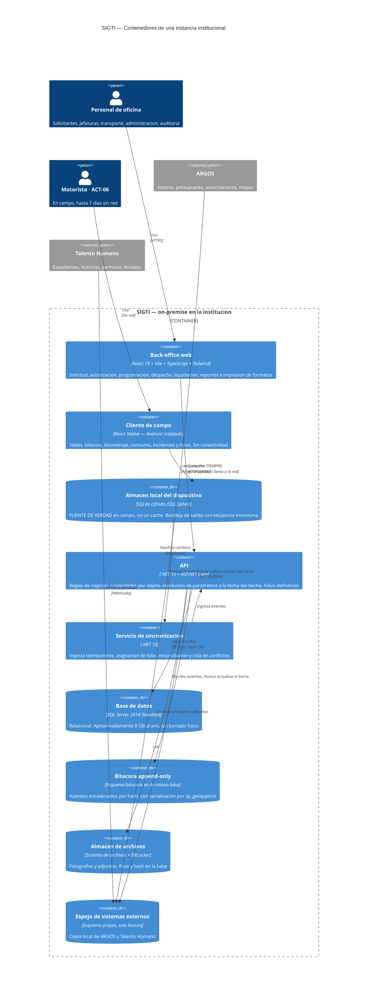

# C4 nivel 2 — Contenedores

Las piezas desplegables de una instancia de SIGTI. El stack de cada una está fijado por [`ADR-002`](../adr/ADR-002-adoptar-el-stack-tecnologico.md).

## Diagrama

## Las cuatro reglas que este diagrama hace cumplir

**1. Ninguna pantalla de campo llama a la red.** Escriben en SQLite; el motor de sincronización se encarga cuando hay señal. Si una sola hace `await fetch(...)`, la aplicación funciona en la oficina y **falla en Gracias a Dios al tercer día** — que es donde [`RNF-03`](../../02-requisitos/no-funcionales/RNF-03-operacion-sin-conectividad.md) dice que tiene que funcionar.

**2. El almacén local es la fuente de verdad, no un caché.** Un caché se puede descartar; esto no. Contiene hasta 7 días de bitácora y ≥ 200 fotografías que no existen en ningún otro lado.

**3. La bitácora se escribe, nunca se actualiza ni se borra.** La cadena de hash es inherentemente secuencial —el asiento *n* necesita el hash del *n−1*—, así que la escritura se serializa con `sp_getapplock` sobre la cola **dentro de la transacción**. Sin eso, dos transacciones concurrentes **bifurcan la cadena** y deja de detectar alteraciones, que es lo único para lo que existe. **No** se calcula en un interceptor de `SaveChanges` sin serializar: funciona con un usuario y bifurca en producción.

**4. Los adjuntos no viven en la base** ([`ADR-004`](../adr/ADR-004-adjuntos-fuera-de-la-base.md)). Son ≈30 GB/año contra ≈8 GB del relacional. Dentro de la base sacarían la restauración de las 2 h que [`RNF-09`](../../02-requisitos/no-funcionales/RNF-09-instalacion-respaldo-y-restauracion.md) permite.

## Qué se respalda, y cómo

`RNF-09` es **filtro de elegibilidad**, no meta de calidad: la restauración la ejecuta personal **no especialista** en ≤ 2 h.

| Pieza | Respaldo |
|---|---|
| Base de datos | Respaldo nativo **cifrado** de SQL Server |
| Almacén de archivos | Copia del árbol de directorios, con verificación de hash |
| Histórico frío | Filegroups de solo lectura, respaldados **una vez** en lugar de cada noche |

> **La restauración es de dos piezas y hay que probarla entera.** Restaurar la base a una fecha y el almacén de archivos a otra produce un expediente que **se ve completo y no lo está**. El procedimiento se escribe así desde el principio.

## Esquemas de base como espejo de los módulos

`flota.Vehiculo`, `mision.OrdenDeMision`, `bitacora.Asiento`, `catalogo.Zona`. Los permisos se otorgan **por esquema**, que es lo que [`RNF-14`](../../02-requisitos/no-funcionales/RNF-14-control-de-acceso-por-puesto-y-registro-de-consultas.md) necesita con 40 delegaciones.

**Cero `DELETE` en todo el sistema.** `RNF-02` lo pone como métrica: *«registros eliminados físicamente: 0»*. Toda anulación es asiento reverso con motivo y autor (`RN-04`).

## Lo que este diagrama todavía no puede afirmar

| Elemento | Estado |
|---|---|
| Edición exacta y Service Pack de la instancia SQL Server 2014, y si el cifrado de respaldo está disponible | `[C]` — bloquea `RNF-13` |
| Dónde vive la llave del cifrado por columna y quién la custodia | `[C]` — insumo #73 reformulado |
| Si el QR de verificación expone un punto público accesible desde carretera | `[C]` |
| Cómo se consume la plantilla `diseno/` de LOKI (contrato 0.3.3): submódulo, copia o paquete versionado | `[C]` — y le falta TanStack Query |
| Distribución de actualizaciones del cliente de campo a 40 delegaciones | `[C]` |
