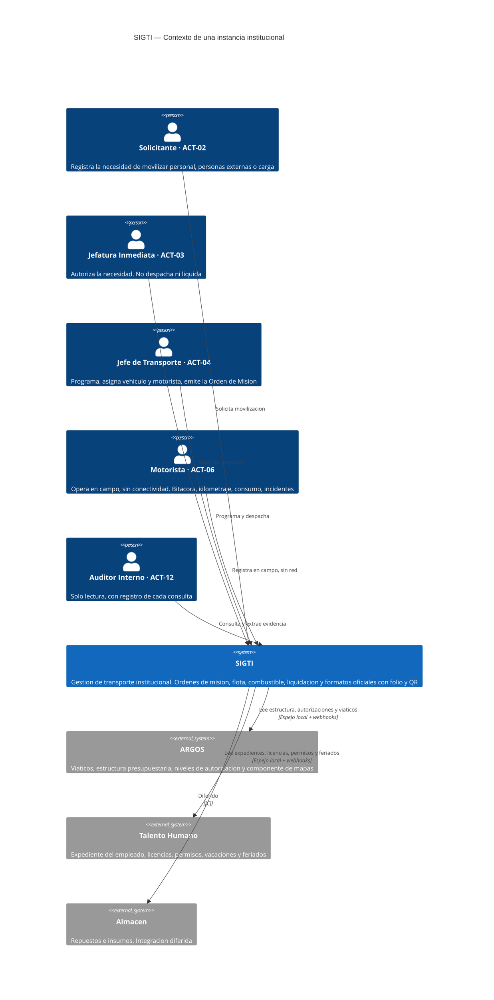

# C4 nivel 1 — Contexto

Qué es SIGTI desde afuera: con quién habla y qué le pide a cada quien.

**Una instancia por institución**, desplegada on-premise en sus servidores ([`RNF-19`](../../02-requisitos/no-funcionales/RNF-19-configurabilidad-multi-institucion.md)). Este diagrama describe una de esas instancias.

## Diagrama

> Los actores del diagrama son **una selección** de los 17 que existen, elegida para que el contexto se lea. La lista completa, con su alcance de datos, sus incompatibilidades y la matriz de permisos, es [`docs/01-negocio/actores-y-roles.md`](../../01-negocio/actores-y-roles.md) — **esa es la autoridad**, no este diagrama.

## Qué le pide SIGTI a cada sistema externo

| Sistema | Qué aporta | Qué **no** hace SIGTI por eso |
|---|---|---|
| **ARGOS** | Estructura organizativa y niveles de autorización (sin ella `ACT-03` no se resuelve automáticamente), viáticos, estructura presupuestaria, componente de mapas | No calcula viáticos — `M-10` está **retirado**, no reasignado. No mantiene estructura presupuestaria propia. No implementa mapas |
| **Talento Humano** | Expediente del empleado, licencias y sus categorías, permisos, vacaciones, incapacidades, calendario de feriados | No mantiene expediente de personal. No gestiona permisos ni vacaciones |
| **Almacén** | Repuestos e insumos para `M-11` | Integración **diferida** `[C]` |

La frontera está fijada por [`DP-001`](../../07-gestion/decisiones-de-producto/DP-001-fronteras-con-sistemas-existentes.md): **no replicamos lo que otro sistema ya hace.**

## Cómo se comunica con ellos, y por qué así

**Espejo local de solo lectura, sincronizado por webhooks** ([`ADR-001`](../adr/ADR-001-integracion-argos-talento-humano.md) — **no reabrir**).

La razón es `RNF-03`: SIGTI opera en campo sin conectividad durante días. Un diseño que consulte a ARGOS o a Talento Humano en cada operación no es viable — y ni siquiera en la oficina sería sensato, porque acoplaría la disponibilidad de SIGTI a la de dos sistemas ajenos.

## Lo que este diagrama todavía no puede afirmar

| Elemento | Estado |
|---|---|
| Integración con **Almacén** | `[C]` — diferida, sin alcance definido |
| Si existe unidad de **Bienes** separada o la absorbe Gerencia Administrativa | `[C]` — condiciona si `ACT-14` se mapea al mismo puesto que `ACT-08` |
| Quién autoriza la misión de la **máxima autoridad** | `[C]` — hasta que se defina, el sistema **escala** |
| Si el **QR de verificación** expone un punto público | `[C]` — con despliegue on-premise, el QR no tiene a dónde apuntar. La vía degradada (huella impresa, código corto, consulta telefónica) sí es implementable |

Registro completo en [`docs/07-gestion/insumos-pendientes.md`](../../07-gestion/insumos-pendientes.md).
