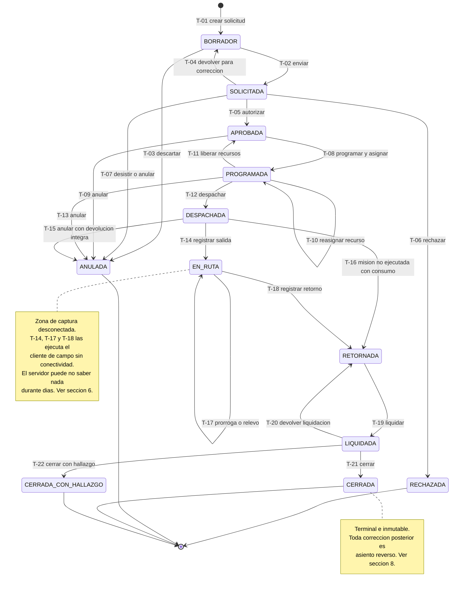
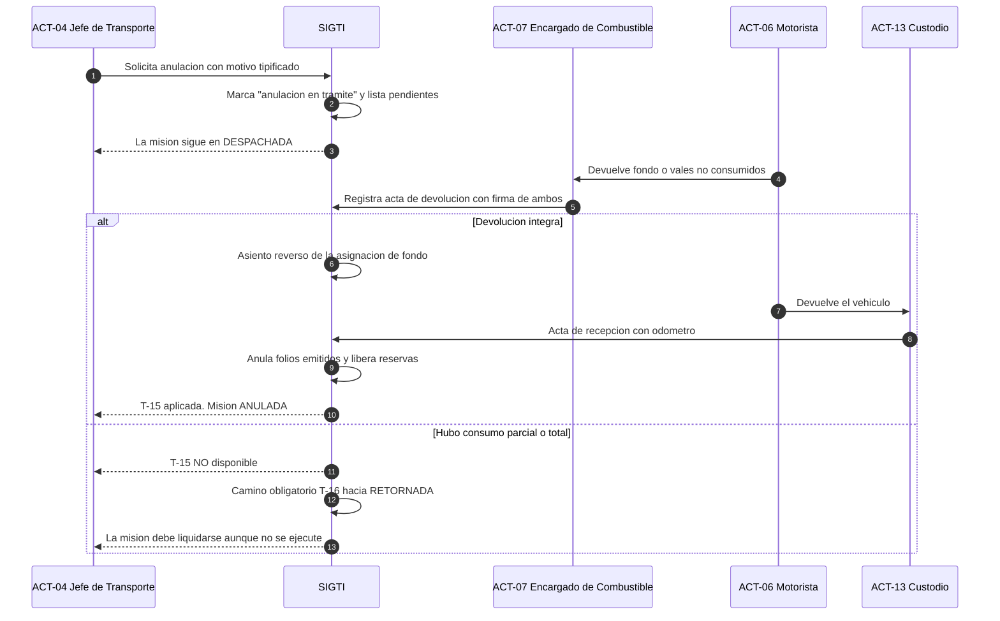
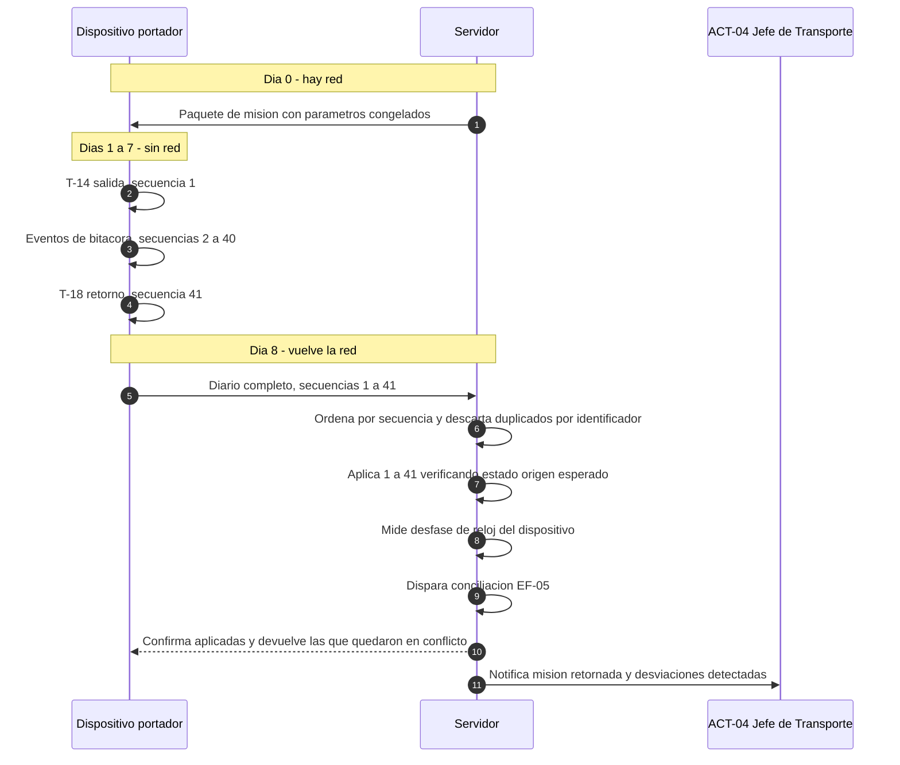
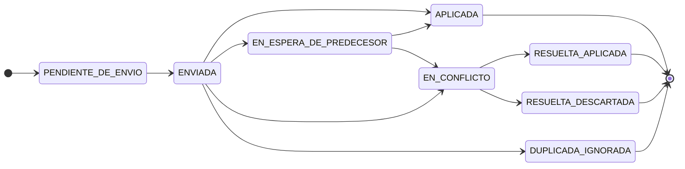
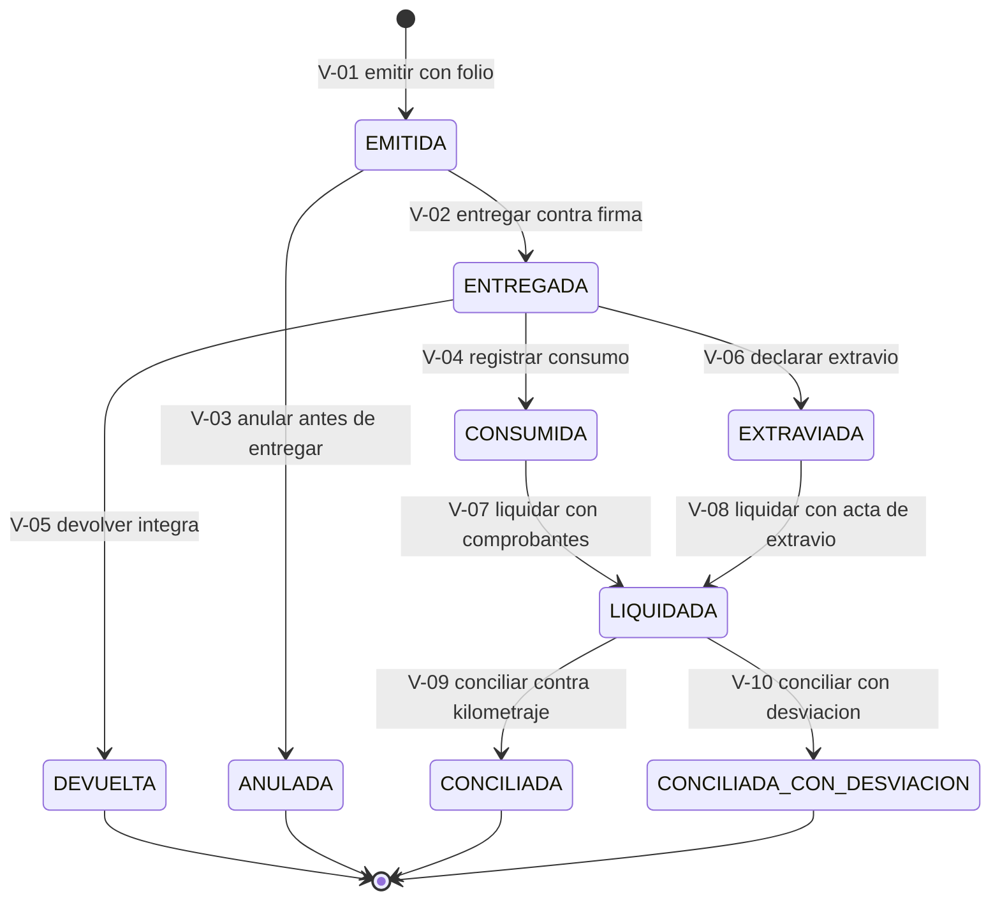
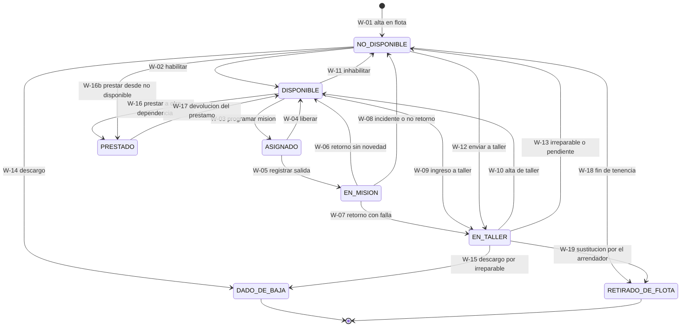

# Máquina de estados — Orden de Misión

| Campo | Valor |
|---|---|
| **Entidad** | Orden de Misión — unidad de control administrativo-contable de SIGTI |
| **Módulos** | M-06, M-07, M-08, M-09, M-13, M-14, M-16, M-18 |
| **Origen normativo** | [NRM-01](../../01-negocio/normativa/NRM-01-control-interno-tsc.md), [NRM-06](../../01-negocio/normativa/NRM-06-transito-y-licencias.md), [NRM-09](../../01-negocio/normativa/NRM-09-realidad-operativa.md), [NRM-10](../../01-negocio/normativa/NRM-10-peajes.md) |
| **Decisiones que la condicionan** | [DP-001](../../07-gestion/decisiones-de-producto/DP-001-fronteras-con-sistemas-existentes.md), [ADR-000](../adr/ADR-000-diferir-seleccion-de-stack.md), [ADR-001](../adr/ADR-001-integracion-argos-talento-humano.md) |
| **Sprint / Bloque** | Sprint 0 / Bloque 1 |
| **Última actualización** | 2026-08-06 |

Esta es la especificación más consultada del proyecto. Está escrita para que se pueda implementar sin preguntar nada: cada transición tiene actor, precondiciones verificables, efectos y reversibilidad. Donde falta un dato de la institución se marca `[C]` y se indica qué decisión desbloquea.

**No contiene decisiones de tecnología.** El stack está diferido al Sprint 2 por [ADR-000](../adr/ADR-000-diferir-seleccion-de-stack.md). Todo lo que aquí se describe es comportamiento observable, no implementación.

**Los viáticos no forman parte de esta máquina.** Los gestiona ARGOS ([DP-001, D-01](../../07-gestion/decisiones-de-producto/DP-001-fronteras-con-sistemas-existentes.md)). SIGTI solo conserva la clave de vínculo. Lo que sí se liquida aquí son los **gastos operativos del viaje**: combustible y peajes.

---

## 0. Cómo leer este documento

### 0.1 Convenciones

| Símbolo | Significado |
|---|---|
| `T-nn` | Transición. Identificador estable, no se recicla |
| `BD-nn` | Precondición de bloqueo duro. El sistema impide la transición, no advierte |
| `EF-nn` | Efecto colateral que exige diseño explícito |
| `INV-nn` | Invariante. Debe ser cierto siempre que el expediente esté en ese estado |
| `H-nn` | Criterio de cierre con hallazgo |
| `[C]` | Dato pendiente de confirmar con la institución |

### 0.2 Cuatro principios que gobiernan toda la máquina

**P-1 — El estado es el resultado del diario, no un campo.**
El estado de una misión es el resultado de aplicar, en orden, su diario de transiciones. Cualquier valor de estado que el sistema guarde es una proyección y debe poder reconstruirse desde el diario. Sin esto, la sincronización desconectada no tiene solución: dos dispositivos no negocian "el estado", intercambian **transiciones**.

**P-2 — Se bloquea lo que compromete recursos; no se bloquea lo que ya ocurrió.**
Los bloqueos duros se aplican a las transiciones que **autorizan, reservan o entregan**: `SOLICITADA → APROBADA`, `APROBADA → PROGRAMADA`, `PROGRAMADA → DESPACHADA`, y a las de cierre económico. A las transiciones que **registran hechos consumados** — la salida, los eventos en ruta, el retorno — se les aplican validaciones de coherencia que exigen justificación, marcan la misión para revisión y pueden derivar en cierre con hallazgo, **pero nunca impiden el registro**. Un sistema que se niega a registrar que el vehículo volvió con 900 km de más no evita el problema: lo deja fuera del expediente, que es exactamente lo que el auditor busca y no encuentra.

La única excepción es el error material de digitación — odómetro de retorno menor al de salida — donde bloquear es corregir, no ocultar. Ver `BD-05`.

**P-3 — Nada se borra, nada se sobrescribe.**
Toda corrección posterior a un estado terminal es un **asiento reverso** con motivo, autor y referencia al asiento revertido. Ver sección 8.

**P-4 — La fecha del hecho manda sobre la fecha de captura.**
Todo cálculo — tarifa de peaje, día hábil, plazo, matriz de licencias — usa la tabla vigente **a la fecha del hecho**. La fecha de captura y la de sincronización existen para auditar el registro, no para calcular. Ver sección 6.4.

### 0.3 Dos entidades, una máquina

Los estados `BORRADOR`, `SOLICITADA`, `APROBADA` y `RECHAZADA` corresponden a la **fase de solicitud** del expediente (M-06). Desde `PROGRAMADA` en adelante corresponden a la **Orden de Misión** propiamente dicha (M-07), que es el documento con folio y la unidad de control contable.

Es un solo expediente con dos fases, no dos entidades que se copian. La razón: partirlo en dos rompe la cadena trazable que exige [NRM-01](../../01-negocio/normativa/NRM-01-control-interno-tsc.md) — `solicitud → autorización → orden de misión → bitácora → vale → liquidación` — y obliga a reconstruirla por referencias en cada consulta de auditoría.

**Consolidación.** Varias solicitudes aprobadas pueden atenderse con una sola Orden de Misión. En ese caso una de ellas actúa como expediente rector y las demás quedan vinculadas a él; desde `PROGRAMADA` en adelante **todas siguen las transiciones del expediente rector**. La única transición que conserva cada solicitud consolidada por separado es `ANULADA`: una dependencia puede desistir sin que la misión se caiga. La liquidación se hace por misión, con atribución de costo por solicitud vinculada para el reporte por dependencia.

---

## 1. Diagrama de estados



---

## 2. Definición de los estados

Cada estado se define por lo que es **cierto** cuando el expediente está ahí — no por lo que "significa" en abstracto. Las invariantes son verificables y deben poder comprobarse en cualquier momento.

### BORRADOR

**Qué es en la operación real.** El solicitante está armando la necesidad de movilización. Todavía no entró al circuito de control: nadie más lo ve, no compromete nada, no existe para efectos de auditoría porque no hubo transacción autorizada.

| | |
|---|---|
| **Invariantes** | `INV-01` No tiene folio institucional asignado. `INV-02` No tiene vehículo ni motorista vinculados. `INV-03` No reserva ninguna ventana temporal. `INV-04` Solo lo ve su creador y el Administrador del Sistema (ACT-01) |
| **Se puede** | Editar cualquier campo libremente, sin versionado. Adjuntar documentos. Descartar |
| **No se puede** | Aprobar, programar, imprimir documento oficial, obtener folio |
| **Ejecuta en campo** | Sí — se crea sin conectividad. El identificador del expediente lo genera el cliente (UUID) |

El descarte de un borrador **no es un asiento reverso**, porque no hubo transacción que revertir. Pero tampoco es un borrado físico: el expediente pasa a `ANULADA` con motivo "descartado antes de enviar" y queda fuera de los paquetes de evidencia de auditoría, marcado como tal.

### SOLICITADA

**Qué es en la operación real.** La necesidad está formulada y encaminada a quien debe autorizarla. La jefatura ya la ve en su bandeja. Aquí empieza la responsabilidad: lo que se apruebe es exactamente lo que se envió.

| | |
|---|---|
| **Invariantes** | `INV-05` El contenido sustantivo está congelado — objeto del traslado, ventana, origen y destinos, tipo de vehículo requerido, pasajeros o carga, dependencia solicitante. `INV-06` Tiene número de expediente institucional asignado, correlativo por delegación y año. `INV-07` Tiene calculado y congelado el estimado de peajes de la ruta, con el identificador de la tabla de tarifas usada (M-18). `INV-08` No reserva vehículo ni motorista |
| **Se puede** | Autorizar, rechazar, devolver para corrección, desistir. Consultar el estimado desglosado por punto de peaje |
| **No se puede** | Editar el contenido sustantivo. Para corregir hay que devolver a `BORRADOR` (`T-04`), lo que incrementa la versión del expediente |
| **Ejecuta en campo** | Sí para enviar. La autorización requiere conectividad o código de autorización fuera de línea — ver 6.6 |

**Sobre los niveles de autorización.** ARGOS es dueño de la matriz de niveles de autorización ([ADR-001](../adr/ADR-001-integracion-argos-talento-humano.md)); SIGTI la consume espejada. Una misión puede requerir **una o varias** autorizaciones según monto, destino, duración o tipo de recurso movilizado. El expediente **permanece en `SOLICITADA` hasta que se registra la última autorización requerida**; no se inventan estados intermedios por nivel. Cada autorización parcial queda registrada como transición de tipo "autorización de nivel N" en el diario, con su actor, sin cambiar el estado.

`[C]` El esquema exacto de niveles y sus disparadores — insumo #16.

### APROBADA

**Qué es en la operación real.** La necesidad está autorizada, pero **todavía no hay vehículo**. La solicitud está en la cola de Transporte esperando que se le asigne flota. Es el estado donde más tiempo pasan las misiones en una institución con demanda alta.

| | |
|---|---|
| **Invariantes** | `INV-09` Existe al menos un registro de autorización con actor, rol ejercido, marca de tiempo y resumen del contenido autorizado. `INV-10` Quien autorizó no es quien solicitó — `BD-01`. `INV-11` Sigue sin reservar recursos: aprobar no es programar |
| **Se puede** | Programar, consolidar con otras solicitudes aprobadas, anular por inviabilidad o desistimiento |
| **No se puede** | Despachar sin pasar por `PROGRAMADA`, ni siquiera en misión urgente. Modificar el contenido autorizado |
| **Ejecuta en campo** | La programación requiere ver la disponibilidad de flota completa |

Una misión aprobada que nadie puede atender **no se queda ahí para siempre**: vencida la ventana solicitada sin programación, el sistema la marca como caducada y exige a ACT-04 anularla con motivo tipificado (`T-09`). Una cola de aprobadas que nadie depura oculta el déficit real de flota, que es justamente el indicador que la institución necesita.

### PROGRAMADA

**Qué es en la operación real.** Hay vehículo y motorista asignados a una ventana concreta. El vehículo está comprometido: nadie más puede tomarlo en esa franja. Los documentos todavía no se imprimen y el motorista todavía no recibió nada.

| | |
|---|---|
| **Invariantes** | `INV-12` Hay exactamente un vehículo y un motorista titular asignados. Puede haber motoristas de relevo declarados, cada uno con su verificación de licencia. `INV-13` El vehículo y el motorista tienen reserva exclusiva sobre la ventana de la misión más sus holguras — `EF-01`. `INV-14` Todas las verificaciones de `BD-02` a `BD-04` se evaluaron y su resultado quedó registrado en el diario, con los datos concretos contra los que se evaluaron. `INV-15` El folio de la Orden de Misión está **reservado** del rango de la delegación, no consumido. `INV-16` El estado operativo del vehículo es `ASIGNADO` |
| **Se puede** | Reasignar vehículo o motorista (`T-10`), desprogramar liberando recursos (`T-11`), despachar, anular |
| **No se puede** | Salir. Entregar fondo de combustible. Imprimir la Orden de Misión como documento válido — se puede imprimir una vista previa marcada visiblemente como no válida para circulación |
| **Ejecuta en campo** | Requiere disponibilidad de flota. En delegación desconectada, ver 6.6 |

La reserva del folio en `PROGRAMADA` — y no en `DESPACHADA` — existe porque [NRM-09](../../01-negocio/normativa/NRM-09-realidad-operativa.md) exige **emisión anticipada de documentos** para delegaciones que salen a zona sin cobertura. El folio se reserva antes; se consume al despachar. Un folio reservado que no se consume se **anula**, no se recicla ni se devuelve al rango.

### DESPACHADA

**Qué es en la operación real.** El motorista ya tiene en la mano la Orden de Misión impresa con folio y QR, las llaves, los documentos del vehículo y el fondo de combustible. Firmó la recepción. Todavía no ha salido del predio, pero la institución ya entregó bienes y dinero público.

Este es el estado de mayor exposición: hay recursos entregados y todavía no hay ejecución que los justifique.

| | |
|---|---|
| **Invariantes** | `INV-17` Existe acta de entrega del vehículo firmada, con odómetro, nivel de combustible, herramientas, llanta de repuesto y documentos a bordo. `INV-18` El folio de la Orden de Misión está consumido y el documento impreso tiene su hash registrado. `INV-19` Si la ventana toca día u hora inhábil, existe el permiso de la máxima autoridad y su salvoconducto impreso — `BD-04`. `INV-20` Toda asignación de fondo de combustible vinculada está en estado `ENTREGADA` con firma de recepción. `INV-21` El paquete normativo está congelado — `EF-03`. `INV-22` Hay exactamente un dispositivo portador designado. `INV-23` Quien despachó no es el motorista ni quien entregó el combustible — `BD-06` |
| **Se puede** | Registrar la salida. Anular con devolución íntegra. Registrar retorno de recursos si hubo consumo y la misión no se ejecuta |
| **No se puede** | Cambiar de vehículo o motorista sin revertir primero a `PROGRAMADA` mediante devolución de lo entregado. Reimprimir la Orden con el mismo folio |
| **Ejecuta en campo** | La salida sí, sin conectividad |

### EN_RUTA

**Qué es en la operación real.** El vehículo salió. A partir de aquí el expediente vive en el dispositivo del motorista y **el servidor puede no saber absolutamente nada durante días**. La bitácora está abierta y cada evento — parada, arribo, espera en sitio, carga de combustible, paso por caseta, incidente, falla — se registra contra el reloj del dispositivo.

| | |
|---|---|
| **Invariantes** | `INV-24` Hay odómetro de salida y marca de tiempo real de salida registrados. `INV-25` El vehículo está en estado `EN_MISION` y el motorista no disponible. `INV-26` La bitácora está abierta y admite eventos. `INV-27` La autoridad del expediente reside en el dispositivo portador; ninguna oficina modifica datos capturados en campo. `INV-28` No existe ninguna liquidación |
| **Se puede** | Registrar eventos de ruta, consumos, peajes, incidentes y fotografías, todo sin conectividad. Solicitar prórroga o relevo (`T-17`). Registrar el retorno |
| **No se puede** | **Anular la misión.** Ver "transiciones prohibidas", 3.4. Editar desde oficina lo capturado en campo. Liquidar |
| **Ejecuta en campo** | Todo |

**El silencio no es un estado.** Que el servidor lleve seis días sin recibir nada de una misión `EN_RUTA` es exactamente lo que el diseño espera. El sistema puede alertar por "sin sincronizar desde", pero esa alerta **no cambia el estado ni dispara ninguna transición automática**. Una máquina que "cierra por inactividad" una misión desconectada inventa hechos, y los hechos inventados son el peor tipo de dato para una auditoría.

### RETORNADA

**Qué es en la operación real.** El vehículo volvió, el motorista devolvió la custodia y se leyó el odómetro final. La ejecución terminó; lo que empieza ahora es el trabajo administrativo de cuadrar las cuentas.

| | |
|---|---|
| **Invariantes** | `INV-29` Hay odómetro de retorno y marca de tiempo real de retorno. `INV-30` La bitácora está cerrada: no admite eventos nuevos. `INV-31` Existe acta de recepción del vehículo con novedades declaradas. `INV-32` La conciliación automática de combustible, peajes y kilometraje está calculada y sus desviaciones tipificadas — `EF-05`. `INV-33` El vehículo ya no está `EN_MISION` |
| **Se puede** | Liquidar. Adjuntar comprobantes faltantes. Justificar desviaciones. Abrir expediente de incidente o de mantenimiento derivado |
| **No se puede** | Volver a `EN_RUTA`. Anular. Modificar odómetros o eventos capturados — solo corregirlos por asiento |
| **Ejecuta en campo** | Sí, el registro del retorno. La liquidación no |

Se llega a `RETORNADA` por dos caminos: la ejecución normal (`T-18`) y la misión que no se ejecutó pero tuvo consumo (`T-16`). En el segundo caso el kilometraje recorrido es cero o mínimo y la conciliación es solo de fondo entregado contra fondo devuelto.

### LIQUIDADA

**Qué es en la operación real.** Alguien distinto del motorista y de quien entregó el combustible revisó los números: cuánto se asignó, cuánto se consumió, qué comprobantes hay, cuánto se devolvió, cuánto se recorrió y si eso guarda relación con el rendimiento esperado del vehículo. La misión tiene resultado económico. Falta la aprobación de ese resultado.

| | |
|---|---|
| **Invariantes** | `INV-34` Todas las asignaciones de fondo vinculadas están `LIQUIDADAS`. `INV-35` Toda desviación fuera de umbral tiene causa tipificada y justificación registrada. `INV-36` No hay divergencias de sincronización sin resolver — `BD-08`. `INV-37` Quien liquidó no es el motorista, ni quien entregó el combustible, ni quien despachó — `BD-06`. `INV-38` El resultado económico está congelado con los identificadores de las tablas paramétricas usadas |
| **Se puede** | Cerrar, cerrar con hallazgo, o devolver la liquidación para corrección (`T-20`) |
| **No se puede** | Modificar el resultado sin devolver primero a `RETORNADA`. Anular |
| **Ejecuta en campo** | No |

### CERRADA

Terminal. El expediente está completo y aprobado. Ver sección 8.

### CERRADA_CON_HALLAZGO

Terminal, con observación que exige seguimiento. **No imputa responsabilidad a nadie.** Ver sección 7.

### RECHAZADA

**Qué es en la operación real.** La jefatura no autorizó la movilización. Terminal.

El solicitante no reabre un rechazo: crea una solicitud nueva, y el sistema ofrece hacerlo **a partir de** la rechazada, conservando el vínculo entre ambas. La razón es de control: un expediente que se rechaza y se reabre hasta que pasa deja un rastro confuso; dos expedientes vinculados dejan un rastro legible — "esto se pidió, se negó, se volvió a pedir así".

`INV-39` Toda misión `RECHAZADA` tiene motivo obligatorio del catálogo configurable más texto libre.

### ANULADA

**Qué es en la operación real.** El expediente se cancela antes de que el vehículo salga. Es el único estado terminal al que se llega desde varios puntos, y el que más disciplina exige: si ya se habían entregado recursos, no basta con cambiar el estado.

`INV-40` Motivo obligatorio, tipificado y con autor.
`INV-41` Todo folio reservado o consumido por el expediente quedó marcado como anulado, con referencia a la misión.
`INV-42` No queda ninguna reserva de vehículo, motorista ni fondo asociada.
`INV-43` Si se había entregado fondo o vales, existe acta de devolución íntegra firmada — `EF-06`.

**Una misión que salió no se anula nunca.** Ver 3.4.

---

## 3. Tabla de transiciones

### 3.1 Resumen

| ID | Origen → Destino | Ejecuta | Motivo obligatorio | Reversible | Cliente desconectado |
|---|---|---|---|---|---|
| `T-01` | — → BORRADOR | ACT-02 | No | Sí, vía `T-03` | Sí |
| `T-02` | BORRADOR → SOLICITADA | ACT-02 | No | Sí, vía `T-04` | Sí |
| `T-03` | BORRADOR → ANULADA | ACT-02 · ACT-01 | Sí | **No** | Sí |
| `T-04` | SOLICITADA → BORRADOR | ACT-03 | Sí | Sí, vía `T-02` | No |
| `T-05` | SOLICITADA → APROBADA | ACT-03 + niveles | No | Sí, vía `T-09` | Con código — 6.6 |
| `T-06` | SOLICITADA → RECHAZADA | ACT-03 | Sí | **No** | Con código — 6.6 |
| `T-07` | SOLICITADA → ANULADA | ACT-02 · ACT-08 | Sí | **No** | No |
| `T-08` | APROBADA → PROGRAMADA | ACT-04 · ACT-10 | No | Sí, vía `T-11` | Con código — 6.6 |
| `T-09` | APROBADA → ANULADA | ACT-04 · ACT-02 · ACT-08 | Sí | **No** | No |
| `T-10` | PROGRAMADA → PROGRAMADA | ACT-04 · ACT-10 | Sí | Sí, repitiendo | No |
| `T-11` | PROGRAMADA → APROBADA | ACT-04 · ACT-10 | Sí | Sí, vía `T-08` | No |
| `T-12` | PROGRAMADA → DESPACHADA | ACT-05 | No | Sí, vía `T-15` | Con código — 6.6 |
| `T-13` | PROGRAMADA → ANULADA | ACT-04 · ACT-08 | Sí | **No** | No |
| `T-14` | DESPACHADA → EN_RUTA | ACT-06 | No | **No** | **Sí** |
| `T-15` | DESPACHADA → ANULADA | ACT-04 + ACT-07 + ACT-13 | Sí | **No** | No |
| `T-16` | DESPACHADA → RETORNADA | ACT-04 · ACT-10 | Sí | **No** | Sí |
| `T-17` | EN_RUTA → EN_RUTA | ACT-06 + autorizador | Sí | Sí, repitiendo | **Sí, con código** |
| `T-18` | EN_RUTA → RETORNADA | ACT-06 · ACT-10 | Solo subtipos | **No** | **Sí** |
| `T-19` | RETORNADA → LIQUIDADA | ACT-04 · ACT-10 | No | Sí, vía `T-20` | No |
| `T-20` | LIQUIDADA → RETORNADA | ACT-08 | Sí | Sí, vía `T-19` | No |
| `T-21` | LIQUIDADA → CERRADA | ACT-08 | No | **No — terminal** | No |
| `T-22` | LIQUIDADA → CERRADA_CON_HALLAZGO | ACT-08 · a instancia de ACT-12 | Sí | **No — terminal** | No |

"Reversible" significa que existe una **transición inversa definida**, no que se pueda deshacer. Nada se deshace: ambas transiciones quedan en el diario para siempre.

### 3.2 Detalle de cada transición

---

#### `T-01` — Crear solicitud · → `BORRADOR` · **ACT-02 Solicitante**

**Precondiciones**
- El actor tiene rol con permiso de solicitar en al menos una dependencia.
- El alcance de datos del actor determina la dependencia solicitante por defecto.

**Efectos**
- Se genera el identificador del expediente **en el cliente** (UUID), no en el servidor. Es requisito de la operación desconectada: una solicitud creada en campo debe poder referenciarse antes de existir en el servidor.
- Se registra creador, dependencia, marca de tiempo del hecho y de captura.
- No se asigna número institucional ni folio.

---

#### `T-02` — Enviar a autorización · `BORRADOR` → `SOLICITADA` · **ACT-02**

**Precondiciones**
- Contenido mínimo completo: objeto del traslado (personal, personas externas, carga o combinación), descripción de lo trasladado, dependencia solicitante, origen, uno o más destinos con orden previsto, ventana solicitada con fecha y hora de salida y de retorno, tipo de vehículo requerido, cantidad de pasajeros y/o peso y volumen de carga, motivo de viaje del catálogo.
- Si el traslado es de personas externas, se cumplen los requisitos de manifiesto de M-17.
- `BD-09` — el tipo de vehículo requerido es compatible con lo que se declara mover.
- Antelación mínima configurable respecto a la salida solicitada. Si no se cumple, la solicitud se marca **urgente** y su autorización exige el nivel adicional que defina la institución. `[C]` antelación mínima y nivel requerido para urgencia — insumo **#32**, paquete de parámetros operativos.

**Efectos**
- Se asigna número de expediente institucional: correlativo por delegación y año, sin reciclado.
- Se congela el contenido sustantivo y se calcula su hash. La autorización posterior referenciará ese hash — quien autoriza autoriza un contenido concreto, no un expediente que puede cambiar después.
- Se calcula el **estimado de peajes** de la ruta con la tarifa vigente a la fecha prevista de cada paso, desglosado por punto, y se congela junto con el identificador de la tabla de tarifas usada ([NRM-10](../../01-negocio/normativa/NRM-10-peajes.md)).
- Se calcula el estimado de combustible según distancia prevista y rendimiento esperado del tipo de vehículo.
- Se determina si la ventana toca día u hora inhábil y se marca la necesidad de permiso de la máxima autoridad. Se avisa desde aquí, aunque el bloqueo sea en `T-12`.
- Entra en la bandeja del autorizador según la jerarquía espejada de ARGOS.
- Si existe vínculo con viáticos, se registra la **clave compartida con ARGOS**. SIGTI no calcula, no consulta y no espera nada de ARGOS para continuar. `[C]` si la institución exige viático aprobado en ARGOS antes de despachar — insumo #25.

**Reversible** — vía `T-04`.

---

#### `T-03` — Descartar borrador · `BORRADOR` → `ANULADA` · **ACT-02**

**Precondiciones** — el expediente nunca fue enviado.
**Efectos** — motivo obligatorio; se excluye de los paquetes de evidencia de auditoría, marcado como descarte previo al circuito de control. No hay asiento reverso porque no hubo transacción.

---

#### `T-04` — Devolver para corrección · `SOLICITADA` → `BORRADOR` · **ACT-03 Jefatura Inmediata**

**Precondiciones**
- El actor es autorizador competente del expediente según la jerarquía espejada.
- Ninguna autorización de nivel se ha registrado todavía; si ya hay autorizaciones parciales, devolver las **invalida todas** y así debe advertirse.

**Efectos**
- Motivo obligatorio, visible para el solicitante.
- Se incrementa la versión del expediente. La versión anterior se conserva íntegra.
- Se libera el número de expediente institucional. Al reenviar **conserva el mismo número**: es el mismo expediente en su versión 2, no uno nuevo.
- Se anulan los estimados congelados; se recalculan al reenviar.

**Por qué existe.** Sin esta transición, toda observación menor obliga a rechazar. Un sistema que rechaza por un dato mal escrito produce un histórico de rechazos que no significa nada y esconde los rechazos reales.

---

#### `T-05` — Autorizar · `SOLICITADA` → `APROBADA` · **ACT-03 + niveles definidos en ARGOS**

**Precondiciones**
- `BD-01` **Segregación solicitante ≠ autorizador.** Bloqueo duro.
- El actor es autorizador competente del solicitante según la jerarquía espejada de ARGOS.
- El espejo de la jerarquía no está desactualizado más allá del umbral configurable. Si lo está, el sistema advierte antes de permitir y **registra la advertencia en el diario** — mitigación 5 de [ADR-001](../adr/ADR-001-integracion-argos-talento-humano.md).
- Se han registrado todas las autorizaciones de nivel anteriores requeridas.

**Efectos**
- Se registra la autorización con actor, **rol ejercido en ese momento** (copia, no referencia a un rol que puede cambiar mañana), marca de tiempo del hecho y de captura, dispositivo, y hash del contenido autorizado.
- El expediente entra en la cola de programación de Transporte.
- **No se reserva ningún recurso.** Aprobar no compromete flota. Esta separación es deliberada: quien autoriza la pertinencia del viaje no es quien conoce la disponibilidad de la flota, y mezclar ambas decisiones produce aprobaciones que Transporte no puede cumplir.
- Se calcula la fecha de caducidad de la aprobación: si no se programa antes del inicio de la ventana solicitada, caduca.

**Reversible** — vía `T-09`, no vía desaprobación. Una autorización registrada no se borra.

---

#### `T-06` — Rechazar · `SOLICITADA` → `RECHAZADA` · **ACT-03**

**Precondiciones** — `BD-01`; actor competente.
**Efectos** — motivo obligatorio del catálogo más texto libre; se notifica al solicitante; se libera el número de expediente sin reciclarlo; queda disponible la acción "crear nueva solicitud a partir de esta", que preserva el vínculo.

---

#### `T-07` — Desistir o anular en solicitud · `SOLICITADA` → `ANULADA` · **ACT-02** (desistimiento) · **ACT-08** (anulación administrativa)

**Precondiciones** — no hay autorizaciones de nivel pendientes de resolver que ya estén en curso de firma. Si las hay, se notifica a esos autorizadores.
**Efectos** — motivo obligatorio; se retira de todas las bandejas.

---

#### `T-08` — Programar y asignar · `APROBADA` → `PROGRAMADA` · **ACT-04 Jefe de Transporte** · **ACT-10 Encargado de Delegación** en su ámbito

Es la transición con más precondiciones del sistema, y la que traslada responsabilidad legal directa a quien la ejecuta ([NRM-06](../../01-negocio/normativa/NRM-06-transito-y-licencias.md)).

**Precondiciones**
- La aprobación no ha caducado.
- `BD-02` **Licencia habilitante y vigente durante todo el rango de la misión.** Bloqueo duro sin excepción.
- `BD-03` **Documentación del vehículo vigente.** Matrícula bloqueante; seguro y revisión configurables.
- `BD-07` **El vehículo está `DISPONIBLE`** y su tipo es compatible con lo que se va a mover.
- `BD-10` **El motorista está disponible** según el espejo de Talento Humano — sin vacaciones, permiso ni incapacidad que se solapen con la ventana — y no tiene otra misión asignada en esa franja.
- `BD-11` **No hay solapamiento de reserva** de vehículo ni de motorista, incluidas las holguras.
- El vehículo tiene resuelta su **categoría de peaje** vigente ([NRM-10](../../01-negocio/normativa/NRM-10-peajes.md)); sin ella el estimado no es verificable.
- El espejo de Talento Humano no está desactualizado más allá del umbral. Si lo está: advertencia registrada y visible en el documento impreso.

**Efectos**
- `EF-01` **Reserva exclusiva** de vehículo y motorista sobre la ventana más holguras.
- `EF-02` **Reserva del folio** de la Orden de Misión del rango de la delegación.
- Se registra el resultado de cada verificación con los datos concretos contra los que se evaluó: número de licencia, categoría, fecha de vencimiento, versión de la matriz licencia↔vehículo, vencimientos de documentación consultados. **Esto es la defensa de quien autorizó ante un siniestro**, y por eso no basta con guardar "verificado: sí".
- El vehículo pasa a `ASIGNADO`; el motorista queda comprometido en esa franja.
- Se recalcula el estimado de peajes con la tarifa vigente a la fecha ahora programada. Si difiere del estimado congelado en la aprobación por encima del umbral configurable, **se exige nueva autorización** antes de despachar: lo autorizado tenía un costo y ese costo cambió.
- Se genera la propuesta de asignación de fondo de combustible, que sigue su propia máquina (sección 10.1).

**Reversible** — vía `T-11`.

---

#### `T-09` — Anular aprobada · `APROBADA` → `ANULADA` · **ACT-04 · ACT-02 · ACT-08**

**Precondiciones** — ninguna adicional.
**Efectos** — motivo obligatorio y **tipificado**, porque la tipificación de estas anulaciones es el indicador de déficit de flota: sin flota disponible, sin motorista habilitado, caducada por falta de programación, desistimiento del solicitante, causa externa. Un motivo de texto libre aquí no produce ningún indicador.

---

#### `T-10` — Reasignar recurso · `PROGRAMADA` → `PROGRAMADA` · **ACT-04 · ACT-10**

**Precondiciones** — todas las de `T-08` para el recurso entrante.

**Efectos**
- Se libera la reserva del recurso saliente y se crea la del entrante.
- **Se conserva la trazabilidad de la asignación original** — exigido por [DP-001, D-07](../../07-gestion/decisiones-de-producto/DP-001-fronteras-con-sistemas-existentes.md). El diario muestra a quién se había asignado, por qué se cambió y a quién se asignó.
- Motivo obligatorio y tipificado: vehículo a taller, motorista no disponible, cambio de requerimiento, consolidación.
- El folio reservado **no cambia**: es el mismo expediente.

---

#### `T-11` — Liberar recursos · `PROGRAMADA` → `APROBADA` · **ACT-04 · ACT-10**

**Precondiciones** — no se ha despachado.
**Efectos** — se liberan reservas de vehículo y motorista; el folio reservado se **anula** y al reprogramar se reserva uno nuevo; el vehículo vuelve a `DISPONIBLE`; motivo obligatorio; la solicitud vuelve a la cola de programación conservando su aprobación original.

---

#### `T-12` — Despachar · `PROGRAMADA` → `DESPACHADA` · **ACT-05 Encargado de Despacho**

**Precondiciones**
- `BD-04` **Permiso de circulación en día u hora inhábil** emitido por ACT-09, si la ventana lo requiere. Bloqueo duro.
- `BD-06` **Segregación:** quien despacha ≠ solicitante, ≠ autorizador, ≠ motorista, ≠ quien entrega el combustible.
- Revalidación completa de `BD-02` y `BD-03` **al momento del despacho**, no la del momento de la programación. Entre programar y despachar pueden pasar días y una licencia puede haber vencido.
- El vehículo está físicamente presente y su estado operativo sigue siendo `ASIGNADO`.
- Existe acta de entrega con odómetro inicial, nivel de combustible, inventario de herramientas y accesorios, y verificación de la identificación institucional del vehículo — franjas, leyenda, siglas y correlativo, con fecha y fotografía. Es hallazgo frecuente de auditoría ([NRM-01](../../01-negocio/normativa/NRM-01-control-interno-tsc.md)).
- Si hay diferencia de estimado de peajes por encima del umbral respecto a lo autorizado, existe la reautorización.

**Efectos**
- `EF-02` **Se consume el folio** y se emiten los documentos oficiales: Orden de Misión, salvoconducto si aplica, manifiesto de personas externas si aplica (M-17), hoja de bitácora, asignación de fondo de combustible. Cada uno con folio, QR de verificación, espacio de firma y sello, y **hash del contenido electrónico** (M-15).
- `EF-03` **Se congela el paquete normativo** de la misión: identificadores y versiones de la tabla de tarifas de peaje, calendario de días hábiles, matriz licencia↔vehículo, rendimiento esperado del vehículo y umbrales de desviación vigentes. Todo cálculo posterior de esta misión usa **ese** paquete, aunque las tablas cambien mientras el vehículo está en ruta. Sin esto, una misión de siete días que atraviesa un ajuste tarifario se vuelve irreconciliable.
- `EF-04` **Se entrega el fondo de combustible** por ACT-07, contra firma de recepción del motorista. La asignación pasa a `ENTREGADA` (sección 10.1).
- **Se transfiere la custodia del vehículo** al motorista, que pasa a ser custodio de la misión (ACT-13 conserva la custodia permanente si existe; la custodia de la misión es temporal y se registra aparte).
- Se designa el **dispositivo portador** y se le transfiere el paquete de misión: datos del expediente, documentos, paquete normativo congelado, catálogos necesarios para operar sin red — puntos de peaje de la ruta, estaciones, tipificaciones de evento, guía de actuación en accidente ([NRM-06](../../01-negocio/normativa/NRM-06-transito-y-licencias.md)).
- Se registra la transferencia con marca de tiempo: desde aquí, lo que el dispositivo capture es la fuente primaria.

**Reversible** — solo vía `T-15`, con devolución íntegra.

---

#### `T-14` — Registrar salida · `DESPACHADA` → `EN_RUTA` · **ACT-06 Motorista** · sin conectividad

**Precondiciones verificables en el dispositivo, sin red**
- El actor autenticado en el dispositivo es el motorista asignado, o un motorista de relevo declarado en la programación.
- Odómetro de salida capturado, mayor o igual al odómetro registrado en el acta de entrega.
- `BD-05` — coherencia de odómetro contra la última lectura conocida del vehículo que el dispositivo tenga en su paquete.
- La marca de tiempo del hecho está dentro de la ventana autorizada más la tolerancia configurable. Si está fuera: **no se bloquea** — el vehículo ya está saliendo — pero se exige justificación y se marca la misión para revisión (P-2).

**Efectos**
- Odómetro y hora real de salida quedan registrados; fotografía del odómetro si la institución lo exige. `[C]` insumo #2.
- El vehículo pasa a `EN_MISION`; el motorista a no disponible.
- Se abre la bitácora. Los eventos se numeran con secuencia monotónica por dispositivo, no por reloj.
- `EF-07` **La misión entra en captura desconectada.** El servidor no debe inferir nada del silencio posterior.
- Comienza el seguimiento en ruta (M-19), que se alimenta oportunistamente cuando hay señal. Su ausencia no es un estado ni una anomalía.

---

#### `T-15` — Anular con devolución íntegra · `DESPACHADA` → `ANULADA` · **ACT-04 + ACT-07 + ACT-13**

Es la transición más delicada del sistema: hay documentos con folio emitidos y dinero público entregado.

**Precondiciones — todas obligatorias, sin excepción**
- El vehículo **no ha salido**. Si salió, esta transición no existe.
- **Devolución íntegra del fondo o de los vales entregados**, con acta de devolución firmada por el motorista y por ACT-07. Si hubo cualquier consumo, aunque sea parcial, `T-15` **no está disponible** y el camino es `T-16`.
- **Devolución de la custodia del vehículo** con acta de recepción y odómetro, que debe coincidir con el de la entrega dentro de la tolerancia.
- Devolución física de los documentos impresos, o constancia de su destrucción con acta. `[C]` cuál de las dos exige la institución — insumo #1.

**Efectos**
- `EF-06` **Asiento reverso de la asignación de fondo.** No se borra la asignación: se registra su reverso con motivo y autor.
- Todos los folios emitidos — Orden, salvoconducto, vales — pasan a `ANULADO` con referencia cruzada a la misión y al acta. **No se reciclan.**
- El vehículo vuelve a `DISPONIBLE` o al estado que corresponda si la causa fue una falla.
- Se liberan las reservas.
- Motivo obligatorio y tipificado.

**Mientras la devolución no esté completa, la misión sigue en `DESPACHADA`** con la marca "anulación en trámite" y la lista de pendientes visible. No se crea un estado intermedio: multiplicaría las transiciones sin agregar control, porque el control real es la lista de devoluciones pendientes, no un nombre de estado.

---

#### `T-16` — Misión no ejecutada con consumo · `DESPACHADA` → `RETORNADA` · **ACT-04 · ACT-10**

**Cuándo se usa.** El vehículo nunca salió, pero el fondo entregado ya se consumió parcial o totalmente — el caso típico es que el motorista llenó el tanque la tarde anterior y la misión se suspendió esa noche. También cuando parte de lo entregado no es devolvible.

**Por qué no es una anulación.** Hubo movimiento de fondos públicos. Anular sería borrar un hecho económico. La misión tiene que liquidarse, aunque su kilometraje sea cero.

**Precondiciones** — hubo consumo o entrega no devolvible; el odómetro final coincide con el de entrega dentro de la tolerancia.

**Efectos** — se cierra la bitácora sin eventos de ruta; se dispara la conciliación limitada a fondo entregado contra consumido contra devuelto; motivo obligatorio y tipificado; el vehículo vuelve a `DISPONIBLE` o al estado que corresponda; la misión queda marcada como **no ejecutada** para que no contamine los indicadores operativos de kilometraje y rendimiento.

---

#### `T-17` — Prórroga o relevo en ruta · `EN_RUTA` → `EN_RUTA` · **ACT-06 + autorizador**

Cubre tres situaciones reales: la misión se extiende más allá de la ventana autorizada, se agrega un destino no previsto, o el motorista debe ser relevado.

**Precondiciones**
- Autorización de ACT-04, o de ACT-09 si la extensión hace que la misión toque día u hora inhábil no cubierto por el salvoconducto vigente.
- **En prórroga: se revalidan `BD-02` y `BD-03` contra la nueva fecha de fin**, con el paquete normativo congelado que lleva el dispositivo. Si la licencia del motorista en curso vence dentro de la ventana ampliada, la prórroga **se bloquea**: la salida es el relevo, o el retorno anticipado por `T-18`.
- En relevo: el motorista entrante cumple `BD-02` contra el paquete normativo congelado, y existe acta de traspaso de custodia con odómetro.

> **Corrección — hallazgo detectado al escribir [CE-06](../../02-requisitos/casos-especiales/CE-06-la-mision-se-extiende-mas-dias-destinos-o-kilometros.md).** Esta transición revalidaba `BD-02` y `BD-03` **solo en el relevo**. Pero `BD-02` exige licencia habilitante y vigente **durante todo el rango de la misión**, y la prórroga es precisamente lo que mueve el fin de ese rango.
>
> El agujero: una misión prorrogada podía seguir circulando con el motorista original y su licencia vencida dentro de la ventana nueva, y el sistema no lo detectaba hasta la liquidación, como `H-07`. Es decir, tarde — con el vehículo ya de vuelta y la responsabilidad ya trasladada a quien autorizó la prórroga.
>
> `BD-02` no tiene excepción configurable. Prorrogar no puede ser la puerta trasera que lo evita.

**Efectos**
- Se registra la nueva ventana o el nuevo destino, conservando la original. El expediente muestra ambas.
- En relevo, se registra el traspaso; la responsabilidad del tramo anterior no se transfiere.
- Si se agregan destinos, se recalcula el estimado de peajes **con el paquete congelado**, no con la tabla actual del servidor.

**Sin conectividad.** Se ejecuta con el **código de autorización fuera de línea** (6.6). Si no hay forma de obtener el código — sin señal, sin radio, sin teléfono — el motorista registra el hecho como evento en ruta con justificación obligatoria, y **la falta de autorización previa se resuelve en la liquidación**, con hallazgo si la institución así lo tipifica. Es honesto: no se puede exigir una autorización que físicamente no se puede pedir, pero tampoco se puede fingir que existió.

---

#### `T-18` — Registrar retorno · `EN_RUTA` → `RETORNADA` · **ACT-06** · **ACT-10** en digitación diferida · sin conectividad

**Subtipos**, todos con motivo obligatorio salvo el primero:

| Subtipo | Cuándo |
|---|---|
| Retorno normal | Se cumplió el objeto de la misión |
| Retorno anticipado | La misión se abortó en ruta |
| Retorno sin vehículo | Siniestro total, robo o decomiso. Exige expediente de incidente vinculado (M-12) |
| Retorno constatado en oficina | El motorista no registró el retorno y se verificó físicamente. Exige acta y adjunto |

**Precondiciones**
- Odómetro de retorno capturado.
- `BD-05` **Odómetro de retorno ≥ odómetro de salida.** Bloqueo duro de captura, con una sola salida: que exista un acta previa de sustitución o reinicio de odómetro registrada por ACT-11 (sección 4.5).
- En retorno sin vehículo, el odómetro se declara **estimado** y se marca como tal; el expediente de incidente es obligatorio.
- Acta de recepción del vehículo con novedades, o su equivalente si el vehículo no volvió.

**Efectos**
- `EF-05` **Se dispara la conciliación completa**: combustible, peajes y kilometraje. Detalle en 5.4.
- Se cierra la bitácora. No admite eventos nuevos; toda corrección posterior es un asiento.
- El vehículo pasa a `DISPONIBLE`, o a `EN_TALLER` si se declararon novedades que lo requieren, o a `NO_DISPONIBLE` si hay incidente bajo investigación. Las novedades declaradas por el motorista pueden generar orden de trabajo en M-11 ([DP-001, D-08](../../07-gestion/decisiones-de-producto/DP-001-fronteras-con-sistemas-existentes.md)).
- El motorista vuelve a disponible.
- Empieza a correr el **plazo de liquidación**, configurable en días hábiles según el calendario de la delegación, con alerta y escalamiento al vencerse. `[C]` el plazo — insumo **#32**, paquete de parámetros operativos.
- Si hubo consumo de fondo, las asignaciones vinculadas pasan a estado pendiente de liquidación.

---

#### `T-19` — Liquidar · `RETORNADA` → `LIQUIDADA` · **ACT-04 · ACT-10**

**Precondiciones**
- `BD-06` **Segregación:** quien liquida ≠ motorista, ≠ quien entregó el combustible, ≠ quien despachó.
- `BD-08` **No hay divergencias de sincronización sin resolver** en esta misión. Bloqueo duro: liquidar con dos versiones del retorno sin conciliar produce un número que no significa nada.
- Todas las asignaciones de fondo vinculadas están **liquidadas**, entendiendo por liquidar **declarar el resultado — incluido el faltante o el sobrante**, no que el resultado cuadre en cero (sección 10.1).

> **Corrección — hallazgo `HB3-03`.** Esta precondición, leída junto con la definición de `LIQUIDADA` de §10.1 —*"cuadran asignado, consumido, comprobado y saldo devuelto"*— dejaba **una misión con faltante de caja atrapada en `RETORNADA` para siempre**. Contradice a [`RN-86`](../../01-negocio/reglas/), cuya obligación de reintegro *"sobrevive al cierre de la misión"*, y al propósito mismo de `CERRADA_CON_HALLAZGO`.
>
> Liquidar es **declarar** el resultado. Si falta dinero, la liquidación lo dice, el hallazgo se dispara, y la obligación de reintegro sigue viva en su propio expediente después del cierre. Lo que no puede pasar es que el expediente quede abierto indefinidamente esperando un reintegro: *un expediente que no puede cerrarse se abandona.*
>
> Detectado al escribir [`CU-15`](../../02-requisitos/casos-de-uso/CU-15-liquidar-la-mision-y-conciliar.md).
- Toda desviación fuera de umbral tiene causa tipificada y justificación registrada.
- Los comprobantes obligatorios están adjuntos. **La falta del ticket de caseta advierte pero no bloquea** ([NRM-10](../../01-negocio/normativa/NRM-10-peajes.md)): el motorista no siempre puede conseguirlo, y bloquear por eso hace que el sistema se abandone. La falta queda registrada y cuenta para el criterio de hallazgo.

**Efectos**
- Se congela el resultado económico con los identificadores de las tablas usadas.
- Se calculan los indicadores de la misión: kilómetros recorridos, rendimiento real km/galón, costo de combustible, costo de peajes, desviación contra estimado, tiempos de espera en sitio (M-19).
- Se propone la clasificación de cierre — con o sin hallazgo — según los criterios `H-01` a `H-08`. **La propuesta no cierra**: cerrar es acto de ACT-08.

**Reversible** — vía `T-20`.

---

#### `T-20` — Devolver liquidación · `LIQUIDADA` → `RETORNADA` · **ACT-08 Gerencia Administrativa**

**Precondiciones** — no se ha cerrado.
**Efectos** — motivo obligatorio con las observaciones; la liquidación anterior se conserva íntegra como versión; vuelve al liquidador. Existe porque la alternativa es cerrar mal y corregir por asiento reverso, que es más costoso y más confuso.

---

#### `T-21` — Cerrar · `LIQUIDADA` → `CERRADA` · **ACT-08**

**Precondiciones**
- `BD-06` **Quien cierra ≠ quien liquidó.**
- **No se cumple ninguno** de los criterios `H-01` a `H-08`. Si alguno se cumple, esta transición no está disponible: el camino es `T-22`.
- No hay expedientes vinculados abiertos que condicionen el resultado. **Un expediente vinculado condiciona el cierre solo si su resultado puede cambiar el resultado económico u operativo de esta misión.** `[C]` la lista definitiva — insumo #1.

> **Corrección — hallazgo `HB3-02`. Este era un bloqueo sin salida.**
>
> [`RN-92`](../../01-negocio/reglas/) declaraba que las discrepancias de peaje no cierran sin el reclamo resuelto. Pero **un reclamo ante la SAPP tarda meses**, y la discrepancia de clasificación **no está entre los criterios `H-01` a `H-08`**, cuya lista está declarada cerrada en §7.2. Resultado: ni `T-21` ni `T-22` disponibles. **El expediente quedaba atrapado en `LIQUIDADA` indefinidamente.**
>
> Es exactamente lo que [`RN-08`](../../01-negocio/reglas/RN-08-cadena-de-trazabilidad-para-cierre.md) evitó al admitir `CERRADA_CON_HALLAZGO`: *un expediente que no puede cerrarse se abandona, y un expediente abandonado no produce el hallazgo que el auditor necesita ver.* Una regla escrita 84 números después lo reintrodujo sin advertirlo.
>
> **Resolución adoptada — el reclamo de peaje NO condiciona el cierre.** Razón de fondo: un reclamo ante la SAPP es una gestión **contra un tercero** por un cobro indebido de la concesionaria. No es un hallazgo sobre la conducta de la institución — es una **cuenta por cobrar**. Sobrevive al cierre en su propio expediente, con su monto, igual que la obligación de reintegro de `RN-86`.
>
> Lo que sí condiciona el cierre es lo que puede **cambiar el resultado de esta misión**: un incidente en investigación cuyo desenlace altera la responsabilidad, o una orden de trabajo que revela que el kilometraje registrado era falso.
>
> `[C]` **Decisión del PO pendiente.** La alternativa era incorporar un `H-09` y cerrar como `CERRADA_CON_HALLAZGO`. Se descartó porque marcaría a la institución por un error del concesionario. Si el PO prefiere lo contrario, se revierte y se abre `H-09`.
>
> Corregir también [`RN-92`](../../01-negocio/reglas/), que hoy dice lo opuesto.

**Efectos**
- El expediente pasa a **inmutable**. Sección 8.
- Se sella la cadena de auditoría de la misión: el hash de la última transición cierra la cadena.
- Se consolidan los indicadores en los acumulados del vehículo, del motorista y de la dependencia.
- El expediente pasa a estar disponible para exportación como paquete de evidencia (M-14).

---

#### `T-22` — Cerrar con hallazgo · `LIQUIDADA` → `CERRADA_CON_HALLAZGO` · **ACT-08**, a instancia propia o de **ACT-12 Auditor Interno**

Ver sección 7.

### 3.3 Matriz de segregación de funciones

`BD-06` se implementa comparando **identidad de persona**, no rol. Un usuario puede tener dos roles compatibles en el organigrama y aun así no puede ejercer dos funciones incompatibles **en la misma misión**.

> ## Corrección — hallazgo `HB1-11`
>
> **Aquí había una matriz de 8 × 8 que duplicaba la tabla de incompatibilidades `I-01` a `I-17` de [actores-y-roles.md §5.2](../../01-negocio/actores-y-roles.md). Se eliminó.**
>
> Por la [precedencia entre artefactos](../../../CLAUDE.md) de `CLAUDE.md`, **`actores-y-roles.md` es la autoridad en incompatibilidades**. Este documento es autoridad en transiciones, precondiciones e invariantes — no en quién es incompatible con quién.
>
> La copia ya había divergido de la fuente en tres puntos, y uno era grave:
>
> | Celda de la matriz eliminada | Qué decía | Qué dice la autoridad |
> |---|---|---|
> | `Solicita × Entrega combustible` | **✓ compatible** | `I-03` — **bloqueo duro**. Es el par que habilita el fraude de combustible más simple: quien pide el viaje también entrega el dinero |
> | `Programa × Despacha` | ✗ incompatible | **No existe** ningún par `I-nn` que lo establezca. Era invención de esta tabla |
> | `Conduce × Programa` y `Conduce × Cierra` | ✗ incompatibles | **No existen** en `I-01` a `I-17`. Ver la nota de divergencia abajo |
>
> Es exactamente lo que advierte la regla de precedencia: *una tabla copiada es una tabla que va a divergir*. El remedio no era corregir las celdas — era dejar de copiarla.

**La tabla de incompatibilidades es [`actores-y-roles.md §5.2`, pares `I-01` a `I-17`](../../01-negocio/actores-y-roles.md).** Consúltala ahí. Este documento no la reproduce.

Lo que sí es propio de este documento son las **precondiciones de segregación de cada transición**, que están en la sección 4 (bloqueos duros `BD-01` a `BD-11`) y en la ficha de cada `T-nn`. Esas precondiciones **invocan** los pares `I-nn`; no los redefinen.

La regla de negocio que implementa la segregación es [`RN-01`](../../01-negocio/reglas/RN-01-segregacion-de-funciones.md).

### Divergencia abierta — `Conduce × Programa` y `Conduce × Cierra`

La matriz eliminada marcaba estos dos pares como incompatibles. **No existen en la tabla autoridad.** No se resuelven aquí, porque este documento no es autoridad en la materia.

El argumento a favor de incorporarlos existe y es el mismo de `I-11`: quien conduce aporta el odómetro, el galonaje y la ruta. Si además programó la misión, eligió el vehículo cuyo rendimiento esperado va a compararse contra su propio consumo. Si además la cerró, dio por buena su propia liquidación.

**Queda como propuesta de ampliación dirigida a `actores-y-roles.md`.** Mientras no se incorpore ahí, `RN-01` implementa `I-11` tal como lo escribe la autoridad — autorizar, despachar, entregar fondo y liquidar — y estos dos pares **no se bloquean**.

`[C]` La institución puede endurecer las incompatibilidades, nunca relajarlas — insumo #1.

**El problema de las delegaciones pequeñas.** Una delegación con tres personas no puede segregar cinco funciones. La solución **no es una excepción configurable**: una excepción registrada es evidencia en contra ante el TSC. La solución es el **escalamiento a sede**: la función incompatible la ejerce remotamente alguien de la sede central. Si la delegación está desconectada, el mecanismo es el código de autorización fuera de línea (6.6), que hace exactamente esto sin red.

> **Ratificado por [DP-002](../../07-gestion/decisiones-de-producto/DP-002-segregacion-en-delegaciones-pequenas.md)** tras el hallazgo `HN1-01`. Esta postura —escalamiento a sede, sin régimen de excepción— es la que se construye. El régimen de excepción diseñado en `actores-y-roles.md §5.4` Nivel 2 queda **suspendido y no se implementa**, junto con las acciones 27 y 28 de la matriz de permisos.
>
> Requiere ratificación del PO y pronunciamiento de **Auditoría Interna** — insumo #26. Si Auditoría Interna avala el régimen de excepción, se revierte por `DP-003` y **hay que corregir este párrafo**, que hoy dice por escrito que ese régimen no existe.

`[C]` Mapa de delegaciones y su dotación real de personal — insumo #27.

### 3.4 Transiciones prohibidas

Se enumeran porque son las que un desarrollador razonable agregaría "para ayudar", y cada una destruye una garantía.

| Transición | Por qué no existe | Qué se hace en su lugar |
|---|---|---|
| `EN_RUTA → ANULADA` | El vehículo salió: hubo consumo real de recursos públicos. Anular sería borrar un hecho | `T-18` con subtipo retorno anticipado, y luego liquidar |
| `RETORNADA → EN_RUTA` | La ejecución no se reabre. Reabrir permitiría agregar eventos con fecha del hecho anterior sin control | Asiento de corrección sobre la bitácora cerrada |
| `LIQUIDADA → ANULADA` | Ya hay resultado económico registrado | Corrección por `T-20`, o asiento reverso si ya cerró |
| `CERRADA → *` | Inmutabilidad. Ver sección 8 | Asiento reverso, y expediente de hallazgo si es material |
| `CERRADA_CON_HALLAZGO → CERRADA` | "Limpiar" un hallazgo cambiando el estado destruye el registro de control interno | El hallazgo se resuelve en su propio expediente; la misión no cambia |
| `ANULADA → *` · `RECHAZADA → *` | Terminales | Nueva solicitud vinculada a la anterior |
| `APROBADA → DESPACHADA` | Sin programación no hay verificación de licencia, documentación ni reserva. Es el atajo que produce el siniestro con responsabilidad institucional | Programación inmediata y despacho, dos actos, dos registros |
| `* → BORRADOR` salvo `T-04` | Volver a borrador desde cualquier punto permitiría reescribir lo autorizado | — |
| Cierre automático por inactividad | Inventa hechos. Una misión desconectada seis días es lo normal, no una anomalía | Alerta al Jefe de Transporte; el cierre siempre lo ejecuta una persona |

---

## 4. Precondiciones de bloqueo duro

Bloqueo duro significa: **el sistema no ofrece la acción, y si se intenta por cualquier vía, la rechaza.** No hay confirmación con advertencia, no hay "continuar de todos modos", no hay excepción configurable salvo donde se indica explícitamente.

### `BD-01` — Segregación entre solicitante y autorizador

**Se evalúa en** `T-05`, `T-06`.

**Regla.** La persona que ejecuta la autorización o el rechazo no puede ser **ninguna de estas tres**, si fueran distintas entre sí:

1. Quien **creó** la solicitud (`T-01`)
2. Quien la **envió** (`T-02`)
3. **El solicitante de derecho** — la persona a cuyo nombre se solicita la movilización, que puede no ser ninguna de las dos anteriores

> **Corrección — hallazgo `HB3-01`.** Esta regla comparaba solo contra el creador y el remitente, y **no bloqueaba el escenario más común de todos**: la asistente captura la solicitud para su jefe, y el jefe la autoriza. Formalmente el jefe no creó ni envió nada — pero es el solicitante, y la incompatibilidad `I-01` de [actores-y-roles.md](../../01-negocio/actores-y-roles.md) sí se está violando.
>
> [`RN-02`](../../01-negocio/reglas/RN-02-escalamiento-de-autorizacion.md) ya establecía que en la captura por encargo el solicitante de derecho es otro. El bloqueo no lo leía.
>
> Detectado al escribir [`CU-01`](../../02-requisitos/casos-de-uso/CU-01-registrar-solicitud-de-transporte.md) y [`CU-02`](../../02-requisitos/casos-de-uso/CU-02-autorizar-solicitud-de-transporte.md). Un control que no cubre el caso cotidiano no es un control.

**Datos.** Identidad de persona, no identificador de usuario: un mismo servidor con dos cuentas sigue siendo la misma persona. La comparación se hace contra el identificador de persona del espejo de Talento Humano.

**La captura por encargo es explícita.** Toda solicitud registra por separado quién la capturó y a nombre de quién se solicita. No se infiere del usuario autenticado: se declara. Sin ese dato, el bloqueo vuelve a ser ciego.

**Caso límite.** El jefe de una unidad solicita para sí mismo. Entonces su autorizador es el nivel inmediato superior según la jerarquía espejada de ARGOS. Si es la máxima autoridad quien solicita, `[C]` quién autoriza — insumo #4 resuelto vía ARGOS, pero el caso concreto necesita confirmación.

### `BD-02` — Licencia habilitante y vigente durante todo el rango

**Se evalúa en** `T-08`, `T-10`, `T-12`, y en `T-17` **tanto en el relevo como en la prórroga** — la prórroga mueve el fin del rango, y este bloqueo exige vigencia durante todo el rango. **Se revalida en cada una**, con los datos del momento.

**Regla, en tres condiciones que deben cumplirse las tres.**

1. **Habilitación por categoría.** La categoría de la licencia del motorista habilita el vehículo asignado según la matriz licencia↔vehículo **vigente a la fecha de salida prevista**. La matriz no se resuelve por número de ejes ni por nombre del tipo de vehículo, sino por los atributos de la ficha técnica: tipo, **peso bruto vehicular en kg**, capacidad de pasajeros y **si va enganchado a un remolque o semirremolque** ([NRM-06](../../01-negocio/normativa/NRM-06-transito-y-licencias.md)).

> **Corrección — verificación contra el Acuerdo 1012-2021, 2026-08-26.** Este punto decía *«y si es articulado»*, y **no es lo mismo**. El Artículo 4 del Acuerdo crea dos categorías por remolque: **`BE`** —automóviles de la categoría B enganchados a un remolque— y **`CE`** —vehículos de la categoría C enganchados a remolque o semirremolque—.
>
> Un pick-up de 2,800 kg **con una plataforma enganchada** no es articulado en ningún sentido, y aun así requiere `BE`. Con *«articulado»* como único atributo, ese caso **pasa el bloqueo duro** — que es precisamente el escenario de siniestro con responsabilidad institucional que `BD-02` existe para impedir.
>
> El atributo correcto es **si lleva remolque**. La fuente está en [`fuentes/acuerdo-1012-2021-permisos-de-conducir.pdf`](../../01-negocio/normativa/fuentes/acuerdo-1012-2021-permisos-de-conducir.pdf), y el nivel de verificación sube de `[P]` a **`[V]`**.
>
> `CLAUDE.md` enumeraba ocho categorías; **son nueve.** No existe ninguna `DE`.
2. **Vigencia en todo el rango.** `fecha_vencimiento_licencia ≥ fin de la ventana de la misión, incluida la holgura posterior`. **No basta que esté vigente el día de salida.** Una licencia que vence el miércoles no habilita una misión que retorna el viernes: el motorista conduciría sin licencia dos días, con responsabilidad directa de quien autorizó.
3. **Restricciones médicas compatibles.** Si la licencia tiene restricciones registradas — corrección visual, prohibición de conducción nocturna, u otras — y la misión las contradice, bloquea. `[C]` catálogo de restricciones que usa la DNVT — insumo #23.

**Sin excepción configurable.** Confirmado por el PO en [DP-001, D-12](../../07-gestion/decisiones-de-producto/DP-001-fronteras-con-sistemas-existentes.md): *"nos tenemos que proteger con la ley también"*. Una excepción registrada sería evidencia en contra ante un siniestro.

**Qué se registra.** El resultado de la evaluación con todos sus insumos: número de licencia, categoría, vencimiento, versión de la matriz, atributos del vehículo usados, fecha de fin de rango evaluada. Guardar solo "verificado" no defiende a nadie.

**Dependencia del espejo.** Los datos de licencia vienen de Talento Humano ([ADR-001](../adr/ADR-001-integracion-argos-talento-humano.md)). Si el espejo lleva más del umbral configurable sin confirmarse, la evaluación se marca como realizada sobre datos posiblemente desactualizados y esa marca **se imprime en el documento**. `[C]` umbral — insumo #17.

### `BD-03` — Documentación del vehículo vigente

**Se evalúa en** `T-08`, `T-10`, `T-12`.

| Documento | Bloquea | Nota |
|---|---|---|
| Matrícula | **Sí, duro** | Vigente durante todo el rango de la misión |
| Placa metálica | **No** | "Sin placa metálica" es estado válido — hay desabastecimiento nacional. Exige adjunto de constancia o documento sustitutivo del IP ([NRM-06](../../01-negocio/normativa/NRM-06-transito-y-licencias.md)) |
| Póliza de seguro | **Configurable, apagado por defecto** | No es obligatoria por ley vigente. Rastreable y alertable siempre ([DP-001, D-13](../../07-gestion/decisiones-de-producto/DP-001-fronteras-con-sistemas-existentes.md)) |
| Revisión mecánica | **Configurable, apagado por defecto** | Igual que la póliza |
| Permisos especiales según tipo de vehículo o carga | **Configurable** | El permiso IHTT de carga está fuera de alcance ([DP-001, D-14](../../07-gestion/decisiones-de-producto/DP-001-fronteras-con-sistemas-existentes.md)) |
| Identificación institucional verificada | **No bloquea, se exige constatar** | Franjas, leyenda, siglas y correlativo, con fecha y foto. Hallazgo frecuente de auditoría |

La regla de vigencia es la misma que en `BD-02`: **durante todo el rango**, no solo el día de salida.

### `BD-04` — Salida en día u hora inhábil sin permiso de la máxima autoridad

**Se evalúa en** `T-12`, y en `T-17` cuando la prórroga extiende la misión a franja inhábil.

**Regla.** Si cualquier parte de la ventana de la misión cae en día inhábil u hora inhábil según el calendario configurable de la delegación, debe existir un **permiso de circulación emitido por ACT-09 Máxima Autoridad**, vigente para **ese vehículo, ese motorista, esa ruta y esa ventana**, y su **salvoconducto impreso** debe emitirse junto con la Orden de Misión.

**Un relevo de motorista invalida el permiso** y obliga a reemitirlo para el tramo restante.

**Excepción — vehículo de servicio exceptuado.** No aplica a los vehículos marcados como de **servicio exceptuado** (emergencia, seguridad, defensa, salud), que [NRM-02](../../01-negocio/normativa/NRM-02-bienes-del-estado.md) exime `[V]` y que [`RN-24`](../../01-negocio/reglas/RN-24-vehiculo-de-servicio-exceptuado.md) ya reconocía. La excepción es **atributo del vehículo con vigencia**, no del viaje, y su uso queda registrado.

> **Corrección — hallazgos `HB3-08` y `HB3-07`.**
>
> **`HB3-08`:** este bloqueo no contemplaba la excepción, de modo que **una ambulancia con excepción vigente no podía despacharse un domingo**. Ya estaba abierto desde el Bloque 1 como `HB1-21`.
>
> **`HB3-07`:** qué ampara el salvoconducto tenía tres redacciones — `BD-04` decía "vehículo y ventana", `PC-03` "vehículo, motorista y ventana", `RN-23` "vehículo, motorista, ruta y ventana". No es cosmético: decide si un relevo de motorista invalida el permiso frente al agente que lo revisa en carretera.
>
> **Resolución adoptada — corregida el 2026-08-25:** el permiso ampara **vehículo, motorista, ruta y ventana**, la lectura más exigente, que es la que [`RN-23`](../../01-negocio/reglas/RN-23-permiso-de-circulacion-en-dia-inhabil.md) ya tenía escrita. **Un relevo de motorista invalida el permiso** y obliga a reemitirlo para el tramo restante.
>
> **Una versión anterior de esta corrección adoptó la lectura contraria** —vehículo, ruta y ventana, con el relevo sin invalidar— por un argumento operativo: que si el relevo invalidara el permiso, un motorista incapacitado un domingo dejaría el vehículo varado esperando otra firma de la máxima autoridad.
>
> **Ese argumento era erróneo, y la salida ya existía.** El **código de autorización fuera de línea** (sección 6.6, y `DP-001` D-04) permite justamente eso: la máxima autoridad autoriza por teléfono con un código que el motorista ingresa sin conectividad. El vehículo no queda varado.
>
> Y la razón de fondo pesa más: **el salvoconducto lo lee un agente en carretera que compara el nombre del papel con quien va al volante.** Si no coinciden, el documento no sirve para lo único que existe. Un permiso que ampara a cualquiera que conduzca no es un permiso nominativo.
>
> `[C]` Confirmar con Auditoría Interna el alcance literal: `NRM-02` no lo precisa.

**Cómo se determina "inhábil".**
- Calendario de días hábiles, feriados y horario laboral **configurable por institución y por delegación** ([NRM-09](../../01-negocio/normativa/NRM-09-realidad-operativa.md)). Los feriados se espejan de Talento Humano ([DP-001, D-07](../../07-gestion/decisiones-de-producto/DP-001-fronteras-con-sistemas-existentes.md)).
- **Nunca se cablean los feriados.** El Art. 339 del Código del Trabajo fija los nacionales, pero existe legislación posterior sobre los feriados de octubre que no se pudo verificar. `[C]` insumo #14.
- `[C]` Horario hábil oficial de la institución — insumo #1.

**El caso de la prórroga imprevista.** Una misión autorizada de martes a jueves que se extiende al sábado por una falla mecánica queda **fuera del amparo del salvoconducto**. El motorista no siempre podrá obtener autorización desde la carretera. Regla: se registra el hecho con justificación obligatoria, la extensión no autorizada queda marcada, y se resuelve en la liquidación con hallazgo `H-05` si no se justifica. No se puede exigir en carretera lo que solo se puede firmar en la oficina, pero tampoco se puede dejar de registrarlo.

**Semana Santa.** El TSC realiza operativos de fiscalización vehicular específicamente en Semana Santa ([NRM-09](../../01-negocio/normativa/NRM-09-realidad-operativa.md)). Es el pico anual de riesgo, y es predecible: el sistema debe poder reportar, para ese período, qué vehículos están autorizados a circular con su permiso y cuáles deben estar resguardados con confirmación.

### `BD-05` — Coherencia del odómetro

**Se evalúa en** `T-14` y `T-18`, en el dispositivo, sin red.

| Condición | Tratamiento |
|---|---|
| Odómetro de salida < última lectura conocida del vehículo | **Bloqueo duro de captura.** Es error de digitación o retroceso de odómetro |
| Odómetro de retorno < odómetro de salida, en `T-18` **ordinario** | **Bloqueo duro de captura.** Físicamente imposible |
| Odómetro de retorno < odómetro de salida, en `T-18` subtipo **retorno constatado** | **No bloquea.** Se registra tal cual, se marca la inconsistencia y **el vehículo se libera igual** — ver la nota de abajo |
| Odómetro de retorno = odómetro de salida en misión ejecutada | Permitido pero exige justificación. Es el patrón de la misión que nunca se hizo |
| Kilómetros recorridos > distancia estimada × factor configurable | **No bloquea.** Justificación obligatoria y marca para revisión. Deriva en `H-02` |
| Kilómetros recorridos < distancia estimada × factor configurable | **No bloquea.** Igual tratamiento: la desviación se vigila **en ambas direcciones** ([NRM-01](../../01-negocio/normativa/NRM-01-control-interno-tsc.md)) |
| Salto imposible respecto al tiempo transcurrido | **No bloquea.** Marca para revisión |

> **Corrección — hallazgo `HB3-04`.** Este bloqueo era incompatible con [`RN-79`](../../01-negocio/reglas/RN-79-retorno-constatado-libera-al-vehiculo.md), que establece que la constatación física del retorno *"se registra tal cual, se marca la inconsistencia y el vehículo se libera igual"*.
>
> **Resolución:** se distingue el `T-18` **ordinario** —el motorista registra su propio retorno, con el vehículo delante— del subtipo **retorno constatado**, en el que un tercero verifica que el vehículo está de vuelta sin que el motorista haya podido cerrar la bitácora: incapacitado, sin dispositivo, o simplemente no volvió a la oficina.
>
> En el ordinario, una lectura menor a la de salida es error de digitación y se corrige en el momento. En el constatado, **bloquear no arregla nada**: el vehículo ya está en el predio, y negarse a registrarlo lo deja secuestrado por un trámite mientras la delegación se queda sin unidad. Se registra la inconsistencia, se libera el vehículo, y la liquidación queda bloqueada hasta resolverla.
>
> Detectado al escribir [`CU-10`](../../02-requisitos/casos-de-uso/CU-10-registrar-retorno-y-cerrar-bitacora.md).

**La única salida al bloqueo duro** —en el `T-18` ordinario— es que exista un **acta previa de sustitución o reinicio de odómetro**, registrada por ACT-11 Encargado de Mantenimiento antes de la salida, con la lectura del odómetro retirado y la del instalado. Entonces el sistema calcula el kilometraje acumulado sumando tramos y el bloqueo no aplica. **No es un permiso para saltarse la validación: es un hecho mecánico que hay que poder registrar.**

Esto importa porque el hallazgo típico del TSC en flota es el **incremento de consumo de combustible sin relación con el uso habitual**, y el odómetro es el único ancla que tiene el sistema para detectarlo.

### `BD-06` — Segregación de funciones operativas

Ya detallada en 3.3. Se evalúa en `T-12`, `T-19`, `T-21`, `T-22` y en la entrega de fondo.

### `BD-07` — Estado y compatibilidad del vehículo

**Se evalúa en** `T-08`, `T-10`.

- El vehículo está en estado `DISPONIBLE` (sección 10.2).
- Su tipo es compatible con el objeto del traslado según la matriz de compatibilidad de M-02. **El tipo de vehículo es el eje de compatibilidad**, no la marca ni el modelo.
- Capacidad de pasajeros suficiente, o capacidad de carga en peso y volumen suficiente.
- Tiene **categoría de peaje resuelta y vigente**. Sin ella el estimado de peajes no es verificable, y quien autoriza no puede comprobar el cálculo ([NRM-10](../../01-negocio/normativa/NRM-10-peajes.md)).
- No tiene orden de trabajo abierta que lo inmovilice, ni mantenimiento preventivo vencido por encima del umbral configurable. `[C]` si el preventivo vencido bloquea o advierte — insumo #1.

### `BD-08` — Sin divergencias de sincronización pendientes

**Se evalúa en** `T-19`.

Si la misión tiene transiciones o eventos en la cola de conflictos sin resolver (sección 6.3), no se puede liquidar. Liquidar sobre dos versiones del retorno produce un número que no significa nada, y ese número acabaría en un reporte del TSC.

### `BD-09` — Compatibilidad entre lo solicitado y el tipo de vehículo

**Se evalúa en** `T-02`. El tipo de vehículo requerido debe poder mover lo que se declara: pasajeros, carga con su peso y volumen, o ambos. Se valida contra la matriz de compatibilidad, no contra criterio del solicitante.

### `BD-10` — Disponibilidad del motorista

**Se evalúa en** `T-08`, `T-10`, `T-12`.

El motorista no tiene, solapada con la ventana: vacaciones, permiso, incapacidad ni ausencia registrada en el espejo de Talento Humano; ni otra misión asignada; ni suspensión de habilitación derivada de un expediente de M-12. Cuando no está disponible, el sistema permite **cubrir la misión con otro sin perder la trazabilidad de la asignación original** ([DP-001, D-07](../../07-gestion/decisiones-de-producto/DP-001-fronteras-con-sistemas-existentes.md)) — es `T-10`.

`[C]` Qué ocurre con un empleado dado de baja en Talento Humano que tiene misiones abiertas en SIGTI — pendiente abierto de [ADR-001](../adr/ADR-001-integracion-argos-talento-humano.md).

### `BD-11` — Sin solapamiento de reserva

**Se evalúa en** `T-08`, `T-10`. Detalle del cálculo en `EF-01`.

---

## 5. Efectos colaterales que exigen diseño explícito

### `EF-01` — Reserva de vehículo y motorista al programar

**Qué se reserva.** Al pasar a `PROGRAMADA`, el vehículo y el motorista quedan reservados sobre la **ventana efectiva**:

```
ventana_efectiva = [salida_prevista − holgura_previa , retorno_previsto + holgura_posterior]
```

Las holguras son parámetros configurables por institución y por tipo de vehículo, con vigencia por rango de fechas como todo parámetro normativo. Cubren lo que la realidad exige: preparación, carga de combustible, revisión previa, limpieza, retorno tardío, mantenimiento posterior. `[C]` valores — insumo #1.

**Qué pasa con otra solicitud que pida el mismo recurso en esa franja.** No se encola en silencio ni se rechaza. El sistema **muestra el conflicto con su titular** — qué misión tiene tomado el recurso, de qué dependencia, en qué franja — y ofrece cuatro caminos, en este orden:

1. **Consolidar.** Si ambas misiones comparten ruta compatible y hay capacidad, se atienden con una sola Orden de Misión. Es el camino preferente y el que produce el ahorro real. Las solicitudes consolidadas siguen el expediente rector (0.3).
2. **Asignar otro recurso.** El sistema propone vehículos compatibles y motoristas habilitados libres en esa franja.
3. **Reprogramar** una de las dos, con acuerdo registrado de la dependencia afectada.
4. **Escalar la prioridad.** Solo ACT-08 Gerencia Administrativa puede desplazar una programación existente. Hacerlo **libera la primera misión a `APROBADA` mediante `T-11`**, con motivo obligatorio "desplazada por prioridad superior" y notificación a la dependencia afectada. Nunca se le quita el vehículo a una misión sin devolverla explícitamente a la cola: una misión que pierde su vehículo en silencio se descubre el día de la salida, en el predio.

**Lo que el sistema no hace.** No sobre-asigna, ni siquiera con advertencia. Dos misiones con el mismo vehículo el mismo día es el error que termina con un servidor público esperando en la puerta.

**Indicador que esto produce.** Cada conflicto registrado, con su resolución, es la medición del déficit de flota. Es uno de los pocos indicadores que la institución puede llevar a una gestión presupuestaria con evidencia.

### `EF-02` — Folios: reserva, consumo y anulación

| Momento | Qué ocurre |
|---|---|
| `T-08` programar | Se **reserva** un folio del rango asignado a la delegación |
| `T-12` despachar | Se **consume**. Se emiten los documentos con folio, QR de verificación, espacio de firma y sello, y hash del contenido electrónico |
| `T-11` desprogramar | El folio reservado se **anula**. Al reprogramar se toma uno nuevo |
| `T-15` anular despachada | Todos los folios emitidos pasan a `ANULADO` con referencia al acta |
| Nunca | Reciclar un folio, reutilizarlo o reimprimir con el mismo folio un contenido distinto |

**Rangos por delegación.** Cada delegación tiene su rango, precisamente para que pueda emitir documentos sin conectividad ([NRM-09](../../01-negocio/normativa/NRM-09-realidad-operativa.md)). Un rango que se agota estando desconectado es un incidente operativo previsible: el sistema debe alertar por consumo del rango con anticipación configurable, y `[C]` definir el procedimiento de ampliación de rango sin conectividad — insumo #1.

**Reimpresión.** Un documento se puede reimprimir tantas veces como haga falta **con el mismo contenido y el mismo folio**, y cada reimpresión se registra con actor y marca de tiempo. Lo que no existe es reimprimir con contenido distinto: eso es un documento nuevo, con folio nuevo, que declara "sustituye al folio X".

### `EF-03` — Congelamiento del paquete normativo al despachar

Al pasar a `DESPACHADA` se registran, con la misión, los **identificadores y versiones** de:

- Tabla de tarifas de peaje por punto y categoría, vigente a la fecha prevista de cada paso
- Categoría de peaje asignada al vehículo y su fundamento
- Calendario de días hábiles y feriados de la delegación
- Matriz licencia↔vehículo
- Rendimiento esperado del vehículo (km/galón)
- Umbrales de desviación aplicables
- Holguras y plazos

**Todo cálculo posterior de esta misión usa ese paquete**, aunque las tablas cambien mientras el vehículo está en ruta. Es la aplicación directa de la premisa rectora #6: el cálculo usa la tabla vigente **a la fecha del hecho**.

Por qué no es opcional: las tarifas de peaje se revisan cada enero y en 2026 hubo tres reversiones en dos meses ([NRM-10](../../01-negocio/normativa/NRM-10-peajes.md)). Una misión de siete días puede atravesar un ajuste tarifario. Sin congelamiento, la conciliación de esa misión es irreproducible, y una conciliación irreproducible no defiende nada ante el TSC.

**Corrección retroactiva de tarifa.** Si una tarifa ya aplicada se corrige después ([NRM-10](../../01-negocio/normativa/NRM-10-peajes.md) exige soportarlo), las misiones afectadas se **recalculan dejando asiento de la diferencia**, nunca sobrescribiendo el valor histórico. Si la misión ya está cerrada, el recálculo es un asiento reverso (sección 8).

### `EF-04` — Entrega del fondo de combustible al despachar

Al despachar, ACT-07 Encargado de Combustible entrega el fondo o los vales asignados a la misión, contra firma de recepción del motorista.

- La asignación pasa a `ENTREGADA` en su propia máquina (10.1).
- Quien entrega no puede ser quien despacha ni el motorista (`BD-06`).
- El monto o galonaje entregado queda congelado con la misión.
- Si la institución opera con **tag prepago** para peajes, se registra la asignación del tag al vehículo y su saldo inicial ([NRM-10](../../01-negocio/normativa/NRM-10-peajes.md)). `[C]` si la institución tiene tags — insumo #24.

**El punto de fuga clásico es el efectivo sin trazabilidad.** Aquí ningún lempira se mueve sin quedar atado a un folio, un responsable, una misión y un odómetro (PROP-01 de `insumos-pendientes.md`).

### `EF-07` — Entrada en captura desconectada al salir

Detallado en la sección 6. Lo esencial como efecto: al pasar a `EN_RUTA`, **la fuente primaria del expediente deja de ser el servidor y pasa a ser el dispositivo portador**. El servidor conserva una versión que sabe incompleta, y debe presentarla como tal: "última sincronización hace N días" visible en pantalla, nunca un estado que aparente estar al día.

### `EF-05` — Conciliación disparada al retornar

Al pasar a `RETORNADA` se ejecutan tres conciliaciones. Ninguna bloquea el registro del retorno; todas alimentan la liquidación y los criterios de hallazgo.

**Combustible.**
- Fondo asignado vs. entregado vs. consumido vs. devuelto.
- Galones consumidos vs. kilómetros recorridos vs. rendimiento esperado del vehículo, con desviación marcada **en ambas direcciones**.
- Cada consumo con su comprobante, estación, odómetro del momento y fotografía.
- Consumo registrado en fecha u hora incompatible con la posición declarada de la misión → alerta.

**Peajes** ([NRM-10](../../01-negocio/normativa/NRM-10-peajes.md)).
- Estimado vs. pagado, con causa tipificada de cada desviación: cambio de tarifa entre aprobación y ejecución, ruta distinta a la autorizada, paso adicional no previsto, cobro en categoría equivocada, o peaje pagado sin paso registrado.
- **Correlación peaje × kilometraje × ruta autorizada.** Un peaje de Yojoa en una misión autorizada a Choluteca es un hallazgo, y el sistema debe producirlo solo.
- **Coherencia geográfica y temporal** de la secuencia de casetas: Zambrano → Siguatepeque → Yojoa es el sentido Tegucigalpa → San Pedro Sula; una secuencia imposible o un intervalo inviable entre dos casetas es alerta.
- Cobro en categoría distinta a la asignada → se marca **discrepancia de clasificación**, se conserva el ticket y se habilita el reclamo ante la SAPP.

**Kilometraje y tiempos.**
- Kilómetros recorridos vs. distancia estimada de la ruta autorizada.
- Tiempos de espera en sitio (M-19) vs. lo previsto.
- Coherencia entre hora de salida, eventos de ruta y hora de retorno.

**Lo que busca el auditor no son comprobantes: es correlación entre consumo, kilometraje y misión autorizada** ([NRM-01](../../01-negocio/normativa/NRM-01-control-interno-tsc.md)). Estas tres conciliaciones son la respuesta a esa pregunta, y por eso se ejecutan solas, no a pedido.

### `EF-06` — Anular una misión con vales o fondo ya entregados

El caso que más disciplina exige. Secuencia obligatoria, en este orden:



**La regla que hay que entender.** Si se consumió aunque sea un lempira, la misión **no se anula**: se liquida. Hubo movimiento de fondos públicos y anular sería borrar un hecho económico. Es la aplicación de la premisa rectora #3.

**Qué se registra en la devolución.** Acta con: qué se devolvió (monto en efectivo, folios de vale por número), quién lo entregó, quién lo recibió, marca de tiempo, y firma de ambos. Los vales devueltos vuelven a estado `DISPONIBLE` solo si no fueron nominados a la misión; si llevaban impresa la misión, se anulan.

---

## 6. Transiciones desde estado desconocido — el caso desconectado

Esta sección es la razón por la que la máquina se diseñó como diario de transiciones y no como campo de estado. El cliente de campo puede recorrer `DESPACHADA → EN_RUTA → RETORNADA` completo, con toda su bitácora, **sin ver el servidor durante siete días o más**.

### 6.1 Qué puede ejecutar el cliente desconectado

| Puede, sin ninguna conectividad | No puede nunca |
|---|---|
| `T-01`, `T-02` — crear y enviar solicitud | `T-05`, `T-06` autorizar o rechazar, salvo con código (6.6) |
| `T-14` registrar salida | `T-19` liquidar |
| `T-17` prórroga y relevo, con código o con justificación diferida | `T-21`, `T-22` cerrar |
| `T-18` registrar retorno, todos sus subtipos | `T-07`, `T-09`, `T-13`, `T-15` anular |
| Todo evento de bitácora: paradas, arribos, esperas, consumos, pasos por caseta, incidentes, fallas, fotografías | `T-20` devolver liquidación |
| Consultar la Orden de Misión, el salvoconducto y la guía de actuación en accidente | Consultar datos fuera de su paquete de misión |

**Modo delegación desconectada.** `[C]` Una delegación puede quedar sin red durante días completos, y su ciclo de solicitud–autorización–despacho es **local**. Si la institución lo requiere, se habilita un modo en el que ACT-10 Encargado de Delegación ejecuta `T-05`, `T-08` y `T-12` sin conectividad, evaluando los bloqueos duros contra el espejo local que traía el dispositivo.

El riesgo es concreto y hay que nombrarlo: **se puede autorizar contra un espejo desactualizado** — una licencia suspendida ayer, un motorista de vacaciones desde el lunes. Mitigaciones obligatorias si se habilita:

- El paquete de la delegación tiene **horizonte de validez** declarado. Superado, el cliente advierte en cada operación.
- Toda autorización emitida con espejo desactualizado se marca como tal, y **la marca se imprime en el documento**: "emitida con datos sincronizados hace N días".
- Al sincronizar, el servidor **revalida** todos los bloqueos duros con los datos actuales. Si alguno falla, no revierte el hecho — el vehículo ya salió — sino que **abre hallazgo automático** y notifica a ACT-04 y ACT-12.
- Tope configurable de días de operación desconectada de una delegación, superado el cual el cliente deja de permitir autorizaciones nuevas. `[C]` valor y si la institución acepta el modo — insumo #11.

### 6.2 Qué se sincroniza: el diario, nunca el estado

El cliente **no envía "la misión está en RETORNADA"**. Envía la secuencia completa de transiciones y eventos que produjo, cada uno con:

| Campo | Contenido |
|---|---|
| Identificador de la transición | Generado en el cliente (UUID). Es la llave de idempotencia |
| Identificador de la misión | Generado en el cliente si la misión nació en campo |
| Estado origen esperado | Contra el que el cliente evaluó las precondiciones |
| Estado destino | — |
| Secuencia del dispositivo | Contador **monotónico** por dispositivo. Es lo que define el orden, no el reloj |
| Marca de tiempo del hecho | `ocurrido_en` |
| Marca de tiempo de captura | `capturado_en` |
| Actor, rol ejercido, dispositivo | — |
| Motivo, cuando aplica | — |
| Hash del contenido | Encadenado con el hash de la transición anterior del mismo dispositivo |

El servidor aplica las transiciones **en orden de secuencia del dispositivo**, no en orden de llegada.



### 6.3 Reglas de aplicación en el servidor

**Regla 1 — Idempotencia.** Una transición con un identificador ya aplicado se **ignora**, y la recepción duplicada se registra. Los reenvíos son normales cuando la red se corta a mitad de una sincronización.

**Regla 2 — Fuera de orden por hueco en la secuencia.** Si llega la secuencia 41 y falta la 40, el servidor **no aplica ni rechaza**: retiene la 41 en espera de su predecesora. Si el hueco se cierra, aplica en orden. Si no se cierra en un plazo configurable, escala a la **cola de resolución humana** para ACT-04. Nunca aplica una transición saltando una faltante: eso produciría una misión `RETORNADA` sin odómetro de salida.

**Regla 3 — Estado origen inesperado.** Si el estado origen que el cliente declara no coincide con el estado del servidor, la transición **no se descarta ni sobrescribe**: se registra íntegra y se abre conflicto. Ejemplo real: la oficina anuló la misión el lunes por la mañana; el motorista, sin señal, había salido el lunes al amanecer. El hecho ocurrió. La anulación es la que está equivocada, y quien lo resuelve es una persona con las dos versiones a la vista.

**Regla 4 — Dos dispositivos, la misma misión.** Ocurre de verdad: el teléfono del motorista se dañó y el Encargado de Delegación registró el retorno desde el suyo.

- Al despachar se designa **un dispositivo portador**. Es el único cuya cadena se aplica automáticamente.
- Una transición proveniente de otro dispositivo es **legítima pero no automática**: se registra y, si no entra en conflicto con la cadena del portador, se aplica marcada como "de dispositivo no portador".
- Si entra en conflicto — dos cadenas que ambas declaran `DESPACHADA → EN_RUTA` con datos distintos — se aplica la **primera cadena recibida**, la segunda se conserva **íntegra** como cadena divergente, y se abre conflicto para ACT-04 con ambas versiones lado a lado, campo por campo.
- La misión queda marcada "con divergencia pendiente" y **`BD-08` impide liquidarla** hasta que se resuelva.
- La resolución es un acto humano registrado: qué versión se toma, cuál se descarta, por qué, y con qué autoridad. **La versión descartada no se borra.**
- Se puede reasignar el dispositivo portador (por ACT-04, con motivo), y ese cambio queda en el diario.

**Regla 5 — Cero pérdida.** Ninguna regla de conflicto descarta datos. Lo que no se aplica, se conserva y se muestra. Es la exigencia de [NRM-09](../../01-negocio/normativa/NRM-09-realidad-operativa.md): cola de conflictos para resolución humana en lugar de sobrescritura silenciosa.

**Estado de sincronización de cada transición**, que el cliente y el servidor deben poder mostrar:



`RESUELTA_DESCARTADA` significa que la transición no se aplicó al expediente. **No significa que se haya borrado**: su contenido queda íntegro y consultable, con la decisión humana que la descartó.

### 6.4 Fecha del hecho, fecha de captura, fecha de sincronización

Tres marcas de tiempo distintas, obligatorias en toda transición y todo evento. Confundirlas es el error que hace inservible el expediente ante el TSC, porque la norma exige **registro oportuno** (TSC-NOGECI V-10) y distinguir el momento real del hecho del momento de captura ([NRM-01](../../01-negocio/normativa/NRM-01-control-interno-tsc.md)).

| Marca | Qué es | Quién la fija | Para qué se usa |
|---|---|---|---|
| `ocurrido_en` | Cuándo pasó en la realidad | El actor lo declara, o el dispositivo lo toma del reloj en captura inmediata | **Todo cálculo normativo**: tarifa vigente, día hábil, plazo, matriz de licencias, orden de los hechos en el expediente |
| `capturado_en` | Cuándo se registró en el dispositivo | Reloj del dispositivo, no editable | Medir el desfase entre el hecho y su registro. Detectar reconstrucción posterior |
| `recibido_en` | Cuándo llegó al servidor | Reloj del servidor, no editable | Auditoría del registro, retención documental, medición de la ventana de silencio |

**Reglas de coherencia**
- `ocurrido_en ≤ capturado_en ≤ recibido_en`, con tolerancia configurable para el desfase de reloj.
- Si `ocurrido_en > capturado_en` fuera de tolerancia, el dato es incoherente: va a la cola de conflictos.
- Si `ocurrido_en` cae fuera de la ventana de la misión más tolerancia, no bloquea pero exige justificación y marca la misión.
- El servidor **mide y registra el desfase del reloj del dispositivo** en cada sincronización, comparando `capturado_en` de la última transición contra `recibido_en`. Ese desfase queda en el expediente: permite auditar después si un dispositivo tenía el reloj corrido, y permite corregir el análisis sin corregir el dato.
- El **orden de los hechos** lo define la secuencia monotónica del dispositivo, no el reloj. Un reloj puede retroceder; la secuencia no.

**Digitación diferida.** Cuando el registro viene de un formulario en papel que alguien digita días después ([NRM-09](../../01-negocio/normativa/NRM-09-realidad-operativa.md)), el modo de captura se marca explícitamente y se exige: quién digitó, cuándo, y **adjunto del original escaneado o fotografiado**. `ocurrido_en` lo toma del papel; `capturado_en` es el momento de la digitación. La diferencia entre ambos es visible en el expediente, no se disimula.

**Modo de captura**, obligatorio en toda transición: `en línea`, `desconectada sincronizada`, `digitación diferida de papel`, `corrección posterior`.

### 6.5 Qué muestra el sistema mientras no sabe nada

- Estado del servidor: `EN_RUTA`, con la leyenda **"sin sincronizar desde"** y la cuenta de días.
- La última posición conocida, con su marca de tiempo, si el seguimiento en ruta alcanzó a reportar (M-19).
- Nunca una posición o un progreso inferido. Si no se sabe, se dice que no se sabe.
- Alertas por superación de la ventana prevista, dirigidas a ACT-04 y ACT-10. **Informativas: no disparan transiciones.**

### 6.6 Código de autorización fuera de línea

Mecanismo previsto por [DP-001, D-04](../../07-gestion/decisiones-de-producto/DP-001-fronteras-con-sistemas-existentes.md): no hay firma electrónica certificada; la autorización es interna, por usuario autenticado **o por código especial gestionado por el sistema**.

**Para qué sirve.** Autorizar sin red: prórroga en ruta (`T-17`), relevo de motorista, y en modo delegación desconectada las transiciones de autorización y despacho. Es también la respuesta al problema de segregación en delegaciones pequeñas (3.3): la función incompatible se ejerce desde la sede, por teléfono o radio, sin que el sistema tenga que estar en línea.

**Cómo se comporta.**
- Lo genera el autorizador competente en la sede, sobre una **transición concreta de una misión concreta**, con ventana de validez corta.
- Se transmite por el canal que haya: llamada, radio, mensaje. El canal no forma parte del sistema.
- El dispositivo lo **verifica sin conectividad** y solo acepta el código si corresponde a esa misión, esa transición y esa ventana.
- Queda registrado quién lo generó, para qué, cuándo, quién lo usó y en qué dispositivo — que es exactamente lo que el control interno exige conservar.
- Un código no reutilizable, de un solo uso, no transferible a otra misión.

`[C]` Canal operativo real, longitud del código y ventana de validez — insumo #1. `[C]` Viabilidad de un canal degradado por SMS o llamada para autorizaciones urgentes — [NRM-09](../../01-negocio/normativa/NRM-09-realidad-operativa.md).

---

## 7. `CERRADA_CON_HALLAZGO`

### 7.1 Qué significa y qué no

**Significa** que la misión terminó y su expediente quedó completo, pero **contiene una observación que el control interno debe seguir**. Es una marca de seguimiento, no una sanción.

**No significa** que alguien hizo algo mal. No imputa responsabilidad, no sanciona y no debe presentarse como falta en ningún reporte. Un vehículo robado en ruta produce hallazgo y nadie es culpable.

**No es un cajón de sastre.** Si el criterio no está en la lista de 7.2, no se cierra con hallazgo. Un estado que absorbe todo lo que incomoda deja de significar algo en seis meses, y entonces el auditor deja de mirarlo — que es justo lo contrario de lo que se busca.

### 7.2 Criterios — la lista es cerrada y configurable

`T-22` **está disponible si y solo si** se cumple al menos uno. Y si se cumple alguno, **`T-21` no está disponible**: quien cierra no elige entre cerrar limpio o con hallazgo, el criterio decide y él lo confirma con su justificación.

| ID | Criterio | Umbral |
|---|---|---|
| `H-01` | Desviación de consumo de combustible contra rendimiento esperado fuera de umbral, **en cualquier dirección**, sin justificación aceptada | Configurable por tipo de vehículo |
| `H-02` | Kilometraje recorrido fuera de umbral respecto a la ruta autorizada, sin justificación aceptada | Configurable |
| `H-03` | Paso por punto de peaje incompatible con la ruta autorizada, o secuencia de casetas geográfica o temporalmente imposible | Sin umbral: cualquier caso |
| `H-04` | Fondo entregado no devuelto ni comprobado al vencer el plazo de liquidación | Sin umbral |
| `H-05` | Circulación en día u hora inhábil sin permiso vigente, detectada al conciliar | Sin umbral |
| `H-06` | Incidente, siniestro, multa o pérdida del bien ocurrido durante la misión y aún sin resolución en M-12 | Sin umbral |
| `H-07` | Bloqueo duro que falló al revalidarse en el servidor tras sincronizar una operación desconectada — licencia vencida durante la misión, motorista no disponible, documentación vencida | Sin umbral |
| `H-08` | Ausencia de comprobante obligatorio según la política de la institución, o divergencia de sincronización resuelta descartando datos capturados en campo | Configurable |

`[C]` Umbrales concretos y si la institución agrega criterios — insumos #1 y #19. Los informes de Auditoría Interna o del TSC sobre flota, si existen, son la mejor fuente: **cada hallazgo pasado describe algo que salió mal en la operación real**.

**El catálogo es configurable pero no arbitrario.** Se pueden ajustar umbrales y agregar criterios; **no se puede desactivar un criterio para una misión concreta**. Desactivar por caso es exactamente lo que el control interno prohíbe.

### 7.3 Quién lo decide

- **ACT-08 Gerencia Administrativa** ejecuta `T-22`. Es quien cierra.
- **ACT-12 Auditor Interno** puede requerirlo: su requerimiento **obliga**, queda registrado con su fundamento, y ACT-08 no puede cerrar limpio contra él.
- El sistema **propone** la clasificación al liquidar (`T-19`), evaluando `H-01` a `H-08`. La propuesta no cierra nada.

### 7.4 Qué implica que una misión quede así

- **La misión está cerrada.** Es terminal e inmutable igual que `CERRADA`. Lo que queda abierto es el **expediente de hallazgo**, que es otra entidad con su propio ciclo (M-12 y M-14).
- Se crea automáticamente el expediente de hallazgo, con: criterio que lo originó, datos concretos que lo dispararon, responsable de seguimiento asignado, y plazo.
- Se notifica a ACT-12 Auditor Interno y a ACT-08.
- La misión entra en los reportes de control interno y en los paquetes de evidencia de auditoría por período, vehículo, motorista y dependencia.
- **Puede alimentar restricciones operativas**: un motorista o un vehículo con hallazgos reiterados dentro de un período configurable se marca para revisión antes de nuevas asignaciones. `[C]` si esto bloquea o solo advierte — insumo #1. La recomendación de arquitectura es que **advierta**, no que bloquee: bloquear al motorista por un hallazgo aún no resuelto es sancionar antes de investigar.
- **Resolver el hallazgo no cambia el estado de la misión.** El expediente de hallazgo se cierra; la misión sigue siendo `CERRADA_CON_HALLAZGO` para siempre. Que el hallazgo se haya resuelto se lee en el expediente de hallazgo, no reescribiendo la historia de la misión.

### 7.5 Y si el hallazgo aparece después de cerrar

Un auditor revisa en noviembre las misiones de marzo y encuentra algo. **La misión no se reabre y no cambia de estado.**

Se abre un **expediente de hallazgo posterior** vinculado a la misión, con la misma estructura, y si tiene efecto económico se registran los **asientos reversos** que correspondan (sección 8). La misión cerrada muestra desde entonces, de forma visible, que tiene hallazgos posteriores vinculados.

La razón de no reabrir es dura y deliberada: si un estado terminal puede cambiar meses después, entonces ningún reporte histórico es reproducible, y un reporte no reproducible no sirve para rendir cuentas.

---

## 8. Estados terminales e inmutabilidad

### 8.1 Los cuatro terminales

`RECHAZADA`, `ANULADA`, `CERRADA`, `CERRADA_CON_HALLAZGO`. Desde ellos no sale ninguna transición. Nunca.

### 8.2 Qué significa inmutable

Alcanzado un terminal, sobre el expediente **no se modifica ningún dato**: ni un odómetro, ni un monto, ni una fecha, ni un motivo, ni un adjunto. Ni siquiera una errata en un campo de texto.

Lo que sí se puede agregar son **registros nuevos que se refieren al expediente** y que nunca alteran lo anterior:

| Registro | Qué hace |
|---|---|
| **Asiento de corrección de dato** | Declara que el valor registrado es incorrecto y cuál es el correcto. No reemplaza el original |
| **Asiento reverso económico** | Contrapartida de igual magnitud y signo contrario a un asiento previo |
| **Anulación de documento** | Marca un folio como anulado y, si procede, emite un sustituto con folio nuevo |
| **Expediente de hallazgo posterior** | Vincula una observación de auditoría descubierta después |

### 8.3 Cómo se hace un asiento reverso

**Precondiciones.**
- Lo autoriza ACT-08 Gerencia Administrativa, o lo requiere ACT-12 Auditor Interno.
- Motivo obligatorio, tipificado, con fundamento documental adjunto.
- Referencia explícita al asiento o al dato que revierte. **No existe el reverso genérico "de la misión"**: se revierte un asiento concreto.
- `BD-06` — quien autoriza el reverso no puede ser quien produjo el asiento revertido.

**Contenido obligatorio.**

| Campo | Detalle |
|---|---|
| Referencia al asiento revertido | Identificador exacto |
| Naturaleza | Corrección de dato · reverso económico · anulación de documento |
| Valor anterior y valor nuevo | Ambos, siempre, incluso si el nuevo es nulo |
| Fecha del hecho original | La del asiento revertido |
| Fecha del reverso | La de este asiento |
| Autor, rol ejercido, autorizador | — |
| Motivo tipificado y fundamento | Con adjunto |
| Efecto económico | Monto y signo, si lo tiene |
| Identificadores de tablas paramétricas | Las usadas para recalcular, si se recalculó |

**Efectos.**
- El expediente cerrado **muestra el reverso, no lo esconde**. Todo reporte sobre esa misión presenta el valor original, el reverso y el valor resultante, con su cadena. Nunca solo el resultado.
- Si el reverso es económico, afecta los acumulados del período en que se registra, **no** los del período original. Los históricos ya publicados siguen siendo reproducibles.
- Los indicadores del vehículo, motorista y dependencia se recalculan mostrando el ajuste como tal.
- El reverso entra en la cadena de auditoría de la misión y **reabre el sello** de la cadena con un eslabón adicional, que queda encadenado al último.
- Si el reverso es material — la misión no se ejecutó, el kilometraje era falso — **no cambia el estado**: genera además un expediente de hallazgo o de investigación.

**Documentos impresos.** Un documento oficial nunca se reemite con el mismo folio y contenido distinto. El corregido es un documento nuevo, con folio nuevo, que declara en su cuerpo **"sustituye al folio X"**, y el folio X queda marcado `ANULADO` con referencia cruzada. Ambos se conservan y ambos se imprimen si se piden.

### 8.4 Retención

Los expedientes cerrados se conservan por el plazo de prescripción de responsabilidad administrativa y civil, **implementado como parámetro configurable, nunca cableado** ([NRM-01](../../01-negocio/normativa/NRM-01-control-interno-tsc.md)). `[C]` el plazo, con Auditoría Interna de la institución.

Vencida la retención **no hay borrado automático**. La depuración es un acto autorizado, registrado, con acta y con constancia de qué se depuró. Un sistema que borra solo, aunque sea legal, no puede demostrar qué borró.

---

## 9. Auditoría de transiciones

### 9.1 Registro obligatorio de toda transición

Cada transición produce **exactamente un registro** en la bitácora append-only, sin excepción. `INV-44`: no existe cambio de estado sin su registro; el estado del expediente es el resultado de aplicar esos registros (P-1).

| Grupo | Campo | Notas |
|---|---|---|
| **Identidad** | Identificador de la transición | Generado en el origen, llave de idempotencia |
| | Identificador de la misión | — |
| | Identificador de la transición anterior | Encadenamiento |
| **Transición** | Código `T-nn`, estado origen, estado destino | El origen es el **esperado por quien la ejecutó**, que puede diferir del que tenía el servidor |
| | Tipo | Avance · rama · corrección · autorización de nivel |
| **Actor** | Identificador de persona | No de cuenta de usuario |
| | **Rol ejercido** | **Copia del rol al momento**, no referencia. Los roles cambian; el registro no puede cambiar con ellos |
| | Dependencia y delegación desde la que actuó | — |
| | Autorizador y código usado, si aplica | Ver 6.6 |
| **Tiempo** | `ocurrido_en`, `capturado_en`, `recibido_en` | Sección 6.4 |
| | Zona horaria y desfase de reloj medido | — |
| **Origen** | Identificador del dispositivo y si era el portador | — |
| | Versión de la aplicación | Permite explicar comportamientos históricos |
| | Dirección de red de origen | "Desde dónde", exigido por [NRM-01](../../01-negocio/normativa/NRM-01-control-interno-tsc.md) |
| | Ubicación aproximada | Solo si el dispositivo la tiene y la institución lo autoriza. `[C]` |
| | Modo de captura | En línea · desconectada sincronizada · digitación diferida · corrección posterior |
| **Contenido** | Valores anteriores y nuevos de todo campo afectado | Ambos, siempre |
| | Motivo tipificado y texto libre | Obligatorio donde la tabla 3.1 lo exige |
| | Adjuntos vinculados | Actas, fotografías, comprobantes |
| **Verificaciones** | Resultado de cada bloqueo duro evaluado, **con los datos concretos usados** | Ver 9.2 |
| | Advertencias emitidas y si se continuó pese a ellas | Espejo desactualizado, desviaciones |
| **Parámetros** | Identificadores y versiones de las tablas usadas | Tarifas, calendario, matriz de licencias, umbrales |
| **Integridad** | Hash del contenido de esta transición | — |
| | Hash de la transición anterior | Encadenamiento por misión |
| | Hash de los documentos emitidos | Vincula el papel con el registro electrónico |

### 9.2 Por qué se guardan los insumos de la verificación

No basta con registrar "licencia verificada: sí". Hay que registrar **contra qué se verificó**: número de licencia, categoría, fecha de vencimiento consultada, versión de la matriz licencia↔vehículo, atributos del vehículo usados, fecha de fin de rango evaluada, y antigüedad del espejo de Talento Humano en ese momento.

La razón es concreta y legal: asignar un motorista sin licencia habilitante **traslada responsabilidad directa a quien autorizó** ([NRM-06](../../01-negocio/normativa/NRM-06-transito-y-licencias.md)). El día que haya un siniestro, la defensa de esa persona es poder mostrar exactamente qué datos tenía el sistema y qué le dijo. Un "sí" no defiende a nadie.

### 9.3 Encadenamiento e integridad

- Cada transición encadena con la anterior **de la misma misión** mediante una función resumen criptográfica sobre una representación canónica de su contenido. Alterar una transición pasada invalida todas las posteriores.
- Los documentos impresos llevan el hash de su contenido electrónico y un QR de verificación (M-15). Se puede verificar un papel contra el sistema, que es lo que hace el control en carretera.
- **Sellado periódico**: la cadena de la delegación se sella con periodicidad configurable, de modo que la manipulación de un tramo antiguo sea detectable aunque se recalculen los eslabones intermedios. `[C]` periodicidad y si el sello se resguarda fuera del propio sistema.
- La bitácora es **append-only**: no se actualiza ni se borra ningún registro. Ni el Administrador del Sistema (ACT-01) puede hacerlo, y su ausencia de esa capacidad debe ser demostrable.

### 9.4 Consulta

- **ACT-12 Auditor Interno** tiene acceso de lectura al diario completo, sin poder alterarlo y sin poder ejecutar transiciones operativas.
- Toda consulta a datos personales queda registrada, exigencia del MARCI conservada en [DP-001, D-14](../../07-gestion/decisiones-de-producto/DP-001-fronteras-con-sistemas-existentes.md).
- El diario de una misión se exporta como **paquete de evidencia**: documento con índice y sello de tiempo, adjuntos y hoja de cálculo (M-14).

---

## 10. Máquinas de estado secundarias

### 10.1 Asignación de fondo o vale de combustible

Modela lo descrito en PROP-01 y [DP-001, D-03](../../07-gestion/decisiones-de-producto/DP-001-fronteras-con-sistemas-existentes.md): SIGTI no compra combustible ni gestiona contratos. Administración aprueba un fondo, Transporte lo asigna a misiones y motoristas, el motorista consume y comprueba, Transporte liquida y concilia contra kilometraje.

Esta máquina es la de **la asignación** — el vale o la porción de fondo entregada a una misión. El fondo global del período tiene su propio ciclo en M-09.



| Estado | Qué es cierto |
|---|---|
| `EMITIDA` | Tiene folio del rango de la delegación, monto o galonaje, misión vinculada y responsable. Nadie la tiene en la mano |
| `ENTREGADA` | El motorista firmó la recepción. Hay dinero público fuera de la caja |
| `CONSUMIDA` | Hay al menos un consumo registrado con galones, monto, estación, odómetro del momento y **fotografía del comprobante**. Puede ser consumo parcial |
| `EXTRAVIADA` | Declarada perdida con acta. `[C]` si la institución exige denuncia — insumo #1 |
| `DEVUELTA` | Volvió íntegra sin consumo, con acta firmada por quien entregó y quien devuelve |
| `LIQUIDADA` | Cuadran asignado, consumido, comprobado y saldo devuelto |
| `CONCILIADA` | Galones contra kilómetros contra rendimiento esperado, dentro de umbral |
| `CONCILIADA_CON_DESVIACION` | Fuera de umbral en cualquier dirección, con causa tipificada. Dispara `H-01` en la misión |
| `ANULADA` | Anulada antes de entregar. Folio anulado, no reciclado |

**Reglas de acoplamiento con la Orden de Misión**

- `V-02` entregar ocurre **dentro de** `T-12` despachar. No se entrega fondo a una misión no despachada.
- `V-04` consumir solo mientras la misión está `EN_RUTA`, y se ejecuta **sin conectividad**.
- `BD-06` se aplica: emite ACT-04 ≠ entrega ACT-07 ≠ consume ACT-06 ≠ liquida ≠ concilia.
- **`T-19` liquidar la misión exige que todas sus asignaciones estén `LIQUIDADAS`.**
- **`T-21` y `T-22` cerrar la misión exigen que todas estén conciliadas**, en cualquiera de las dos formas.
- En `T-15` anular con devolución íntegra, la asignación va a `DEVUELTA` y se registra el asiento reverso. Si hubo cualquier consumo, la asignación **no puede ir a `DEVUELTA`** y la misión toma el camino `T-16`.
- Un vale devuelto sin nominar vuelve al inventario disponible; **un vale nominado a una misión se anula**, no se reutiliza.

`[C]` Preguntas abiertas de PROP-01 que esta máquina hereda: ¿el fondo se asigna por período o por misión?, ¿el motorista acumula saldo entre misiones o liquida cada una?, ¿el sobrante se devuelve o se arrastra?, ¿la orden de pago tiene folio preimpreso o la genera el sistema? — insumo #7 / PROP-01.

### 10.2 Estado operativo del vehículo

El expediente del vehículo es entidad de primera clase ([DP-001, D-11](../../07-gestion/decisiones-de-producto/DP-001-fronteras-con-sistemas-existentes.md)). Este es solo su **estado operativo**: si se puede asignar a una misión o no.



> **Corrección — hallazgos `HB3-17` y el de `CE-14`.** Faltaban dos estados, y su ausencia obligaba a registrar asientos falsos.
>
> **`RETIRADO_DE_FLOTA`** — segundo estado terminal. El único terminal era `DADO_DE_BAJA` **por descargo**, que presupone que el bien es nuestro. Devolver un vehículo en comodato al comodante, o terminar un alquiler, obligaba a declararlo *dado de baja del registro de bienes del Estado* — **un asiento falso sobre un bien ajeno**, detectable cruzando el inventario institucional contra el padrón de flota. Son cosas distintas: el descargo extingue un bien propio; el retiro devuelve uno que nunca lo fue.
>
> **`PRESTADO`** — la enumeración de causas de `NO_DISPONIBLE` no incluía el préstamo entre dependencias o instituciones, pese a que [`RN-19`](../../01-negocio/reglas/RN-19-vehiculo-no-operativo-no-se-asigna.md) lo trata como caso límite y [`RN-13`](../../01-negocio/reglas/RN-13-sin-doble-asignacion.md) exige que ocupe ventana. Un vehículo prestado no está averiado ni de baja: está fuera de nuestro alcance operativo pero sigue siendo nuestro, y sigue devengando responsabilidad patrimonial.
>
> Detectado al escribir [`CE-14`](../../02-requisitos/casos-especiales/CE-14-vehiculo-prestado-entre-dependencias-o-instituciones.md), [`CE-15`](../../02-requisitos/casos-especiales/CE-15-vehiculo-en-comodato-o-alquilado.md) y [`CU-17`](../../02-requisitos/casos-de-uso/CU-17-alta-y-mantenimiento-del-expediente-del-vehiculo.md).

| Estado | Qué es cierto | Quién lo fija |
|---|---|---|
| `DISPONIBLE` | Documentación vigente, sin orden de trabajo abierta que lo inmovilice, con custodio asignado. **Es el único estado desde el que se puede programar** | Automático o ACT-04 |
| `ASIGNADO` | Comprometido a una misión que aún no ha salido. Cubre `PROGRAMADA` y `DESPACHADA` | Automático por `T-08` y `T-11` |
| `EN_MISION` | Fuera, con misión `EN_RUTA` | Automático por `T-14` y `T-18` |
| `EN_TALLER` | Con orden de trabajo abierta, preventivo o correctivo. No asignable | ACT-11 |
| `NO_DISPONIBLE` | No asignable por causa **tipificada**: documentación vencida, incidente bajo investigación, resguardo ordenado — el caso de Semana Santa —, sin custodio, en trámite de descargo, alta reciente sin habilitar | ACT-04 · ACT-11 · ACT-08 |
| `PRESTADO` | Cedido temporalmente a otra dependencia o institución. Sigue siendo bien nuestro y devenga responsabilidad patrimonial, pero no se puede asignar a misiones propias. Ocupa ventana | ACT-08 con acta de préstamo |
| `DADO_DE_BAJA` | Descargado del registro de bienes. **Terminal.** Solo para bienes **propios** | ACT-08 con acta |
| `RETIRADO_DE_FLOTA` | Fin de la tenencia de un bien **ajeno**: devolución de comodato, fin de alquiler, sustitución de unidad por el arrendador. **Terminal.** No es descargo: el bien nunca fue del Estado | ACT-14 con acta de devolución |

**Reglas**

- `ASIGNADO` y `EN_MISION` **los fija el sistema**, no una persona. Son consecuencia de transiciones de la Orden de Misión, y permitir fijarlos a mano abre la puerta a un vehículo "en misión" sin misión.
- `EN_MISION → EN_TALLER` (`W-07`) se dispara desde las **novedades declaradas por el motorista** en el acta de recepción. El estado del vehículo lo registran los propios motoristas desde el campo ([DP-001, D-08](../../07-gestion/decisiones-de-producto/DP-001-fronteras-con-sistemas-existentes.md)).
- `W-08` cubre el vehículo que **no volvió**: siniestro total, robo, decomiso. Exige expediente de incidente (M-12) y se acompaña de `T-18` subtipo "retorno sin vehículo".
- **Un vehículo con misiones abiertas no puede ser dado de baja.** Todas deben estar en estado terminal.
- `DADO_DE_BAJA` es terminal y exige **acta de descargo** conforme a las normas de bienes del Estado ([NRM-02](../../01-negocio/normativa/NRM-02-bienes-del-estado.md)). El expediente histórico del vehículo se conserva íntegro: sus misiones cerradas siguen siendo consultables y auditables.
- El vencimiento de documentación **no cambia el estado por sí solo si el vehículo está `EN_MISION`** — ya salió. Genera alerta y, al retornar, lo lleva a `NO_DISPONIBLE`.
- La transición a `NO_DISPONIBLE` siempre exige **causa tipificada**. Sin tipificación, este estado se convierte en el cementerio donde se esconde la flota que nadie repara.

---

## 11. Pendientes que esta especificación deja abiertos

Ninguno impide implementar la máquina; todos son parámetros o políticas que deben confirmarse antes de poner el sistema en producción.

| # | Pendiente | Bloquea | Insumo |
|---|---|---|---|
| 1 | Antelación mínima de solicitud y nivel de autorización para misión urgente | `T-02` | #1 |
| 2 | Esquema de niveles de autorización y sus disparadores | `T-05` | #16 |
| 3 | Quién autoriza cuando solicita la máxima autoridad | `BD-01` | #4 |
| 4 | Valores de holgura previa y posterior por tipo de vehículo | `EF-01` | #1 |
| 5 | Horario hábil oficial y calendario de feriados confirmado | `BD-04` | #1, #14 |
| 6 | Plazo de liquidación en días hábiles | `T-18` | #1 |
| 7 | Umbrales de desviación de combustible, kilometraje y peaje | `H-01`, `H-02`, `H-08` | #1, #19 |
| 8 | Si el mantenimiento preventivo vencido bloquea o advierte | `BD-07` | #1 |
| 9 | Qué expedientes vinculados abiertos impiden cerrar | `T-21` | #1 |
| 10 | Si se habilita el modo delegación desconectada y con qué tope de días | 6.1 | #11 |
| 11 | Canal, longitud y ventana de validez del código de autorización fuera de línea | 6.6 | #1 |
| 12 | Si la institución exige viático aprobado en ARGOS antes de despachar | `T-02`, `T-12` | #25 |
| 13 | Qué ocurre con un empleado dado de baja con misiones abiertas | `BD-10` | [ADR-001](../adr/ADR-001-integracion-argos-talento-humano.md) |
| 14 | Plazo de retención documental | 8.4 | #1 |
| 15 | Preguntas abiertas de PROP-01 sobre el fondo de combustible | 10.1 | #7 |
| 16 | Si se captura ubicación en las transiciones y bajo qué política | 9.1 | #1 |
| 17 | Periodicidad del sellado de la cadena y su resguardo | 9.3 | Sprint 2 |

---

## 12. Trazabilidad

**Módulos.** M-06 (`BORRADOR` a `APROBADA`) · M-07 (`PROGRAMADA`, `DESPACHADA`) · M-08 (`EN_RUTA`, `RETORNADA`) · M-09 (10.1) · M-13 (`LIQUIDADA`, `CERRADA`) · M-14 (secciones 7, 8 y 9) · M-16 (sección 6) · M-18 (`EF-05`) · M-03 (10.2) · M-15 (`EF-02`).

**Normativa.** [NRM-01](../../01-negocio/normativa/NRM-01-control-interno-tsc.md) — segregación, append-only, registro oportuno, conciliación. [NRM-02](../../01-negocio/normativa/NRM-02-bienes-del-estado.md) — descargo. [NRM-06](../../01-negocio/normativa/NRM-06-transito-y-licencias.md) — `BD-02`, `BD-03`. [NRM-09](../../01-negocio/normativa/NRM-09-realidad-operativa.md) — operación desconectada, folios anticipados, calendario, odómetro. [NRM-10](../../01-negocio/normativa/NRM-10-peajes.md) — estimación, congelamiento y conciliación de peajes.

**Decisiones.** [ADR-000](../adr/ADR-000-diferir-seleccion-de-stack.md) — este documento no decide tecnología. [ADR-001](../adr/ADR-001-integracion-argos-talento-humano.md) — el espejo local sostiene `BD-01`, `BD-02` y `BD-10`, y su desactualización es riesgo declarado. [DP-001](../../07-gestion/decisiones-de-producto/DP-001-fronteras-con-sistemas-existentes.md) — D-01 viáticos fuera, D-02 peajes dentro, D-03 fondo de combustible, D-04 autorización sin firma certificada, D-07 disponibilidad de personal, D-08 estado del vehículo desde campo, D-12 bloqueo duro de licencias, D-13 seguro configurable.

**Pendientes de escribir que derivan de aquí.** Reglas de negocio `RN-xx` para cada `BD-nn`; casos especiales `CE-xx` para las divergencias de sincronización, la anulación con consumo parcial y el retorno sin vehículo; requisitos no funcionales `RNF-xx` para la ventana de operación desconectada, la integridad de la cadena de auditoría y el tiempo de reconciliación.
