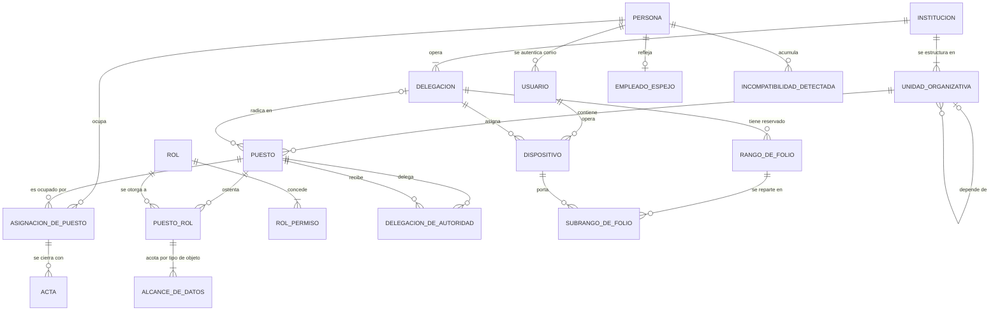
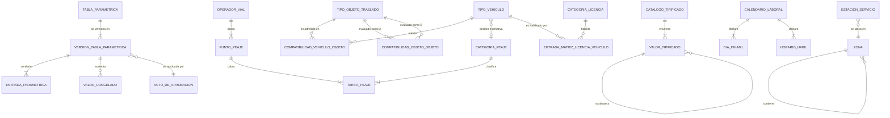
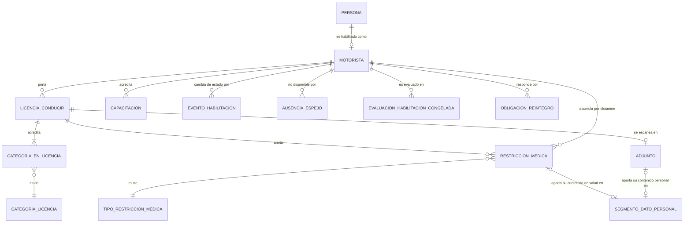
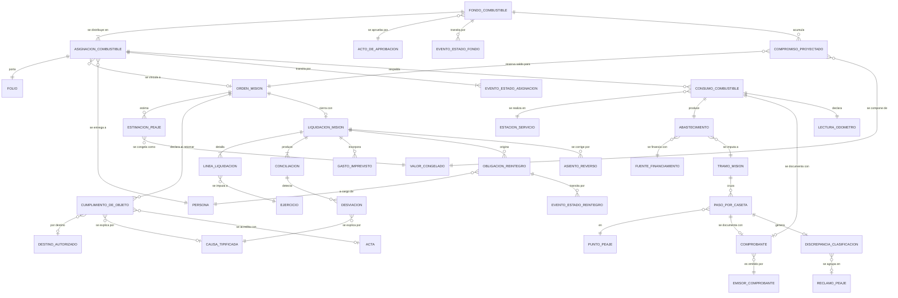
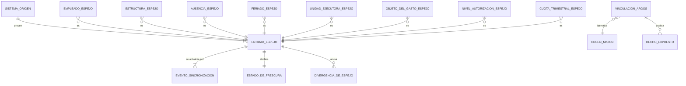

# Modelo conceptual de datos — SIGTI

**Bloque 4 del Sprint 0.** Modelo **conceptual y lógico agnóstico**: entidades, relaciones y cardinalidades. **Sin tipos físicos, sin índices, sin DDL, sin motor de base de datos** — [`ADR-000`](../adr/ADR-000-diferir-seleccion-de-stack.md) difiere el stack al Sprint 2 y este documento no lo anticipa.

Documento hermano: [`diccionario-de-datos.md`](diccionario-de-datos.md), con el detalle campo por campo de las entidades núcleo.

**Revisión aplicada.** Este documento incorpora las correcciones de los hallazgos `HB34-50` a `HB34-64` de [`H-B34-002`](../../05-calidad/hallazgos/H-B34-002-revision-arquitectura-bloque-4.md). Cada corrección lleva su nota visible en el punto donde se aplicó.

| Hallazgo | Qué se corrigió | Dónde |
|---|---|---|
| `HB34-50` | Segundo eje de tiempo en `version_tabla_parametrica` | §1 `M-01`, `D-13`, diccionario §12 |
| `HB34-51` | Alcance, momento y orden del encadenamiento de la cadena de auditoría | §1 `M-02`, §12, `D-14`, diccionario §13 |
| `HB34-52` | `subrango_de_folio` por dispositivo | §1 `M-03`, V1, V8, §12, `D-15`, diccionario §14 |
| `HB34-53` | `adjunto` clasificado y depurable; `segmento_dato_personal` polimórfico | §1 `M-02`, V4, V6, V8, `D-16`, `D-17`, diccionario §13 y §19 |
| `HB34-54` | Eliminada `OBJETO_DEL_TRASLADO — PERSONA` de la Vista 5 | §7 |
| `HB34-55` | Seis cardinalidades mínimas bajadas a `o{` | V3, V5, §12, `D-20` |
| `HB34-56` | Origen polimórfico de `reserva_recurso` | §7, §12, `D-10` |
| `HB34-57` | `orden_mision.id_folio` eliminado | diccionario §1 |
| `HB34-58` | `transicion_orden_mision — asiento_auditoria` pasa a `1 : 1` | §7, §12, `D-12` |
| `HB34-59` | Congelamiento en dos momentos, con concepto distinto | §7, `D-18`, diccionario §12 |
| `HB34-60` | Solicitante de derecho en `solicitud_transporte` | §7, §12, diccionario §20 |
| `HB34-61` | Cuatro entidades nuevas y dos campos para reglas sin soporte | §7, §9, §10, diccionario §15 y §21 a §24 |
| `HB34-62` | `acta` con dueño polimórfico; `acta_cierre_asignacion` fusionada | V1, V6, §12, `D-19` |
| `HB34-63` | Resumen de entidades por módulo completado: 167 de 167 | diccionario §25 |
| `HB34-64` | `[C]` marcados como registrados o **por registrar**; §16 reescrito | §15, §16 |

---

## 0. Cómo leer este documento

### 0.1 Precedencia

Este modelo **no es autoridad** sobre transiciones de estado ni sobre actores. Cuando el modelo y esos documentos difieran, mandan ellos ([CLAUDE.md, precedencia entre artefactos](../../../CLAUDE.md)):

| Materia | Autoridad | Qué hace este modelo |
|---|---|---|
| Estados, precondiciones, invariantes | [`estados/orden-de-mision.md`](../estados/orden-de-mision.md) | Los materializa como datos |
| Actores, competencia, alcance de datos | [`actores-y-roles.md`](../../01-negocio/actores-y-roles.md) | Materializa persona ≠ puesto ≠ rol |
| Reglas de negocio | `RN-xx` | Cada entidad cita las que la condicionan |
| Fronteras entre sistemas | [`ADR-001`](../adr/ADR-001-integracion-argos-talento-humano.md) | Marca qué es propio y qué es espejo |

### 0.2 Convenciones de nombre

- **Español, del [glosario](../../00-vision/glosario.md).** `orden_mision`, nunca `mission_order`. Si un nombre de entidad no está en el glosario, o entra al glosario o no se usa.
- `snake_case` para entidades y campos. En los diagramas Mermaid van en mayúsculas por convención de `erDiagram`; es el mismo nombre.
- Sufijos con significado fijo, para que el nombre diga de qué clase de dato se trata:

| Sufijo o prefijo | Significa | Ejemplo |
|---|---|---|
| `evento_` | Hecho puntual e inmutable, con su propia fecha del hecho | `evento_bitacora` |
| `asiento_` | Registro append-only de la cadena de auditoría | `asiento_auditoria` |
| `version_` | Instancia de un dato versionado por rango de vigencia | `version_tabla_parametrica` |
| `_congelado` | Valor resuelto y fijado en un acto de autorización | `valor_congelado` |
| `_espejo` | Dato propiedad de otro sistema, de **solo lectura** | `empleado_espejo` |
| `asignacion_`, `historial_` | Relación con rango de vigencia, nunca sobrescrita | `asignacion_de_placa` |

### 0.3 Qué NO aparece en este modelo, deliberadamente

| Ausente | Por qué |
|---|---|
| Campo `estado` como columna editable de `orden_mision` | El estado **se deriva del diario de transiciones** (principio `P-1` de la máquina de estados). Ver decisión `D-03` |
| Entidades de viáticos | Retiradas. Son de ARGOS — [`DP-001`](../../07-gestion/decisiones-de-producto/DP-001-fronteras-con-sistemas-existentes.md) |
| Cualquier tarifa, feriado, umbral o plazo como atributo constante | `RN-39`: todo parámetro normativo es dato con vigencia |
| Campo `borrado` o `activo` como mecanismo de baja | `RN-04`: nada se borra; se cierra vigencia o se asienta un reverso |
| `placa` como identificador del vehículo | `RN-15`, `RN-64`. Ver decisión `D-05` |

---

## 1. Los seis invariantes estructurales

Seis propiedades que **no se pueden agregar después**. Cada una se resuelve con estructura, no con procedimiento.

### `M-01` — Temporalidad: todo parámetro normativo es dato con vigencia

`RN-39`, `RN-40`, `RN-41`, `RN-42`, `RNF-05`.

Tres entidades resuelven **todo** el problema, para todo parámetro presente y futuro:

```
tabla_parametrica  ──<  version_tabla_parametrica  ──<  entrada_parametrica
                                   ^
                                   │ referenciada por identificador de version
                          valor_congelado   (el resultado autorizado)
```

- `tabla_parametrica` — el **qué**: tarifas de peaje, matriz licencia↔vehículo, calendario de días inhábiles, horario hábil, umbrales de desviación, matriz de compatibilidad, categorías de peaje, plazos. Es un registro por tabla, no un módulo de código.
- `version_tabla_parametrica` — el **desde cuándo**, en **dos ejes de tiempo**: `vigencia` (tiempo del hecho) y `conocido_desde` / `conocido_hasta` (tiempo del sistema). Más el acto que la aprueba, fuente, fecha de verificación, autor y aprobador (doble control, `actores-y-roles.md` §4.3). **Coexisten la versión anterior y la nueva.** El sistema impide solape y hueco **dentro de cada eje** al cargar, no los detecta después (`RNF-05`).
- `entrada_parametrica` — las filas de esa versión.
- `valor_congelado` — el resultado del cálculo **más el identificador de la versión que lo produjo**, más los valores unitarios que lo componen y la fecha del hecho con que se resolvió (`RN-41`).

#### Los dos ejes de tiempo

> **Corrección — hallazgo `HB34-50`.** El modelo declaraba **un solo eje** (`vigencia`) para un requisito que pide dos. `RNF-05` nombra el segundo con todas sus letras: *«¿qué sabía el sistema sobre esa tarifa el día que se emitió el reporte?»*. Sin él, una tarifa corregida retroactivamente en 2027 cambia el resultado —y con él el hash— de un reporte de 2026 **regenerado con su misma fecha de corte**, que es exactamente el cero que exige `RNF-06`.

| Eje | Campo en `version_tabla_parametrica` | Qué responde |
|---|---|---|
| **Tiempo del hecho** | `vigencia` (inicio / fin) | ¿Qué tarifa estaba vigente el día que el vehículo cruzó la caseta? |
| **Tiempo del sistema** | `conocido_desde` / `conocido_hasta` | ¿Qué sabía el sistema sobre esa tarifa el día que se emitió el reporte? |

**Toda resolución paramétrica se hace con dos fechas**: la **fecha del hecho** (`RN-40`) y la **fecha de corte de conocimiento**. El corte por defecto es *ahora*; un reporte reproducible toma el suyo de `fecha_corte_conocimiento` (`RN-94`, `RNF-06`).

Una corrección retroactiva **no modifica la versión errónea**: le cierra `conocido_hasta` e inserta una versión nueva con la **misma `vigencia`** y `conocido_desde` = fecha de la corrección. Las dos coexisten y ninguna pisa a la otra. El reporte del primer trimestre de 2026 con corte al 30 de abril de 2026 sigue resolviendo contra la versión que el sistema conocía ese día, aunque la corregida se haya cargado en 2027; el mismo reporte con corte *hoy* muestra la corregida y **declara su corte**. La diferencia entre ambos es el `asiento_de_diferencia` de `RN-42`, no una discrepancia inexplicada.

**Por qué no se puede agregar después.** La fecha en que se cargó cada versión se pierde en el momento en que se carga. Un sistema que arranca unitemporal **no puede reconstruir su propio pasado de conocimiento**.

**Comprobación.** Cambiar el reglamento mañana es insertar una `version_tabla_parametrica` nueva. **Cero migración de datos históricos, cero despliegue de versión.** Si alguna vez la respuesta a "cambió la norma" es "hay que migrar", ese parámetro se modeló como atributo en lugar de como entrada paramétrica, y eso es un defecto del modelo.

### `M-02` — Bitácora append-only que encadena referencia y huella, no contenido

`RN-04`, `RNF-04` contra `RNF-17`.

Es la tensión que el índice de `RNF` declara irrecuperable si se decide tarde. Se resuelve partiendo el asiento en dos entidades con plazos de retención distintos:

| Entidad | Contiene | Retención |
|---|---|---|
| `asiento_auditoria` | Quién (persona **y puesto congelados**), qué, cuándo (tres marcas), desde dónde, valor anterior y nuevo **de los campos no personales**, hash propio, hash del anterior | Plazo de prescripción. `[C]` insumo #71 |
| `segmento_dato_personal` | El contenido personal en claro **y su sal de huella** | Plazo más corto. `[C]` insumo #71 |

El asiento guarda del dato personal únicamente **`referencia_segmento` + `huella_segmento`**. La huella se calcula con una sal que vive **dentro del segmento**. Al depurar se elimina el segmento con su sal: la huella queda íntegra —la cadena sigue verificando— y **deja de ser invertible**, porque sin la sal un número de documento, que es un dominio pequeño y enumerable, se reconstruiría por fuerza bruta en minutos. Guardar la huella sin sal habría sido cumplir `RNF-17` en la forma y violarlo en el fondo.

La depuración **no es un borrado**: es `evento_depuracion`, un asiento nuevo que declara alcance, plazo aplicado, autoridad y conteo de lo depurado (`RNF-17`).

#### Alcance, momento y orden del encadenamiento

> **Corrección — hallazgo `HB34-51`.** La única definición de alcance que existía era «encadenamiento por misión», en la tabla del §12, y con ella **borrar íntegra una misión no rompe ninguna cadena**: solo desaparece una cadena entera. Además, los asientos de `ALTA`, `CONSULTA`, `DEPURACION` y `FUSION` no pertenecen a ninguna misión, y todos habrían sido «primeros de cadena». Lo que sigue **sustituye** a aquella definición, que queda derogada aquí y en el §12.

| Cadena | Alcance | Quién fija el enlace | Criterio de orden |
|---|---|---|---|
| **Cadena global de la instancia** | **Todos** los asientos de la institución, sin distinción de misión, entidad ni módulo | **El servidor**, al integrar | `recibido_en`, con desempate determinista por (`id_dispositivo`, `secuencia_dispositivo`, `id_asiento`) |
| **Subcadena por dispositivo** | Los asientos nacidos en un dispositivo desconectado, desde su último empalme | **El propio dispositivo**, al escribir | `secuencia_dispositivo`, monotónica |

**Empalme.** Un dispositivo con nueve días sin red **no puede** conocer la huella del último asiento global: encadena en su subcadena y el servidor, al integrar, la **empalma al final de la cadena global sin reordenar ni reescribir lo ya sellado** (`RNF-04`). Por eso `id_asiento_anterior` y `huella_anterior` de la cadena global son **derivados (`Dv.`), asignados por el servidor**, y no capturados en el origen; los de la subcadena sí los pone el dispositivo.

**El criterio de orden del encadenamiento es distinto del criterio de aplicación de las transiciones.** Las transiciones se aplican por `secuencia_dispositivo` (máquina de estados §6.2); los asientos se encadenan por `recibido_en`. Confundirlos produce una cadena que se reordena cada vez que llega un dispositivo atrasado — y una cadena que se reordena no prueba nada.

**Nada queda fuera.** El alta de un vehículo, la carga de una `version_tabla_parametrica`, la consulta a un manifiesto (`RN-52`), la depuración y la fusión pertenecen a la cadena global igual que una transición de misión. **Solo el primer asiento de la instancia** tiene `id_asiento_anterior` nulo. Es lo que hace verificable la batería de `RNF-04`: detectar la eliminación de un asiento intermedio sobre una cadena de 4,000,000, con identificación del punto exacto de ruptura.

#### El dato personal también vive en los adjuntos

> **Corrección — hallazgo `HB34-53`.** `RNF-17` fija el umbral sin margen: *«datos personales que sobrevivan la depuración en respaldos, **adjuntos**, registros técnicos o dispositivos de campo: **0**»*. `adjunto` no tenía ni clasificación de contenido ni relación con `segmento_dato_personal`: la fotografía del original digitado —obligatoria por `RN-47`— conservaba nombres y números de identidad manuscritos **después** de la depuración. Y el segmento solo colgaba de `linea_manifiesto`.

Dos cambios estructurales:

1. **`adjunto` clasifica su contenido.** `clasificacion_de_contenido` ∈ `SIN_DATO_PERSONAL` · `CON_DATO_PERSONAL_ESTRUCTURADO` · `CON_DATO_PERSONAL_NO_ESTRUCTURADO` · `NO_CLASIFICADO`, y cuando lo contiene **referencia su `segmento_dato_personal`** con la misma indirección que `linea_manifiesto`. Al depurar, el archivo se sustituye por una **`constancia_de_depuracion`** que conserva la huella del original, su tipo, su tamaño y el `evento_depuracion` que lo alcanzó: el adjunto no desaparece del expediente, **deja de ser legible**. `NO_CLASIFICADO` **se trata como si contuviera dato personal** hasta que alguien lo clasifique — el valor por defecto no puede ser el permisivo.
2. **`segmento_dato_personal` es polimórfico.** Lleva `tipo_de_objeto_portador` + `id_objeto_portador` y cuelga de `linea_manifiesto`, `involucrado_en_incidente` (el tercero lesionado que no es empleado, `CE-03`), `restriccion_medica` (dato de salud del servidor, que exige `base_legal_del_campo`, `CE-10`), `firmante_acta` (quien suscribe sin ser de la institución) y `adjunto`. La ampliación de `RN-51` a terceros de siniestro y al dato de salud queda **materializada**, no solo declarada.

**Comprobación.** Depurar un año de manifiestos y volver a verificar la cadena completa debe dar cero rupturas, y el sello emitido antes de la depuración debe seguir siendo válido. Y la **fotografía del manifiesto digitado** debe quedar reemplazada por su constancia de depuración, no íntegra en el almacenamiento.

### `M-03` — Identidad generada en el cliente, folio consumido del rango

`RN-44`, `RNF-21`. **Son dos cosas distintas y el modelo las mantiene separadas:**

| | Identificador interno | Folio |
|---|---|---|
| Quién lo genera | El dispositivo, sin consultar al servidor | El dispositivo, **consumiendo de un `subrango_de_folio` propio**, tomado del rango pre-asignado a su delegación |
| Forma | Opaco, tipo UUID | Legible, correlativo, explicable, impreso |
| Unicidad | Global por construcción | Institucional, por tipo de documento |
| Reciclaje | No aplica | **Nunca**, ni el de un documento anulado |
| Huecos | No existen | Cada uno **explicado**: anulación, extravío con acta, o rango asignado y no consumido |

`folio` es **entidad propia, no un atributo del documento**: tiene estado (`RESERVADO`, `EMITIDO`, `ANULADO`, `EXTRAVIADO`), rango y subrango de origen, documento al que quedó adherido, y motivo de anulación. Por eso el reporte de control de folios de `RNF-21` existe sin construir nada encima.

#### El rango se reparte en dos niveles

> **Corrección — hallazgo `HB34-52`.** El rango estaba modelado **solo por delegación** —`DELEGACION ||--|{ RANGO_DE_FOLIO`, sin ninguna relación con `DISPOSITIVO`— mientras la prosa decía que lo porta el dispositivo. Cuatro dispositivos de la misma delegación —la tableta de la caseta, el equipo del encargado, el teléfono del motorista— con el mismo rango descargado y todos sin red toman **el mismo número siguiente**. `RNF-21` exige **0 folios duplicados a nivel institución**.

| Nivel | Entidad | A quién se asigna | Para qué |
|---|---|---|---|
| 1 | `rango_de_folio` | **Delegación** + tipo de documento | Que la delegación pueda emitir sin conectividad (`EF-02`) |
| 2 | `subrango_de_folio` | **Dispositivo**, dentro de un rango de su delegación | Que dos dispositivos de la **misma** delegación, ambos sin red, no colisionen |

Cada `subrango_de_folio` tiene su propio `desde`/`hasta` —**disjuntos entre sí dentro del rango**—, su propio saldo derivado, su propio `umbral_de_alerta` y su **devolución al reincorporarse**: lo no consumido vuelve al rango de la delegación con acta, y cada hueco queda explicado (`RNF-21`). Todo folio consumido en campo declara de qué subrango salió. La emisión en sede conectada puede consumir del rango sin subrango, y también lo declara.

**Nota para la batería de verificación de `RNF-21`.** La prueba vigente —*«cinco dispositivos, cada uno con el rango de una delegación distinta»*— está escrita para el caso fácil y **no cubre el que rompe**. Falta la prueba de **dos o más dispositivos de la misma delegación, todos desconectados, emitiendo el mismo tipo de documento**. `RNF-21` está fuera del alcance de este documento: queda como hallazgo abierto contra ese requisito.

### `M-04` — Fecha del hecho ≠ fecha de captura ≠ fecha de recepción

`RN-46`, `RN-40`, máquina de estados §6.4. **Toda entidad de hecho** —no las de catálogo— lleva el mismo bloque, sin excepción:

`ocurrido_en` · `capturado_en` · `recibido_en` · `zona_horaria` · `desfase_reloj_medido` · `modo_de_captura` · `secuencia_dispositivo` · `id_dispositivo`

`modo_de_captura` ∈ { `EN_LINEA`, `DESCONECTADA_SINCRONIZADA`, `DIGITACION_DIFERIDA_DE_PAPEL`, `CORRECCION_POSTERIOR` }.

En `DIGITACION_DIFERIDA_DE_PAPEL` se exigen además `digitado_por`, `id_adjunto_original` y `motivo_del_diferimiento` (`RN-47`). **El orden de los hechos lo define `secuencia_dispositivo`, nunca el reloj**: un reloj retrocede, un contador monotónico no.

### `M-05` — Persona ≠ puesto ≠ rol, y la autoría no se reasigna jamás

`RNF-15`, `actores-y-roles.md` §2. Los permisos cuelgan del **puesto**; la autoría se congela con **persona + puesto + rol ejercido + denominación del puesto al momento**, copiados como valor y no como referencia. Una reorganización que renombre o suprima el puesto **no puede** cambiar lo que dice un asiento de hace tres años.

### `M-06` — Dato propio contra dato espejo

`RN-48`, `RN-49`, [`ADR-001`](../adr/ADR-001-integracion-argos-talento-humano.md). Toda entidad espejo lleva `sincronizado_en`, `sistema_origen`, `version_origen` y `estado_de_frescura`, y **ninguna pantalla la edita**.

| Propio de SIGTI | Espejo, solo lectura |
|---|---|
| Vehículo y todo su expediente, motorista como recurso de flota, **licencia de conducir con categorías, vencimiento y restricciones médicas**, misiones, combustible, peajes, bitácora | Identidad del empleado, puesto y estructura, permisos, vacaciones e incapacidades, calendario de feriados, unidad ejecutora y objeto del gasto, niveles de autorización |

**La licencia es dato propio**, corrección explícita de [`ADR-001`](../adr/ADR-001-integracion-argos-talento-humano.md): el bloqueo duro de `RN-09` no se puede sostener sobre un espejo que quizá no traiga la categoría. `[C]` insumo #17.

---

## 2. Mapa de vistas

El modelo completo no cabe en un diagrama legible. Se presenta en nueve vistas.

| Vista | Módulos | Contenido |
|---|---|---|
| [V1](#3-vista-1--organizacion-personas-y-competencia) | M-01 | Institución, dependencias, delegaciones, persona, puesto, rol, usuario, dispositivo |
| [V2](#4-vista-2--temporalidad-normativa-y-catalogos) | M-02 | Tablas paramétricas, versiones, entradas, catálogos tipificados |
| [V3](#5-vista-3--expediente-del-vehiculo) | M-03, M-04, M-11 | Vehículo, ficha técnica, tenencia, placa, custodia, estado operativo, odómetro |
| [V4](#6-vista-4--motorista-y-habilitacion) | M-05 | Motorista, licencia, categorías, restricciones médicas, disponibilidad |
| [V5](#7-vista-5--solicitud-orden-de-mision-y-alcance-autorizado) | M-06, M-07 | Solicitud, objeto del traslado, Orden de Misión, versión de alcance, tramos, transiciones |
| [V6](#8-vista-6--ejecucion-bitacora-y-personas-externas) | M-08, M-12, M-17, M-19 | Eventos de bitácora, actas, manifiestos, incidentes, estado en ruta |
| [V7](#9-vista-7--combustible-peajes-y-liquidacion) | M-09, M-18, M-13 | Fondo, asignaciones, consumos, peajes, liquidación, conciliación |
| [V8](#10-vista-8--auditoria-folios-documentos-y-sincronizacion) | M-14, M-15, M-16 | Asientos, sellos, datos personales, folios, documentos, conflictos |
| [V9](#11-vista-9--espejo-e-integracion) | M-20 | Entidades espejo y su frescura |

---

## 3. Vista 1 — Organización, personas y competencia

**Módulo M-01.** Materializa `M-05`: los permisos son del puesto, la autoría es de la persona y del puesto congelados.



**Lo que esta vista decide:**

- `PUESTO` **existe aunque esté vacante**. Los actos pendientes quedan atribuidos al puesto, no a la persona que se fue (`actores-y-roles.md` §2.4).
- `ALCANCE_DE_DATOS` cuelga de `PUESTO_ROL` y **se acota por tipo de objeto**, no globalmente: el mismo puesto puede tener alcance `DEPENDENCIA` sobre misiones e `INSTITUCION` sobre vehículos (§3.3). Un solo campo `alcance` en el rol habría hecho imposible a `ACT-11` ver un vehículo de otra dependencia entrando a taller.
- `INCOMPATIBILIDAD_DETECTADA` se evalúa **sobre la persona**, nunca sobre el puesto (`RN-01`), porque una persona con dos puestos acumula facultades incompatibles sin que ningún puesto por sí solo lo sea.
- `DISPOSITIVO` es entidad de primera clase: es el emisor de `secuencia_dispositivo`, **el portador de un `subrango_de_folio`** y el sujeto del `desfase_reloj_medido`.
- **`RANGO_DE_FOLIO` es de la delegación; `SUBRANGO_DE_FOLIO` es del dispositivo** (`HB34-52`, §1 `M-03`). La delegación puede tener cero rangos vigentes de un tipo de documento —es un estado operable, con emisión bloqueada y alerta—, y por eso la cardinalidad es `o{` y no `|{`.
- **`ACTA` es una sola entidad con dueño polimórfico** (`HB34-62`, decisión `D-19`). El cierre de una asignación de puesto ya no tiene entidad propia: es un `acta` con su `tipo_acta`, igual que el acta de custodia, la de traspaso en ruta o la de devolución de fondo. `ACTA_CIERRE_ASIGNACION` queda **suprimida**; el concepto no se duplica.

---

## 4. Vista 2 — Temporalidad normativa y catálogos

**Módulo M-02.** Materializa `M-01`. Es la vista más pequeña y la que más rescata al proyecto de una migración futura.



**Lo que esta vista decide:**

- `COMPATIBILIDAD_VEHICULO_OBJETO` y `COMPATIBILIDAD_OBJETO_OBJETO` son **entradas paramétricas versionadas**, no atributos del tipo de vehículo. `RN-67` exige además que **la ausencia de entrada bloquee**: modelarlo como matriz explícita permite distinguir "declarado incompatible" de "no declarado", que es la distinción que un atributo booleano perdería.
- `ENTRADA_MATRIZ_LICENCIA_VEHICULO` se resuelve por `tipo_vehiculo` + rangos de **peso bruto vehicular**, **capacidad de pasajeros** y **condición de articulado** (`RN-09`), nunca por nombre comercial.
- `TIPO_VEHICULO` declara una `CATEGORIA_PEAJE` **estimativa** para la estimación previa de `T-02`, cuando todavía no hay unidad asignada (`RN-33`, segunda derivación). El estimado producido con ella queda marcado como estimativo.
- `VALOR_TIPIFICADO` con relación reflexiva `sustituye a`: cuando la institución renombra un motivo tipificado, **el valor viejo no se edita**, se marca sustituido. Los registros históricos siguen apuntando al valor con que se capturaron.
- `TARIFA_PEAJE` lleva `fuente` y `fecha_de_verificacion`, y el sistema alerta a los 12 meses sin revisar (`RN-34`).

---

## 5. Vista 3 — Expediente del vehículo

**Módulos M-03, M-04, M-11.** La entidad que la frase del producto pone al centro: *SIGTI cuida de todo lo referente a los vehículos*. **No es un catálogo.**


**Lo que esta vista decide:**

- **`correlativo_institucional` es la identidad operativa** y es obligatorio y único en la institución (`RN-15`). `ASIGNACION_DE_PLACA` es un **historial con rango de vigencia** y `HISTORIAL_ESTADO_PLACA` es otro, separado y tipificado (`RN-64`): el número asignado en el registro y la existencia de la lámina metálica son dos hechos distintos que en Honduras no coinciden.
- `VERSION_FICHA_TECNICA` está versionada porque **la ficha cambia**: un cambio de motor, una reclasificación de peso bruto o una modificación de carrocería alteran la categoría de licencia exigible y la categoría de peaje. Sin versión, un cambio de ficha reescribiría retroactivamente la habilitación de misiones ya cerradas.
- **`KILOMETRAJE_ACUMULADO` es atributo derivado del expediente y no decrece nunca** (`RN-89`). Las lecturas cuelgan de una `SERIE_INSTRUMENTO_MEDICION` con unidad declarada y vigencia; reemplazar el tablero cierra la serie y abre otra. Sin esta separación, cada odómetro reemplazado corrompe el histórico y el plan de mantenimiento preventivo pasa a calcularse sobre un número falso.
- `ASIGNACION_CATEGORIA_PEAJE` es una **asignación con vigencia y fundamento registrado** — quién la asignó y con qué criterio —, no una derivación calculada al vuelo (`RN-33`). Un liviano y un "vehículo de 2 ejes" tienen ambos dos ejes y pagan tarifas muy distintas: si la categoría se derivara al momento de consultar, el histórico cambiaría cada vez que se afinara la fórmula.
- `TITULO_DE_TENENCIA` con `RUBRO_ASUMIDO` responde quién paga combustible, mantenimiento, seguro, peajes, multas y daños (`RN-62`). De su `regimen` depende cuál de los dos terminales aplica: `DADO_DE_BAJA` solo para bien propio, `RETIRADO_DE_FLOTA` para bien ajeno. **Declarar dado de baja un comodato es un asiento falso** y el modelo lo impide por invariante, no por pantalla.
- `DOCUMENTO_VEHICULAR` es **opcional en cardinalidad**: póliza de seguro y revisión mecánica no son obligatorias por ley vigente (`RN-16`), y el bloqueo por su ausencia es parámetro configurable **apagado por defecto**, con valor distinto admisible por régimen de tenencia.
- `EVENTO_ESTADO_OPERATIVO` es un **diario**, igual que las transiciones de la misión: el estado actual del vehículo se deriva del último evento aplicable. Cada evento cita su código `W-nn` y su causa tipificada — `NO_DISPONIBLE` sin causa tipificada es el cementerio donde se esconde la flota que nadie repara.
- **Ningún mínimo obligatorio bloquea el alta del expediente** (`HB34-55`). `CUSTODIA_VEHICULO`, `ASIGNACION_CATEGORIA_PEAJE` y `SERIE_INSTRUMENTO_MEDICION` bajaron de `|{` a `o{`, porque el ciclo de vida garantiza cero en casos legítimos: la máquina de estados §10.2 tipifica *«sin custodio»* como causa válida de `NO_DISPONIBLE`; `HU-024` sitúa la categoría de peaje resuelta como requisito **para programar**, no para dar de alta; y un vehículo recibido con el odómetro inutilizado (`CE-22`) no tiene serie con `lectura_inicial_de_serie` conocida. La obligatoriedad vive donde le corresponde: como precondición de `BD-07` al programar, no como restricción de integridad al insertar. Un mínimo mal puesto bloquea el alta, y el usuario lo resuelve **inventando el dato** — la serie de odómetro falsa, el custodio que no existe—, que es la corrupción que este modelo entero intenta evitar.
- `IMPUTACION_EXTERNA` (multa, línea de estado de cuenta, reclamo de seguro) **no se ancla a la placa**: se resuelve por la jerarquía configurable de `RN-66`, con la placa en último lugar y resuelta **a la fecha del hecho** contra el historial. Lo que no se resuelve queda `NO_RESUELTA` con responsable y plazo; nunca se asigna por parecido.

---

## 6. Vista 4 — Motorista y habilitación

**Módulo M-05.** Aquí vive la corrección de [`ADR-001`](../adr/ADR-001-integracion-argos-talento-humano.md): **la licencia es dato propio de SIGTI**.



**Lo que esta vista decide:**

- **Un motorista tiene varias categorías a la vez.** `CATEGORIA_EN_LICENCIA` es la entidad asociativa con **vigencia propia por categoría**, porque una categoría puede vencer o suspenderse sin que caiga toda la licencia. Modelarla como lista de etiquetas dentro de la licencia habría hecho imposible responder "¿estaba habilitado para C1 el 14 de marzo?".
- `EVALUACION_HABILITACION_CONGELADA` guarda el resultado de `RN-09` y `RN-11` **con sus insumos**: número de licencia consultado, categorías vigentes usadas, fecha de vencimiento leída, versión de la matriz aplicada, atributos del vehículo usados y antigüedad del espejo de Talento Humano en ese momento. La razón es legal y está en la máquina de estados §9.2: el día del siniestro, un "sí, verificado" no defiende a nadie; el detalle de contra qué se verificó, sí.
- `AUSENCIA_ESPEJO` (permiso, vacaciones, incapacidad) es **espejo de Talento Humano**, con su `estado_de_frescura`. `RN-50` degrada explícitamente cuando la sincronización lleva detenida más del umbral, en lugar de asumir disponibilidad.
- `RESTRICCION_MEDICA` cuelga de la licencia **y también del motorista**: hay restricciones anotadas en el documento y otras que llegan por dictamen posterior sin reemisión de licencia (`RN-11`). Colgarla solo de la licencia habría perdido las segundas.
- **El contenido de salud de la restricción no vive en la restricción** (`HB34-53`, `CE-10`). La restricción guarda su tipo, su efecto —incompatibilizante o advertencia— y su vigencia; el diagnóstico, el dictamen y todo dato clínico van a `segmento_dato_personal` con `categoria_de_dato = SALUD` y `base_legal_del_campo` obligatoria. Es la única categoría que el propio segmento marca como exigente de base legal, y era la que estaba en claro. El escaneo de la licencia (`ADJUNTO`) sigue la misma indirección.

---

## 7. Vista 5 — Solicitud, Orden de Misión y alcance autorizado

**Módulos M-06 y M-07.** El núcleo. La Orden de Misión es la unidad de control administrativo-contable; **no es un viaje**.

```mermaid
erDiagram
    SOLICITUD_TRANSPORTE ||--|{ OBJETO_DEL_TRASLADO : "declara"
    SOLICITUD_TRANSPORTE ||--|{ DESTINO_SOLICITADO : "pide"
    SOLICITUD_TRANSPORTE }o--|| TIPO_VEHICULO : "requiere"
    SOLICITUD_TRANSPORTE }o--|| UNIDAD_ORGANIZATIVA : "es originada por"
    SOLICITUD_TRANSPORTE }o--|| MOTIVO_DE_VIAJE : "se funda en"
    SOLICITUD_TRANSPORTE }o--|| PERSONA : "se pide a nombre de"
    SOLICITUD_TRANSPORTE |o--o| ORDEN_MISION : "se convierte en"

    ORDEN_MISION ||--o{ VERSION_ALCANCE_AUTORIZADO : "se autoriza por"
    VERSION_ALCANCE_AUTORIZADO ||--|{ DESTINO_AUTORIZADO : "comprende"
    VERSION_ALCANCE_AUTORIZADO ||--o{ VALOR_CONGELADO : "congela indicativo al autorizar"
    VERSION_ALCANCE_AUTORIZADO }o--|| ACTO_DE_AUTORIZACION : "se sustenta en"
    ORDEN_MISION ||--o{ VALOR_CONGELADO : "congela vinculante al despachar"
    TRAMO_MISION ||--o{ VALOR_CONGELADO : "recongela por sustitucion"

    ORDEN_MISION ||--o{ TRAMO_MISION : "se ejecuta en"
    TRAMO_MISION }o--|| VEHICULO : "usa"
    TRAMO_MISION }o--|| MOTORISTA : "es conducido por"
    TRAMO_MISION ||--o| ACTA : "se delimita por el acta de traspaso"
    TRAMO_MISION ||--|{ OBJETO_EN_TRAMO : "configura"
    OBJETO_DEL_TRASLADO ||--o{ OBJETO_EN_TRAMO : "va en"
    OBJETO_EN_TRAMO ||--o| CONSTATACION_AL_DESPACHAR : "se constata en"

    ORDEN_MISION ||--|{ TRANSICION_ORDEN_MISION : "se mueve por"
    TRANSICION_ORDEN_MISION ||--o{ RESULTADO_VERIFICACION : "registra"
    TRANSICION_ORDEN_MISION ||--|| ASIENTO_AUDITORIA : "produce"
    TRANSICION_ORDEN_MISION |o--o| CODIGO_AUTORIZACION_FUERA_DE_LINEA : "usa"

    RESERVA_RECURSO }o--o| ORDEN_MISION : "puede originarse en"
    RESERVA_RECURSO }o--o| PRESTAMO_VEHICULO : "puede originarse en"
    RESERVA_RECURSO }o--o| EVENTO_ESTADO_OPERATIVO : "puede originarse en"
    RESERVA_RECURSO }o--o| ORDEN_TRABAJO : "puede originarse en"
    RESERVA_RECURSO }o--o| VEHICULO : "sobre"
    RESERVA_RECURSO }o--o| MOTORISTA : "sobre"

    CONFLICTO_DE_RECURSO ||--|{ SOLICITUD_DESPLAZADA : "deja constancia de"
    CONFLICTO_DE_RECURSO ||--o| ADJUDICACION_DE_RECURSO : "se resuelve por"
    CONFLICTO_DE_RECURSO }o--o| RESERVA_RECURSO : "disputa"
    SOLICITUD_DESPLAZADA }o--|| SOLICITUD_TRANSPORTE : "desplaza a"

    ORDEN_MISION ||--o| EXPEDIENTE_CONVALIDACION : "se convalida con"
    ORDEN_MISION ||--o{ PERMISO_CIRCULACION_INHABIL : "requiere"
    ORDEN_MISION ||--o{ DOCUMENTO_EMITIDO : "emite"
    ORDEN_MISION }o--o| VINCULACION_ARGOS : "expone a"
    ORDEN_MISION ||--o{ HALLAZGO_DE_CIERRE : "cierra con"

    OBJETO_DEL_TRASLADO }o--|| TIPO_OBJETO_TRASLADO : "se tipifica como"
    OBJETO_DEL_TRASLADO |o--o| MANIFIESTO_PERSONA_EXTERNA : "detalla en"
    OBJETO_DEL_TRASLADO |o--o| INVENTARIO_DE_CARGA : "detalla en"
```



**Lo que esta vista decide:**

- **`OBJETO_DEL_TRASLADO` es supertipo con tres subtipos** —personal institucional, persona externa, carga— y una misión puede tener varios a la vez. Esto es lo que hace que el modelo soporte los tres casos sin forzar ninguno: no hay campo `cantidad_pasajeros` en la orden. `OBJETO_EN_TRAMO` existe porque `RN-68` evalúa compatibilidad y capacidad **por tramo, sobre la configuración real de cada tramo**, no sobre la misión completa.
- **`VERSION_ALCANCE_AUTORIZADO` es la entidad que evita el hallazgo falso.** Cada extensión —más días, más destinos, más kilómetros, mayor costo— produce una versión con su autorizador y su vigencia (`RN-77`). La coherencia de casetas, el kilometraje y la ruta se validan contra **la versión vigente a la fecha de cada hecho**: un paso amparado por una extensión autorizada no es desviación. Un modelo con ventana única en la orden habría marcado como hallazgo cada prórroga legítima.
- **El paquete normativo se congela dos veces, y las dos quedan** (`HB34-59`, decisión `D-18`). Al **autorizar** (`T-05`) se congela la **estimación indicativa** que `RN-35` exige para poder decidir, colgada de la `version_alcance_autorizado`. Al **despachar** (`T-12`) se congela el **paquete vinculante** de `EF-03` —tarifas, categoría de peaje, calendario, matriz licencia↔vehículo, rendimiento esperado, umbrales, holguras y plazos—, colgado de la **orden**, y es el que lleva impreso el papel que el motorista discute en la caseta (`RN-91`). Son `valor_congelado` con `concepto` distinto y **ninguno pisa al otro**. La sustitución de vehículo (`RN-61`) recongela sobre el **tramo**, con asiento de diferencia, sin tocar el alcance autorizado. **Autoridad del momento vinculante: `EF-03` de la máquina de estados.**
- **`TRAMO_MISION` es donde se imputa todo**, no la orden (`RN-72`). Kilometraje, combustible, peajes e indicadores de conducción se imputan por tramo, delimitados por el odómetro del acta de traspaso. Modelar `orden_mision → vehiculo` como relación directa habría hecho imposible conciliar el rendimiento cuando hubo sustitución en ruta, que es exactamente cuando más importa.
- **No hay campo `estado` editable.** `TRANSICION_ORDEN_MISION` es el diario append-only; el estado es la proyección de aplicarlo. `RESULTADO_VERIFICACION` guarda por transición el resultado de cada bloqueo duro `BD-nn` **con los datos concretos usados**.
- **`RESERVA_RECURSO` tiene origen polimórfico** (`HB34-56`, decisión `D-10`): `tipo_de_origen` ∈ {`MISION`, `PRESTAMO`, `INDISPONIBILIDAD`, `MANTENIMIENTO`} más `id_origen`. Colgarla obligatoriamente de la Orden de Misión hacía **imposible de escribir** la reserva de un préstamo, que `RN-63` declara expresamente que *«nunca es una Orden de Misión»*: el pickup prestado diez días a otra dependencia dejaba de ocupar ventana, y `RN-13` volvía a permitir programarlo — que es justo lo que `CE-14` obligó a corregir. Tiene ventana con holgura previa y posterior configurable (`RN-13`, `RN-60`).
- **La identificación de personas trasladadas no está en `OBJETO_DEL_TRASLADO`**: está en `MANIFIESTO_PERSONA_EXTERNA`, cuyo contenido personal vive en `segmento_dato_personal` (V8). `RN-51` exige que el dato de gestión —vehículo, ruta, costo, unidad ejecutora— pueda exportarse sin el dato personal, y eso solo se logra si están estructuralmente separados desde el principio. **El diagrama contenía `OBJETO_DEL_TRASLADO |o--o{ PERSONA`, que era exactamente el camino directo que esta nota prohíbe** (`HB34-54`): se eliminó. El personal institucional trasladado se resuelve por `objeto_en_tramo` y por el subtipo `PERSONAL_INSTITUCIONAL`, nunca por una relación del supertipo a `persona`.
- **`SOLICITUD_TRANSPORTE` guarda al solicitante de derecho** (`HB34-60`). `BD-01`, tras el hallazgo `HB3-01`, compara al autorizador contra **tres** personas: quien creó, quien envió y **la persona a cuyo nombre se solicita la movilización**. Ninguna entidad guardaba la tercera, y el bloqueo duro más cotidiano del sistema —la asistente captura, el jefe autoriza— no era implementable. `id_persona_solicitante_de_derecho` es obligatorio e igual al capturador cuando no hay encargo.
- **Los mínimos obligatorios que el ciclo de vida no puede satisfacer bajaron a `o{`** (`HB34-55`). Una orden en `BORRADOR` no tiene tramo ni versión de alcance, y una `RECHAZADA` (`T-06`) o `ANULADA` antes de programar no los tendrá **nunca**; `T-01` no evalúa ningún `BD-nn`; una misión urbana sin peajes no congela ningún valor. La obligatoriedad vive donde la máquina de estados ya la puso: `T-05` para la primera versión de alcance, `T-08` y `BD-07` para el tramo. **Autoridad: [`estados/orden-de-mision.md`](../estados/orden-de-mision.md).**
- **Cada transición produce exactamente un asiento de auditoría** (`HB34-58`). El diagrama declaraba `TRANSICION_ORDEN_MISION }o--|| ASIENTO_AUDITORIA`, que se lee «N transiciones se atribuyen a 1 asiento» y admitiría una cobertura del 5 %. `RNF-04` exige **100 %**: ninguna operación de negocio escribe sin dejar asiento. La relación es `||--||`.
- **`CONFLICTO_DE_RECURSO` con sus solicitudes desplazadas** (`HB34-61`, `RN-56`, `RN-82`). `RN-13` impedía la doble asignación —la consecuencia—, pero nada registraba la disputa ni a quién se dejó sin recurso. `EF-01` dice que *«cada conflicto registrado, con su resolución, es la medición del déficit de flota»* y uno de los pocos indicadores llevables a una gestión presupuestaria con evidencia. Sin entidad, ese indicador no existe.
- **`EXPEDIENTE_CONVALIDACION`** (`HB34-61`, `RN-73`, `CE-01`, `HU-008`). `orden_mision.id_solicitud_transporte` nulo *«obliga a expediente de convalidación con cronología declarada»*, y ese expediente no era ninguna entidad. Guarda causal tipificada, quién ordenó verbalmente la movilización y por qué canal, quién convalida, el intervalo entre el hecho y la convalidación, el plazo vigente aplicado y la marca de extemporánea.
- **`CONSTATACION_AL_DESPACHAR`** (`HB34-61`, `RN-21` ampliada por `CE-18`). `objeto_del_traslado` solo tenía `peso_declarado` y `cantidad_personas`, ambos declarados. Lo **efectivo** se constata al despachar, cuelga de `objeto_en_tramo` —porque la capacidad se evalúa por tramo (`RN-68`)— y lleva su indicador de desviación contra lo declarado.

---

## 8. Vista 6 — Ejecución, bitácora y personas externas

**Módulos M-08, M-12, M-17, M-19.** Todo lo de esta vista se captura **sin conectividad** (`RN-43`).

```mermaid
erDiagram
    TRAMO_MISION ||--|{ EVENTO_BITACORA : "registra"
    EVENTO_BITACORA }o--|| TIPO_EVENTO_BITACORA : "se tipifica como"
    EVENTO_BITACORA ||--o{ ADJUNTO : "evidencia con"
    EVENTO_BITACORA }o--o| DESTINO_AUTORIZADO : "ocurre en"
    EVENTO_BITACORA ||--o| LECTURA_ODOMETRO : "toma"
    EVENTO_BITACORA ||--o| POSICION_REPORTADA : "informa"

    EVENTO_BITACORA |o--o| EVENTO_ARRIBO : "es"
    EVENTO_BITACORA |o--o| EVENTO_SALIDA_DE_SITIO : "es"
    EVENTO_BITACORA |o--o| EVENTO_ESPERA : "es"
    EVENTO_BITACORA |o--o| EVENTO_INTERRUPCION : "es"
    EVENTO_BITACORA |o--o| EVENTO_ENTREGA : "es"
    EVENTO_ESPERA }o--o| DEPENDENCIA_RESPONSABLE : "se atribuye a"
    EVENTO_INTERRUPCION ||--|| DESENLACE_INTERRUPCION : "exige"

    ACTA }o--|| TIPO_ACTA : "es de"
    ACTA ||--o{ FIRMANTE_ACTA : "es suscrita por"
    ACTA ||--o| FOLIO : "porta"
    ACTA }o--o| TRAMO_MISION : "puede colgar de"
    ACTA }o--o| ORDEN_MISION : "puede colgar de"
    ACTA }o--o| CUSTODIA_VEHICULO : "puede colgar de"
    ACTA }o--o| ASIGNACION_COMBUSTIBLE : "puede colgar de"
    ACTA }o--o| PRESTAMO_VEHICULO : "puede colgar de"
    ACTA }o--o| ASIGNACION_DE_PUESTO : "puede colgar de"
    ACTA }o--o| VEHICULO : "puede colgar de"
    ACTA }o--o| EJERCICIO : "puede colgar de"
    FIRMANTE_ACTA |o--o| SEGMENTO_DATO_PERSONAL : "aparta su identidad en"

    MANIFIESTO_PERSONA_EXTERNA ||--|{ LINEA_MANIFIESTO : "lista"
    LINEA_MANIFIESTO }o--|| SEGMENTO_DATO_PERSONAL : "referencia"
    MANIFIESTO_PERSONA_EXTERNA ||--o{ NOVEDAD_DE_MANIFIESTO : "se altera por"
    MANIFIESTO_PERSONA_EXTERNA ||--o{ REGISTRO_DE_CONSULTA : "es consultado en"

    INVENTARIO_DE_CARGA ||--|{ LINEA_INVENTARIO : "detalla"
    LINEA_INVENTARIO ||--o{ DIFERENCIA_DE_INVENTARIO : "presenta"
    DIFERENCIA_DE_INVENTARIO ||--|| EXPEDIENTE_INCIDENTE : "abre"

    EXPEDIENTE_INCIDENTE ||--o{ ADJUNTO : "documenta con"
    EXPEDIENTE_INCIDENTE }o--o| VEHICULO : "afecta a"
    EXPEDIENTE_INCIDENTE ||--o{ INVOLUCRADO_EN_INCIDENTE : "involucra"
    INVOLUCRADO_EN_INCIDENTE }o--o| PERSONA : "es servidor de la institucion"
    INVOLUCRADO_EN_INCIDENTE |o--o| SEGMENTO_DATO_PERSONAL : "aparta su identidad en"
    EXPEDIENTE_INCIDENTE ||--o{ EVENTO_ESTADO_INCIDENTE : "transita por"

    ADJUNTO |o--o| SEGMENTO_DATO_PERSONAL : "aparta su contenido personal en"
    ADJUNTO ||--o| CONSTANCIA_DE_DEPURACION : "se sustituye por"
```



**Lo que esta vista decide:**

- `EVENTO_BITACORA` es **un supertipo con subtipos por naturaleza**, no una tabla por tipo de evento. Razón: el cliente de campo debe poder registrar un evento nuevo —una espera improductiva, un paso por caseta— sin cambio de esquema, y la bitácora impresa (`RN-80`) debe tener **paridad exacta campo por campo** con la pantalla de digitación.
- **El tiempo en sitio se deriva** de los eventos de arribo y salida por destino (`RN-76`). No se le pide al motorista que lo cronometre ni que lo digite. Y **el sistema nunca infiere estado a partir de la ausencia de señal**: `POSICION_REPORTADA` siempre exhibe su antigüedad.
- `EVENTO_INTERRUPCION` marca la misión **sin cambiarle el estado** y exige `DESENLACE_INTERRUPCION` (`RN-70`). Un modelo que convirtiera la interrupción en estado habría creado un estado del que no se sabe salir.
- `LINEA_MANIFIESTO` **no contiene la identidad**: la referencia. Esa indirección es la que permite depurar a los cinco años sin romper la cadena ni alterar los conteos del reporte (`RNF-17`, `RN-51`).
- `REGISTRO_DE_CONSULTA` es obligatorio sobre manifiestos: **quién vio qué y cuándo** (`RN-52`). Es una entidad de escritura en una operación de lectura, y por eso hay que preverla en el modelo y no en la capa de aplicación.
- `EXPEDIENTE_INCIDENTE` **no captura atribución de responsabilidad en campo** (`RN-74`). El registro de campo describe el hecho; la responsabilidad se determina en el expediente, por otro actor y en otro momento.
- **`ACTA` tiene dueño polimórfico** (`HB34-62`, decisión `D-19`): `tipo_de_objeto` + `id_objeto`, exactamente como se resolvió `alcance_de_datos`. Colgada solo de `tramo_mision` y de `custodia_vehiculo`, **no cabían** el acta de devolución del fondo de `EF-06` —anulación de una misión despachada y no salida, donde todavía no hay tramo porque el tramo abre con `INICIO_DE_MISION`—, el acta de anulación de vale (`RN-04`, `PT-049`), las de préstamo y devolución (`RN-63`), la de descargo (`W-14`), la de devolución al comodante (`W-19`), la de constatación física (`PT-124`, `RN-18`) ni el acta de cierre de ejercicio (`RN-96`). `ACTA_CIERRE_ASIGNACION` se fusiona en `acta` con su `tipo_acta`; el `acta_traspaso` de `RN-71` es `acta` con `tipo_acta = TRASPASO_EN_RUTA`. **Un solo concepto, un solo folio, una sola cadena de firmantes.**
- **El tercero de un siniestro no es una `persona` del espejo** (`HB34-53`, `CE-03`). `EXPEDIENTE_INCIDENTE }o--o| PERSONA` obligaba a crear un registro de persona para un lesionado que no es empleado de la institución y que Talento Humano no conoce. `INVOLUCRADO_EN_INCIDENTE` declara la calidad del involucrado —servidor, tercero, peatón, propietario de otro vehículo—, apunta a `persona` **solo cuando lo es**, y en los demás casos aparta su identidad en `segmento_dato_personal`, con plazo de retención propio y depurable.
- **`ADJUNTO` clasifica su contenido y es alcanzable por la depuración** (`HB34-53`). Un adjunto con dato personal referencia su `segmento_dato_personal` y, al depurarse, se sustituye por una `CONSTANCIA_DE_DEPURACION` que conserva la huella del original. Sin esto, la fotografía del manifiesto digitado (`RN-47`, `PT-123`) conservaba los nombres manuscritos íntegros a los cinco años, y la depuración era cosmética justo donde el diseño se enorgullece de no serlo.

---

## 9. Vista 7 — Combustible, peajes y liquidación

**Módulos M-09, M-18, M-13.** Aquí está el dinero, y por eso aquí es donde el TSC mira primero.



**Lo que esta vista decide:**

- **`ABASTECIMIENTO` es distinto de `CONSUMO_COMBUSTIBLE`**, y esa separación es de `RN-83`. Todo ingreso de combustible al tanque es un abastecimiento, **cualquiera sea su fuente**: fondo de la misión, tanque institucional, otra dependencia, donación, peculio del servidor, tercero en apoyo. El abastecimiento con fuente distinta del fondo **entra en el denominador de la conciliación** pero **no en el cuadre del fondo**. Un modelo con una sola entidad habría producido rendimientos imposiblemente buenos, que es justo la señal que `RN-30` quiere detectar.
- `COMPROBANTE` tiene **unicidad institucional por tipo + emisor + número**, verificada **al registrar y atravesando el alcance de datos** (`RN-84`). Dos delegaciones no se ven entre sí, pero la unicidad del comprobante sí las cruza. Si dos capturas sin red invocan el mismo comprobante, el segundo va a la cola de conflictos: nunca aceptación silenciosa, nunca descarte silencioso.
- `ESTIMACION_PEAJE` se congela como `VALOR_CONGELADO` con el desglose **por punto**, la categoría usada y la versión de la tabla de tarifas (`RN-35`, `RN-41`, `RN-91`). La orden impresa lleva ese desglose, para que el motorista pueda discutir en la caseta con el papel en la mano.
- **`RECLAMO_PEAJE` y `OBLIGACION_REINTEGRO` sobreviven al cierre de la misión.** Son cuentas por cobrar con ciclo propio (`RN-92`, `RN-86`), no hallazgos sobre la conducta de la institución. Sin esta separación, un reclamo ante la SAPP que tarda meses dejaría el expediente atrapado en `LIQUIDADA` indefinidamente, y un expediente que no puede cerrarse se abandona.
- La conciliación **detecta desviación en ambas direcciones** (`RN-30`). Un rendimiento imposiblemente bueno suele significar un despacho de combustible no registrado.
- **`CUMPLIMIENTO_DE_OBJETO` es dato de cierre, no observación de texto libre** (`HB34-61`, `RN-78`). La liquidación tenía `linea_liquidacion`, `conciliacion` y `desviacion` —**todas económicas**— y la palabra «cumplimiento» no aparecía en el modelo, mientras `RN-78` es **bloqueo duro para `T-19`**: sin grado declarado la misión no se liquida. Se declara **por destino autorizado y consolidado**, con causa tipificada cuando el grado no es total y acta de entrega o constancia de no atención (`CE-07`, `CE-08`). Es lo que permite responder cuántas misiones se abortaron, por qué causa, de qué dependencia y con qué costo — una misión de 600 km que no entregó nada porque la bodega estaba cerrada podía cerrar limpia.
- **`COMPROMISO_PROYECTADO` hace existir el saldo proyectado** (`HB34-61`, `RN-88`). El fondo solo tenía aprobado, asignado y saldo contable, y la alerta de `RN-88` se dispara **sobre el proyectado**. Cada compromiso apunta a la misión aprobada o programada sin asignación emitida y al `valor_congelado` que lo cuantifica, de modo que la cartera que compone el número sea consultable y no un agregado sin explicación.
- **`EJERCICIO` existe como entidad** (`HB34-61`, `RN-96`, `RN-97`). El `§14` de `folio` invocaba *«el invariante de cierre de ejercicio»* contra un objeto que no existía. La Orden de Misión que cruza el corte **no se divide**: cada `linea_liquidacion` se imputa al ejercicio de su fecha del hecho y la liquidación presenta el desglose por ejercicio. Ver V8 para el corte, el acta y el saldo de apertura.

---

## 10. Vista 8 — Auditoría, folios, documentos y sincronización

**Módulos M-14, M-15, M-16.** Materializa `M-02`, `M-03` y la resolución de la tensión `RNF-04` × `RNF-17`.

```mermaid
erDiagram
    ASIENTO_AUDITORIA ||--o| ASIENTO_AUDITORIA : "encadena a en la cadena global"
    ASIENTO_AUDITORIA ||--o| ASIENTO_AUDITORIA : "encadena a en la subcadena del dispositivo"
    ASIENTO_AUDITORIA }o--o| DISPOSITIVO : "nace en"
    ASIENTO_AUDITORIA }o--o| SEGMENTO_DATO_PERSONAL : "referencia por huella"
    ASIENTO_AUDITORIA ||--o{ VALOR_ANTERIOR_Y_NUEVO : "declara"
    ASIENTO_AUDITORIA }o--|| AUTORIA_CONGELADA : "se atribuye a"
    ASIENTO_AUDITORIA }o--o| VERSION_TABLA_PARAMETRICA : "declara usada"
    ASIENTO_AUDITORIA ||--o| ASIENTO_REVERSO : "es revertido por"
    SELLO_DE_CADENA ||--|{ ASIENTO_AUDITORIA : "sella"
    SELLO_DE_CADENA ||--|{ DESTINO_DE_ANCLAJE : "se ancla en"
    SEGMENTO_DATO_PERSONAL ||--o| EVENTO_DEPURACION : "es depurado por"
    SEGMENTO_DATO_PERSONAL ||--o{ RECTIFICACION_HABEAS_DATA : "se rectifica por"
    EVENTO_DEPURACION ||--o{ ADJUNTO : "tambien alcanza"
    ADJUNTO ||--o| CONSTANCIA_DE_DEPURACION : "se sustituye por"

    RANGO_DE_FOLIO ||--o{ FOLIO : "provee"
    RANGO_DE_FOLIO ||--o{ SUBRANGO_DE_FOLIO : "se reparte en"
    SUBRANGO_DE_FOLIO }o--|| DISPOSITIVO : "se porta en"
    SUBRANGO_DE_FOLIO ||--o{ FOLIO : "consumido desde"
    SUBRANGO_DE_FOLIO ||--o{ EVENTO_ESTADO_SUBRANGO : "transita por"
    RANGO_DE_FOLIO }o--|| DELEGACION : "se reserva a"
    RANGO_DE_FOLIO }o--|| TIPO_DOCUMENTO : "es de"
    RANGO_DE_FOLIO }o--o| EJERCICIO : "se anula al cierre de"
    FOLIO ||--o| DOCUMENTO_EMITIDO : "se adhiere a"
    FOLIO ||--o{ EVENTO_ESTADO_FOLIO : "transita por"
    DOCUMENTO_EMITIDO ||--o{ IMPRESION : "se imprime en"
    DOCUMENTO_EMITIDO ||--|| HUELLA_DOCUMENTO : "sella con"
    DOCUMENTO_EMITIDO |o--o| DOCUMENTO_EMITIDO : "sustituye a"
    DOCUMENTO_EMITIDO ||--o{ VERIFICACION_QR : "es verificado por"

    DISPOSITIVO ||--|{ ENTRADA_DIARIO_SINCRONIZACION : "produce"
    ENTRADA_DIARIO_SINCRONIZACION ||--o| ENTRADA_DIARIO_SINCRONIZACION : "encadena a"
    ENTRADA_DIARIO_SINCRONIZACION ||--o| CONFLICTO_DE_SINCRONIZACION : "abre"
    CONFLICTO_DE_SINCRONIZACION ||--|{ VERSION_DIVERGENTE : "conserva"
    CONFLICTO_DE_SINCRONIZACION ||--o| RESOLUCION_DE_CONFLICTO : "se resuelve por"
    RESOLUCION_DE_CONFLICTO }o--|| AUTORIA_CONGELADA : "decidida por"
    ORDEN_MISION }o--o| DISPOSITIVO : "designa portador"
    EXPEDIENTE_HALLAZGO_POSTERIOR }o--o{ ORDEN_MISION : "vincula"
    EXPEDIENTE_HALLAZGO_POSTERIOR ||--o{ ASIENTO_REVERSO : "materializa con"
    REPORTE_GENERADO ||--|| FECHA_CORTE_CONOCIMIENTO : "declara"
    FECHA_CORTE_CONOCIMIENTO }o--o{ VERSION_TABLA_PARAMETRICA : "resuelve contra el eje conocido_desde de"

    EJERCICIO ||--o| ACTA : "cierra con"
    EJERCICIO ||--o{ RENGLON_SALDO_APERTURA : "abre con"
    RENGLON_SALDO_APERTURA }o--o| ORDEN_MISION : "puede referir a"
    RENGLON_SALDO_APERTURA }o--o| EXPEDIENTE_INCIDENTE : "puede referir a"
    RENGLON_SALDO_APERTURA }o--o| OBLIGACION_REINTEGRO : "puede referir a"
    RENGLON_SALDO_APERTURA }o--o| PRESTAMO_VEHICULO : "puede referir a"
    RENGLON_SALDO_APERTURA }o--o| RECLAMO_PEAJE : "puede referir a"
```



**Lo que esta vista decide:**

- `AUTORIA_CONGELADA` es una entidad, no un puñado de claves foráneas: guarda **persona, puesto, denominación del puesto al momento, rol ejercido, unidad, delegación y alcance aplicado**, todos como valor copiado. Es la única forma de que la respuesta a *"¿quién autorizó esto y con qué competencia?"* siga siendo cierta después de tres reorganizaciones (`RNF-15`).
- `SELLO_DE_CADENA` con `DESTINO_DE_ANCLAJE` **múltiple y fuera del alcance del administrador de la base** (`RNF-04`). La propiedad alcanzable es **detectabilidad con anclaje externo**, no inmutabilidad absoluta, y el modelo no promete más de lo que puede.
- `VERSION_DIVERGENTE` **conserva íntegra la versión no aplicada**. `RESUELTA_DESCARTADA` significa que no se aplicó al expediente, **no que se haya borrado** (`RN-45`).
- `DOCUMENTO_EMITIDO` con relación reflexiva `sustituye a`: un documento corregido es **un documento nuevo con folio nuevo** que declara en su cuerpo "sustituye al folio X", y el X queda `ANULADO` con referencia cruzada. Ambos se conservan y ambos se imprimen si se piden.
- `EXPEDIENTE_HALLAZGO_POSTERIOR` vincula **cero, una o varias** órdenes en estado terminal y **no altera ni su estado ni sus datos** (`RN-93`). Una orden `CERRADA` no se reabre, ni por auditoría. Lleva **fecha del hecho y fecha del descubrimiento como campos distintos**, porque la antigüedad del hallazgo se cuenta desde el hecho.
- `REPORTE_GENERADO` guarda su `FECHA_CORTE_CONOCIMIENTO` (`RN-94`, `RNF-06`): el mismo reporte, con el mismo período y el mismo corte, produce el mismo resultado dentro de cinco años. Lo incorporado después de un corte se presenta como **capa identificada**, nunca fundido en el dato histórico. **Ese corte ahora tiene contra qué aplicarse**: el eje `conocido_desde` / `conocido_hasta` de `version_tabla_parametrica` (`HB34-50`, §1 `M-01`). Antes la fecha de corte se guardaba en el reporte y no existía en el lado de los parámetros, de modo que todo reporte agregado que recalculara —la mayoría de lo que produce `M-14`— devolvía un resultado distinto cada vez que se corregía una tarifa hacia atrás.
- **La cadena de auditoría es global por instancia, con subcadena por dispositivo** (`HB34-51`, §1 `M-02`, decisión `D-14`). Son dos enlaces distintos sobre la misma entidad: el global lo fija el servidor al integrar, ordenado por `recibido_en`; el del dispositivo lo fija el dispositivo, ordenado por `secuencia_dispositivo`. La cadena por misión que declaraba el §12 **queda derogada**: con ella, borrar una misión entera no rompía nada.
- **`SUBRANGO_DE_FOLIO` es del dispositivo** (`HB34-52`, §1 `M-03`). `EVENTO_ESTADO_SUBRANGO` registra su asignación, su agotamiento, su devolución al reincorporarse el dispositivo y la anulación del remanente. Sin este nivel, cuatro dispositivos de la misma delegación sin red emiten el mismo folio.
- **`EVENTO_DEPURACION` alcanza también a los adjuntos** (`HB34-53`). El adjunto depurado no desaparece: se sustituye por `CONSTANCIA_DE_DEPURACION`, que conserva su huella, su tipo, su tamaño y la referencia al evento. El expediente sigue mostrando que **hubo** un documento; deja de mostrar lo que decía.
- **`EJERCICIO` con su acta de cierre y su saldo de apertura** (`HB34-61`, `RN-96`, `RN-97`). El ejercicio **no ejecuta ni habilita ninguna transición**: es corte de imputación y de reporte, y ningún expediente cambia de estado por efecto de una fecha. `RENGLON_SALDO_APERTURA` es polimórfico —misión sin cerrar, interrupción sin desenlace, préstamo vencido, obligación de reintegro, reclamo de peaje, imputación externa— y lleva **antigüedad contada desde el hecho original, que no se reinicia con el cambio de ejercicio**. Es la estructura que impide el abandono silencioso de enero.

---

## 11. Vista 9 — Espejo e integración

**Módulo M-20.** Ninguna de estas entidades se edita desde SIGTI (`RN-48`).



**Lo que esta vista decide:**

- `FERIADO_ESPEJO` es espejo de Talento Humano, **pero el calendario que usan los cálculos es `CALENDARIO_LABORAL` de V2**, con su versión paramétrica. El espejo alimenta la versión; no la reemplaza. Si el espejo se cae, el cálculo sigue resolviendo contra la última versión vigente y lo declara.
- `HECHO_EXPUESTO`: SIGTI **expone hechos a ARGOS con la clave de vinculación de la orden y no escribe en el sistema origen** (`RN-81`). La dirección del flujo es un dato del modelo, no una convención de la integración.
- `DIVERGENCIA_DE_ESPEJO` existe porque `RN-49` exige reconciliación periódica: **el espejo nunca diverge en silencio** (`RNF-07`).

---

## 12. Cardinalidades explícitas y justificadas

Una relación mal cardinalizada es un caso especial que aparece en producción. Estas son las que se decidieron contra la intuición, con el caso real que las obligó.

> **Corrección — hallazgo `HB34-55`.** Seis relaciones declaraban mínimo obligatorio (`||--|{`) donde el ciclo de vida **garantiza cero**, y una de ellas se contradecía además con el diccionario. Están corregidas abajo y en los diagramas. El criterio, que rige para toda cardinalidad futura de este modelo: **un mínimo obligatorio es una restricción de integridad que bloquea el alta**, y el usuario la resuelve inventando el dato. La obligatoriedad de proceso se expresa como precondición de la transición correspondiente, y su autoridad es [`estados/orden-de-mision.md`](../estados/orden-de-mision.md), no esta tabla.

| Relación | Cardinalidad | Por qué **no** es la obvia |
|---|---|---|
| `orden_mision` — `tramo_mision` | 1 : **0..N** | N porque la intuición dice 1:1 con un vehículo y es **falso**: avería en ruta, relevo de motorista, transbordo de carga (`RN-72`). **Cero** porque el vehículo se asigna en `T-08`: toda orden en `BORRADOR`, `SOLICITADA` y `APROBADA` no tiene tramo, y una `RECHAZADA` (`T-06`) o `ANULADA` antes de programar **no lo tendrá nunca** (`HB34-55`) |
| `orden_mision` — `version_alcance_autorizado` | 1 : **0..N** | N porque una ventana única en la orden convertiría toda prórroga legítima en hallazgo (`RN-77`). **Cero** porque la primera versión nace con la aprobación (`T-05`): en `BORRADOR` y `SOLICITADA` no hay ninguna, y en `RECHAZADA` jamás la habrá (`HB34-55`) |
| `version_alcance_autorizado` — `valor_congelado` | 1 : **0..N** | Cero: una misión urbana sin peajes, sin fondo y sin umbral aplicado no congela nada al autorizar. Y el paquete **vinculante** cuelga de la orden, no de la versión — se congela al despachar (`EF-03`, `HB34-59`) |
| `transicion_orden_mision` — `resultado_verificacion` | 1 : **0..N** | `T-01` crear borrador no evalúa ningún `BD-nn`. El diagrama declaraba `1..N` y el diccionario `0..N`: se contradecían entre sí (`HB34-55`) |
| `transicion_orden_mision` — `asiento_auditoria` | **1 : 1** | El diagrama declaraba `}o--||`, que se lee «N transiciones se atribuyen a 1 asiento» y admitiría 5 % de cobertura. `RNF-04` exige **100 %**: ninguna operación de negocio escribe sin dejar asiento (`HB34-58`) |
| `asiento_auditoria` — `autoria_congelada` | 0..N : 1 | La autoría **se reutiliza por acto, no por sesión**: dos actos del mismo servidor en la misma sesión son dos autorías si el puesto, el rol ejercido o el alcance aplicado difieren. Es dato del hecho, no del actor (`HB34-58`) |
| `solicitud_transporte` — `persona` (solicitante de derecho) | 0..N : 1 | **Obligatorio.** Igual al capturador cuando no hay encargo. `BD-01` compara al autorizador contra creador, remitente y solicitante de derecho; sin el tercero, el escenario cotidiano —la asistente captura, el jefe autoriza— no se bloquea (`HB34-60`, `HB3-01`) |
| `solicitud_transporte` — `orden_mision` | 0..1 : 0..1 | Hay órdenes sin solicitud previa: convalidación de acto ejecutado sin autorización previa (`RN-73`, `CE-01`). Y solicitudes que mueren rechazadas |
| `solicitud_transporte` — `objeto_del_traslado` | 1 : 1..N | Misión mixta de personas y carga. `RN-20` exige evaluar **ambas** compatibilidades a la vez, no la predominante |
| `objeto_del_traslado` — `objeto_en_tramo` | 1 : 0..N | Un objeto puede no ir en algún tramo —carga entregada en el primer destino— y puede cambiar de vehículo. `RN-68` evalúa por tramo |
| `vehiculo` — `asignacion_de_placa` | 1 : 0..N | Cero es un estado válido y frecuente: desabastecimiento nacional (`RN-15`). Y N porque el número **nunca se sobrescribe**, se cierra el rango y se abre otro (`RN-64`) |
| `vehiculo` — `documento_vehicular` (póliza, revisión) | 1 : 0..N | **Cero es legal.** No son obligatorias por ley vigente (`RN-16`). Obligarlas dejaría fuera de operación a flota que circula lícitamente |
| `vehiculo` — `version_ficha_tecnica` | 1 : 1..N | Cambio de motor, reclasificación de peso, modificación de carrocería. Con 1:1 un cambio de ficha reescribiría la habilitación de misiones cerradas |
| `vehiculo` — `serie_instrumento_medicion` | 1 : **0..N** | N porque cada tablero reemplazado cierra una serie y abre otra (`RN-89`, `RN-90`); con una sola, el histórico se corrompe. **Cero** porque un vehículo recibido con el odómetro inutilizado (`CE-22`) no tiene serie con `lectura_inicial_de_serie` conocida, y forzarla produce una serie falsa (`HB34-55`) |
| `vehiculo` — `kilometraje_acumulado` | 1 : 1 | Es **uno solo por expediente**, derivado y monótono. Deliberadamente **no** cuelga de la serie: si colgara, un reemplazo de instrumento reiniciaría el plan de mantenimiento preventivo |
| `vehiculo` — `custodia_vehiculo` | 1 : **0..N** | Lo normal es uno vigente (`RN-22`) y el histórico completo se conserva; el despacho **no cierra la custodia**, la traslada temporalmente al motorista. **Cero** porque §10.2 de la máquina de estados tipifica *«sin custodio»* como causa válida de `NO_DISPONIBLE`: el vehículo donado que llega al predio antes de designar custodio es un alta legítima (`HB34-55`) |
| `vehiculo` — `asignacion_categoria_peaje` | 1 : **0..N** | `HU-024` sitúa la categoría de peaje resuelta como requisito **para programar**, no para dar de alta. Exigirla al insertar obliga a inventar una categoría el día del alta (`HB34-55`) |
| `vehiculo` — `titulo_de_tenencia` | 1 : 1..N | Un vehículo pasa de alquilado a donado, o renueva comodato. Sin título vigente no se habilita en la flota (`RN-62`) |
| `motorista` — `licencia_conducir` | 1 : 0..N | Cero: un motorista dado de alta cuya licencia aún no se ha capturado — no se le puede asignar, pero existe. N: renovaciones, cuyo histórico se conserva |
| `licencia_conducir` — `categoria_en_licencia` | 1 : 1..N | **Un motorista tiene varias categorías**, y cada una con vigencia propia porque una puede suspenderse sin caer la licencia entera |
| `persona` — `asignacion_de_puesto` | 1 : 0..N | N porque una persona ocupa varios puestos a la vez, y sus incompatibilidades se acumulan sobre la persona (`RN-01`). Cero porque una persona sin puesto vigente es un usuario sin permisos que **no se borra** |
| `puesto` — `asignacion_de_puesto` | 1 : 0..N | Cero: el puesto vacante existe y acumula actos pendientes. N simultáneas: el traspaso con solape entre titular saliente y entrante `[C]` |
| `asiento_auditoria` — `segmento_dato_personal` | 0..N : 0..1 | **Nunca 1:1 embebido.** La indirección es lo que permite depurar sin romper la cadena (`RNF-17`) |
| `asiento_auditoria` — `asiento_auditoria` (cadena global) | 1 : 0..1 | **Cadena global por instancia**, no por misión. Solo el **primer asiento de la instancia** no tiene anterior. La definición anterior —«encadenamiento por misión»— queda **derogada**: con ella, borrar íntegra una misión no rompía ninguna cadena, y `ALTA`, `CONSULTA`, `DEPURACION` y `FUSION` habrían sido todos primeros de cadena (`HB34-51`, §1 `M-02`) |
| `asiento_auditoria` — `asiento_auditoria` (subcadena de dispositivo) | 1 : 0..1 | Enlace **distinto y adicional**, fijado por el dispositivo al escribir sin red y ordenado por `secuencia_dispositivo`. El servidor lo empalma a la cadena global al integrar, **sin reordenar lo ya sellado** (`RNF-04`) |
| `rango_de_folio` — `subrango_de_folio` | 1 : 0..N | Cero: rango de una delegación que emite solo desde sede conectada. N: un subrango **disjunto por dispositivo**, que es lo que impide la colisión entre dos dispositivos de la **misma** delegación sin red (`HB34-52`, `RNF-21`) |
| `subrango_de_folio` — `folio` | 0..1 : 0..N | Cero subrangos: el folio se consumió del rango en sede conectada, y lo declara. Cero folios: subrango asignado y devuelto sin consumir, con acta (`RNF-21`) |
| `rango_de_folio` — `folio` | 1 : 0..N | Un rango asignado y no consumido es un hueco **explicado** (`RNF-21`); al cierre de ejercicio se anula con acta y no se arrastra (`RN-96`) |
| `folio` — `documento_emitido` | 1 : 0..1 | Cero: folio reservado, o anulado antes de emitir. **Nunca 1:N** — un folio no ampara dos documentos |
| `documento_emitido` — `impresion` | 1 : 0..N | La reimpresión **conserva el folio** y se registra como reimpresión. Emitir folio nuevo al reimprimir es defecto (`RNF-21`) |
| `conflicto_de_sincronizacion` — `version_divergente` | 1 : 2..N | Por definición hay al menos dos versiones, y **ninguna se descarta** (`RN-45`) |
| `expediente_hallazgo_posterior` — `orden_mision` | 0..N : 0..N | Cero órdenes: hallazgo sobre un vehículo o un período. Varias: un hallazgo de auditoría abarca un lote de misiones (`RN-93`) |
| `orden_mision` — `asignacion_combustible` | 1 : 0..N | Cero: misión sin fondo asignado. N: fondo repuesto en ruta, o un vale por tramo cuando hay relevo |
| `asignacion_combustible` — `consumo_combustible` | 1 : 0..N | Cero: vale devuelto íntegro. N: consumo parcial, que es lo normal |
| `consumo_combustible` — `comprobante` | 1 : 0..1 | **Cero es admisible**: la fotografía del comprobante es exigible pero no bloqueante (`RN-28`), y la ausencia lleva causa tipificada y descargo alternativo (`RN-85`) |
| `tramo_mision` — `paso_por_caseta` | 1 : 0..N | Cero en rutas sin peaje. La secuencia debe ser geográfica y temporalmente coherente con el **alcance vigente a la fecha del hecho** (`RN-37`) |
| `discrepancia_clasificacion` — `reclamo_peaje` | 0..N : 0..1 | Varias discrepancias se agrupan en un reclamo. Y el reclamo **abierto no impide cerrar la misión** (`RN-92`) |
| `vehiculo` — `reserva_recurso` | 1 : 0..N | Las ocupan también préstamo e indisponibilidad sobrevenida, no solo misiones (`RN-60`, `RN-63`) |
| `reserva_recurso` — su origen | 0..N : 1, **polimórfico** | `tipo_de_origen` ∈ {`MISION`, `PRESTAMO`, `INDISPONIBILIDAD`, `MANTENIMIENTO`} + `id_origen`. El diagrama declaraba `ORDEN_MISION ||--o{ RESERVA_RECURSO`, o sea que **cada reserva pertenece a exactamente una orden**: la reserva de un préstamo —que `RN-63` declara que *«nunca es una Orden de Misión»*— no se podía escribir, y el estado `PRESTADO` dejaba de ocupar ventana (`HB34-56`, `CE-14`) |
| `acta` — su objeto | 0..N : 1, **polimórfico** | `tipo_de_objeto` + `id_objeto`, como `alcance_de_datos`. Colgada solo de tramo y de custodia, no cabían el acta de devolución del fondo (`EF-06`, sin tramo abierto), la de anulación de vale (`RN-04`), las de préstamo (`RN-63`), la de descargo (`W-14`), la de constatación física (`RN-18`) ni la de cierre de ejercicio (`RN-96`) (`HB34-62`) |
| `orden_mision` — `cumplimiento_de_objeto` | 1 : 0..N | Cero en la misión anulada antes del despacho, que nunca tuvo ejecución que evaluar (`RN-78`). N porque el grado se declara **por destino autorizado** y además consolidado |
| `ejercicio` — `renglon_saldo_apertura` | 1 : 0..N | Cero solo si al corte no quedó ningún expediente no terminal, que en la práctica no ocurre. El renglón lleva antigüedad **desde el hecho original**, que no se reinicia con el cambio de ejercicio (`RN-97`) |
| `orden_mision` — `dispositivo` (portador) | 0..N : 0..1 | Un solo portador designado al despachar; los demás dispositivos pueden aportar, marcados como no portadores |

---

## 13. Decisiones de modelado no obvias

### `D-01` — La entidad central es la Orden de Misión, y no tiene vehículo

`orden_mision` **no referencia un vehículo ni un motorista**. Los referencia `tramo_mision`. Es contraintuitivo y es correcto: la orden es la unidad de control administrativo-contable; el vehículo es un recurso que puede cambiar durante su ejecución. Poner `id_vehiculo` en la orden habría sido el atajo que rompe la imputación por tramo de `RN-72`.

### `D-02` — El tipo de vehículo es catálogo con atributos, no lista de etiquetas

`TIPO_VEHICULO` no es una enumeración. Es un catálogo con atributos que permiten **resolver compatibilidad por regla**: rangos de peso bruto, capacidad de pasajeros, condición de articulado, categoría de peaje estimativa. La compatibilidad se resuelve contra matrices paramétricas versionadas (`RN-20`, `RN-67`, `RN-09`), no contra una lista cableada. Agregar un tipo de vehículo nuevo es cargar catálogo, no desplegar código.

### `D-03` — El estado es una proyección del diario, no una columna

Ni `orden_mision`, ni `vehiculo`, ni `folio`, ni `asignacion_combustible` tienen columna `estado` editable. Todos tienen su diario de eventos de estado. El estado corriente es una **proyección derivada**, marcada como tal.

La razón no es purismo: es que el cliente desconectado **no envía el estado, envía la secuencia de transiciones** (máquina de estados §6.2), y el servidor las aplica en orden de `secuencia_dispositivo`. Con una columna de estado, dos dispositivos sincronizando producirían la última escritura ganadora, que es exactamente la sobrescritura silenciosa que `RN-45` prohíbe.

### `D-04` — La huella del dato personal lleva sal, y la sal vive con el dato

Explicado en `M-02`. Sin sal, la huella de un número de identidad es reversible por fuerza bruta sobre un dominio enumerable, y la depuración sería cosmética.

### `D-05` — La identidad del vehículo es el correlativo; la placa es un historial

`correlativo_institucional` obligatorio y único; `placa` ni obligatoria ni única, y además partida en dos historiales independientes: el **número asignado en el registro** y el **estado de la lámina física** (`RN-64`). Un vehículo puede tener número sin lámina durante años, tener la lámina retenida por autoridad, o no tener número asignado todavía. Los tres son estados operables.

Consecuencia aguas abajo: la imputación externa **no se ancla a la placa** (`RN-66`).

### `D-06` — Kilometraje acumulado separado de la lectura del instrumento

`KILOMETRAJE_ACUMULADO` (1:1 con el vehículo, monótono, derivado) contra `LECTURA_ODOMETRO` (N, con unidad original conservada y normalizada, colgando de una `SERIE_INSTRUMENTO_MEDICION`). El plan de mantenimiento preventivo se calcula sobre el acumulado, **jamás sobre la lectura** (`RN-89`). La continuidad se evalúa sobre la serie **ordenada por fecha del hecho**, de modo que insertar un registro anterior —digitación diferida— reabre la validación de todos los posteriores.

### `D-07` — Dos estados terminales de vehículo, gobernados por el título de tenencia

`DADO_DE_BAJA` exige `titulo_de_tenencia.regimen = PROPIEDAD`. `RETIRADO_DE_FLOTA` es para bien ajeno. **Es un invariante del modelo, no una validación de pantalla**: declarar dado de baja un comodato es un asiento falso sobre un bien que nunca fue del Estado, y se detecta cruzando el inventario institucional contra el padrón de flota.

### `D-08` — `valor_congelado` es una entidad, no un campo por cada monto

En lugar de duplicar `monto_estimado`, `version_tarifa_usada`, `fecha_resolucion` en cada entidad que calcula algo, existe una entidad `valor_congelado` reutilizable con: concepto, **carácter** (indicativo, vinculante o recongelado), valor, unidad, versión de tabla usada, **fecha de corte de conocimiento usada**, valores unitarios componentes, fecha del hecho con que se resolvió, acto que lo congeló y **portador polimórfico**. La usan la estimación de peajes, la evaluación de habilitación, el rendimiento esperado, los umbrales aplicados, el criterio de prelación y el plazo de convalidación. **Un solo mecanismo de congelamiento** para `RN-41`, en lugar de once implementaciones que van a divergir.

El portador es polimórfico —`version_alcance_autorizado`, `orden_mision` o `tramo_mision`— por la decisión `D-18`: se congela al autorizar y al despachar, y se recongela al sustituir vehículo, **sin que ninguno pise al otro** (`HB34-59`).

### `D-09` — El objeto del traslado es supertipo, y la carga tiene inventario propio

Tres subtipos —personal institucional, persona externa, carga— porque `RN-69` exige inventario unitario con acta de entrega para bienes inventariables, y `RN-51` exige minimización estricta para personas externas. Un campo `descripcion_de_lo_trasladado` habría hecho imposibles ambas.

### `D-10` — Reserva de recurso es entidad propia, no un intervalo en la orden

`RESERVA_RECURSO` tiene ventana con holgura previa y posterior configurable **por tipo de vehículo** (`EF-01`) y la ocupan misiones, préstamos e indisponibilidades sobrevenidas. Es lo que permite que `RN-13` —sin doble asignación— y `RN-60` —indisponibilidad sobrevenida con desenlace explícito de cada reserva afectada— se evalúen contra una sola estructura.

**Y por eso su origen es polimórfico** (`tipo_de_origen` + `id_origen`), no una clave foránea a la orden de misión. Corrección del hallazgo `HB34-56`: el diagrama la colgaba obligatoriamente de `ORDEN_MISION`, lo que hacía **inescribible** la reserva de un préstamo. El texto de esta decisión ya decía lo correcto; el diagrama decía lo contrario, y el diagrama es lo que alguien traduce a esquema.

### `D-11` — La fusión de expedientes duplicados no borra ninguno

Cuando dos delegaciones sin conexión dan de alta el mismo vehículo, resultan dos identificadores distintos con el mismo `correlativo_institucional` o el mismo chasis. El modelo lo resuelve con `FUSION_DE_EXPEDIENTES`: se designa un expediente **superviviente** y el otro queda marcado `ABSORBIDO_POR`, **conservando íntegro su historial y sus referencias**. Ninguna misión, lectura de odómetro o consumo cambia de dueño retroactivamente: se consultan a través del superviviente. La fusión es un acto humano registrado, con autoría congelada y motivo (`RN-45`). Ver §14, pregunta 4.

### `D-12` — Autoría congelada como entidad, no como claves foráneas

Explicado en V8. Es la diferencia entre un asiento que sigue siendo cierto en 2035 y uno que cambia de significado cada vez que la institución se reorganiza.

**Se reutiliza por acto, no por sesión** (`HB34-58`): dos actos del mismo servidor en la misma sesión son dos autorías congeladas si difieren el puesto ejercido, el rol o el alcance aplicado. La autoría es dato del **hecho**, no del actor.

### `D-13` — La temporalidad paramétrica es bitemporal

Incorporada por el hallazgo `HB34-50`. `version_tabla_parametrica` lleva **dos rangos independientes**: `vigencia` (tiempo del hecho) y `conocido_desde` / `conocido_hasta` (tiempo del sistema). Toda resolución paramétrica toma **dos fechas**.

La alternativa —un solo eje— parece más simple y produce un sistema en el que **regenerar un reporte con su misma fecha de corte da un resultado distinto** cada vez que alguien corrige una tabla hacia atrás. `RNF-06` exige diferencia **0**. No se puede agregar después porque la fecha de carga de cada versión se pierde en el acto de cargarla. Detalle y caso concreto en §1 `M-01`.

### `D-14` — La cadena de auditoría es global por instancia, con subcadena por dispositivo

Incorporada por el hallazgo `HB34-51`. Dos enlaces sobre `asiento_auditoria`: el **global**, que fija el servidor al integrar y ordena por `recibido_en`; y el de **subcadena por dispositivo**, que fija el dispositivo y ordena por `secuencia_dispositivo`.

Se descartó la cadena **por misión** —la única definición que existía— porque con ella borrar íntegra una misión no rompe ninguna cadena, y porque los asientos de alta, consulta, depuración y fusión no pertenecen a ninguna misión. Se descartó también la cadena **global sin subcadena**, porque un dispositivo con nueve días sin red no puede conocer la huella del último asiento global y quedaría sin poder encadenar nada. Detalle en §1 `M-02`.

### `D-15` — El rango de folio se reparte en subrangos por dispositivo

Incorporada por el hallazgo `HB34-52`. El rango es de la **delegación** —para que la delegación pueda emitir sin red (`EF-02`)— y el subrango es del **dispositivo** —para que dos dispositivos de la misma delegación, ambos sin red, no tomen el mismo número—.

La alternativa de un `id_dispositivo` opcional dentro de `rango_de_folio` se descartó: no permite que la delegación conserve un remanente propio para la emisión en sede, ni modelar la devolución del remanente del dispositivo al reincorporarse. Detalle en §1 `M-03`.

### `D-16` — El adjunto declara qué contiene, y la depuración lo alcanza

Incorporada por el hallazgo `HB34-53`. `adjunto` lleva `clasificacion_de_contenido`; el que contiene dato personal referencia su `segmento_dato_personal` y, al depurarse, se sustituye por una `constancia_de_depuracion` con la huella del original.

El valor por defecto es `NO_CLASIFICADO` y **se trata como si contuviera dato personal**. Un valor por defecto permisivo convierte el olvido de un usuario en una fuga, y `RNF-17` fija el umbral en **0** nombrando los adjuntos expresamente.

### `D-17` — El segmento de dato personal es polimórfico

Incorporada por el hallazgo `HB34-53`. El dato personal separable existía **solo** para `linea_manifiesto`. Con `tipo_de_objeto_portador` + `id_objeto_portador`, el mismo mecanismo —contenido en claro, sal de huella, categoría, base legal, plazo de retención propio y depuración— cubre al tercero lesionado de un siniestro (`CE-03`), al dato de salud del servidor en `restriccion_medica` (`CE-10`), al firmante externo de un acta y al adjunto.

La alternativa —una entidad de dato personal por cada portador— multiplicaba por cinco la lógica de depuración, y la depuración que se implementa cinco veces se implementa mal cuatro.

### `D-18` — El paquete normativo se congela dos veces, con concepto distinto

Incorporada por el hallazgo `HB34-59`, que encontró tres fuentes declarando tres momentos distintos.

| Momento | Qué se congela | Dónde cuelga | Fuente |
|---|---|---|---|
| `T-05` **autorizar** | Estimación **indicativa**, la que hace falta para decidir | `version_alcance_autorizado` | `RN-35`, `RN-41` |
| `T-12` **despachar** | Paquete **vinculante**: tarifas, categoría de peaje, calendario, matriz licencia↔vehículo, rendimiento esperado, umbrales, holguras y plazos | `orden_mision` | **`EF-03` — autoridad** |
| `T-10` o en ruta, **sustituir vehículo** | Recongelamiento de todo valor derivado, con asiento de diferencia | `tramo_mision` | `RN-61` |

**Ninguno pisa al otro** y los tres se conservan. El impreso que el motorista lleva a la caseta muestra el del **despacho** (`RN-91`): si mostrara el de la aprobación, ante una tarifa que cambió el 20 de enero el papel estaría mal y el motorista perdería la discusión. La diferencia entre el indicativo y el vinculante es información de gestión —cuánto se desvió la estimación—, no un error que ocultar.

### `D-19` — `acta` es una sola entidad con dueño polimórfico

Incorporada por el hallazgo `HB34-62`. `tipo_de_objeto` + `id_objeto`, más `tipo_acta` del catálogo. `ACTA_CIERRE_ASIGNACION` se **fusiona** en `acta`; `acta_traspaso` es `acta` con `tipo_acta = TRASPASO_EN_RUTA`.

Una entidad de acta por cada dueño posible obliga a reimplementar folio, firmantes, huella, impresión y verificación QR en cada una. El acta de devolución del fondo de `EF-06` es el caso que lo prueba: ocurre en la anulación de una misión **despachada y no salida**, cuando todavía no hay tramo del que colgar.

### `D-20` — La obligatoriedad de proceso no se modela como cardinalidad mínima

Incorporada por el hallazgo `HB34-55`. Un `||--|{` es una restricción de integridad que **impide insertar**. Cuando lo que se quiere expresar es «para despachar hace falta X», el lugar correcto es la **precondición de la transición**, cuya autoridad es [`estados/orden-de-mision.md`](../estados/orden-de-mision.md).

La consecuencia de confundirlos no es teórica: el mínimo bloquea el alta, y el usuario lo resuelve **inventando el dato** —una serie de odómetro falsa, un custodio que no existe—, que es exactamente la corrupción que este modelo intenta evitar. Toda cardinalidad mínima de este documento se contrasta contra el ciclo de vida antes de escribirse.

---

## 14. Las cuatro preguntas, respondidas por el modelo

### 1. ¿Cómo se registra esto cuando el hecho ocurrió en carretera sin señal y se digitó tres días después?

Cada entidad de hecho lleva el bloque de `M-04` completo. El caso concreto:

- El identificador lo genera el dispositivo (`M-03`); el registro tiene identidad desde el momento del hecho, no desde que alcanza el servidor.
- `ocurrido_en` sale del papel o de la declaración del actor; `capturado_en` es el momento de la digitación; `recibido_en` lo pone el servidor. La diferencia entre las tres **es visible en el expediente, no se disimula**.
- `modo_de_captura = DIGITACION_DIFERIDA_DE_PAPEL` exige `digitado_por` y **adjunto del original escaneado** (`RN-47`).
- Todos los cálculos —tarifa de peaje, día hábil, matriz de licencias— resuelven contra `ocurrido_en` (`RN-40`), así que un registro digitado tres días después produce **exactamente el mismo resultado** que si se hubiera capturado en el momento.
- El orden lo define `secuencia_dispositivo`, no el reloj. Y si el registro diferido se inserta antes de otros ya validados, la serie de odómetro reabre la validación de los posteriores (`RN-89`).

### 2. Si un auditor pide la cadena completa de una misión, ¿el modelo la produce sin reconstruirla a mano?

Sí, y por construcción, no por consulta ingeniosa. Todo cuelga de `orden_mision`:

`transicion_orden_mision` (con sus `resultado_verificacion` y los insumos usados) → `version_alcance_autorizado` con sus autorizadores → `tramo_mision` → `evento_bitacora` con adjuntos → `asignacion_combustible` con folio, `consumo_combustible` y `comprobante` → `paso_por_caseta` con su categoría y tarifa congeladas → `liquidacion_mision` con sus conciliaciones y desviaciones → `documento_emitido` con folio, huella e impresiones → `asiento_auditoria` encadenado, con sello y anclaje.

El **paquete de evidencia** de `RNF-18` es la exportación de ese árbol. Lo que no se puede reconstruir después y por eso está en el modelo desde ahora: los **insumos de cada verificación**, la **versión de cada tabla usada**, y el **puesto que la persona ocupaba ese día**.

### 3. Si el reglamento cambia mañana, ¿qué se rompe?

Nada, y la prueba es que no hay nada que migrar. El cambio es una `version_tabla_parametrica` nueva con su rango de vigencia y su acto de aprobación. Coexiste con la anterior. Los cálculos ya congelados **siguen mostrando el valor histórico** porque guardan el identificador de la versión que los produjo (`RN-41`); los hechos nuevos resuelven contra la nueva.

Si la corrección es retroactiva —la tabla estaba mal cargada—, se genera **asiento de diferencia**, nunca sobrescritura (`RN-42`), imputado al período corriente con referencia al período afectado. Y la versión corregida **no sustituye** a la errónea: entra con la misma `vigencia` y su propio `conocido_desde` (decisión `D-13`), de modo que un reporte emitido antes de la corrección se sigue regenerando idéntico y uno emitido después muestra el valor corregido **declarando su corte de conocimiento**. Sin el segundo eje, la corrección retroactiva reescribía en silencio el pasado de todo reporte que recalculara.

**Donde sí hay riesgo, y hay que decirlo:** si el cambio normativo introduce una **dimensión nueva** —por ejemplo, que la tarifa de peaje pase a depender también del horario—, hay que agregar una columna a `entrada_parametrica` de esa tabla. Eso es evolución de esquema, no migración de datos históricos: las versiones anteriores conservan la dimensión vacía y siguen resolviendo. El modelo acota el daño; no lo elimina.

### 4. ¿Qué pasa cuando dos delegaciones sin conexión entre sí registran algo sobre el mismo vehículo?

Se distinguen tres casos, y ninguno se resuelve por sobrescritura (`RN-45`):

| Caso | Qué produce el modelo |
|---|---|
| **Dos hechos legítimos sobre el mismo vehículo** — dos lecturas de odómetro, dos consumos | Ambos entran. Son entidades de hecho distintas, con identificadores distintos. La serie de odómetro se ordena por `ocurrido_en` y valida continuidad; si hay retroceso o salto, exige justificación (`RN-31`) sin descartar ninguno |
| **Dos versiones del mismo hecho** — dos dispositivos declaran la misma salida con odómetros distintos | `CONFLICTO_DE_SINCRONIZACION` con **dos o más `VERSION_DIVERGENTE` conservadas íntegras**. Se aplica la cadena del dispositivo portador; la otra se conserva y se muestra lado a lado, campo por campo. `BD-08` impide liquidar hasta resolver. La resolución es acto humano con autoría congelada, y **la versión descartada no se borra** |
| **Dos altas del mismo vehículo** — cada delegación crea su expediente | Dos identificadores con el mismo `correlativo_institucional` o el mismo chasis. El servidor lo detecta al sincronizar y abre conflicto de **identidad presunta duplicada**. Se resuelve con `FUSION_DE_EXPEDIENTES` (`D-11`): expediente superviviente y expediente absorbido, ambos conservados, ninguna referencia histórica reasignada |

Y en los tres: el mismo comprobante invocado por dos delegaciones se detecta **al registrar el segundo**, no ocho meses después al conciliar (`RN-84`, `RNF-21`).

---

## 15. Lo que queda `[C]` en este modelo

Ninguno se inventó.

> **Corrección — hallazgo `HB34-64`.** Este apartado abría diciendo *«Todos están **o entran** en `insumos-pendientes.md`»*. «O entran» **no es registrarlo**, y `CLAUDE.md` es explícito: cuando falte un dato de la institución, *«márcalo `[C]` **y regístralo**»*. La columna «Insumo» de abajo dice ahora la verdad: `#nn` cuando la entrada existe, **`por registrar`** cuando no. Registrar los pendientes en [`insumos-pendientes.md`](../../07-gestion/insumos-pendientes.md) está **fuera del alcance de este documento** y se devuelve como acción abierta.

| # | Qué falta decidir | Qué entidad o campo lo espera | Insumo |
|---|---|---|---|
| 1 | **Formato del correlativo institucional**: único por institución o compuesto por delegación | `vehiculo.correlativo_institucional` y su regla de unicidad | #34 |
| 2 | **Plazo de retención** y **plazo de depuración** de datos personales | Vigencia de `segmento_dato_personal` y disparo de `evento_depuracion`. **Sin el dato, el sistema no depura nada** y lo declara | #71 |
| 3 | **Periodicidad del sello** de la cadena y sus destinos de anclaje | `sello_de_cadena`, `destino_de_anclaje` | Sprint 2 / #71 |
| 4 | **Si el fondo se asigna por período o por misión**; si el motorista acumula saldo entre misiones; si el sobrante se devuelve o se arrastra | Cardinalidad `asignacion_combustible` — `orden_mision`, hoy modelada `0..1` para admitir ambos esquemas | #7 / PROP-01 |
| 5 | **Si la orden de pago trae folio preimpreso** o lo genera el sistema | `folio.numero_talonario_preimpreso` como campo propio | #46 |
| 6 | **Solape máximo en días** entre titular saliente y entrante de un puesto | Restricción sobre `asignacion_de_puesto` | **por registrar** — hoy solo citado en actores-y-roles §2.3 |
| 7 | **Si se captura ubicación** en las transiciones y bajo qué política | `transicion_orden_mision.ubicacion_aproximada` | #1 |
| 8 | **Matriz licencia↔vehículo definitiva**, **tarifas de peaje** y **exoneraciones** reales | Contenido de `entrada_parametrica`; el modelo está listo, los datos no | #20, #21, #22 |
| 9 | **Horario hábil oficial y calendario de feriados** confirmados | `calendario_laboral`, `horario_habil`, `dia_inhabil` | #1, #14 |
| 10 | **Volumen operativo cifrado** (flota, delegaciones, concurrencia, duración máxima de misión) | Ninguna entidad cambia; condiciona el diseño físico del Sprint 2 | #67 |
| 11 | **Si Talento Humano mantiene la categoría de licencia** con el detalle requerido | Si la respuesta es sí, `licencia_conducir` podría pasar a espejo. Hasta entonces, **propio** | #17 |
| 12 | **Si la institución exige denuncia** por vale extraviado | Obligatoriedad de `adjunto` en `evento_estado_asignacion = EXTRAVIADA` | #1 |
| 13 | **Régimen de excepción a la segregación** en delegaciones de tres personas | `incompatibilidad_detectada` y su tratamiento. Hoy **bloquea** | #26, #27 |
| 14 | **Tamaño del subrango por dispositivo** y **procedimiento de ampliación sin conectividad** | `subrango_de_folio.desde`/`hasta` y `evento_estado_subrango` | **por registrar** — se relaciona con #1, que solo cubre la ampliación del rango de delegación |
| 15 | **Plazo de retención propio del dato personal del tercero de siniestro** y del **dato de salud del servidor**, distintos del plazo del manifiesto | `segmento_dato_personal.vigencia_de_retencion` por `categoria_de_dato` | **por registrar** — #71 cubre el plazo general, no la diferenciación por categoría |
| 16 | **Catálogo de `grado_de_cumplimiento`** y de `causa_de_incumplimiento`, y **en qué transición se declara** (al retornar o al liquidar) | `cumplimiento_de_objeto` | **por registrar** — `RN-78` lo declara configurable y decisión de la institución |
| 17 | **Criterio de prelación** entre solicitudes que compiten | `conflicto_de_recurso`, `adjudicacion_de_recurso` | #31 |
| 18 | **Puesto que convalida** y **plazo de convalidación** | `expediente_convalidacion` | #32, #50 |
| 19 | **Fechas de corte legal y operativa del ejercicio** y criterio de imputación entre ejercicios | `ejercicio` | **por registrar** — `RN-96` lo marca `[C]` dependiente de SIAFI |
| 20 | **Si la constatación de peso y ocupación efectivos al despachar es bloqueante** o solo deja indicador de desviación | `constatacion_al_despachar` | **por registrar** — `RN-21` ampliada por `CE-18` |

---

## 16. Trazabilidad

**Módulos.** Los veinte del [CLAUDE.md](../../../CLAUDE.md), menos M-10 (retirado), distribuidos en las nueve vistas de §2.

**Reglas de negocio.** `RN-01` a `RN-97`. Las que **condicionan estructuralmente** el modelo y no solo lo validan: `RN-04` (append-only), `RN-15` y `RN-64` (identidad del vehículo), `RN-39` a `RN-42` (temporalidad y congelamiento), `RN-44` y `RN-46` (identificadores y fechas), `RN-45` (cero sobrescritura), `RN-48` (espejo), `RN-51` (separación del dato personal), `RN-62` (título de tenencia), `RN-72` (imputación por tramo), `RN-77` (versionado del alcance), `RN-89` (kilometraje acumulado), `RN-93` (hallazgo posterior).

**Requisitos no funcionales.** `RNF-02` (acervo sin borrado), `RNF-04` (cadena), `RNF-05` (bitemporalidad), `RNF-06` (reproducibilidad), `RNF-15` (autoría frente a rotación), `RNF-17` (depuración sin romper cadena), `RNF-21` (folios e identificadores).

### Estado de los cinco `RNF` irreversibles

> **Corrección — hallazgo `HB34-64` y resumen ejecutivo de `H-B34-002`.** Este apartado afirmaba que *«los cinco que el índice de `RNF` declara imposibles de agregar después están todos resueltos en §1»*. **Cuatro de los cinco tenían un agujero estructural.** El revisor señaló que esa frase es la que hará que nadie los vuelva a mirar, y tenía razón: una afirmación de cierre sin evidencia por requisito clausura la revisión en lugar de habilitarla. Lo que sigue es el estado **por requisito, con lo que lo resuelve y lo que queda abierto**.

| `RNF` | Estado tras esta corrección | Qué lo resuelve | Qué queda abierto |
|---|---|---|---|
| `RNF-03` **operación sin conectividad** | **Resuelto en el modelo** | Bloque `BTT` (§1 `M-04`), identidad generada en cliente (§1 `M-03`), diario de sincronización con conflicto a cola humana (V8) | Nada del modelo. La verificación es de implementación |
| `RNF-05` **temporalidad normativa** | **Resuelto en el modelo** | Segundo eje `conocido_desde` / `conocido_hasta` y resolución con dos fechas (§1 `M-01`, decisión `D-13`) | `[C]` §15 puntos 8 y 9: el **contenido** de las tablas. El modelo está listo; los datos no |
| `RNF-04` **bitácora encadenada** | **Resuelto en el modelo** | Alcance global por instancia + subcadena por dispositivo, con criterio de orden y asignación del enlace declarados (§1 `M-02`, decisión `D-14`) | `[C]` §15 punto 3: periodicidad del sello y destinos de anclaje. **Sigue siendo detectabilidad con anclaje externo, no inmutabilidad absoluta**, y el modelo no promete más |
| `RNF-17` **retención y depuración** | **Resuelto en el modelo, con dos dependencias externas** | `adjunto` clasificado y depurable, `segmento_dato_personal` polimórfico (§1 `M-02`, decisiones `D-16` y `D-17`) | `[C]` §15 puntos 2 y 15: **sin plazo configurado el sistema no depura nada** y lo declara. El umbral de `RNF-17` es cero, y con plazo sin definir no hay nada que verificar |
| `RNF-21` **integridad de folios** | **Resuelto en el modelo. Su batería de verificación, no** | `subrango_de_folio` por dispositivo, con saldo, umbral y devolución (§1 `M-03`, decisión `D-15`) | **Hallazgo abierto contra `RNF-21`, fuera del alcance de este documento**: la prueba vigente usa cinco dispositivos de **cinco delegaciones distintas** y no cubre el caso que rompe. Falta la de dos dispositivos de la **misma** delegación, ambos sin red. Más `[C]` §15 punto 14 |

**Lo que «resuelto en el modelo» significa y lo que no.** Significa que la propiedad **está expresada en la estructura** y que no habrá que rehacer el modelo para tenerla. **No** significa que esté verificada: ninguno de los cinco tiene código, y tres dependen de datos que la institución todavía no entregó. La afirmación anterior confundía las dos cosas.

**Normativa.** [NRM-01](../../01-negocio/normativa/NRM-01-control-interno-tsc.md), [NRM-02](../../01-negocio/normativa/NRM-02-bienes-del-estado.md), [NRM-06](../../01-negocio/normativa/NRM-06-transito-y-licencias.md), [NRM-07](../../01-negocio/normativa/NRM-07-transparencia-y-datos-personales.md), [NRM-09](../../01-negocio/normativa/NRM-09-realidad-operativa.md), [NRM-10](../../01-negocio/normativa/NRM-10-peajes.md).

**Decisiones.** [`ADR-000`](../adr/ADR-000-diferir-seleccion-de-stack.md) — este documento no nombra motor de base de datos ni escribe DDL. [`ADR-001`](../adr/ADR-001-integracion-argos-talento-humano.md) — dato propio contra dato espejo, con la corrección de la licencia. [`DP-001`](../../07-gestion/decisiones-de-producto/DP-001-fronteras-con-sistemas-existentes.md) — qué está dentro y qué está fuera del alcance.

**Lo que este documento deja pendiente al Sprint 2.** Modelo físico, estrategia de particionado y archivado en frío (`RNF-02`), representación canónica para el cálculo de hashes, esquema de almacenamiento local del cliente de campo, e índices. Nada de eso cambia el modelo conceptual; todo eso depende del stack.
