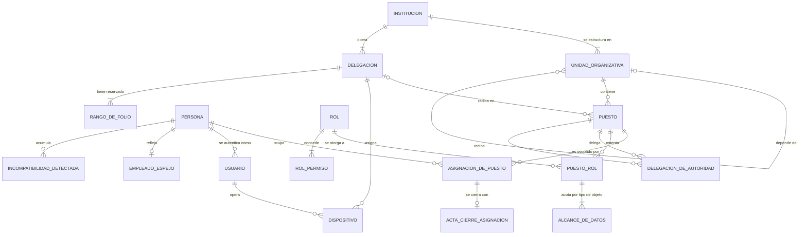
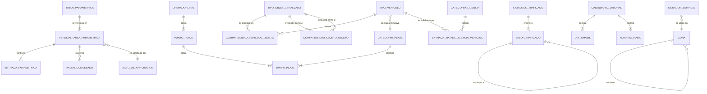
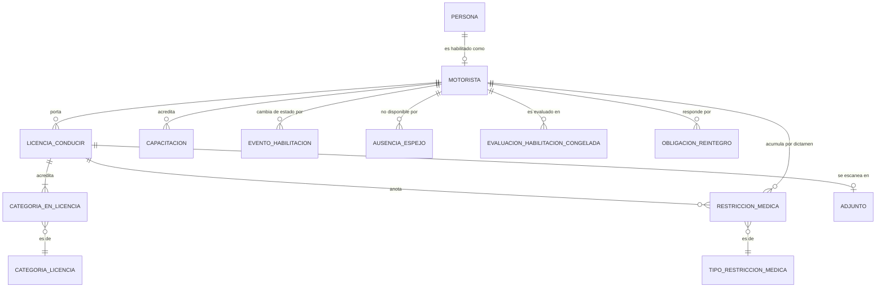
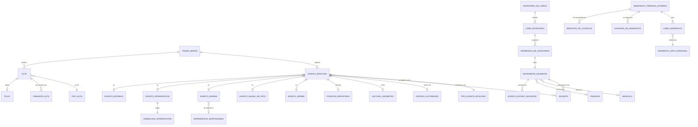
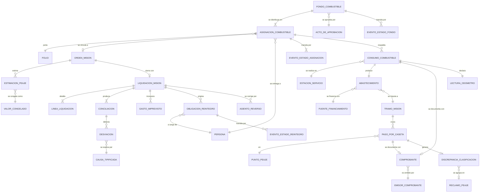
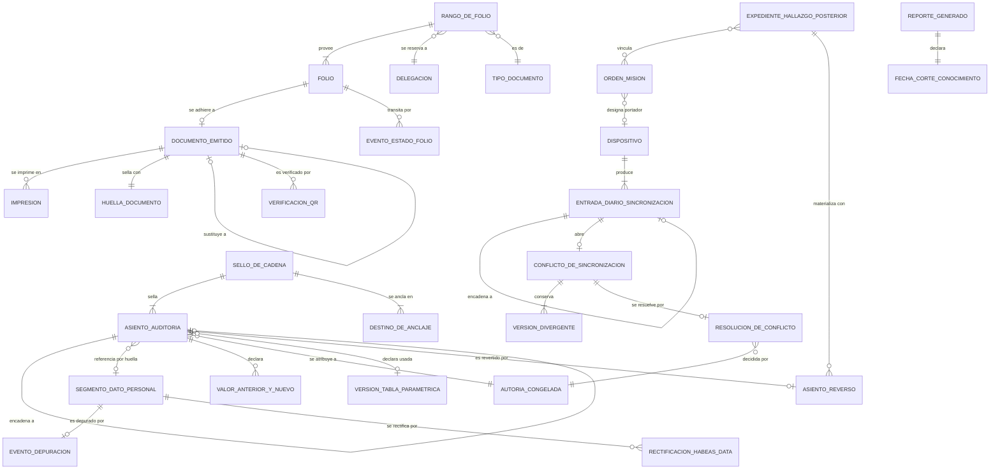
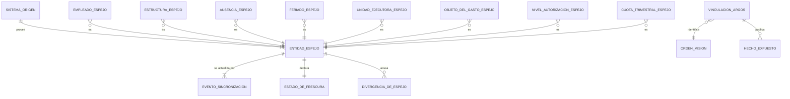

# Modelo conceptual de datos — SIGTI

**Bloque 4 del Sprint 0.** Modelo **conceptual y lógico agnóstico**: entidades, relaciones y cardinalidades. **Sin tipos físicos, sin índices, sin DDL, sin motor de base de datos** — [`ADR-000`](../adr/ADR-000-diferir-seleccion-de-stack.md) difiere el stack al Sprint 2 y este documento no lo anticipa.

Documento hermano: [`diccionario-de-datos.md`](diccionario-de-datos.md), con el detalle campo por campo de las entidades núcleo.

---

## 0. Cómo leer este documento

### 0.1 Precedencia

Este modelo **no es autoridad** sobre transiciones de estado ni sobre actores. Cuando el modelo y esos documentos difieran, mandan ellos ([CLAUDE.md, precedencia entre artefactos](../../../CLAUDE.md)):

| Materia | Autoridad | Qué hace este modelo |
|---|---|---|
| Estados, precondiciones, invariantes | [`estados/orden-de-mision.md`](../estados/orden-de-mision.md) | Los materializa como datos |
| Actores, competencia, alcance de datos | [`actores-y-roles.md`](../../01-negocio/actores-y-roles.md) | Materializa persona ≠ puesto ≠ rol |
| Reglas de negocio | `RN-xx` | Cada entidad cita las que la condicionan |
| Fronteras entre sistemas | [`ADR-001`](../adr/ADR-001-integracion-argos-talento-humano.md) | Marca qué es propio y qué es espejo |

### 0.2 Convenciones de nombre

- **Español, del [glosario](../../00-vision/glosario.md).** `orden_mision`, nunca `mission_order`. Si un nombre de entidad no está en el glosario, o entra al glosario o no se usa.
- `snake_case` para entidades y campos. En los diagramas Mermaid van en mayúsculas por convención de `erDiagram`; es el mismo nombre.
- Sufijos con significado fijo, para que el nombre diga de qué clase de dato se trata:

| Sufijo o prefijo | Significa | Ejemplo |
|---|---|---|
| `evento_` | Hecho puntual e inmutable, con su propia fecha del hecho | `evento_bitacora` |
| `asiento_` | Registro append-only de la cadena de auditoría | `asiento_auditoria` |
| `version_` | Instancia de un dato versionado por rango de vigencia | `version_tabla_parametrica` |
| `_congelado` | Valor resuelto y fijado en un acto de autorización | `valor_congelado` |
| `_espejo` | Dato propiedad de otro sistema, de **solo lectura** | `empleado_espejo` |
| `asignacion_`, `historial_` | Relación con rango de vigencia, nunca sobrescrita | `asignacion_de_placa` |

### 0.3 Qué NO aparece en este modelo, deliberadamente

| Ausente | Por qué |
|---|---|
| Campo `estado` como columna editable de `orden_mision` | El estado **se deriva del diario de transiciones** (principio `P-1` de la máquina de estados). Ver decisión `D-03` |
| Entidades de viáticos | Retiradas. Son de ARGOS — [`DP-001`](../../07-gestion/decisiones-de-producto/DP-001-fronteras-con-sistemas-existentes.md) |
| Cualquier tarifa, feriado, umbral o plazo como atributo constante | `RN-39`: todo parámetro normativo es dato con vigencia |
| Campo `borrado` o `activo` como mecanismo de baja | `RN-04`: nada se borra; se cierra vigencia o se asienta un reverso |
| `placa` como identificador del vehículo | `RN-15`, `RN-64`. Ver decisión `D-05` |

---

## 1. Los seis invariantes estructurales

Seis propiedades que **no se pueden agregar después**. Cada una se resuelve con estructura, no con procedimiento.

### `M-01` — Temporalidad: todo parámetro normativo es dato con vigencia

`RN-39`, `RN-40`, `RN-41`, `RN-42`, `RNF-05`.

Tres entidades resuelven **todo** el problema, para todo parámetro presente y futuro:

```
tabla_parametrica  ──<  version_tabla_parametrica  ──<  entrada_parametrica
                                   ^
                                   │ referenciada por identificador de version
                          valor_congelado   (el resultado autorizado)
```

- `tabla_parametrica` — el **qué**: tarifas de peaje, matriz licencia↔vehículo, calendario de días inhábiles, horario hábil, umbrales de desviación, matriz de compatibilidad, categorías de peaje, plazos. Es un registro por tabla, no un módulo de código.
- `version_tabla_parametrica` — el **desde cuándo**: rango de vigencia, acto que la aprueba, fuente, fecha de verificación, autor y aprobador (doble control, `actores-y-roles.md` §4.3). **Coexisten la versión anterior y la nueva.** El sistema impide solape y hueco al cargar, no los detecta después (`RNF-05`).
- `entrada_parametrica` — las filas de esa versión.
- `valor_congelado` — el resultado del cálculo **más el identificador de la versión que lo produjo**, más los valores unitarios que lo componen y la fecha del hecho con que se resolvió (`RN-41`).

**Comprobación.** Cambiar el reglamento mañana es insertar una `version_tabla_parametrica` nueva. **Cero migración de datos históricos, cero despliegue de versión.** Si alguna vez la respuesta a "cambió la norma" es "hay que migrar", ese parámetro se modeló como atributo en lugar de como entrada paramétrica, y eso es un defecto del modelo.

### `M-02` — Bitácora append-only que encadena referencia y huella, no contenido

`RN-04`, `RNF-04` contra `RNF-17`.

Es la tensión que el índice de `RNF` declara irrecuperable si se decide tarde. Se resuelve partiendo el asiento en dos entidades con plazos de retención distintos:

| Entidad | Contiene | Retención |
|---|---|---|
| `asiento_auditoria` | Quién (persona **y puesto congelados**), qué, cuándo (tres marcas), desde dónde, valor anterior y nuevo **de los campos no personales**, hash propio, hash del anterior | Plazo de prescripción. `[C]` insumo #71 |
| `segmento_dato_personal` | El contenido personal en claro **y su sal de huella** | Plazo más corto. `[C]` insumo #71 |

El asiento guarda del dato personal únicamente **`referencia_segmento` + `huella_segmento`**. La huella se calcula con una sal que vive **dentro del segmento**. Al depurar se elimina el segmento con su sal: la huella queda íntegra —la cadena sigue verificando— y **deja de ser invertible**, porque sin la sal un número de documento, que es un dominio pequeño y enumerable, se reconstruiría por fuerza bruta en minutos. Guardar la huella sin sal habría sido cumplir `RNF-17` en la forma y violarlo en el fondo.

La depuración **no es un borrado**: es `evento_depuracion`, un asiento nuevo que declara alcance, plazo aplicado, autoridad y conteo de lo depurado (`RNF-17`).

**Comprobación.** Depurar un año de manifiestos y volver a verificar la cadena completa debe dar cero rupturas, y el sello emitido antes de la depuración debe seguir siendo válido.

### `M-03` — Identidad generada en el cliente, folio consumido del rango

`RN-44`, `RNF-21`. **Son dos cosas distintas y el modelo las mantiene separadas:**

| | Identificador interno | Folio |
|---|---|---|
| Quién lo genera | El dispositivo, sin consultar al servidor | El dispositivo, **consumiendo de un rango pre-asignado a su delegación** |
| Forma | Opaco, tipo UUID | Legible, correlativo, explicable, impreso |
| Unicidad | Global por construcción | Institucional, por tipo de documento |
| Reciclaje | No aplica | **Nunca**, ni el de un documento anulado |
| Huecos | No existen | Cada uno **explicado**: anulación, extravío con acta, o rango asignado y no consumido |

`folio` es **entidad propia, no un atributo del documento**: tiene estado (`RESERVADO`, `EMITIDO`, `ANULADO`, `EXTRAVIADO`), rango de origen, documento al que quedó adherido, y motivo de anulación. Por eso el reporte de control de folios de `RNF-21` existe sin construir nada encima.

### `M-04` — Fecha del hecho ≠ fecha de captura ≠ fecha de recepción

`RN-46`, `RN-40`, máquina de estados §6.4. **Toda entidad de hecho** —no las de catálogo— lleva el mismo bloque, sin excepción:

`ocurrido_en` · `capturado_en` · `recibido_en` · `zona_horaria` · `desfase_reloj_medido` · `modo_de_captura` · `secuencia_dispositivo` · `id_dispositivo`

`modo_de_captura` ∈ { `EN_LINEA`, `DESCONECTADA_SINCRONIZADA`, `DIGITACION_DIFERIDA_DE_PAPEL`, `CORRECCION_POSTERIOR` }.

En `DIGITACION_DIFERIDA_DE_PAPEL` se exigen además `digitado_por`, `id_adjunto_original` y `motivo_del_diferimiento` (`RN-47`). **El orden de los hechos lo define `secuencia_dispositivo`, nunca el reloj**: un reloj retrocede, un contador monotónico no.

### `M-05` — Persona ≠ puesto ≠ rol, y la autoría no se reasigna jamás

`RNF-15`, `actores-y-roles.md` §2. Los permisos cuelgan del **puesto**; la autoría se congela con **persona + puesto + rol ejercido + denominación del puesto al momento**, copiados como valor y no como referencia. Una reorganización que renombre o suprima el puesto **no puede** cambiar lo que dice un asiento de hace tres años.

### `M-06` — Dato propio contra dato espejo

`RN-48`, `RN-49`, [`ADR-001`](../adr/ADR-001-integracion-argos-talento-humano.md). Toda entidad espejo lleva `sincronizado_en`, `sistema_origen`, `version_origen` y `estado_de_frescura`, y **ninguna pantalla la edita**.

| Propio de SIGTI | Espejo, solo lectura |
|---|---|
| Vehículo y todo su expediente, motorista como recurso de flota, **licencia de conducir con categorías, vencimiento y restricciones médicas**, misiones, combustible, peajes, bitácora | Identidad del empleado, puesto y estructura, permisos, vacaciones e incapacidades, calendario de feriados, unidad ejecutora y objeto del gasto, niveles de autorización |

**La licencia es dato propio**, corrección explícita de [`ADR-001`](../adr/ADR-001-integracion-argos-talento-humano.md): el bloqueo duro de `RN-09` no se puede sostener sobre un espejo que quizá no traiga la categoría. `[C]` insumo #17.

---

## 2. Mapa de vistas

El modelo completo no cabe en un diagrama legible. Se presenta en nueve vistas.

| Vista | Módulos | Contenido |
|---|---|---|
| [V1](#3-vista-1--organizacion-personas-y-competencia) | M-01 | Institución, dependencias, delegaciones, persona, puesto, rol, usuario, dispositivo |
| [V2](#4-vista-2--temporalidad-normativa-y-catalogos) | M-02 | Tablas paramétricas, versiones, entradas, catálogos tipificados |
| [V3](#5-vista-3--expediente-del-vehiculo) | M-03, M-04, M-11 | Vehículo, ficha técnica, tenencia, placa, custodia, estado operativo, odómetro |
| [V4](#6-vista-4--motorista-y-habilitacion) | M-05 | Motorista, licencia, categorías, restricciones médicas, disponibilidad |
| [V5](#7-vista-5--solicitud-orden-de-mision-y-alcance-autorizado) | M-06, M-07 | Solicitud, objeto del traslado, Orden de Misión, versión de alcance, tramos, transiciones |
| [V6](#8-vista-6--ejecucion-bitacora-y-personas-externas) | M-08, M-12, M-17, M-19 | Eventos de bitácora, actas, manifiestos, incidentes, estado en ruta |
| [V7](#9-vista-7--combustible-peajes-y-liquidacion) | M-09, M-18, M-13 | Fondo, asignaciones, consumos, peajes, liquidación, conciliación |
| [V8](#10-vista-8--auditoria-folios-documentos-y-sincronizacion) | M-14, M-15, M-16 | Asientos, sellos, datos personales, folios, documentos, conflictos |
| [V9](#11-vista-9--espejo-e-integracion) | M-20 | Entidades espejo y su frescura |

---

## 3. Vista 1 — Organización, personas y competencia

**Módulo M-01.** Materializa `M-05`: los permisos son del puesto, la autoría es de la persona y del puesto congelados.



**Lo que esta vista decide:**

- `PUESTO` **existe aunque esté vacante**. Los actos pendientes quedan atribuidos al puesto, no a la persona que se fue (`actores-y-roles.md` §2.4).
- `ALCANCE_DE_DATOS` cuelga de `PUESTO_ROL` y **se acota por tipo de objeto**, no globalmente: el mismo puesto puede tener alcance `DEPENDENCIA` sobre misiones e `INSTITUCION` sobre vehículos (§3.3). Un solo campo `alcance` en el rol habría hecho imposible a `ACT-11` ver un vehículo de otra dependencia entrando a taller.
- `INCOMPATIBILIDAD_DETECTADA` se evalúa **sobre la persona**, nunca sobre el puesto (`RN-01`), porque una persona con dos puestos acumula facultades incompatibles sin que ningún puesto por sí solo lo sea.
- `DISPOSITIVO` es entidad de primera clase: es el emisor de `secuencia_dispositivo`, el portador de un rango de folios y el sujeto del `desfase_reloj_medido`.

---

## 4. Vista 2 — Temporalidad normativa y catálogos

**Módulo M-02.** Materializa `M-01`. Es la vista más pequeña y la que más rescata al proyecto de una migración futura.



**Lo que esta vista decide:**

- `COMPATIBILIDAD_VEHICULO_OBJETO` y `COMPATIBILIDAD_OBJETO_OBJETO` son **entradas paramétricas versionadas**, no atributos del tipo de vehículo. `RN-67` exige además que **la ausencia de entrada bloquee**: modelarlo como matriz explícita permite distinguir "declarado incompatible" de "no declarado", que es la distinción que un atributo booleano perdería.
- `ENTRADA_MATRIZ_LICENCIA_VEHICULO` se resuelve por `tipo_vehiculo` + rangos de **peso bruto vehicular**, **capacidad de pasajeros** y **condición de articulado** (`RN-09`), nunca por nombre comercial.
- `TIPO_VEHICULO` declara una `CATEGORIA_PEAJE` **estimativa** para la estimación previa de `T-02`, cuando todavía no hay unidad asignada (`RN-33`, segunda derivación). El estimado producido con ella queda marcado como estimativo.
- `VALOR_TIPIFICADO` con relación reflexiva `sustituye a`: cuando la institución renombra un motivo tipificado, **el valor viejo no se edita**, se marca sustituido. Los registros históricos siguen apuntando al valor con que se capturaron.
- `TARIFA_PEAJE` lleva `fuente` y `fecha_de_verificacion`, y el sistema alerta a los 12 meses sin revisar (`RN-34`).

---

## 5. Vista 3 — Expediente del vehículo

**Módulos M-03, M-04, M-11.** La entidad que la frase del producto pone al centro: *SIGTI cuida de todo lo referente a los vehículos*. **No es un catálogo.**

```mermaid
erDiagram
    VEHICULO ||--|{ VERSION_FICHA_TECNICA : "tiene"
    VEHICULO ||--|{ TITULO_DE_TENENCIA : "se posee bajo"
    VEHICULO ||--|{ ASIGNACION_DE_PLACA : "ha tenido"
    VEHICULO ||--|{ HISTORIAL_ESTADO_PLACA : "declara"
    VEHICULO ||--|{ EVENTO_ESTADO_OPERATIVO : "transita por"
    VEHICULO ||--|{ CUSTODIA_VEHICULO : "esta bajo"
    VEHICULO ||--|{ REGIMEN_DE_USO : "se usa bajo"
    VEHICULO ||--o{ DOCUMENTO_VEHICULAR : "acredita con"
    VEHICULO ||--o{ VERIFICACION_ROTULACION : "se constata con"
    VEHICULO ||--|{ ASIGNACION_CATEGORIA_PEAJE : "clasifica como"
    VEHICULO ||--o{ EXONERACION_PEAJE : "goza de"
    VEHICULO ||--|{ SERIE_INSTRUMENTO_MEDICION : "mide con"
    VEHICULO ||--|| KILOMETRAJE_ACUMULADO : "acumula"
    VEHICULO ||--o{ PRESTAMO_VEHICULO : "es cedido en"
    VEHICULO ||--o{ ORDEN_TRABAJO : "ingresa a taller con"
    VEHICULO ||--o{ IMPUTACION_EXTERNA : "recibe"
    VEHICULO }o--|| UNIDAD_ORGANIZATIVA : "esta adscrito a"
    VEHICULO }o--o| DELEGACION : "opera desde"

    VERSION_FICHA_TECNICA }o--|| TIPO_VEHICULO : "es de"
    ASIGNACION_CATEGORIA_PEAJE }o--|| CATEGORIA_PEAJE : "toma"
    TITULO_DE_TENENCIA ||--|{ RUBRO_ASUMIDO : "reparte"
    SERIE_INSTRUMENTO_MEDICION ||--|{ LECTURA_ODOMETRO : "produce"
    SERIE_INSTRUMENTO_MEDICION ||--o| EVENTO_INTERVENCION_INSTRUMENTO : "se cierra por"
    CUSTODIA_VEHICULO }o--|| PERSONA : "responsabiliza a"
    CUSTODIA_VEHICULO ||--|| ACTA : "consta en"
    DOCUMENTO_VEHICULAR }o--|| TIPO_DOCUMENTO_VEHICULAR : "es de"
    ORDEN_TRABAJO ||--o{ REPUESTO_APLICADO : "consume"
    VEHICULO ||--o{ EXPEDIENTE_INCIDENTE : "involucrado en"
```



**Lo que esta vista decide:**

- **`correlativo_institucional` es la identidad operativa** y es obligatorio y único en la institución (`RN-15`). `ASIGNACION_DE_PLACA` es un **historial con rango de vigencia** y `HISTORIAL_ESTADO_PLACA` es otro, separado y tipificado (`RN-64`): el número asignado en el registro y la existencia de la lámina metálica son dos hechos distintos que en Honduras no coinciden.
- `VERSION_FICHA_TECNICA` está versionada porque **la ficha cambia**: un cambio de motor, una reclasificación de peso bruto o una modificación de carrocería alteran la categoría de licencia exigible y la categoría de peaje. Sin versión, un cambio de ficha reescribiría retroactivamente la habilitación de misiones ya cerradas.
- **`KILOMETRAJE_ACUMULADO` es atributo derivado del expediente y no decrece nunca** (`RN-89`). Las lecturas cuelgan de una `SERIE_INSTRUMENTO_MEDICION` con unidad declarada y vigencia; reemplazar el tablero cierra la serie y abre otra. Sin esta separación, cada odómetro reemplazado corrompe el histórico y el plan de mantenimiento preventivo pasa a calcularse sobre un número falso.
- `ASIGNACION_CATEGORIA_PEAJE` es una **asignación con vigencia y fundamento registrado** — quién la asignó y con qué criterio —, no una derivación calculada al vuelo (`RN-33`). Un liviano y un "vehículo de 2 ejes" tienen ambos dos ejes y pagan tarifas muy distintas: si la categoría se derivara al momento de consultar, el histórico cambiaría cada vez que se afinara la fórmula.
- `TITULO_DE_TENENCIA` con `RUBRO_ASUMIDO` responde quién paga combustible, mantenimiento, seguro, peajes, multas y daños (`RN-62`). De su `regimen` depende cuál de los dos terminales aplica: `DADO_DE_BAJA` solo para bien propio, `RETIRADO_DE_FLOTA` para bien ajeno. **Declarar dado de baja un comodato es un asiento falso** y el modelo lo impide por invariante, no por pantalla.
- `DOCUMENTO_VEHICULAR` es **opcional en cardinalidad**: póliza de seguro y revisión mecánica no son obligatorias por ley vigente (`RN-16`), y el bloqueo por su ausencia es parámetro configurable **apagado por defecto**, con valor distinto admisible por régimen de tenencia.
- `EVENTO_ESTADO_OPERATIVO` es un **diario**, igual que las transiciones de la misión: el estado actual del vehículo se deriva del último evento aplicable. Cada evento cita su código `W-nn` y su causa tipificada — `NO_DISPONIBLE` sin causa tipificada es el cementerio donde se esconde la flota que nadie repara.
- `IMPUTACION_EXTERNA` (multa, línea de estado de cuenta, reclamo de seguro) **no se ancla a la placa**: se resuelve por la jerarquía configurable de `RN-66`, con la placa en último lugar y resuelta **a la fecha del hecho** contra el historial. Lo que no se resuelve queda `NO_RESUELTA` con responsable y plazo; nunca se asigna por parecido.

---

## 6. Vista 4 — Motorista y habilitación

**Módulo M-05.** Aquí vive la corrección de [`ADR-001`](../adr/ADR-001-integracion-argos-talento-humano.md): **la licencia es dato propio de SIGTI**.



**Lo que esta vista decide:**

- **Un motorista tiene varias categorías a la vez.** `CATEGORIA_EN_LICENCIA` es la entidad asociativa con **vigencia propia por categoría**, porque una categoría puede vencer o suspenderse sin que caiga toda la licencia. Modelarla como lista de etiquetas dentro de la licencia habría hecho imposible responder "¿estaba habilitado para C1 el 14 de marzo?".
- `EVALUACION_HABILITACION_CONGELADA` guarda el resultado de `RN-09` y `RN-11` **con sus insumos**: número de licencia consultado, categorías vigentes usadas, fecha de vencimiento leída, versión de la matriz aplicada, atributos del vehículo usados y antigüedad del espejo de Talento Humano en ese momento. La razón es legal y está en la máquina de estados §9.2: el día del siniestro, un "sí, verificado" no defiende a nadie; el detalle de contra qué se verificó, sí.
- `AUSENCIA_ESPEJO` (permiso, vacaciones, incapacidad) es **espejo de Talento Humano**, con su `estado_de_frescura`. `RN-50` degrada explícitamente cuando la sincronización lleva detenida más del umbral, en lugar de asumir disponibilidad.
- `RESTRICCION_MEDICA` cuelga de la licencia **y también del motorista**: hay restricciones anotadas en el documento y otras que llegan por dictamen posterior sin reemisión de licencia (`RN-11`). Colgarla solo de la licencia habría perdido las segundas.

---

## 7. Vista 5 — Solicitud, Orden de Misión y alcance autorizado

**Módulos M-06 y M-07.** El núcleo. La Orden de Misión es la unidad de control administrativo-contable; **no es un viaje**.

```mermaid
erDiagram
    SOLICITUD_TRANSPORTE ||--|{ OBJETO_DEL_TRASLADO : "declara"
    SOLICITUD_TRANSPORTE ||--|{ DESTINO_SOLICITADO : "pide"
    SOLICITUD_TRANSPORTE }o--|| TIPO_VEHICULO : "requiere"
    SOLICITUD_TRANSPORTE }o--|| UNIDAD_ORGANIZATIVA : "es originada por"
    SOLICITUD_TRANSPORTE }o--|| MOTIVO_DE_VIAJE : "se funda en"
    SOLICITUD_TRANSPORTE |o--o| ORDEN_MISION : "se convierte en"

    ORDEN_MISION ||--|{ VERSION_ALCANCE_AUTORIZADO : "se autoriza por"
    VERSION_ALCANCE_AUTORIZADO ||--|{ DESTINO_AUTORIZADO : "comprende"
    VERSION_ALCANCE_AUTORIZADO ||--|{ VALOR_CONGELADO : "congela"
    VERSION_ALCANCE_AUTORIZADO }o--|| ACTO_DE_AUTORIZACION : "se sustenta en"

    ORDEN_MISION ||--|{ TRAMO_MISION : "se ejecuta en"
    TRAMO_MISION }o--|| VEHICULO : "usa"
    TRAMO_MISION }o--|| MOTORISTA : "es conducido por"
    TRAMO_MISION ||--o| ACTA_TRASPASO : "se delimita por"
    TRAMO_MISION ||--|{ OBJETO_EN_TRAMO : "configura"
    OBJETO_DEL_TRASLADO ||--o{ OBJETO_EN_TRAMO : "va en"

    ORDEN_MISION ||--|{ TRANSICION_ORDEN_MISION : "se mueve por"
    TRANSICION_ORDEN_MISION ||--|{ RESULTADO_VERIFICACION : "registra"
    TRANSICION_ORDEN_MISION }o--|| ASIENTO_AUDITORIA : "produce"
    TRANSICION_ORDEN_MISION |o--o| CODIGO_AUTORIZACION_FUERA_DE_LINEA : "usa"

    ORDEN_MISION ||--o{ RESERVA_RECURSO : "compromete"
    RESERVA_RECURSO }o--o| VEHICULO : "sobre"
    RESERVA_RECURSO }o--o| MOTORISTA : "sobre"
    ORDEN_MISION ||--o{ PERMISO_CIRCULACION_INHABIL : "requiere"
    ORDEN_MISION ||--o{ DOCUMENTO_EMITIDO : "emite"
    ORDEN_MISION }o--o| VINCULACION_ARGOS : "expone a"
    ORDEN_MISION ||--o{ HALLAZGO_DE_CIERRE : "cierra con"

    OBJETO_DEL_TRASLADO }o--|| TIPO_OBJETO_TRASLADO : "se tipifica como"
    OBJETO_DEL_TRASLADO |o--o| MANIFIESTO_PERSONA_EXTERNA : "detalla en"
    OBJETO_DEL_TRASLADO |o--o| INVENTARIO_DE_CARGA : "detalla en"
    OBJETO_DEL_TRASLADO |o--o{ PERSONA : "identifica a"
```



**Lo que esta vista decide:**

- **`OBJETO_DEL_TRASLADO` es supertipo con tres subtipos** —personal institucional, persona externa, carga— y una misión puede tener varios a la vez. Esto es lo que hace que el modelo soporte los tres casos sin forzar ninguno: no hay campo `cantidad_pasajeros` en la orden. `OBJETO_EN_TRAMO` existe porque `RN-68` evalúa compatibilidad y capacidad **por tramo, sobre la configuración real de cada tramo**, no sobre la misión completa.
- **`VERSION_ALCANCE_AUTORIZADO` es la entidad que evita el hallazgo falso.** Cada extensión —más días, más destinos, más kilómetros, mayor costo— produce una versión con su autorizador y su vigencia (`RN-77`). La coherencia de casetas, el kilometraje y la ruta se validan contra **la versión vigente a la fecha de cada hecho**: un paso amparado por una extensión autorizada no es desviación. Un modelo con ventana única en la orden habría marcado como hallazgo cada prórroga legítima.
- **`TRAMO_MISION` es donde se imputa todo**, no la orden (`RN-72`). Kilometraje, combustible, peajes e indicadores de conducción se imputan por tramo, delimitados por el odómetro del acta de traspaso. Modelar `orden_mision → vehiculo` como relación directa habría hecho imposible conciliar el rendimiento cuando hubo sustitución en ruta, que es exactamente cuando más importa.
- **No hay campo `estado` editable.** `TRANSICION_ORDEN_MISION` es el diario append-only; el estado es la proyección de aplicarlo. `RESULTADO_VERIFICACION` guarda por transición el resultado de cada bloqueo duro `BD-nn` **con los datos concretos usados**.
- `RESERVA_RECURSO` tiene ventana con holgura previa y posterior configurable, y **la ocupan también el préstamo y la indisponibilidad sobrevenida** (`RN-13`, `RN-60`): un vehículo prestado no está disponible aunque no esté averiado.
- La identificación de personas trasladadas **no está en `OBJETO_DEL_TRASLADO`**: está en `MANIFIESTO_PERSONA_EXTERNA`, cuyo contenido personal vive en `segmento_dato_personal` (V8). `RN-51` exige que el dato de gestión —vehículo, ruta, costo, unidad ejecutora— pueda exportarse sin el dato personal, y eso solo se logra si están estructuralmente separados desde el principio.

---

## 8. Vista 6 — Ejecución, bitácora y personas externas

**Módulos M-08, M-12, M-17, M-19.** Todo lo de esta vista se captura **sin conectividad** (`RN-43`).



**Lo que esta vista decide:**

- `EVENTO_BITACORA` es **un supertipo con subtipos por naturaleza**, no una tabla por tipo de evento. Razón: el cliente de campo debe poder registrar un evento nuevo —una espera improductiva, un paso por caseta— sin cambio de esquema, y la bitácora impresa (`RN-80`) debe tener **paridad exacta campo por campo** con la pantalla de digitación.
- **El tiempo en sitio se deriva** de los eventos de arribo y salida por destino (`RN-76`). No se le pide al motorista que lo cronometre ni que lo digite. Y **el sistema nunca infiere estado a partir de la ausencia de señal**: `POSICION_REPORTADA` siempre exhibe su antigüedad.
- `EVENTO_INTERRUPCION` marca la misión **sin cambiarle el estado** y exige `DESENLACE_INTERRUPCION` (`RN-70`). Un modelo que convirtiera la interrupción en estado habría creado un estado del que no se sabe salir.
- `LINEA_MANIFIESTO` **no contiene la identidad**: la referencia. Esa indirección es la que permite depurar a los cinco años sin romper la cadena ni alterar los conteos del reporte (`RNF-17`, `RN-51`).
- `REGISTRO_DE_CONSULTA` es obligatorio sobre manifiestos: **quién vio qué y cuándo** (`RN-52`). Es una entidad de escritura en una operación de lectura, y por eso hay que preverla en el modelo y no en la capa de aplicación.
- `EXPEDIENTE_INCIDENTE` **no captura atribución de responsabilidad en campo** (`RN-74`). El registro de campo describe el hecho; la responsabilidad se determina en el expediente, por otro actor y en otro momento.

---

## 9. Vista 7 — Combustible, peajes y liquidación

**Módulos M-09, M-18, M-13.** Aquí está el dinero, y por eso aquí es donde el TSC mira primero.



**Lo que esta vista decide:**

- **`ABASTECIMIENTO` es distinto de `CONSUMO_COMBUSTIBLE`**, y esa separación es de `RN-83`. Todo ingreso de combustible al tanque es un abastecimiento, **cualquiera sea su fuente**: fondo de la misión, tanque institucional, otra dependencia, donación, peculio del servidor, tercero en apoyo. El abastecimiento con fuente distinta del fondo **entra en el denominador de la conciliación** pero **no en el cuadre del fondo**. Un modelo con una sola entidad habría producido rendimientos imposiblemente buenos, que es justo la señal que `RN-30` quiere detectar.
- `COMPROBANTE` tiene **unicidad institucional por tipo + emisor + número**, verificada **al registrar y atravesando el alcance de datos** (`RN-84`). Dos delegaciones no se ven entre sí, pero la unicidad del comprobante sí las cruza. Si dos capturas sin red invocan el mismo comprobante, el segundo va a la cola de conflictos: nunca aceptación silenciosa, nunca descarte silencioso.
- `ESTIMACION_PEAJE` se congela como `VALOR_CONGELADO` con el desglose **por punto**, la categoría usada y la versión de la tabla de tarifas (`RN-35`, `RN-41`, `RN-91`). La orden impresa lleva ese desglose, para que el motorista pueda discutir en la caseta con el papel en la mano.
- **`RECLAMO_PEAJE` y `OBLIGACION_REINTEGRO` sobreviven al cierre de la misión.** Son cuentas por cobrar con ciclo propio (`RN-92`, `RN-86`), no hallazgos sobre la conducta de la institución. Sin esta separación, un reclamo ante la SAPP que tarda meses dejaría el expediente atrapado en `LIQUIDADA` indefinidamente, y un expediente que no puede cerrarse se abandona.
- La conciliación **detecta desviación en ambas direcciones** (`RN-30`). Un rendimiento imposiblemente bueno suele significar un despacho de combustible no registrado.

---

## 10. Vista 8 — Auditoría, folios, documentos y sincronización

**Módulos M-14, M-15, M-16.** Materializa `M-02`, `M-03` y la resolución de la tensión `RNF-04` × `RNF-17`.



**Lo que esta vista decide:**

- `AUTORIA_CONGELADA` es una entidad, no un puñado de claves foráneas: guarda **persona, puesto, denominación del puesto al momento, rol ejercido, unidad, delegación y alcance aplicado**, todos como valor copiado. Es la única forma de que la respuesta a *"¿quién autorizó esto y con qué competencia?"* siga siendo cierta después de tres reorganizaciones (`RNF-15`).
- `SELLO_DE_CADENA` con `DESTINO_DE_ANCLAJE` **múltiple y fuera del alcance del administrador de la base** (`RNF-04`). La propiedad alcanzable es **detectabilidad con anclaje externo**, no inmutabilidad absoluta, y el modelo no promete más de lo que puede.
- `VERSION_DIVERGENTE` **conserva íntegra la versión no aplicada**. `RESUELTA_DESCARTADA` significa que no se aplicó al expediente, **no que se haya borrado** (`RN-45`).
- `DOCUMENTO_EMITIDO` con relación reflexiva `sustituye a`: un documento corregido es **un documento nuevo con folio nuevo** que declara en su cuerpo "sustituye al folio X", y el X queda `ANULADO` con referencia cruzada. Ambos se conservan y ambos se imprimen si se piden.
- `EXPEDIENTE_HALLAZGO_POSTERIOR` vincula **cero, una o varias** órdenes en estado terminal y **no altera ni su estado ni sus datos** (`RN-93`). Una orden `CERRADA` no se reabre, ni por auditoría. Lleva **fecha del hecho y fecha del descubrimiento como campos distintos**, porque la antigüedad del hallazgo se cuenta desde el hecho.
- `REPORTE_GENERADO` guarda su `FECHA_CORTE_CONOCIMIENTO` (`RN-94`, `RNF-06`): el mismo reporte, con el mismo período y el mismo corte, produce el mismo resultado dentro de cinco años. Lo incorporado después de un corte se presenta como **capa identificada**, nunca fundido en el dato histórico.

---

## 11. Vista 9 — Espejo e integración

**Módulo M-20.** Ninguna de estas entidades se edita desde SIGTI (`RN-48`).



**Lo que esta vista decide:**

- `FERIADO_ESPEJO` es espejo de Talento Humano, **pero el calendario que usan los cálculos es `CALENDARIO_LABORAL` de V2**, con su versión paramétrica. El espejo alimenta la versión; no la reemplaza. Si el espejo se cae, el cálculo sigue resolviendo contra la última versión vigente y lo declara.
- `HECHO_EXPUESTO`: SIGTI **expone hechos a ARGOS con la clave de vinculación de la orden y no escribe en el sistema origen** (`RN-81`). La dirección del flujo es un dato del modelo, no una convención de la integración.
- `DIVERGENCIA_DE_ESPEJO` existe porque `RN-49` exige reconciliación periódica: **el espejo nunca diverge en silencio** (`RNF-07`).

---

## 12. Cardinalidades explícitas y justificadas

Una relación mal cardinalizada es un caso especial que aparece en producción. Estas son las que se decidieron contra la intuición, con el caso real que las obligó.

| Relación | Cardinalidad | Por qué **no** es la obvia |
|---|---|---|
| `orden_mision` — `tramo_mision` | 1 : 1..N | La intuición dice 1:1 con un vehículo. **Falso:** avería en ruta, relevo de motorista, transbordo de carga (`RN-72`). Con 1:1 el rendimiento se calcularía sobre la misión completa y sería inservible |
| `orden_mision` — `version_alcance_autorizado` | 1 : 1..N | Una ventana única en la orden convertiría toda prórroga legítima en hallazgo (`RN-77`). La primera versión nace con la aprobación |
| `solicitud_transporte` — `orden_mision` | 0..1 : 0..1 | Hay órdenes sin solicitud previa: convalidación de acto ejecutado sin autorización previa (`RN-73`, `CE-01`). Y solicitudes que mueren rechazadas |
| `solicitud_transporte` — `objeto_del_traslado` | 1 : 1..N | Misión mixta de personas y carga. `RN-20` exige evaluar **ambas** compatibilidades a la vez, no la predominante |
| `objeto_del_traslado` — `objeto_en_tramo` | 1 : 0..N | Un objeto puede no ir en algún tramo —carga entregada en el primer destino— y puede cambiar de vehículo. `RN-68` evalúa por tramo |
| `vehiculo` — `asignacion_de_placa` | 1 : 0..N | Cero es un estado válido y frecuente: desabastecimiento nacional (`RN-15`). Y N porque el número **nunca se sobrescribe**, se cierra el rango y se abre otro (`RN-64`) |
| `vehiculo` — `documento_vehicular` (póliza, revisión) | 1 : 0..N | **Cero es legal.** No son obligatorias por ley vigente (`RN-16`). Obligarlas dejaría fuera de operación a flota que circula lícitamente |
| `vehiculo` — `version_ficha_tecnica` | 1 : 1..N | Cambio de motor, reclasificación de peso, modificación de carrocería. Con 1:1 un cambio de ficha reescribiría la habilitación de misiones cerradas |
| `vehiculo` — `serie_instrumento_medicion` | 1 : 1..N | Cada tablero reemplazado cierra una serie y abre otra (`RN-89`, `RN-90`). Con una sola serie, el histórico se corrompe |
| `vehiculo` — `kilometraje_acumulado` | 1 : 1 | Es **uno solo por expediente**, derivado y monótono. Deliberadamente **no** cuelga de la serie: si colgara, un reemplazo de instrumento reiniciaría el plan de mantenimiento preventivo |
| `vehiculo` — `custodia_vehiculo` | 1 : 1..N | Siempre hay uno vigente (`RN-22`) y el histórico completo se conserva. El despacho **no cierra la custodia**: la traslada temporalmente al motorista |
| `vehiculo` — `titulo_de_tenencia` | 1 : 1..N | Un vehículo pasa de alquilado a donado, o renueva comodato. Sin título vigente no se habilita en la flota (`RN-62`) |
| `motorista` — `licencia_conducir` | 1 : 0..N | Cero: un motorista dado de alta cuya licencia aún no se ha capturado — no se le puede asignar, pero existe. N: renovaciones, cuyo histórico se conserva |
| `licencia_conducir` — `categoria_en_licencia` | 1 : 1..N | **Un motorista tiene varias categorías**, y cada una con vigencia propia porque una puede suspenderse sin caer la licencia entera |
| `persona` — `asignacion_de_puesto` | 1 : 0..N | N porque una persona ocupa varios puestos a la vez, y sus incompatibilidades se acumulan sobre la persona (`RN-01`). Cero porque una persona sin puesto vigente es un usuario sin permisos que **no se borra** |
| `puesto` — `asignacion_de_puesto` | 1 : 0..N | Cero: el puesto vacante existe y acumula actos pendientes. N simultáneas: el traspaso con solape entre titular saliente y entrante `[C]` |
| `asiento_auditoria` — `segmento_dato_personal` | 0..N : 0..1 | **Nunca 1:1 embebido.** La indirección es lo que permite depurar sin romper la cadena (`RNF-17`) |
| `asiento_auditoria` — `asiento_auditoria` | 1 : 0..1 | Encadenamiento por misión. El primer asiento de una cadena no tiene anterior |
| `rango_de_folio` — `folio` | 1 : 0..N | Un rango asignado y no consumido es un hueco **explicado** (`RNF-21`); al cierre de ejercicio se anula con acta y no se arrastra (`RN-96`) |
| `folio` — `documento_emitido` | 1 : 0..1 | Cero: folio reservado, o anulado antes de emitir. **Nunca 1:N** — un folio no ampara dos documentos |
| `documento_emitido` — `impresion` | 1 : 0..N | La reimpresión **conserva el folio** y se registra como reimpresión. Emitir folio nuevo al reimprimir es defecto (`RNF-21`) |
| `conflicto_de_sincronizacion` — `version_divergente` | 1 : 2..N | Por definición hay al menos dos versiones, y **ninguna se descarta** (`RN-45`) |
| `expediente_hallazgo_posterior` — `orden_mision` | 0..N : 0..N | Cero órdenes: hallazgo sobre un vehículo o un período. Varias: un hallazgo de auditoría abarca un lote de misiones (`RN-93`) |
| `orden_mision` — `asignacion_combustible` | 1 : 0..N | Cero: misión sin fondo asignado. N: fondo repuesto en ruta, o un vale por tramo cuando hay relevo |
| `asignacion_combustible` — `consumo_combustible` | 1 : 0..N | Cero: vale devuelto íntegro. N: consumo parcial, que es lo normal |
| `consumo_combustible` — `comprobante` | 1 : 0..1 | **Cero es admisible**: la fotografía del comprobante es exigible pero no bloqueante (`RN-28`), y la ausencia lleva causa tipificada y descargo alternativo (`RN-85`) |
| `tramo_mision` — `paso_por_caseta` | 1 : 0..N | Cero en rutas sin peaje. La secuencia debe ser geográfica y temporalmente coherente con el **alcance vigente a la fecha del hecho** (`RN-37`) |
| `discrepancia_clasificacion` — `reclamo_peaje` | 0..N : 0..1 | Varias discrepancias se agrupan en un reclamo. Y el reclamo **abierto no impide cerrar la misión** (`RN-92`) |
| `vehiculo` — `reserva_recurso` | 1 : 0..N | Las ocupan también préstamo e indisponibilidad sobrevenida, no solo misiones (`RN-60`, `RN-63`) |
| `orden_mision` — `dispositivo` (portador) | 0..N : 0..1 | Un solo portador designado al despachar; los demás dispositivos pueden aportar, marcados como no portadores |

---

## 13. Decisiones de modelado no obvias

### `D-01` — La entidad central es la Orden de Misión, y no tiene vehículo

`orden_mision` **no referencia un vehículo ni un motorista**. Los referencia `tramo_mision`. Es contraintuitivo y es correcto: la orden es la unidad de control administrativo-contable; el vehículo es un recurso que puede cambiar durante su ejecución. Poner `id_vehiculo` en la orden habría sido el atajo que rompe la imputación por tramo de `RN-72`.

### `D-02` — El tipo de vehículo es catálogo con atributos, no lista de etiquetas

`TIPO_VEHICULO` no es una enumeración. Es un catálogo con atributos que permiten **resolver compatibilidad por regla**: rangos de peso bruto, capacidad de pasajeros, condición de articulado, categoría de peaje estimativa. La compatibilidad se resuelve contra matrices paramétricas versionadas (`RN-20`, `RN-67`, `RN-09`), no contra una lista cableada. Agregar un tipo de vehículo nuevo es cargar catálogo, no desplegar código.

### `D-03` — El estado es una proyección del diario, no una columna

Ni `orden_mision`, ni `vehiculo`, ni `folio`, ni `asignacion_combustible` tienen columna `estado` editable. Todos tienen su diario de eventos de estado. El estado corriente es una **proyección derivada**, marcada como tal.

La razón no es purismo: es que el cliente desconectado **no envía el estado, envía la secuencia de transiciones** (máquina de estados §6.2), y el servidor las aplica en orden de `secuencia_dispositivo`. Con una columna de estado, dos dispositivos sincronizando producirían la última escritura ganadora, que es exactamente la sobrescritura silenciosa que `RN-45` prohíbe.

### `D-04` — La huella del dato personal lleva sal, y la sal vive con el dato

Explicado en `M-02`. Sin sal, la huella de un número de identidad es reversible por fuerza bruta sobre un dominio enumerable, y la depuración sería cosmética.

### `D-05` — La identidad del vehículo es el correlativo; la placa es un historial

`correlativo_institucional` obligatorio y único; `placa` ni obligatoria ni única, y además partida en dos historiales independientes: el **número asignado en el registro** y el **estado de la lámina física** (`RN-64`). Un vehículo puede tener número sin lámina durante años, tener la lámina retenida por autoridad, o no tener número asignado todavía. Los tres son estados operables.

Consecuencia aguas abajo: la imputación externa **no se ancla a la placa** (`RN-66`).

### `D-06` — Kilometraje acumulado separado de la lectura del instrumento

`KILOMETRAJE_ACUMULADO` (1:1 con el vehículo, monótono, derivado) contra `LECTURA_ODOMETRO` (N, con unidad original conservada y normalizada, colgando de una `SERIE_INSTRUMENTO_MEDICION`). El plan de mantenimiento preventivo se calcula sobre el acumulado, **jamás sobre la lectura** (`RN-89`). La continuidad se evalúa sobre la serie **ordenada por fecha del hecho**, de modo que insertar un registro anterior —digitación diferida— reabre la validación de todos los posteriores.

### `D-07` — Dos estados terminales de vehículo, gobernados por el título de tenencia

`DADO_DE_BAJA` exige `titulo_de_tenencia.regimen = PROPIEDAD`. `RETIRADO_DE_FLOTA` es para bien ajeno. **Es un invariante del modelo, no una validación de pantalla**: declarar dado de baja un comodato es un asiento falso sobre un bien que nunca fue del Estado, y se detecta cruzando el inventario institucional contra el padrón de flota.

### `D-08` — `valor_congelado` es una entidad, no un campo por cada monto

En lugar de duplicar `monto_estimado`, `version_tarifa_usada`, `fecha_resolucion` en cada entidad que calcula algo, existe una entidad `valor_congelado` reutilizable con: concepto, valor, unidad, versión de tabla usada, valores unitarios componentes, fecha del hecho con que se resolvió y acto que lo congeló. La usan la estimación de peajes, la evaluación de habilitación, el rendimiento esperado y los umbrales aplicados. **Un solo mecanismo de congelamiento** para `RN-41`, en lugar de once implementaciones que van a divergir.

### `D-09` — El objeto del traslado es supertipo, y la carga tiene inventario propio

Tres subtipos —personal institucional, persona externa, carga— porque `RN-69` exige inventario unitario con acta de entrega para bienes inventariables, y `RN-51` exige minimización estricta para personas externas. Un campo `descripcion_de_lo_trasladado` habría hecho imposibles ambas.

### `D-10` — Reserva de recurso es entidad propia, no un intervalo en la orden

`RESERVA_RECURSO` tiene ventana con holgura previa y posterior configurable **por tipo de vehículo** (`EF-01`) y la ocupan misiones, préstamos e indisponibilidades sobrevenidas. Es lo que permite que `RN-13` —sin doble asignación— y `RN-60` —indisponibilidad sobrevenida con desenlace explícito de cada reserva afectada— se evalúen contra una sola estructura.

### `D-11` — La fusión de expedientes duplicados no borra ninguno

Cuando dos delegaciones sin conexión dan de alta el mismo vehículo, resultan dos identificadores distintos con el mismo `correlativo_institucional` o el mismo chasis. El modelo lo resuelve con `FUSION_DE_EXPEDIENTES`: se designa un expediente **superviviente** y el otro queda marcado `ABSORBIDO_POR`, **conservando íntegro su historial y sus referencias**. Ninguna misión, lectura de odómetro o consumo cambia de dueño retroactivamente: se consultan a través del superviviente. La fusión es un acto humano registrado, con autoría congelada y motivo (`RN-45`). Ver §14, pregunta 4.

### `D-12` — Autoría congelada como entidad, no como claves foráneas

Explicado en V8. Es la diferencia entre un asiento que sigue siendo cierto en 2035 y uno que cambia de significado cada vez que la institución se reorganiza.

---

## 14. Las cuatro preguntas, respondidas por el modelo

### 1. ¿Cómo se registra esto cuando el hecho ocurrió en carretera sin señal y se digitó tres días después?

Cada entidad de hecho lleva el bloque de `M-04` completo. El caso concreto:

- El identificador lo genera el dispositivo (`M-03`); el registro tiene identidad desde el momento del hecho, no desde que alcanza el servidor.
- `ocurrido_en` sale del papel o de la declaración del actor; `capturado_en` es el momento de la digitación; `recibido_en` lo pone el servidor. La diferencia entre las tres **es visible en el expediente, no se disimula**.
- `modo_de_captura = DIGITACION_DIFERIDA_DE_PAPEL` exige `digitado_por` y **adjunto del original escaneado** (`RN-47`).
- Todos los cálculos —tarifa de peaje, día hábil, matriz de licencias— resuelven contra `ocurrido_en` (`RN-40`), así que un registro digitado tres días después produce **exactamente el mismo resultado** que si se hubiera capturado en el momento.
- El orden lo define `secuencia_dispositivo`, no el reloj. Y si el registro diferido se inserta antes de otros ya validados, la serie de odómetro reabre la validación de los posteriores (`RN-89`).

### 2. Si un auditor pide la cadena completa de una misión, ¿el modelo la produce sin reconstruirla a mano?

Sí, y por construcción, no por consulta ingeniosa. Todo cuelga de `orden_mision`:

`transicion_orden_mision` (con sus `resultado_verificacion` y los insumos usados) → `version_alcance_autorizado` con sus autorizadores → `tramo_mision` → `evento_bitacora` con adjuntos → `asignacion_combustible` con folio, `consumo_combustible` y `comprobante` → `paso_por_caseta` con su categoría y tarifa congeladas → `liquidacion_mision` con sus conciliaciones y desviaciones → `documento_emitido` con folio, huella e impresiones → `asiento_auditoria` encadenado, con sello y anclaje.

El **paquete de evidencia** de `RNF-18` es la exportación de ese árbol. Lo que no se puede reconstruir después y por eso está en el modelo desde ahora: los **insumos de cada verificación**, la **versión de cada tabla usada**, y el **puesto que la persona ocupaba ese día**.

### 3. Si el reglamento cambia mañana, ¿qué se rompe?

Nada, y la prueba es que no hay nada que migrar. El cambio es una `version_tabla_parametrica` nueva con su rango de vigencia y su acto de aprobación. Coexiste con la anterior. Los cálculos ya congelados **siguen mostrando el valor histórico** porque guardan el identificador de la versión que los produjo (`RN-41`); los hechos nuevos resuelven contra la nueva.

Si la corrección es retroactiva —la tabla estaba mal cargada—, se genera **asiento de diferencia**, nunca sobrescritura (`RN-42`), imputado al período corriente con referencia al período afectado.

**Donde sí hay riesgo, y hay que decirlo:** si el cambio normativo introduce una **dimensión nueva** —por ejemplo, que la tarifa de peaje pase a depender también del horario—, hay que agregar una columna a `entrada_parametrica` de esa tabla. Eso es evolución de esquema, no migración de datos históricos: las versiones anteriores conservan la dimensión vacía y siguen resolviendo. El modelo acota el daño; no lo elimina.

### 4. ¿Qué pasa cuando dos delegaciones sin conexión entre sí registran algo sobre el mismo vehículo?

Se distinguen tres casos, y ninguno se resuelve por sobrescritura (`RN-45`):

| Caso | Qué produce el modelo |
|---|---|
| **Dos hechos legítimos sobre el mismo vehículo** — dos lecturas de odómetro, dos consumos | Ambos entran. Son entidades de hecho distintas, con identificadores distintos. La serie de odómetro se ordena por `ocurrido_en` y valida continuidad; si hay retroceso o salto, exige justificación (`RN-31`) sin descartar ninguno |
| **Dos versiones del mismo hecho** — dos dispositivos declaran la misma salida con odómetros distintos | `CONFLICTO_DE_SINCRONIZACION` con **dos o más `VERSION_DIVERGENTE` conservadas íntegras**. Se aplica la cadena del dispositivo portador; la otra se conserva y se muestra lado a lado, campo por campo. `BD-08` impide liquidar hasta resolver. La resolución es acto humano con autoría congelada, y **la versión descartada no se borra** |
| **Dos altas del mismo vehículo** — cada delegación crea su expediente | Dos identificadores con el mismo `correlativo_institucional` o el mismo chasis. El servidor lo detecta al sincronizar y abre conflicto de **identidad presunta duplicada**. Se resuelve con `FUSION_DE_EXPEDIENTES` (`D-11`): expediente superviviente y expediente absorbido, ambos conservados, ninguna referencia histórica reasignada |

Y en los tres: el mismo comprobante invocado por dos delegaciones se detecta **al registrar el segundo**, no ocho meses después al conciliar (`RN-84`, `RNF-21`).

---

## 15. Lo que queda `[C]` en este modelo

Ninguno se inventó. Todos están o entran en [`insumos-pendientes.md`](../../07-gestion/insumos-pendientes.md).

| # | Qué falta decidir | Qué entidad o campo lo espera | Insumo |
|---|---|---|---|
| 1 | **Formato del correlativo institucional**: único por institución o compuesto por delegación | `vehiculo.correlativo_institucional` y su regla de unicidad | #34 |
| 2 | **Plazo de retención** y **plazo de depuración** de datos personales | Vigencia de `segmento_dato_personal` y disparo de `evento_depuracion`. **Sin el dato, el sistema no depura nada** y lo declara | #71 |
| 3 | **Periodicidad del sello** de la cadena y sus destinos de anclaje | `sello_de_cadena`, `destino_de_anclaje` | Sprint 2 / #71 |
| 4 | **Si el fondo se asigna por período o por misión**; si el motorista acumula saldo entre misiones; si el sobrante se devuelve o se arrastra | Cardinalidad `asignacion_combustible` — `orden_mision`, hoy modelada `0..1` para admitir ambos esquemas | #7 / PROP-01 |
| 5 | **Si la orden de pago trae folio preimpreso** o lo genera el sistema | `folio.numero_talonario_preimpreso` como campo propio | #46 |
| 6 | **Solape máximo en días** entre titular saliente y entrante de un puesto | Restricción sobre `asignacion_de_puesto` | actores-y-roles §2.3 |
| 7 | **Si se captura ubicación** en las transiciones y bajo qué política | `transicion_orden_mision.ubicacion_aproximada` | #1 |
| 8 | **Matriz licencia↔vehículo definitiva**, **tarifas de peaje** y **exoneraciones** reales | Contenido de `entrada_parametrica`; el modelo está listo, los datos no | #20, #21, #22 |
| 9 | **Horario hábil oficial y calendario de feriados** confirmados | `calendario_laboral`, `horario_habil`, `dia_inhabil` | #1, #14 |
| 10 | **Volumen operativo cifrado** (flota, delegaciones, concurrencia, duración máxima de misión) | Ninguna entidad cambia; condiciona el diseño físico del Sprint 2 | #67 |
| 11 | **Si Talento Humano mantiene la categoría de licencia** con el detalle requerido | Si la respuesta es sí, `licencia_conducir` podría pasar a espejo. Hasta entonces, **propio** | #17 |
| 12 | **Si la institución exige denuncia** por vale extraviado | Obligatoriedad de `adjunto` en `evento_estado_asignacion = EXTRAVIADA` | #1 |
| 13 | **Régimen de excepción a la segregación** en delegaciones de tres personas | `incompatibilidad_detectada` y su tratamiento. Hoy **bloquea** | #26, #27 |

---

## 16. Trazabilidad

**Módulos.** Los veinte del [CLAUDE.md](../../../CLAUDE.md), menos M-10 (retirado), distribuidos en las nueve vistas de §2.

**Reglas de negocio.** `RN-01` a `RN-97`. Las que **condicionan estructuralmente** el modelo y no solo lo validan: `RN-04` (append-only), `RN-15` y `RN-64` (identidad del vehículo), `RN-39` a `RN-42` (temporalidad y congelamiento), `RN-44` y `RN-46` (identificadores y fechas), `RN-45` (cero sobrescritura), `RN-48` (espejo), `RN-51` (separación del dato personal), `RN-62` (título de tenencia), `RN-72` (imputación por tramo), `RN-77` (versionado del alcance), `RN-89` (kilometraje acumulado), `RN-93` (hallazgo posterior).

**Requisitos no funcionales.** `RNF-02` (acervo sin borrado), `RNF-04` (cadena), `RNF-05` (bitemporalidad), `RNF-06` (reproducibilidad), `RNF-15` (autoría frente a rotación), `RNF-17` (depuración sin romper cadena), `RNF-21` (folios e identificadores). Los cinco que el índice de `RNF` declara imposibles de agregar después —`RNF-03`, `RNF-04`, `RNF-05`, `RNF-17`, `RNF-21`— están todos resueltos en §1.

**Normativa.** [NRM-01](../../01-negocio/normativa/NRM-01-control-interno-tsc.md), [NRM-02](../../01-negocio/normativa/NRM-02-bienes-del-estado.md), [NRM-06](../../01-negocio/normativa/NRM-06-transito-y-licencias.md), [NRM-07](../../01-negocio/normativa/NRM-07-transparencia-y-datos-personales.md), [NRM-09](../../01-negocio/normativa/NRM-09-realidad-operativa.md), [NRM-10](../../01-negocio/normativa/NRM-10-peajes.md).

**Decisiones.** [`ADR-000`](../adr/ADR-000-diferir-seleccion-de-stack.md) — este documento no nombra motor de base de datos ni escribe DDL. [`ADR-001`](../adr/ADR-001-integracion-argos-talento-humano.md) — dato propio contra dato espejo, con la corrección de la licencia. [`DP-001`](../../07-gestion/decisiones-de-producto/DP-001-fronteras-con-sistemas-existentes.md) — qué está dentro y qué está fuera del alcance.

**Lo que este documento deja pendiente al Sprint 2.** Modelo físico, estrategia de particionado y archivado en frío (`RNF-02`), representación canónica para el cálculo de hashes, esquema de almacenamiento local del cliente de campo, e índices. Nada de eso cambia el modelo conceptual; todo eso depende del stack.
