# Mapa de navegación

| Campo | Valor |
|---|---|
| **Ámbito** | Estructura de pantallas por rol y los caminos entre ellas, en los dos clientes del sistema |
| **Para quién está escrito** | El diseñador externo que va a producir los mockups **sin haber leído los 200 documentos anteriores** |
| **Artefacto hermano** | [`inventario-de-pantallas.md`](inventario-de-pantallas.md) — la lista completa con su trazabilidad |
| **Autoridad** | Este documento **no crea reglas**. Donde una pantalla bloquea, la autoridad es [`docs/03-arquitectura/estados/`](../03-arquitectura/estados/orden-de-mision.md); donde decide quién ve qué, es [`actores-y-roles.md`](../01-negocio/actores-y-roles.md) |
| **Última actualización** | 2026-08-18 |

---

## 0. Lo que hay que entender antes de dibujar nada

### 0.1 El principio que no se negocia

> El operador que lleva años llenando un formato preimpreso debe encontrar **los mismos campos, con los mismos nombres, en el mismo orden** en la pantalla.

Esto reduce el costo de adopción más que cualquier funcionalidad nueva. Consecuencia directa sobre el trabajo de diseño: **una parte del inventario no se diseña libremente**. Reproduce un formato que la institución ya usa, y hasta que ese formato no esté sobre la mesa (insumo #2), esas pantallas están bloqueadas. La otra parte no tiene equivalente en papel y se puede empezar hoy.

Si al revisar los formatos alguien propone "mejorar" el orden de los campos, **la respuesta por defecto es no**, y quien lo proponga debe justificar por qué el costo de reaprendizaje vale la pena.

### 0.2 Son dos productos, no uno responsive

No hay un solo sistema con "vista móvil". Hay **dos clientes con propósitos opuestos** que comparten dominio y nada más:

| | **Cliente administrativo** | **Cliente de campo** |
|---|---|---|
| Dispositivo | Escritorio, doble pantalla en el caso de `ACT-04` | Celular de gama baja, batería contada |
| Red | Conectado. La caída de red es una excepción | **Sin red es la condición normal**, no el caso borde ([RNF-03](../02-requisitos/no-funcionales/RNF-03-operacion-sin-conectividad.md)) |
| Densidad | Alta. Tablas, lotes, comparaciones, filtros | Mínima. Un dato por pantalla, botón grande |
| Sesión típica | 40 minutos, muchas misiones simultáneas | 20 segundos, una misión, a pleno sol y con guantes ([RNF-12](../02-requisitos/no-funcionales/RNF-12-uso-en-campo.md)) |
| Estado emocional | Presión de tiempo | Estrés real: vehículo detenido en carretera, a veces de noche |
| Quién lo usa | `ACT-01` a `ACT-05`, `ACT-07` a `ACT-09`, `ACT-11` a `ACT-14` | `ACT-06` Motorista y `ACT-10` Encargado de Delegación; `ACT-05` en el predio; `ACT-13`/`ACT-14` en constatación física |
| Criterio de éxito | El despachador programa 30 misiones sin abrir 30 pestañas | El motorista registra un arribo **en un toque, sin leer** |

**No intentes que una sola navegación sirva para ambos.** El intento produce siempre lo mismo: un cliente de campo que es la versión encogida del administrativo, con menús de tres niveles y formularios de catorce campos, que el motorista abandona en la primera semana y sustituye por papel — y entonces no hay ni control ni sistema.

Hay además una **tercera superficie, mínima y pública**: la verificación por QR que consume `ACT-15` Verificador en Carretera, que **no está autenticado**. Una sola pantalla, sin sesión, sin menú. Ver §9.

### 0.3 Los cinco usuarios en condiciones reales

- **Motorista** (`ACT-06`) — celular, a veces con guantes, a pleno sol, sin conectividad, con el vehículo detenido resolviendo un problema. Todo lo que le exija más de un minuto o más de tres toques por registro **se llenará en papel y se digitará después, mal**.
- **Encargado de despacho** (`ACT-05`) — escritorio o tableta en la caseta, ráfagas a primera hora de la mañana y última de la tarde, muchas salidas simultáneas. Densidad y acciones en lote. **El predio suele estar fuera del edificio principal: su tableta también trabaja sin red.**
- **Jefatura que aprueba** (`ACT-03`) — entra dos veces al día, a menudo desde el celular. Quiere ver lo pendiente y decidir en dos toques, con información suficiente para no equivocarse.
- **Encargado de delegación** (`ACT-10`) — digita formularios que llegaron en papel. Necesita capturar rápido, adjuntar foto del original, y que el sistema no le estorbe con validaciones que el papel no tenía.
- **Auditor** (`ACT-12`) — busca evidencia. Filtra, rastrea y exporta. **No crea nada, y ninguna pantalla suya tiene un botón que produzca un acto de negocio.**

---

## 1. Reglas de navegación que valen para todo el sistema

Son diez. Aplican a cualquier pantalla que se dibuje.

**R-1 — No hay un menú único. Hay una raíz por puesto.**
Los permisos se otorgan al puesto, no a la persona, y una persona puede ocupar varios puestos ([`actores-y-roles.md`](../01-negocio/actores-y-roles.md) §2). La pantalla de ingreso resuelve **con qué puesto está trabajando** y la raíz cambia en consecuencia. El Jefe de Transporte que además es custodio de tres vehículos ve dos raíces distintas, no una mezclada.

**R-2 — La raíz de cada rol es su bandeja de trabajo, no un tablero decorativo.**
Nadie entra a SIGTI a "ver indicadores". Entra a resolver lo que tiene pendiente. La primera pantalla de cada rol responde a *"¿qué me toca a mí ahora?"*.

**R-3 — El bloqueo duro es una pantalla, no un cartel rojo.**
Segregación de funciones, licencia no habilitante, documentación vencida, saldo insuficiente: son **bloqueos duros sin botón de "continuar de todos modos"**. Una pantalla de bloqueo tiene siempre tres partes: *qué se impidió · por qué exactamente, con nombres y números · cuál es el camino de salida*. Un mensaje genérico produce una llamada a soporte; un mensaje preciso produce la acción correcta ([RNF-16](../02-requisitos/no-funcionales/RNF-16-idioma-accesibilidad-y-mensajes.md)).

**R-4 — La advertencia sí deja continuar, pero cobra el peaje de un motivo escrito**, y el motivo y el nombre de quien continuó quedan visibles en el expediente y **en su versión impresa**. Distinguir visualmente bloqueo de advertencia es decisión de diseño de primer orden: si se parecen, el usuario deja de leer ambos.

**R-5 — Nada se borra. No existe el icono de papelera.**
Toda anulación es un asiento reverso con motivo y autor. En pantalla eso significa que la acción se llama *anular*, exige motivo, y el registro anulado **sigue viéndose** con su marca.

**R-6 — Ninguna pantalla edita un hecho pasado.**
No hay "corregir el odómetro". Hay elegir entre versiones que existen, o registrar un asiento nuevo. Esto es lo que hace que la cola de conflictos (§7.1) sea difícil: no se le puede dar al usuario la salida fácil.

**R-7 — Toda cifra normativa se muestra con la tabla y la fecha con que se calculó.**
Tarifas, umbrales, plazos y matriz licencia↔vehículo son parámetros con vigencia, y todo cálculo usa la tabla vigente **a la fecha del hecho**. La pantalla que muestra un total sin decir con qué tabla lo calculó es una pantalla que el auditor no puede usar.

**R-8 — Todo total tiene su desglose a un toque.**
Peajes por punto, viáticos por noche, combustible por abastecimiento. Un total opaco no se puede autorizar ni conciliar. Esta regla sola resuelve la mitad de la pantalla de la jefatura y toda la de conciliación.

**R-9 — El cliente de campo nunca muestra un estado de red como error.**
"Sin señal" no es un fallo: es lo normal. Se muestra como información neutra —*"34 registros pendientes, se enviarán solos cuando haya señal"*— y **jamás bloquea una captura**.

**R-10 — Toda pantalla que produce un documento oficial muestra su vista previa con el folio ya reservado**, marcada visiblemente como no válida hasta la emisión, y el documento impreso lleva folio, QR, espacio de firma y sello, y hash en el pie.

---

## 2. `ACT-02` Solicitante — cliente administrativo

El usuario más numeroso y el menos frecuente: entra varias veces al mes. Su navegación tiene que ser **memorizable después de no usarla en seis semanas**. Con frecuencia quien captura es la asistente de la unidad por encargo de su jefatura, así que la distinción *quién captura* / *quién es el solicitante de derecho* está en la pantalla desde el primer campo.

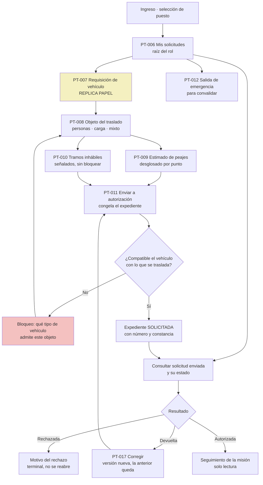

Notas para el diseñador:

- **`PT-007` es la pantalla más replicada del sistema.** Es la "requisición de vehículo" que la institución llena hoy en papel. Bloqueada por insumo #2.
- El estimado de peajes **nunca se muestra como total**. Se muestra punto por punto con categoría y tarifa (R-8), porque es gasto que se compromete y la jefatura lo va a mirar.
- `RECHAZADA` es estado terminal: la pantalla no ofrece "reenviar". Ofrece **crear una solicitud nueva vinculada a la rechazada**.
- El solicitante **no ve** disponibilidad de flota como promesa. Si se muestra, se muestra como orientativa: aprobar no reserva nada.

---

## 3. `ACT-03` Jefatura Inmediata — administrativo, usado desde el celular

Entra dos veces al día. Es el cuello de botella típico del proceso. **Su navegación tiene exactamente dos niveles**: la bandeja y la decisión. Cualquier tercer nivel se traduce en autorizaciones sin leer.

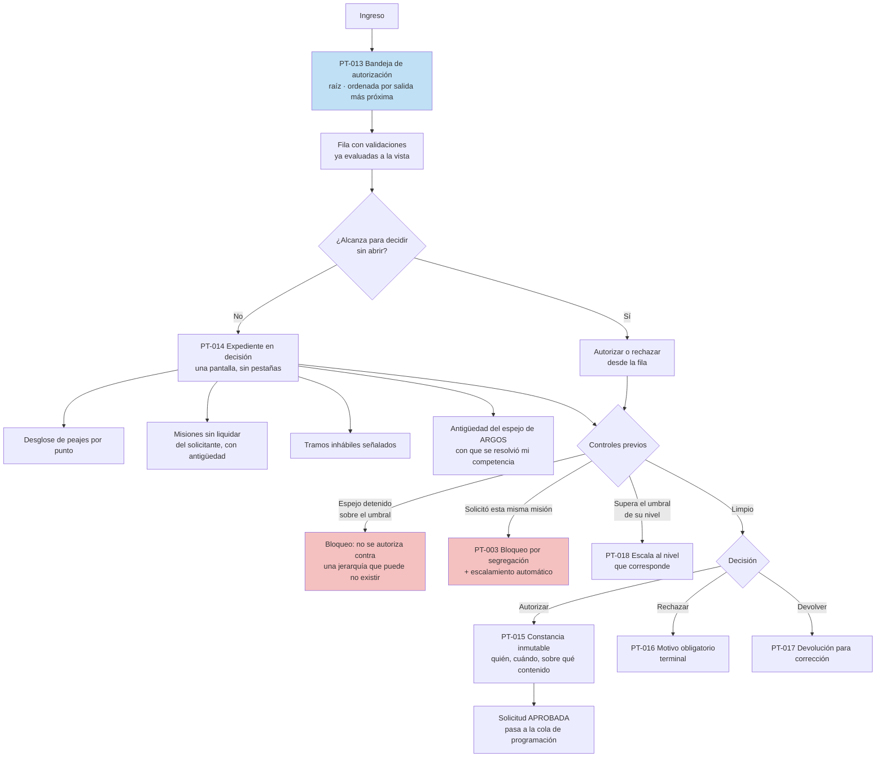

Notas para el diseñador:

- **`PT-013` es una de las cinco pantallas difíciles.** Ver §7.2.
- El orden por defecto es **salida más próxima primero**, no fecha de creación. Lo urgente se señala explícitamente.
- La jefatura **no decide vehículo ni motorista**. Esos datos no aparecen en su pantalla como decisión, solo como contexto si ya existen.
- `PT-015`, `PT-016` y `PT-017` son actos distintos con consecuencias distintas: devolver conserva el expediente, rechazar lo mata. En pantalla no pueden verse como dos botones grises al lado.

---

## 4. `ACT-04` Jefe de Transporte — administrativo, usuario más intensivo

Es el único actor para el que el sistema **es su herramienta de trabajo, no un trámite**. Trabaja con doble pantalla sobre un tablero de misiones. Aquí la densidad es una virtud, no un defecto: quitarle información le cuesta tiempo real.

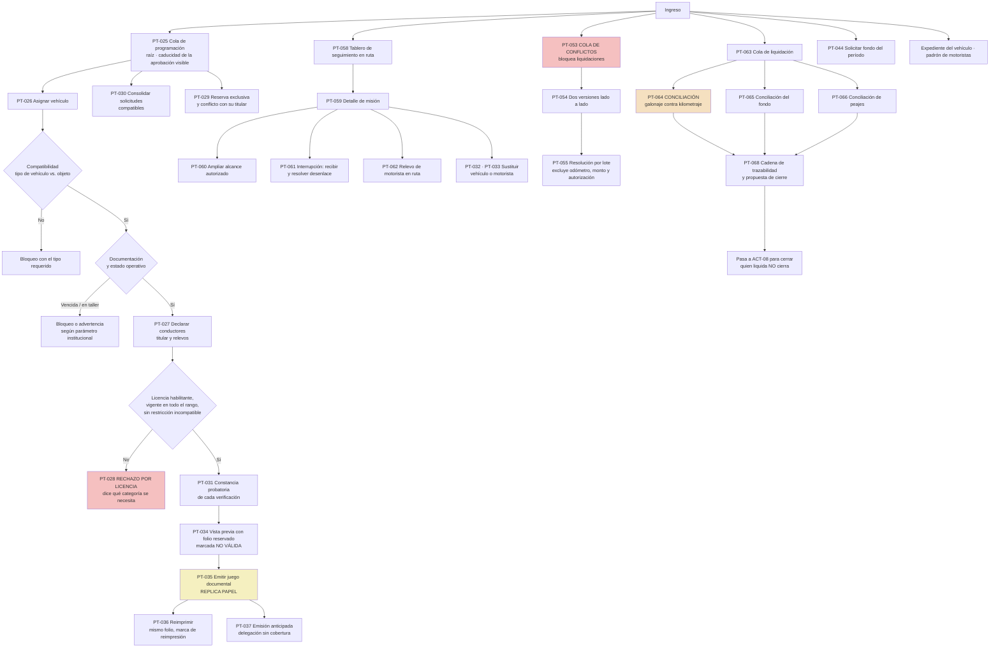

Notas para el diseñador:

- El Jefe de Transporte **entra por tres puertas distintas** según el momento del día: programar (mañana), seguir en ruta (todo el día), liquidar (fin de semana o de mes). Su raíz debe permitir las tres sin navegación profunda.
- **La cola de conflictos y la cola de liquidación están acopladas**: una misión con divergencia pendiente no se puede liquidar. La pantalla de liquidación debe decirlo con el número de divergencias y el enlace directo, no con un error genérico.
- `PT-068` produce la propuesta de cierre, **pero él no cierra**. `I-07` y `BD-06`: quien liquida no cierra. La pantalla debe terminar en "enviado a Gerencia Administrativa", no en un botón de cerrar deshabilitado.

---

## 5. `ACT-05` Encargado de Despacho — administrativo con exigencia de campo

Caso híbrido y por eso fácil de diseñar mal. Trabaja con densidad de escritorio, **pero en una caseta que puede estar sin red**. Su tableta debe registrar una salida completa sin conectividad.

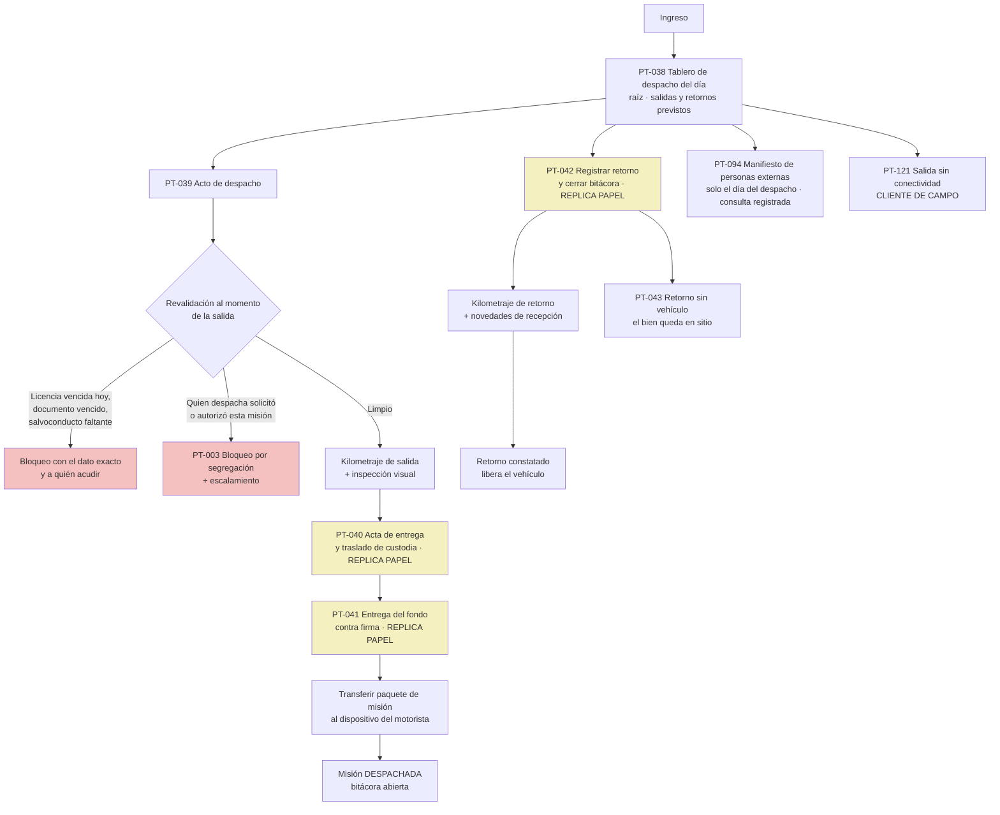

Notas:

- **La revalidación al despachar no es una repetición decorativa de la del día de la programación.** Entre programar y salir pasan días: una licencia pudo vencer anoche. La pantalla debe mostrar *qué se revalidó y cuándo*, no solo el resultado.
- El despachador ve el manifiesto de personas externas **el día del despacho y nada más**, y su consulta se registra. La pantalla debe decírselo — que la consulta queda registrada no es información oculta.
- `PT-121` pertenece al cliente de campo aunque el usuario sea el mismo. Es la misma función con red y sin red, y **no es la misma pantalla**.

---

## 6. `ACT-06` Motorista — cliente de campo

La navegación más importante del sistema y la más corta. **Si el motorista no la usa, todo lo demás da igual.**

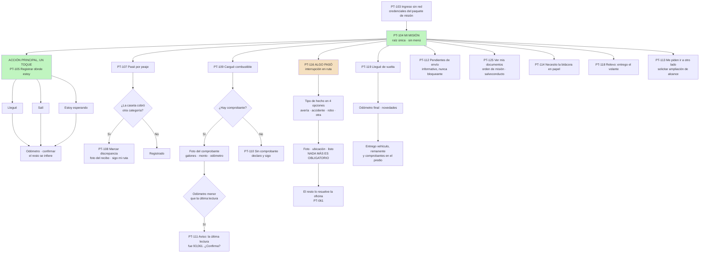

Notas para el diseñador — esto es lo que decide la adopción:

- **`PT-104` es la única raíz. No hay menú, no hay pestañas, no hay perfil.** El motorista tiene exactamente una misión activa. Si tiene dos, algo se hizo mal antes.
- **La acción más frecuente está a un toque desde la raíz** y ocupa el tercio superior de la pantalla, que es donde llega el pulgar con guante.
- Cada registro pide **un dato y una confirmación**. El resto se infiere: hora del hecho, punto de la ruta, misión, autor, secuencia del dispositivo. `ocurrido_en` y `capturado_en` son campos distintos y **ninguno de los dos se le pregunta**.
- **Nada bloquea una captura por falta de red, de comprobante o de foto.** Lo que falte se marca como pendiente y se resuelve después. El motorista sin señal no puede resolver nada: solo puede abandonar el sistema.
- El aviso de odómetro inconsistente **no es un error**: es una pregunta con la última lectura conocida a la vista. Puede que el tablero se haya reemplazado.
- El registro de incidente se diseña para alguien **estresado y sin señal**: cuatro opciones grandes, foto, y listo. Ver §7.6.

---

## 7. Las cinco pantallas difíciles

Estas cinco no se resuelven con una lista de campos. Cada una tiene un **problema de fondo** que el diseñador tiene que entender antes de dibujar. Ninguna replica papel: **las cinco se pueden diseñar hoy**.

### 7.1 `PT-053` / `PT-054` — Cola de conflictos de sincronización

**Es la pantalla más difícil del sistema y la que nadie diseña hasta que ya duele.** Fuente: [`HU-068`](../02-requisitos/historias/HU-068-cola-de-conflictos-dos-versiones-lado-a-lado.md), [`RN-45`](../01-negocio/reglas/RN-45-cero-sobrescritura-silenciosa.md).

**El problema.** Un dispositivo pasó nueve días sin señal. Cuando vuelve, trae 180 registros, y algunos contradicen lo que la oficina ya registró sobre la misma misión: el motorista anotó odómetro de retorno 93,610 el 16 de mayo con foto del tablero; la delegación digitó del papel 93,061 el 28 de mayo con foto del original. **Los dos son de buena fe. Uno de los dos está mal, y la diferencia son 549 kilómetros que van a entrar en una conciliación de combustible.**

Ninguna resolución automática es aceptable: en este dominio los datos en conflicto son **odómetros, galones y montos**, y una sobrescritura silenciosa destruye el término de una conciliación de auditoría sin que nadie se entere hasta que el Tribunal Superior de Cuentas pregunta.

**Quién la usa.** El Jefe de Transporte o el Encargado de Delegación. **No entiende de sincronización y no tiene por qué.**

**Lo que la pantalla tiene que lograr:**

1. **Lenguaje del negocio, cero lenguaje de datos.** Dice *"el motorista registró la salida el lunes a las 5:40, sin señal"*. **Nunca** dice *merge*, *timestamp*, *versión*, *hash divergente* ni *conflicto de escritura*. Es un criterio de aceptación literal, verificable, de `HU-068`.
2. **Ambas versiones completas, lado a lado, campo por campo**, con la diferencia resaltada. De cada una: **quién la capturó, cuándo ocurrió el hecho y cuándo se registró** — tres datos distintos, y la distinción entre los dos últimos es exactamente lo que permite decidir.
3. **Las fotografías de ambas versiones visibles al mismo tiempo**, no detrás de un clic. La foto del tablero contra la foto del original es, en la práctica, lo que resuelve el conflicto.
4. **Declara el impacto en voz alta**: *"Esta misión no se puede liquidar hasta resolver esto."* Sin eso, la cola se convierte en un basurero.
5. **No existe la acción de editar.** El usuario va a buscarla. Cuando la busque, la pantalla debe responder: *"No se edita un registro. Elija entre las versiones que existen o registre un asiento nuevo."*
6. **Sin fusión automática.** Si una versión cambia el odómetro y otra la hora de arribo, se presentan por separado: *"Decida campo por campo. Combinar solo produciría un registro que nadie capturó."*
7. **Motivo obligatorio**: *"Escriba por qué toma esa versión. La decisión queda en el expediente y el auditor la va a leer."*
8. **La versión descartada no desaparece.** Queda íntegra y consultable, vinculada a la decisión que la descartó.
9. **Resolución por lote con criterio declarado**, porque 180 conflictos uno por uno no los resuelve nadie — **pero el lote excluye siempre odómetro, monto y autorización**, y lo dice: *"3 conflictos de alto impacto quedan fuera del lote y se resuelven uno por uno."*
10. **Orden por impacto y luego antigüedad**, con lo que cada conflicto bloquea a la vista.

**El caso que hay que dibujar para probar el diseño:** la oficina anuló la misión el 12 de mayo a las 08:15; el motorista ya había salido a las 05:40 sin señal. La pantalla no pregunta qué versión "gana": pregunta **"¿qué versión describe lo que pasó?"**, y no ofrece revivir una anulación sobre una misión que ya está `EN_RUTA`.

### 7.2 `PT-013` — Bandeja de autorización

Fuente: [`HU-009`](../02-requisitos/historias/HU-009-bandeja-de-autorizacion-con-validaciones-a-la-vista.md).

**El problema.** La jefatura entra dos veces al día, a menudo desde el celular, y es el cuello de botella del proceso. Si tiene que abrir cada solicitud para saber si puede autorizarla, autorizará sin abrir. **El diseño debe hacer que decidir bien sea más rápido que decidir mal.**

En papel, la jefatura firma lo que le ponen enfrente y rara vez tiene a mano el histórico del solicitante. El sistema puede hacer algo que el papel no puede: **poner el control antes de la firma en lugar de después**.

**Lo que la pantalla tiene que lograr:**

- **Las validaciones ya evaluadas se ven en la fila, sin abrir el expediente.** Son tres las que cambian decisiones y hoy nadie ve al firmar: el **estimado de peajes desglosado** (gasto que se compromete), las **misiones anteriores sin liquidar** del mismo solicitante con su antigüedad en días, y la **antigüedad del espejo de ARGOS** con que se resolvió la competencia de quien firma.
- **Dos toques**: uno para entender, uno para decidir. El expediente completo cabe en una pantalla, sin pestañas.
- **Orden por salida más próxima**, con lo urgente señalado — no por fecha de creación.
- **El total de peajes nunca aparece solo.** Cuatro líneas con punto, fecha prevista de paso, categoría y tarifa, más el identificador de la tabla usada (R-7, R-8).
- **Distingue tres respuestas del sistema, visualmente distintas**: bloqueo por espejo detenido sobre el umbral (no ofrece la acción de autorizar), advertencia bajo el umbral (deja continuar y asienta), y limpio.
- Cuando el control configurado como advertencia se supera, **el nombre de quien continuó queda en el expediente y en su versión impresa**. Una advertencia que nadie ve no es un control.

**Restricción de alcance:** la jefatura **no decide vehículo ni motorista**, y la disponibilidad de flota que vea es orientativa y no reserva nada. Si el diseño sugiere lo contrario, produce una expectativa falsa que el despacho tendrá que desmentir por teléfono.

### 7.3 `PT-105` — Registro en ruta del motorista

Fuente: [`HU-046`](../02-requisitos/historias/HU-046-operar-la-mision-sin-conectividad.md), [`HU-047`](../02-requisitos/historias/HU-047-arribos-salidas-y-espera-en-sitio.md), [RNF-12](../02-requisitos/no-funcionales/RNF-12-uso-en-campo.md).

**El problema.** El usuario está a pleno sol, posiblemente con guantes, con el vehículo detenido en la carretera, con batería contada y sin ninguna señal. Es la condición **normal**, no el caso borde. Todo lo que le exija más de un minuto o más de tres toques se llenará en papel y se digitará días después, mal o nunca — que es exactamente lo que hoy deja el expediente incompleto ante el Tribunal Superior de Cuentas.

**Lo que la pantalla tiene que lograr:**

- **Tres botones grandes y nada más**: *Llegué* · *Salí* · *Estoy esperando*. Ocupan la mitad superior de la pantalla.
- **Un solo dato pedido: el odómetro.** Todo lo demás se infiere — misión, punto de la ruta, hora del hecho, autor, secuencia. Ni una pregunta evitable.
- **Legible bajo sol directo**: contraste alto, tipografía grande, **nada que dependa del color para significar** (el sistema tiene que ser útil también en blanco y negro impreso, y en pantalla al sol el color se pierde).
- **Área táctil pensada para dedo con guante**, no para puntero.
- **Confirmación inmediata y visible de que quedó guardado**, porque no hay red que confirme nada. Si el usuario duda de que se guardó, lo registra dos veces y produce un conflicto (§7.1).
- **El contador de pendientes es informativo, nunca alarmante**: *"Lleva 9 días sin enviar. 34 registros pendientes. Se enviarán solos cuando haya señal."*
- **Cero animaciones, cero carga diferida, cero dependencia de red** para pintar la pantalla.

### 7.4 `PT-064` — Conciliación galonaje contra kilometraje

Fuente: [`HU-088`](../02-requisitos/historias/HU-088-conciliar-galonaje-contra-kilometraje.md), [`RN-30`](../01-negocio/reglas/RN-30-conciliacion-galonaje-kilometraje.md).

**El problema.** Lo que el auditor busca **no son comprobantes archivados: es correlación entre consumo, kilometraje y misión autorizada** `[V]`. Un sistema que solo archiva facturas no responde a lo que se le va a preguntar.

Y hay algo que casi todo diseño de esta pantalla hace mal: **la desviación se mira en las dos direcciones, y las dos son hallazgo.**

| Dirección | Qué significa en la práctica |
|---|---|
| **Rendimiento por debajo del esperado** | Más galones de los que el recorrido justifica. Posible consumo no imputable a la misión |
| **Rendimiento por encima del esperado** | Menos galones de los que el recorrido exige. **Casi siempre significa un despacho que nadie anotó**: el vehículo cargó combustible que no pasó por ningún folio |

Un umbral único simétrico es un error de diseño: **un exceso del 20 % y un ahorro del 20 % no significan lo mismo**, y los umbrales superior e inferior son parámetros independientes.

**Lo que la pantalla tiene que lograr:**

- **Muestra la desviación en ambas direcciones sobre un mismo eje**, con las dos bandas de tolerancia dibujadas y visiblemente asimétricas.
- **Explica el rendimiento demasiado bueno**, que es contraintuitivo. El texto no puede ser un código de error: *"Rendimiento observado 30.00 km/galón contra 12.00 esperado. Hipótesis principal: abastecimiento no registrado. Revise fondo agotado, préstamo de otra dependencia, carga de cisterna o peculio del motorista."*
- **Desglose obligatorio** (R-8): kilómetros por tramo, cargas con su odómetro, tiempo de espera en sitio. El total no basta para tipificar la causa.
- **La tabla de rendimiento esperado y su vigencia, a la vista** (R-7). Y **no existe la acción de modificar el rendimiento esperado de una misión ya ejecutada**: la pantalla no ofrece hacer que cuadre.
- **La espera en sitio con motor encendido, declarada por el motorista, ampara la desviación** y eso se ve en pantalla, con la fecha en que se declaró. Si no se ve, el jefe de transporte "corrige" un dato para justificar lo que ya estaba justificado.
- **Odómetro averiado da resultado *no concluyente*, no cero.** Es un tercer estado y tiene que verse como tal.
- **Con sustitución de vehículo hay dos conciliaciones, no un promedio.** El diseño debe soportar N bloques por misión.
- **La alerta agregada por vehículo vive aquí también**: *"TR-0045: 4 misiones con desviación fuera de umbral entre el 01/08/2026 y el 30/09/2026."* El patrón se ve en el agregado, no en la misión aislada.

### 7.5 `PT-028` — Rechazo por licencia no habilitante

Fuente: [`HU-025`](../02-requisitos/historias/HU-025-habilitacion-de-quien-efectivamente-conduce.md), [`RN-09`](../01-negocio/reglas/RN-09-matriz-licencia-vehiculo.md), [`RN-57`](../01-negocio/reglas/RN-57-habilitacion-de-quien-efectivamente-conduce.md), `BD-02`.

**El problema.** Es la validación de mayor valor legal del sistema: asignar un motorista sin licencia habilitante traslada responsabilidad directa a quien autorizó. Es **bloqueo duro sin excepción configurable** — una excepción registrada en el sistema sería evidencia en contra ante un siniestro.

Y aquí está lo que hace especial a esta pantalla: **el usuario no puede resolverlo reintentando.** Tiene que hacer una gestión administrativa — pedir la licencia, buscar otro conductor, cambiar el vehículo. Si el mensaje no le dice **exactamente qué le falta**, va a probar otra vez con la misma persona, y luego va a llamar por teléfono, y luego va a sacar el vehículo sin orden de misión.

**Lo que la pantalla tiene que lograr:**

- **Nombrar la categoría que se necesita, no solo la que falta**: *"La licencia categoría B no habilita un vehículo de 12,000 kg de peso bruto. El vehículo INS-C-002 requiere categoría C."*
- **Distinguir las tres causas**, porque las tres se resuelven distinto:
  - *categoría insuficiente* → hay que cambiar de conductor o de vehículo;
  - *vigencia que no cubre todo el rango* → *"La licencia 08-1988-77120 vence el 14/09/2026 y la ventana efectiva de la misión termina el 15/09/2026, incluida la holgura posterior"*;
  - *restricción médica incompatible* → *"tiene la restricción 'no conducir en horario nocturno' y la misión declara conducción de 19:00 a 23:00"*.
- **Ofrecer los caminos de salida en la misma pantalla**: conductores del padrón que sí habilitan este vehículo, vehículos que esta licencia sí habilita, y el enlace al expediente de habilitación del motorista.
- **No ofrecer ninguna opción de continuar por jerarquía, urgencia ni régimen de uso del vehículo.** Es un criterio de aceptación literal. El funcionario que quiere conducir su propio vehículo asignado se somete al mismo rigor.
- **Mostrar la versión de la matriz licencia↔vehículo con que se evaluó** (R-7), porque la matriz es parámetro con vigencia y el rechazo tiene que ser reproducible.
- **Dejar constancia del intento**: el intento bloqueado es información de control, no ruido.

### 7.6 Media difícil, que conviene tratar con las anteriores: `PT-116` registro de incidente en ruta

No está en las cinco, pero comparte su naturaleza. **El usuario está estresado y sin señal**, posiblemente de noche, posiblemente con un tercero lesionado. Menos campos posibles: **tipo de hecho en cuatro opciones grandes, foto, ubicación, y listo**. Todo lo demás se infiere o se difiere a la oficina (`PT-061`). La guía de actuación en accidente viaja en el paquete de misión y se muestra sin red.

---

## 8. Los otros roles

### 8.1 `ACT-07` Encargado de Combustible — administrativo

Custodia física de efectivo, órdenes de pago o vales. Su navegación gira alrededor de **un objeto con ciclo de vida**: el vale (emitido → entregado → canjeado → conciliado, o anulado o extraviado con acta).

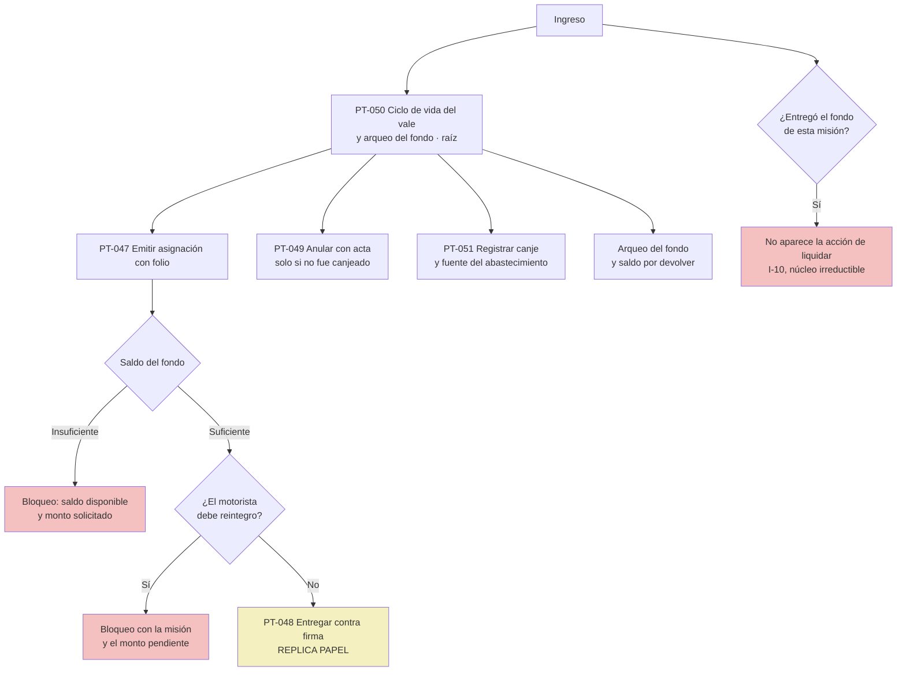

Lo importante en pantalla: **el bloqueo `I-10` no se muestra como un botón deshabilitado.** La acción de liquidar simplemente no existe en su navegación, y si llega por enlace, la pantalla explica el par de incompatibilidad con la misión concreta.

### 8.2 `ACT-10` Encargado de Delegación — **cliente de campo**, aunque tenga computadora

Es el actor que rompe la aritmética de la segregación de funciones (una delegación de tres personas no puede cumplir cinco funciones incompatibles) y el que sostiene la operación donde no hay red. **Su cliente es el de campo**, aunque trabaje sentado: conectividad intermitente o nula es su condición de trabajo.

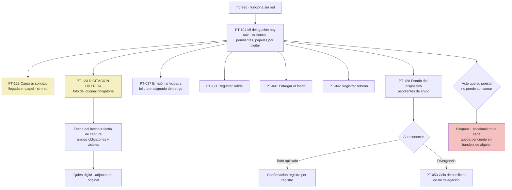

Notas:

- **La pantalla de digitación diferida es donde se juega la adopción rural.** El encargado digita un formulario que ya está lleno en papel: la pantalla debe seguir el papel campo por campo, permitir adjuntar su fotografía, y **no estorbar con validaciones que el papel no tenía**. Fecha del hecho y fecha de captura son campos distintos y ambos se ven.
- El escalamiento por segregación **nunca deja un callejón sin salida**: la misión queda visiblemente pendiente en la bandeja de alguien de sede, y la pantalla dice de quién.

### 8.3 `ACT-08` Gerencia Administrativa y `ACT-09` Máxima Autoridad — administrativo desde el celular

Ambos entran poco y deciden mucho. `ACT-09` en particular: **su interacción debe caber en una pantalla y resolverse en dos toques**, porque si no, delega informalmente su clave — que es exactamente el riesgo que se quiere evitar.

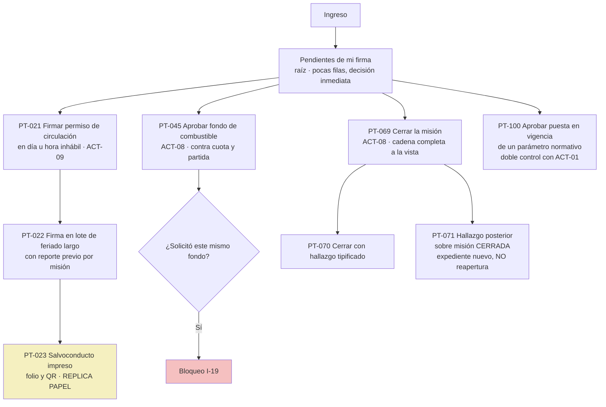

**El salvoconducto es el documento más exigente del sistema** y condiciona esta rama entera: lo va a revisar un agente en carretera, de pie, posiblemente de noche, con una linterna. Ver la nota de §10.

### 8.4 `ACT-12` Auditor Interno — administrativo, solo lectura

**Ninguna pantalla del auditor tiene un botón que produzca un acto de negocio.** Su navegación es de búsqueda, rastreo y exportación, y sus propias consultas quedan registradas.

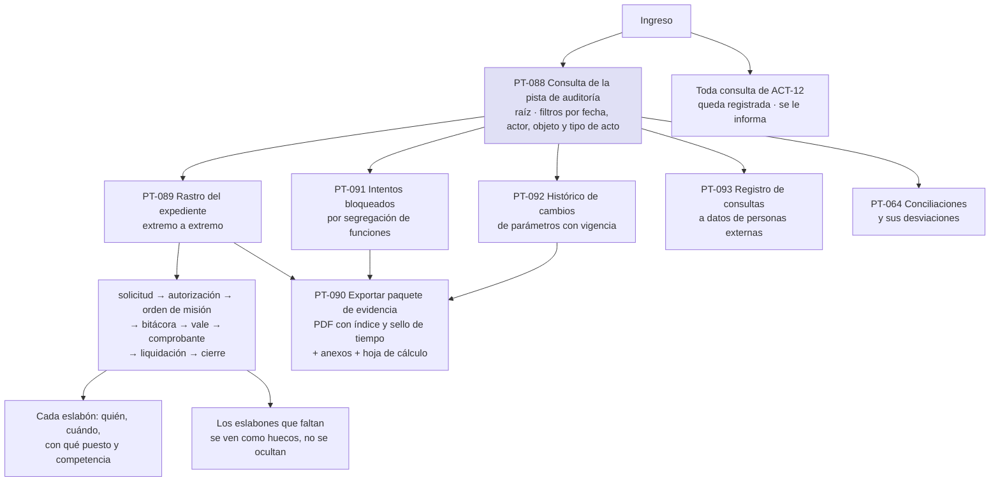

Notas:

- **Las versiones descartadas de la cola de conflictos son visibles para el auditor**, junto con la decisión que las descartó y su motivo. Es una de las razones por las que la versión descartada no se borra.
- El paquete de evidencia se entrega **el mismo día y completo** ([RNF-18](../02-requisitos/no-funcionales/RNF-18-paquetes-de-evidencia-para-auditoria.md)). Esa es una restricción de diseño de la pantalla de exportación: no puede ser un botón que produce un CSV.

### 8.5 `ACT-01` Administrador del Sistema — administrativo, sin acceso al negocio

Su navegación es corta y **no tiene ninguna puerta hacia una transacción de negocio**. Administra estructura, usuarios, puestos, roles, catálogos y carga de parámetros; ejecuta respaldos. **Carga el parámetro pero no lo pone en vigencia** — eso lo aprueba `ACT-08` (doble control). Incluye el panel de salud del sistema de [RNF-20](../02-requisitos/no-funcionales/RNF-20-observabilidad-y-diagnostico.md): **una sola pantalla que dice qué está mal y qué hacer**, escrita para alguien sin especialización, porque en muchas instituciones no hay equipo de TI.

---

## 9. La superficie pública: `ACT-15` Verificador en Carretera

Una sola pantalla, `PT-126`, sin sesión, sin menú, sin navegación.

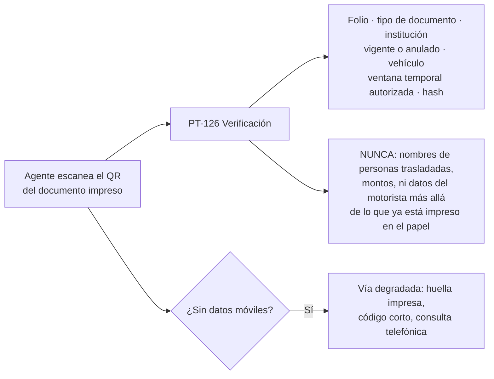

Dos advertencias:

- **`[C]` Si la institución acepta exponer un punto de verificación público en internet, siendo el despliegue on-premise**, está sin confirmar. La vía degradada —contraste visual de la huella impresa más consulta telefónica— **sí es diseñable hoy** y hay que diseñarla, porque puede terminar siendo la única.
- Si esta pantalla se diseña sin límite explícito, alguien terminará exponiendo el expediente completo detrás de un código QR. **Mínimo verificable, nunca el expediente.**

---

## 10. Los caminos entre los dos clientes

Solo hay tres puentes, y los tres son momentos de riesgo:

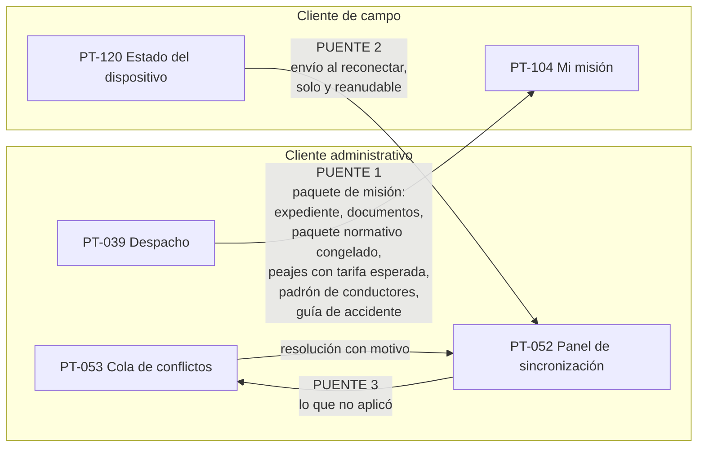

**Puente 1 — el paquete de misión.** Es lo que permite que el cliente de campo funcione solo. Se entrega en el despacho y lleva todo lo que el dispositivo va a necesitar durante días sin red, incluido el **paquete normativo congelado**: los cálculos en ruta usan esas tablas, no las del servidor. La pantalla de despacho tiene que dar constancia visible de que el paquete se transfirió, porque un motorista que sale sin paquete sale sin sistema.

**Puente 2 — la sincronización.** Ocurre **sola y es reanudable**. El usuario no la inicia y no la vigila. En el cliente de campo es un contador informativo (R-9).

**Puente 3 — lo que no aplicó.** Va a la cola de conflictos (§7.1). Es el puente que nadie diseña.

**Y hay un cuarto puente que no es digital: el papel.** El salvoconducto impreso, la hoja de bitácora de respaldo, la orden de misión que el motorista lleva en la guantera. Ese puente existe por diseño, no por parche, y **su extremo más exigente es el salvoconducto**: lo revisa un agente de tránsito, de pie, en la carretera, posiblemente de noche, con luz de linterna. Diseñar para eso significa: los cuatro datos que el agente necesita —vehículo, ventana autorizada, autoridad que firmó, vigencia— **en el tercio superior y en cuerpo grande**, el QR grande y en posición fija, y el documento útil en blanco y negro sobre impresora matricial.

---

## 11. Lo que este mapa deliberadamente no dice

- **No propone bibliotecas de componentes ni tecnología de interfaz.** El stack está diferido al Sprint 2 por [`ADR-000`](../03-arquitectura/adr/ADR-000-diferir-seleccion-de-stack.md). Todo lo de aquí es comportamiento observable y agnóstico.
- **No fija el orden de los campos de las pantallas que replican papel.** Ese orden lo fija el formato de la institución (insumo #2), no el diseñador. Ver la columna correspondiente del [inventario](inventario-de-pantallas.md).
- **No define el sistema visual** — tipografía, paleta, espaciado. Eso es del diseñador externo, con las restricciones de [RNF-12](../02-requisitos/no-funcionales/RNF-12-uso-en-campo.md) para el cliente de campo y [RNF-16](../02-requisitos/no-funcionales/RNF-16-idioma-accesibilidad-y-mensajes.md) para los mensajes.
- **No cubre M-11 Mantenimiento ni M-02 Catálogos con el mismo detalle** que el resto, porque el Bloque 3 no escribió historias para ellos todavía. Sus pantallas están en el inventario marcadas como tales.
