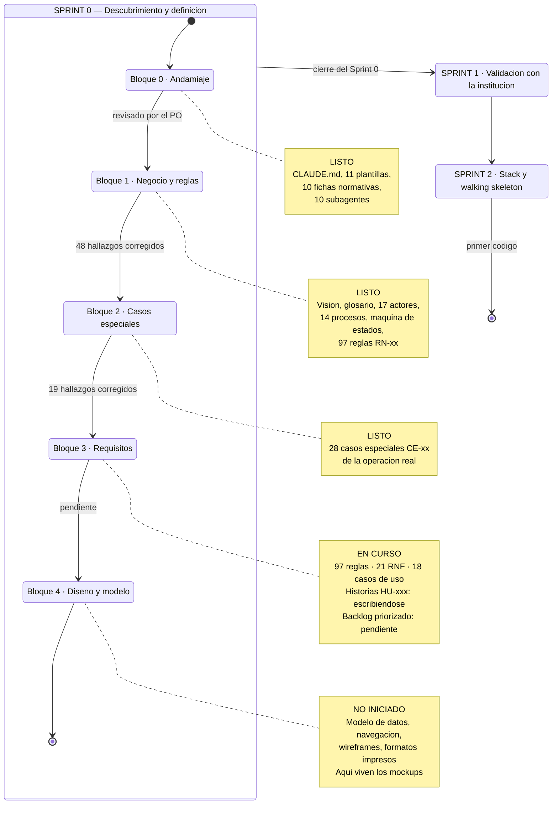
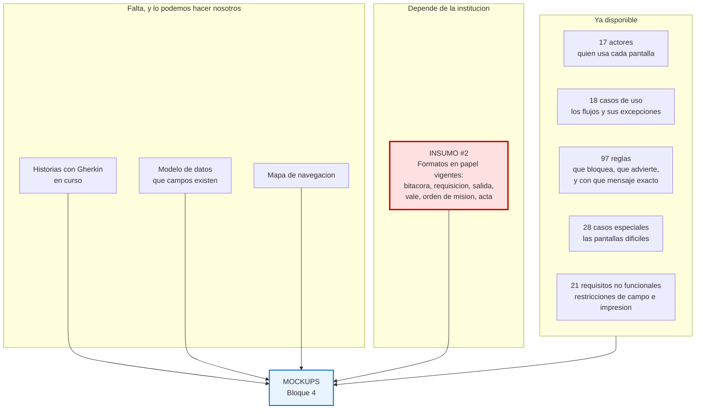

# Estado del proyecto — Sprint 0

**Actualizado 2026-08-18.** 12 commits, 216 archivos de documentación.

## Dónde estamos

## Qué hace falta para empezar los mockups

## El bloqueante real es uno solo

**Insumo #2 — los formatos en papel que la institución usa hoy.**

El principio de diseño ya está fijado en [`docs/04-diseno/README.md`](../04-diseno/README.md):

> El operador que lleva años llenando un formato preimpreso debe encontrar **los mismos campos, con los mismos nombres, en el mismo orden** en la pantalla.

Sin los formatos, cualquier mockup es una invención que el personal no va a reconocer. Y la paridad pantalla↔papel reduce el costo de adopción más que cualquier funcionalidad.

**Qué pedir, concretamente:** bitácora de viaje, requisición de vehículo, boleta de salida, vale o cupón de combustible, orden de misión, acta de entrega-recepción. Fotos de los formularios llenos sirven — de hecho sirven más que los formularios en blanco, porque muestran cómo se usan de verdad.

## Lo que podemos adelantar sin ese insumo

| Artefacto | Estado |
|---|---|
| Historias de usuario con criterios Gherkin | En curso |
| Backlog priorizado con DoR verificada | Sigue |
| **Modelo conceptual de datos y diagrama ER** | Se puede hacer ya |
| **Mapa de navegación por rol** | Se puede hacer ya |
| Wireframes de las pantallas que no replican papel — cola de conflictos, tablero de seguimiento, conciliación | Se pueden hacer ya |
| Wireframes de captura — solicitud, bitácora, vale, liquidación | **Esperan el insumo #2** |

Es decir: **se puede avanzar bastante en el Bloque 4 sin los formatos**, pero las pantallas de captura —que son la mitad del sistema— no deberían dibujarse antes de verlos.

## Decisiones del PO pendientes

Ninguna bloquea los mockups, pero sí condicionan el diseño:

| # | Decisión | Impacto |
|---|---|---|
| 1 | Ratificar o revertir [DP-002](decisiones-de-producto/DP-002-segregacion-en-delegaciones-pequenas.md) — segregación en delegaciones pequeñas | Alto. Decide si las delegaciones operan |
| 2 | Insumo #26 — pronunciamiento de **Auditoría Interna** | Alto. Tarda semanas; conviene moverlo ya |
| 3 | Insumo #36 — ¿hay cisterna o bidones de combustible? | Cambia el circuito completo de M-09 |
| 4 | `HB3-02` — ¿el reclamo de peaje cierra la misión o la marca con hallazgo? | Medio. Ya resuelto provisionalmente |
| 5 | `HB3-07` — ¿el salvoconducto ampara al motorista? | Medio. Ya resuelto provisionalmente |

## Insumos abiertos

**76 en total.** Los dos bloqueantes de verdad son el **#1** (reglamento interno de uso de vehículos) y el **#2** (formatos en papel). El resto tiene tratamiento provisional documentado.
